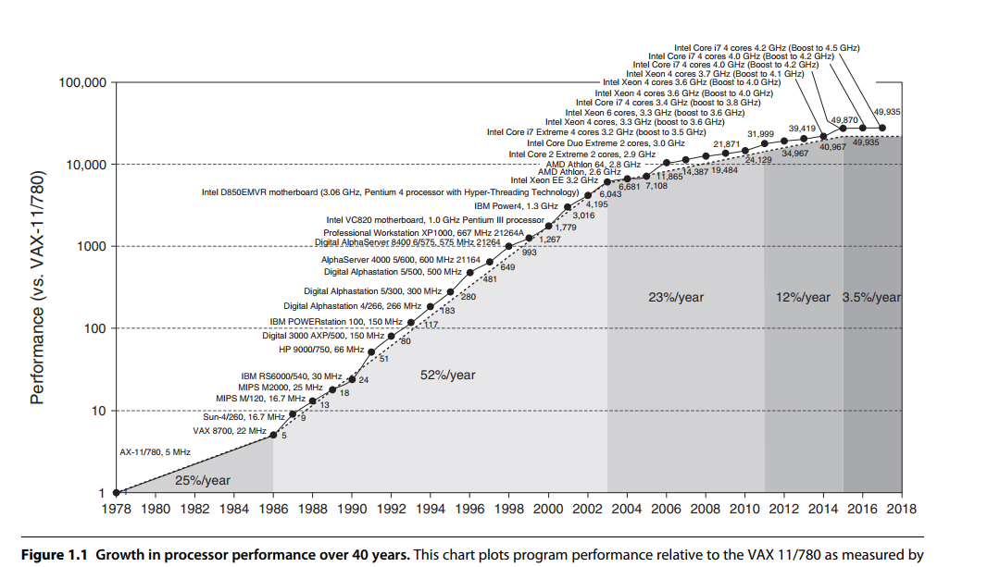
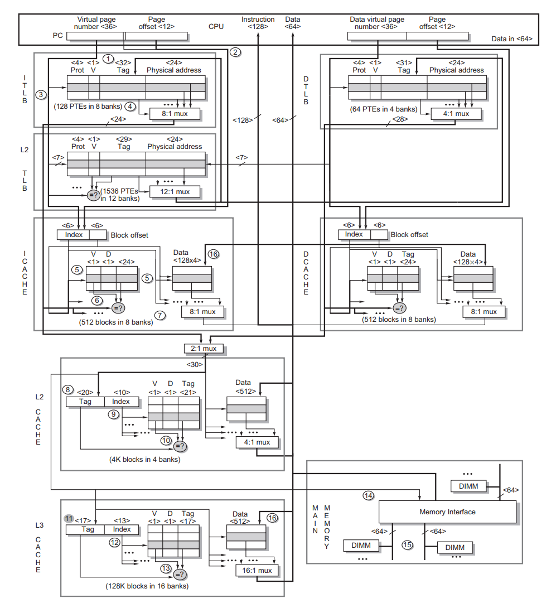

# 一、量化设计和分析基础

## 1. 介绍

指令集

- CISC(**C**omplex **I**nstruction **S**et **C**omputing)，Intel 在内部也将 x86 指令转换为类似于 RISC 指令。
- RISC(**R**educed **I**nstruction **S**et **C**omputing)，主要关注在指令集并行（流水线到多指令）和缓存的使用（后来采用复杂的组织方式和优化）上。ARM 架构。

可以看到摩尔定律正在失效。现在增加核心数来提高性能。甚至大型机也是由微处理器组成。

处理器的性能的提高从单纯依赖指令集并行(ILP)转向数据级并行(DLP)和线程级并行(TLP)。

## 2. 计算机分类

个人移动设备、桌面计算机、服务器、集群、嵌入式计算机

## 3. 并行体系结构分类

在应用程序中主要有两种并行:

- 数据级并行(Data-level parallelism)
- 任务级并行(Task-level parallelism)

计算机硬件主要采取如下4种方法来实现这两种并行：

- 指令级并行，利用流水线之类的思想和预测执行来进行数据级并行
- 向量体系架构和GPU，将单条指令并行应用于一个数据集合，实现数据级并行。SIMD、MIMD
- 线程级并行，用紧耦合硬件模型的方式实现数据级并行或任务级并行，而且允许多个并行的线程之间交互。
- 请求级并行，使用大量的解耦合任务来实现并行。

## 4. 指令集体系结构

指令集体系结构(ISA)

- 分类：现在几乎所有的 ISA 都划分到通用寄存器的体系结构中，操作数是寄存器或存储器地址。x64 有 16 个通用寄存器以及 16 个浮点寄存器(128 位 XMM 寄存器)。这一类主要有两种版本，一种是 **register-memory ISA**，比如 x86，访问内存地址可以是指令的一部分；另一种是 **load-store ISA**。比如 ARMv8、RISC-V，MIPS等，访问内存只能通过 `load` 或 `store` 指令。
- 存储器寻址：几乎所有的计算机都使用字节寻址来访问存储器操作数。有些体系结构，比如ARMv8、MIPS 要求对象必须是对齐的(*aligned*)，即一个大小为 s 字节的对象，其字节地址为 A，如果 `A % s == 0`，则这个对象是对齐的。x86 不需要对齐。
- 寻址模式：RISC-V 的寻址模式有寄存器寻址、立即数寻址、偏移量寻址(Displacement，`M[R1 + Imm]`)；x86 支持以上三种之外，还支持其他偏移量寻址的变体：绝对寻址、变址寻址、比例变址寻址。（具体见x64汇编）。ARMv8 也有 RISC-V 的三种寻址模式，再加上相对 PC 寻址（相对寻址）、寄存器移位寻址、堆栈寻址、多寄存器寻址。
- 操作数的类型和大小：大多数的 ISA 都支持 8-bit ASCII 字符，16-bit Unicode 字符或半字，32-bit 整型或字，64-bit 长整型和双字，IEEE754 标准的 32-bit 单精度浮点数和 64-bit 双精度浮点数。x86 支持 80-bit 的浮点数。
- 操作指令：常见的操作指令有数据传输指令、算术逻辑指令、控制指令、浮点指令。x86 的指令更多一些。
- 控制流指令：通常支持条件分支、无条件跳转、过程间调用和返回
- ISA 编码：有两种编码方式，固定长度(*fixed length*)和可变长度(*variable length*)。所以的 ARMv8 和 RISC-V 是 32 位长的，简化了编码。x86 是变长编码，范围从 1 字节到 18 字节。变长指令比定长指令要节省空间，所以编译同一个程序在 x86 平台上通常会更小一些。(Note: ARMv8 和 RISC-V 之后提供了扩展，Thumb-2 和 RV64IC，支持 16 位指令，来减少程序的大小)

# 二、存储器层次结构设计

## 1. 介绍

内存速度越快容量越大越好，不过限于经济原因，采用了存储器的层次结构，其利用局部性原理。  

处理器的性能提升要远远高于存储器，向多核发展，进一步提高了存储器带宽需求。  

假设 Core i7 每个时钟周期每个核心可以生成 2 次数据存储器引用，有 4 个核心，时钟频率为 3.2 GHz，每秒最多大概可以进行 256 亿次 64 位数据存储器引用，总峰值带宽 409.6 GB/s。而 DRAM 最高只有几十 GB/s 的速度(2020)。  

**存储器的层级结构基础**  

当处理器访问内存时，先查找 cache 中是否有请求数据，如果命中(hit)，则直接返回数据；如果丢失(miss)，先将内存中对应的数据所在**块**(或**行**)载入 cache，再返回给处理器。  

每个缓存块都有一个标签(tag)，拼接 tag 和缓存块的 index，再加上块内偏移，就可以得到数据对应的内存地址。  

**memory 到 cache 的映射策略**：  

- 直接映射：每个组一块的 n 路组相联。某个内存块只能放在 cache 的一个位置，缓存地址 = 内存块地址 mod 缓存块总数。
- 全相联：只有一个组的 n 路组相联。某个内存块可以放到 cache 的任何位置，需要线性查找整个 cache 找到对应的内存块。
- **n 路组相联**：一个块被映射到一个组，某个内存块能放到 cache 对应的组里的任何位置。要查找一个内存地址，先将其块地址映射为 cache 的组号，然后在组里搜索找到对应的块，然后用块内偏移就可以找到请求的数据。

**写缓存策略**：  

- 直写(write-through)：更新 cache 并直接写回 memory。
- 写回(write-back)：更新缓存中的副本，在替换这个块时，再复制回存储器。写回策略还需要考虑缓存一致性。之后再进行讨论。

而且这两种策略都使用了写缓冲区，直接写入缓冲区，不用等待将数据真正被写回 memory 的全部延迟时间。  

## 2. 缓存性能优化

缩短命中时间、增加缓存带宽、降低丢失代价、降低丢失率、通过并行降低丢失代价或丢失率。  

## 3. 存储器技术与优化

**存储器性能**  

- **SRAM**：静态 RAM，不需要进行刷新，造价昂贵，更加快速，低功耗，可用作 CPU cache。

- **DRAM**：动态 RAM，仅用一个晶体管来存储一位数据，为了防止读写某一位的时丢失信息，需要定期刷新该位。可以采用在某个特定的时间窗口内访问一行。刷新也就导致了存储器系统偶尔有不可用时间，因为它要发出一个信号，告诉每个芯片进行刷新。一般 DRAM 为方形的，刷新一行也就是也就是 DRAM 容量的平方根。

- **SDRAM**：同步动态 RAM，DRAM 有一个与存储器控制器相连的异步接口，每次传输都需要一定开销，以完成与控制器的同步。SDRAM 是有同步接口的动态 RAM，在响应控制输入前会等待一个时钟信号，就能和系统总线同步，SDRAM 采用管线处理方式。异步 DRAM 的需要连续进行三个步骤(制定地址，从指定地址传输到输出电路，输出到存储器外部)才能读写数据；而同步 DRAM 这三个步骤相互独立，可以使用流水线操作。而且指定一次地址，就可以进行多次数据传输，提高了存储器的速度。

- **DDR(Double Data Rate) SDRAM**，双倍速率同步动态随机存储器。

- **DDR2/DDR3/DDR4**

- **GDRAM/GSDRAM**：图形 RAM

**降低功耗**：  

分组、省电模式  

**存储器可靠性**：  

cache 和 memory 容量的增加也大幅提高了对存储器单元进行动态冲击时出现错误的概率。  

如果这些错误会改变存储器单元的内容，但不会改变电路，称为软错误。可以使用奇偶校验和纠错码(ECC)检查和纠正。  

还可能在运行时发生硬错误，可能永远改变一个或多个存储器单元的运行方式。  

在规模庞大的系统中，出现多个错误乃至存储器芯片失效的概率大大增加。引入 Chipkill (Intel 将自己的版本命名为 SDDC)来解决这个问题。Chipkill 类似于磁盘使用的 RAID 方法。  

## 4. 总结

**Core i7 6700**  

Core i7 6700 支持 x86-64 指令集架构，是一个四核乱序执行处理器。这节主要从单核角度关注存储器系统的设计。多核之后再进行讨论。  

在每个时钟周期，每个核能够执行 4 条 x86-64 指令，并且采用多次发送(multiple issue)、动态调度、16级。还使用超线程(HT, *Hyper-Thread*)的技术，在一个实体 CPU 中，提供两个逻辑线程。2017 年，i7 最高的时钟频率为 4.0GHz，单核最高每秒 160 亿条指令，或四核每秒 640 亿条指令。不过峰值执行效率和持续执行效率还有很大的区别。  

i7 6700 可以支持 3 个内存通道，每组可以并行传输，i7 6700可以达到 25GB/s 的内存带宽。目前(2020.03)可以最高可以达到 200 多 GB/s 的内存带宽([AMD EPYC](https://www.amd.com/zh-hans/products/cpu/amd-epyc-7h12#product-specs))。  

i7 6700 使用 48 位虚拟地址和 36 位物理地址，最大可以支持 36 GiB 内存。目前(2020.03)年单 CPU 可以支持最大 768 GB([Intel Xeon gold 6154](https://ark.intel.com/content/www/cn/zh/ark/products/120495/intel-xeon-gold-6154-processor-24-75m-cache-3-00-ghz.html))。  

存储器管理使用两级 TLB(页表缓存)。TLB 详情见下表：

|    特性    | 第一级指令 ITLB | 第一级数据 DTLB |     第二级 TLB     |
| :--------: | :-------------: | :-------------: | :----------------: |
| 分页表项数 |       128       |       64        |        1536        |
|   相联度   |      8-way      |      4-way      |       12-way       |
|  替换策略  |     伪 LRU      |     伪 LRU      |       伪 LRU       |
|  访问延迟  |     1 周期      |     1 周期      |       8 周期       |
|  访问丢失  |     9 周期      |     9 周期      | 访问页表上百个周期 |

i7 6700 三级缓存的层次结构见下表：  

|   特性   |       L1        |   L2    |             L3              |
| :------: | :-------------: | :-----: | :-------------------------: |
|   大小   | 32KiB I/32KiB D | 256 KiB |       2 MiB per core        |
|  相联度  |      8-way      |  4-way  |           16-way            |
| 访问延迟 |     4 周期      | 12 周期 |           44 周期           |
| 替换策略 |     伪 LRU      | 伪 LRU  | 伪 LRU 但是带有有序选择算法 |

接下来分析访问内存层级的步骤：  

