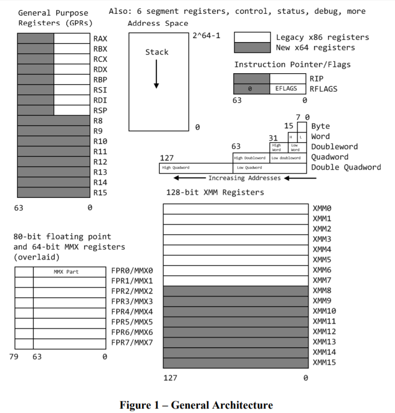

<!-- TOC -->

\- [一、Architecture](#一architecture)    

​    \- [1. register](#1-register)    

​    \- [2. call conventions](#2-call-conventions)

\- [二、Instruction](#二instruction)

​    \- [1. addressing mode](#1-addressing-mode)    

​    \- [2. instruction set](#2-instruction-set)

<!-- /TOC -->


# 一、Architecture

## 1. register



**通用寄存器：** 

```assembly
# 一共 16 个 64 位通用寄存器
RAX ~ RDX, RBP, RSI, RDI, RSP # 兼容 x86，可以使用 EAX, AX, AH, AL, SI, SIL
                              # RSP: stack pointer
R8 ~ R15                      # 新的通用寄存器，R8D(0~31), R8W(0~15), R8B(0~8, R8L)
```


**段寄存器：**

```assembly
CS, DS, ES, FS, GS, SS
```


**控制寄存器**

```assembly
# https://en.wikipedia.org/wiki/Control_register
CR0         # 包含当前处理器运行的控制标志
CR1         # 保留
CR2         # 发生页错误(Page fault)的线性地址
CR3         # 当使能 CR0 的 PG 位，为页目录的物理地址
CR4         # 处理器扩展功能的标志位，比如虚拟8086支持，使能 IO 断点，页大小扩展
CR5 ~ CR7   # 保留
CR8         # x64 下使用 REX 前缀访问，被用作处理外部中断的优先级，被称为任务优先级寄存器(TPR)
            # 低四位为 1(lowest)~15 优先级别，高 60 位保留位 0
            # [REX prefix](https://www.zhihu.com/question/31289006)
CR9 ~ CR15  # 保留
EFER        # 扩展特性使能寄存器，是 model-specific register(MSR)，进入/退出 long mode
XCR0        # 特殊的扩展控制寄存器，管理(启用/禁用)各种特性。(x87, SSE, AVX, ...)
```


**状态寄存器：** `RFLAGS`

| Symbol  |  Bit  |        Name        |                   Set if                    |
| :-----: | :---: | :----------------: | :-----------------------------------------: |
|   CF    |   0   |       Carry        |                 进位或借位                  |
|   PF    |   2   |   Parity(奇偶性)   |               1 的个数为偶数                |
|   AF    |   4   |       Adjust       |         二进制编码的十进制字节进位          |
|   ZF    |   6   |        Zero        |                  结果为 0                   |
|   SF    |   7   |        Sign        |              符号位的结果是 1               |
|   OF    |  11   |      Overflow      |                有符号数溢出                 |
|   DF    |  10   |     Direction      |                串操作的方向                 |
|   TF    |   8   |        trap        |                    陷阱                     |
|  IOPL   | 12/13 | IO privilege level |                 IO 权限级别                 |
|   NT    |  14   |    Nested Task     |    通常由于中断或异常触发了 IDT 的任务门    |
|   RF    |  16   |    Resume flag     |  为 1 时暂时禁止调试寄存器的设置的指令断点  |
|   VM    |  17   | Virtual 8086 Mode  |           为 1 启用虚拟 8086 模式           |
|   AC    |  18   |  Alignment Check   | 设置此标志和 CR0 的 AM 标志启用内存对齐检查 |
| VIF/VIP | 19/20 | Virtual Interrupt  |                虚拟中断机制                 |
|   ID    |  21   |   Identification   |            可变性表示 CPUID 指令            |


**调试寄存器：**

```assembly
DR0 ~ DR3   # 4 个断点的线性地址，如果启用分页，被转换为物理地址
```


**指令指针寄存器：**

```assembly
RIP                # instruction pointer, PC
```


**浮点寄存器：**

```assembly
FPR0 ~ FPR7        # 80 位浮点寄存器，别名 MMX0 ~ MMX7
status register    # 浮点单元的状态、控制、其他寄存器
control register
other specialized registers
```


**保护模式下的寄存器**

```assembly
IDTR         # 32 位的中断描述符表寄存器
GDTR         # 32 位的全局描述符表寄存器
LDTR         # 16 位的局部描述符表寄存器
TR           # 16 位的任务寄存器
```


**SIMD(Single Instruction Multiple Data)** 对多个数据并行执行单条指令

**MMX(Matrix Math eXtensions)** 和 **SSE(Streaming SIMD Extensions)** 指令(使用 MMX 和 XMM 寄存器) 支持 SIMD 操作，在 8 条并行的数据运算用一条指令执行。

**SSE** 加入了浮点支持，SSE 就比 MMX 更加常用。而 **SSE2**加入了整数运算支持之后让 SSE 更加的有弹性，当 MMX 变成是多余的指令集，SSE 指令集甚至可以与 MMX 并发运作，在某些时候可以提供额外的性能增进。

|   Technology    | Register size/type | Item type | Items in Parallel |
| :-------------: | :----------------: | :-------: | :---------------: |
|       MMX       |       64 MMX       |  Integer  |    8, 4, 2, 1     |
|       SSE       |       64 MMX       |  Integer  |      8,4,2,1      |
|       SSE       |      128 XMM       |   Float   |         4         |
| SSE2/SSE3/SSSE3 |       64 MMX       |  Integer  |        2,1        |
| SSE2/SSE3/SSSE3 |      128 XMM       |   Float   |         2         |
| SSE2/SSE3/SSSE3 |      128 XMM       |  Integer  |    16,8,4,2,1     |

```assembly
XMM0 ~ XMM15     # 16 个 128 位寄存器
YMM0 ~ YMM15     # Intel AVX(Advanced Vector Extensions), 256 位寄存器，低 128 位为 XMM
ZMM0 ~ ZMM31     # 512 位寄存器，低 128 位为 XMM，低 256 位为 YMM
```


## 2. call conventions

**参数类型分类：**

- Integer: `bool, char, short, int, long, long long, pointer, unsigned integer, __int128, reference(pointer)`
- SSE: `float, double, _Decimal32, _Decimal64, __m64`，如果 SSEUP 不先于 SSE，被转换为 SSE
- SSEUP: `__float128, _Decimal128, __m128, __m256, __m512`
- X87, X87UP: `long double`
- Complex_X87: `complex<long double>`
- NoClass: 如果聚合类型[^1]的大小超过 8 字节，每个 8 字节被初始化为类 NoClass
- Memory: 大于 512 字节的聚合类型；其中一个 field 为 Memory；If X87UP is not preceded by X87[^2]；如果聚合类型的大于两个 8 字节，并且第一个 8 字节不是 SSE 或者 SSEUP 传递；If SSEUP is not preceded by SSE or SSEUP。

[^1]: 结构体、数组或者 union 的统称。
[^2]: 没看懂，所以就没译。下同。


**Parameter Passing**: 通过寄存器(从左到右的顺序)或者 push 到 stack 中(从右到左)。

- Memory: 通过栈传递参数

- Integer: `rdi, rsi, rdx, rcx, r8, r9`，其余栈传递
- SSE: `xmm0 ~ xmm7` ，其余栈传递
- SSEUP: vector register, `rax` 为被使用 vector register 的数量
- X87, X87UP, Complex_X87: 通过内存传递


Note: `call` 会进行 `push RIP` 

`RBP` 被调用者保存，可选作为 frame pointer

`RBX, R12, R13, R14` 被调用者保存

`R15` 被调用者保存，可选作为 GOT(Global Offset Table) base pointer

`R10` 使用作为传递函数静态链指针(*static chain pointer*), [R10](https://stackoverflow.com/questions/49928950/acceptability-of-regular-usage-of-r10-and-r11)


**Return value**

- Memory: 调用者提供返回值的空间，并且传递这个地址在 `RDI`，这个地址变成了"隐藏的"第一个参数。`RAX` 将保存 `RDI` 传入的地址。
- Integer: `RAX, RDX`
- SSE: `xmm0, xmm1`
- SSEUP: 最后使用的 vector register 下一个可被获得的 8字节块。
- X87, X87UP: `st0` [^3]
- Complex_X87: `st0, st1`


[^3]: `ST(0) ~ ST(7)` 是 `FPR0 ~ FPR7` 物理寄存器的逻辑映射。


>参考资料：
>
>[CSAPP](https://book.douban.com/subject/26912767/) chapter 3
>
>[ABI x64](https://github.com/hjl-tools/x86-psABI/wiki/x86-64-psABI-draft.pdf)
>
>[SystemV ABI](https://wiki.osdev.org/System_V_ABI)
>
>[Register_x86_64](https://wiki.osdev.org/CPU_Registers_x86-64)
>
>[Intel Introduction x64 assembly](https://software.intel.com/sites/default/files/m/d/4/1/d/8/Introduction_to_x64_Assembly.pdf)
>
>[SSE](https://zh.wikipedia.org/wiki/SSE#SSE%E7%9A%84%E6%9A%AB%E5%AD%98%E5%99%A8)


# 二、Instruction

## 1. addressing mode

AT&T 寻址模式

|  类型  |        格式        |            操作数值            |      名称       |
| :----: | :----------------: | :----------------------------: | :-------------: |
| 立即数 |      $\$Imm$       |             $Imm$              |   立即数寻址    |
| 寄存器 |       $R_a$        |            $R[R_a]$            |   寄存器寻址    |
| 存储器 |       $Imm$        |            $M[Imm]$            | 直接(绝对)寻址  |
| 存储器 |      $(R_a)$       |          $M[R[R_a]]$           | 寄存器间接寻址  |
| 存储器 |     $Imm(R_b)$     |       $M[Imm + R[R_b]]$        | 基址+偏移量寻址 |
| 存储器 |    $(R_b, R_i)$    |      $M[R[R_b] + R[R_i]]$      |    变址寻址     |
| 存储器 |   $Imm(Rb, Ri)$    |   $M[Imm + R[R_b] + R[R_i]]$   |    变址寻址     |
| 存储器 |    $(, R_i, s)$    |        $M[R[R_i] · s]$         |  比例变址寻址   |
| 存储器 |   $Imm(,R_i, s)$   |     $M[Imm + R[R_i] · s]$      |  比例变址寻址   |
| 存储器 |  $(R_b, R_i, s)$   |    $M(R[R_b] + R[R_i] · s)$    |  比例变址寻址   |
| 存储器 | $Imm(R_b, R_i, s)$ | $M(Imm + R[R_b] + R[R_i] · s)$ |  比例变址寻址   |


 $R_a$ 表示某个寄存器，$R_b(E_b)$ 为基址寄存器，$R_i(E_i)$ 为变址寄存器，$R[R_a]$ 表示取寄存器的值，$M[addr]$ 表示取对应地址单元的值，$s$ 为比例系数，为 1、2、4、8。


## 2. instruction set

**概述** 

|       Opcode        |                  Meaning                   |
| :-----------------: | :----------------------------------------: |
|        `MOV`        | move to from/ between memory and registers |
|       `CMOV*`       |         Various conditional moves          |
|       `XCHG`        |                  Exchange                  |
|       `BSWAP`       |                 Byte swap                  |
|     `PUSH/POP`      |                Stack usage                 |
|      `ADD/ADC`      |               Add/with carry               |
|      `SUB/SBC`      |            Subtract/with carry             |
|     `MUL/IMUL`      |          Multiply unsigned/signed          |
|     `DIV/IDIV`      |           Divide unsigned/signed           |
|      `INC/DEC`      |            Increment/Decrement             |
|        `NEG`        |                   Negate                   |
|        `CMP`        |                  Compare                   |
|  `AND/OR/XOR/NOT`   |             Bitwise operations             |
|      `SHR/SAR`      |       Shift right logical/arithmetic       |
|      `SHL/SAL`      |       Shift left logical/arithmetic        |
|      `ROR/ROL`      |             Rotate right/left              |
|      `RCR/RCL`      |    Rotate right/left through carry bit     |
|    `BT/BTS/BTR`     |         Bit test/and set/and reset         |
|        `JMP`        |             Unconditional jump             |
|      `JMP/J*`       |           Jump/conditional jump            |
| `LOOP/LOOPE/LOOPNE` |              Loop with `ECX`               |
|     `CALL/RET`      |           Call subroutine/return           |
|        `NOP`        |                No operation                |
|       `CPUID`       |              CPU information               |


**数据类型及指令后缀(针对 LP64 及 AT&T)：**

|  C type  | 后缀 | 大小(byte) |
| :------: | :--: | :--------: |
|  `char`  | `b`  |     1      |
| `short`  | `w`  |     2      |
|  `int`   | `l`  |     4      |
|  `long`  | `q`  |     8      |
|   `T*`   | `q`  |     8      |
| `float`  | `ss` |     4      |
| `double` | `sd` |     8      |


**数据传送指令**

|        Instruction        |    效果     |       描述       |
| :-----------------------: | :---------: | :--------------: |
|    `mov[b,w,l,q] S, D`    |   `D = S`   |                  |
|      `movabsq I, R`       |   `R = I`   |                  |
|  `movz[bw,bl,wl,bq,wq]`   | `R = ZE(S)` |  零扩展进行传递  |
| `movs[bw,bl,wl,bq,wq,lq]` | `R = SE(S)` | 符号扩展进行传递 |

```txt
b: byte, w: word(2 bytes), l: 4 bytes, q: 8 bytes, absq: 绝对四字
bw: b->w, bl: b->l, wl: w->l, bq: b->q, wq: w->q, lq: l->q
x86_64 S 和 D 操作数不能同时为内存地址
mov 指令只会更新目的操作数指定的字节或者内存位置，例外是 movl 指令会把高 4 位清 0
```


**push/pop**

| Instruction |                    效果                     | 描述 |
| :---------: | :-----------------------------------------: | :--: |
|  `pushq S`  |  `R[%rsp] = R[%rsp]-8`<br>`M[R[%rsp]] = S`  |      |
|  `popq D`   | `D = M[R[%rsp]]`<br>`R[%rsp] = R[%rsp] + 8` |      |


**leaq**

`LEAQ` load effective address，实际上是 `mov` 的变形，第一个操作数看起来是内存的引用，其实并不是从指定位置读入数据，而是将有效地址写入到目的操作数。比如 `D = &S`，`&` 为 C/C++ 中的取地址运算符。另外还可以简单地描述算术操作。

`leaq S, D` 

```assembly
# example1: D = &S
# int x = 42;
# int* px = &x;
leaq -8(%rbp), %rcx       # %rcx = %rbp - 8 = &x
movl    $0, -4(%rbp)
movl    $42, -8(%rbp)     # x = 42
movq    %rcx, -16(%rbp)   # px = %rcx
```

```assembly
# long scale(long x, long y, long z) {
#     int64_t t = x + 4 * y + 12 * z;
#     return t;
# }

scale(long, long, long):           # @scale(long, long, long)
	leaq    (%rdi,%rsi,4), %rax    # %rax = x + 4y 
	leaq    (%rdx,%rdx,2), %rcx    # %rcx = z + 2z = 3z
	leaq    (%rax,%rcx,4), %rax    # %rax = %rax + %rcx * 4 = x + 4y + 12z
	retq
```


**算术指令**

|          Instruction           |                  效果                   |              描述              |
| :----------------------------: | :-------------------------------------: | :----------------------------: |
|      `INC/DEC/NEG/NOT D`       |           `D++/D--/D=-D/D=~D`           |             unary              |
| `ADD/SUB/IMUL/XOR/OR/AND S, D` |              `D = S op D`               |             binary             |
|     `SAL/SHL/SAR/SHR k, D`     | `D = D << k/../D = D >>A k/D = D >>L k` |     逻辑左移和算术左移相同     |
|    // 接下来为特殊算术指令     |                                         |                                |
|         `imulq/mulq S`         |        `%rdx:%rax = S * R[%rax]`        | 高位放在 `RDX`，低位放在 `RAX` |
|             `cltq`             |             `RAX = SE(EAX)`             |      `EAX `符号扩展到 RAX      |
|             `clto`             |        `%rdx:%rax = SE(R[%rax])`        |         `RAX` 符号扩展         |
|          `idivq/divq`          |     `%rdx = R[%rdx]:R[%rax] mod S`      |      带 `i` 为有符号运算       |
|                                |      `%rax = R[%rdx]:R[%rax] / S`       |                                |


**控制指令**

|      Instruction       |          效果          |     描述      |
| :--------------------: | :--------------------: | :-----------: |
|      `CMP S1, S2`      |       `S2 - S2`        |     比较      |
|     `TEST S1, S2`      |       `S1 & S2`        |     测试      |
|     `set[cond] D`      |      `D = XFLAG`       |  获取条件码   |
|  `JMP Label/*operand`  |                        | 直接/间接跳转 |
|      `CMOV* S, R`      |  `if cond then R = S`  |  条件 `MOV`   |
| `callq Label/*operand` | `pushq RIP, jmp label` |     call      |
|         `retq`         | `popq addr, jmp addr`  |    return     |


条件码：

|           condition           |     描述     |
| :---------------------------: | :----------: |
|            `e(z)`             |   相等(零)   |
|           `ne(nz)`            | 不相等(非零) |
|            `s/ns`             | 负数/非负数  |
| `g(nle)/ge(nl)/l(nge)/le(ng)` | 有符号数比较 |
| `a(nbe)/ae(nb)/b(nae)/be(na)` | 无符号数比较 |


> 参考资料：
>
> [instruction set](https://c9x.me/x86/)
>
> [CSAPP](https://book.douban.com/subject/26912767/) chapter 3