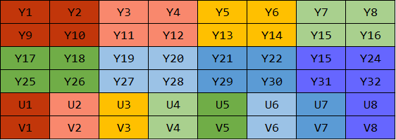
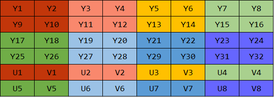

# 一、基础概念
## 1. 声音
声音是压力波，声波三要素是**频率**(音阶)、**振幅**(响度大小)、**波形**(音色)。

频率(过零率)越低，波长越长，更容易绕过障碍物，能量衰减较小，声音就会传得远。人耳听力频率大概是 `20Hz - 20kHz`

响度就是能量大小，使用分贝作为单位。超过 90 dB 将损害人耳，105 dB 为人耳极限。

波的形状决定了声音的音色，比如相同频率和振幅的钢琴和小提琴听起来就是很不一样的，因为音色不同。


**数字音频**：

为了模拟信号数字化，需要对音频进行**采样(sampling)**、**量化(quantization)**  和 **编码(encoding)**。

采样就是对模拟信号进行采样，在时间轴上对连续模拟信号进行数字离散化。根据[采样定理](https://zh.wikipedia.org/wiki/%E9%87%87%E6%A0%B7%E5%AE%9A%E7%90%86)（奈奎斯特定理），需要按比声音最高频率高 2 倍多的频率进行采样(AD 转换)，避免发生混叠(相位/频率发生模糊)。人耳能听到声音频率为 20Hz - 20kHz，采样频率一般为 44.1 kHz，也就是 1 秒采样 44100 次。

具体每次采样如何表示，就涉及到量化。量化是指在幅度轴上对信号进行数字化，比如使用 16-bit 值表示声音的一个采样，共有 65536 个可能取值。


每个采样都可以有一个量化值，那么采样得到的量化值如何进行存储呢。涉及到编码过程。编码是按照一定的格式记录采样和量化后的数字数据，比如顺序存储或压缩存储。

编码涉及到很多格式，通常所说的音频裸数据是脉冲编码调制(Pulse Code Modulation, PCM) 数据。描述一段 PCM 数据一般需要以下几个概念：量化格式(sample format，也叫位深度，bit depth)、采样率(sample rate)、声道数(channel)。

以 CD 音质为例，量化格式为 16-bit，采样率为 44100，声道数为 2。

还有一个概念来描述声音的容量大小，称为比特率(bit rate)，单位时间处理的比特数量，用于衡量单位时间内音频数据的容量大小。对于 CD 音质而言，比特率为 `44100 kHz * 16 bit * 2 = 1378.125 kbps`，一分钟的 CD 音乐需要 `1378.125 * 60 / 8 / 1024 = 10.09 MB` 

麦克风采集声音原理。麦克风里面有一层碳膜，非常薄而且十分敏感。声音其实是一种纵波，会压缩空气也会压缩这层碳膜，碳膜在受到挤压时也会发出振动， 在碳膜的下方就是一个电极，碳膜在振动的时候会接触电极，接触时间的长短和频率与声波的振动幅度和频率有关，这样就完成了声音信号到电信号的转换。之后再经过放大电路处理，就可以实施后面的采样量化处理了。


**音频编码**

有些情况需要对声音进行压缩编码来节省带宽。压缩编码的基本指标是压缩比，压缩比通常小于 1。压缩算法分为无损压缩和有损压缩。

常见的无损压缩有：APE、FLAC、Apple Lossless、WavPack，常见的有损压缩有：MP3、AAC、Vorbis、Opus。

常见的压缩编码格式：

- WAV: 上古时期微软开发的音频格式，使用 RIFF 文件规范存储，WAV 编码的一种实现方式是在 PCM 数据前面添加 44 字节，用来描述 PCM 的采样率、声道数、数据格式等信息。通常不会压缩，音质非常好。
- MP3: MP3实质是对PCM数据中涉及的人类听觉不重要的部分进行舍弃，从而压缩得到较小的文件，具有不错的压缩比，使用 LAME(MP3 一种实现) 的中高码率的 MP3 文件，听感接近 WAV 文件。音质在 128 kbps 表现还不错，压缩比比较高，使用广泛，兼容性好。
- AAC: 通过一些附加的编码技术，衍生出 LC-AAC、HE-AAC、HE-AAC v2 等编码格式。LC-AAC 主要用于中高码率的场景（>= 80 kbps），HE-AAC 主要用于中低码率 (<= 80 kbps)，HE-AAC v2 主要用于低码率(<= 48 kbps)。在小于 128 kbps 的码率下表现优异，并且用于视频中的音频编码。
- Ogg: 各种码率下都比较优秀，尤其在中低码率下。Ogg 在受支持情况不太好，无论在软件还是硬件上，流媒体特性不支持。适用于语音聊天的音频消息场景。


**参考资料**：

[大家都能看懂的Nyquist-Shannon采样定理](https://zhuanlan.zhihu.com/p/45004323)

[音频文件格式](https://zh.wikipedia.org/wiki/%E9%9F%B3%E9%A2%91%E6%96%87%E4%BB%B6%E6%A0%BC%E5%BC%8F)


## 2. 图像

视频是由一幅幅图像组成的，先从图像开始。

### RGB

一幅图像由一个二维的像素点构成，一个像素点由 RGB 组成，表示 RGB 的方式：

- 浮点型：取值范围 0.0 - 1.0，比如 OpenGL ES 中就是这种方式
- 整型：取值范围 0 - 255，8-bit 表示一个 RGB 分量，24-bit 可以表示一个像素点。还有 RGBA_8888 变体，A 表示 Alpha 通道（不透明度），使用 32-bit。Android 平台可以使用 RGB_565，16-bit 来表示一个像素。
  对于一幅图像，一般使用整型的方式进行描述，也就是位图(bitmap)。一张 1280 * 720 的 RGBA 图像大小为 `1280 * 720 * 4B = 3.516 MB` 

和声音编码一样，为了压缩编码，也有一系列的图像压缩格式，比如 JPEG，提供了良好的压缩性能并且有较好的重建质量。被广泛应用于图像处理领域。不过用于视频上不太合适，有时域上的元素需要考虑，需要考虑帧间编码。


### YUV

对于视频帧的裸数据表示，更多使用 YUV 数据格式。Y 表示亮度(Luminance)，U 和 V 共同表示色度(Chrominance)，色度描述影像的色调和饱和度，用 Cr 和 Cb 表示。Cr 和 Cb 反映了 RGB 输入信号红色和蓝色部分与 RGB 信号亮度值的差。利用了人眼对亮度更敏感，对色度相对不敏感的特性，在视频编码系统中为了降低带宽，可以保存更多的亮度信息，减少色度分量的带宽，方便视频数据的编码和传输，而且向后兼容老式黑白电视(只有 Y 分量)。

因为历史原因，YUV、Y'UV、YCbCr、YPbPr(Y'CbCr) 等术语经常被混淆，Y 表示 Luminance，表示人眼对发光体或被照射物体表面的发光或反射光强度实际感受的物理量。Y' 表示 Luma，对 Y 进行伽马校正(gamma correction，$V_{out}=A V_{in}^{\gamma}$)编码处理。术语 YUV 和 Y'UV 用来编码电视系统的模拟信号。YCbCr 是 YUV 的压缩和偏移版本，用于对视频和图像压缩和传输的颜色信息进行压缩和编码，比如 MPEG 和 JPEG，然而现在计算机领域常用术语 YUV 描述用 YCbCr 编码的文件格式。


**采样**

YUV 主流的采样方式有 4:4:4、4:2:2、4:2:0，还有一种不太常用的 4:1:1

4:4:4 采样，每 4 个 Y 采样对应 4 个 U 和 4 个 V 采样，意味着 Y、U、V 三个分量的采样比例相同，每个像素的三个分量信息完整，都是 8-bit，所以 4:4:4 采样方式的图像和 RGB_888 颜色模型的图像大小是一样的，并没有达到节省带宽的目的。一张 1280 * 720 的 YUV 4:4:4 图像大小约为 2.64 MB

4:2:2 采样，每 4 个 Y 采样对应 2 个 U **和** 2 个 V 采样，意味着 UV 分量是 Y 分量的一半，如果水平方向有 10 个像素点，那么采样了 10 个 Y 分量，而只采样了 5 个 UV 分量。平均一个像素占用空间为 8+4+4 bits，大小是原先 RGB_888 图像的 2/3，一张 1280 * 720 的 YUV 4:2:2 图像大小约为 1.76 MB

4:2:2 采样，每 4 个 Y 采样对应 2 个 U **或** 2 个 V 采样，在每一行扫描时，只扫描 U 或 V。比如第一行按照 Y:U = 2:1 进行采样，第二行按照 Y:V = 2:1 进行采样。平均一个像素占用空间为 8+4 bits，大小是原先 RGB_888 图像的 1/2，一张 1280 * 720 的 YUV 4:2:2 图像大小约为 1.32 MB


上图黑点表示 Y 采样，空心圆圈表示 UV 采样。


**编码格式**

采样得到数据，现在需要把采样的数据进行编码存储。YUV 存储格式有两种：packed 紧缩格式 和 planar 平面格式。packed 格式和 RGB 存储方式类似，讲 YUV 三个分量组成一个 24-bit 值进行存储，适合 4:4:4 采样。planar 格式将 Y、U、V 的三个分量分别存放在不同的矩阵中。

YUV 4:2:2 采样的编码格式有: YUYV 格式、UYVY 格式、422P(I422) 格式。其中 YUYV、UYVY 为 packed 格式，422P 为 planar 格式，先存储所有的 Y 分量，再存储所有的 U 分量，再存储所有的 V 分量。

```txt
                2 pixels
             +-------------+-------------+-------------+
YUYV format: | Y0 U0 Y1 V0 | Y2 U2 Y3 V2 | Y4 U4 Y5 V4 |
             +-------------+-------------+-------------+
UYVY format: | U0 Y0 V0 Y1 | U2 Y2 V2 Y3 | U4 Y4 V4 Y5 |
             +-------------+-------------+-------------+
```


YUV 4:2:0 采样的编码格式有: 

- YUV 420P: YU12 和 YV12 格式
- YUV 420SP: NV12 和  NV21 格式


YUV 420 P 的 YU12 格式(也叫 I420)，先存储 Y 分量，再存储 U，最后是 V 分量，如下图所示。YV12 格式正好相反，先 Y 分量，再存储 V 分量，最后是 U 分量，图略。




YUV 420 SP 的 NV12 格式，先存储 Y 分量，再交替存储 UV 分量，是 iOS 中的格式，如下图所示。NV21 格式正好相反，先 Y 分量，再交替存储 VU 分量，是 Android 中的格式，图略。




总结起来就是

```txt
 YUV 420 Format
 +-----------------------+-----------------------+
 |     YUV420P(3Plane)   |     YUV420SP(2Plane)  |
 +-----------+-----------+-----------+-----------+
 | YU12/I420 |    YV12   |   NV12    |    NV21   |
 +-----------+-----------+-----------+-----------+
 |   Y+U+V   |   Y+V+U   |    Y+UV   |    Y+VU   |
 +-----------+-----------+-----------+-----------+
```


**和 RGB 转换**

由于网上大多数文章涉及到 YUV 和 RGB 互相转换公式没有标注标准以及 RGB、YUV 值的取值范围，导致转换公式的非常混乱

标清电视(SDTV) BT.470 (PAL 或 NTSC) 定义 YUV 和 RGB 的转换公式为：

$${\displaystyle {\begin{aligned}{\begin{bmatrix}Y'\\U\\V\end{bmatrix}}&={\begin{bmatrix}0.299&0.587&0.114\\-0.14713&-0.28886&0.436\\0.615&-0.51499&-0.10001\end{bmatrix}}{\begin{bmatrix}R\\G\\B\end{bmatrix}},\\{\begin{bmatrix}R\\G\\B\end{bmatrix}}&={\begin{bmatrix}1&0&1.13983\\1&-0.39465&-0.58060\\1&2.03211&0\end{bmatrix}}{\begin{bmatrix}Y'\\U\\V\end{bmatrix}}.\end{aligned}}}$$


RGB、Y' 的取值范围为 [0, 1]，U 的取值范围为 [-0.436, +0.436]，V 取值范围为 [-0.615, +0.615]

BT.610 定义 U，V 的取值范围为 [-0.5, +0.5]


高清电视(HDTV) BT.709 定义转换公式为：

$${\displaystyle {\begin{aligned}{\begin{bmatrix}Y'\\U\\V\end{bmatrix}}&={\begin{bmatrix}0.2126&0.7152&0.0722\\-0.09991&-0.33609&0.436\\0.615&-0.55861&-0.05639\end{bmatrix}}{\begin{bmatrix}R\\G\\B\end{bmatrix}}\\{\begin{bmatrix}R\\G\\B\end{bmatrix}}&={\begin{bmatrix}1&0&1.28033\\1&-0.21482&-0.38059\\1&2.12798&0\end{bmatrix}}{\begin{bmatrix}Y'\\U\\V\end{bmatrix}}\end{aligned}}}$$

同样，RGB、Y' 的取值范围为 [0, 1]，U 的取值范围为 [-0.436, +0.436]，V 取值范围为 [-0.615, +0.615]


**参考资料**：

https://en.wikipedia.org/wiki/YUV

https://en.wikipedia.org/wiki/YCbCr

https://glumes.com/post/ffmpeg/understand-yuv-format/

https://web.archive.org/web/20160127065924/http://www.equasys.de/colorconversion.html

https://www.fourcc.org/fccyvrgb.php

https://blog.csdn.net/liyuanbhu/article/details/68951683


