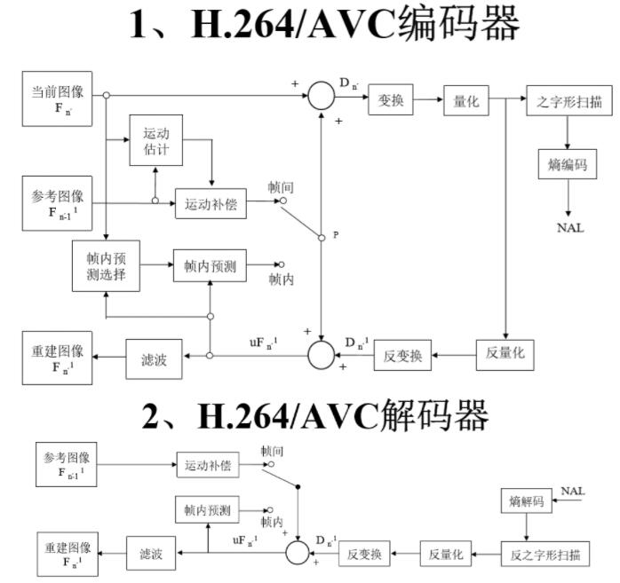

# 一、基础概念
## 1. 声音
声音是压力波，声波三要素是**频率**(音阶)、**振幅**(响度大小)、**波形**(音色)。

频率(过零率)越低，波长越长，更容易绕过障碍物，能量衰减较小，声音就会传得远。人耳听力频率大概是 `20Hz - 20kHz`

响度就是能量大小，使用分贝作为单位。超过 90 dB 将损害人耳，105 dB 为人耳极限。

波的形状决定了声音的音色，比如相同频率和振幅的钢琴和小提琴听起来就是很不一样的，因为音色不同。


**数字音频**：

为了模拟信号数字化，需要对音频进行**采样(sampling)**、**量化(quantization)**  和 **编码(encoding)**。

采样就是对模拟信号进行采样，在时间轴上对连续模拟信号进行数字离散化。根据[采样定理](https://zh.wikipedia.org/wiki/%E9%87%87%E6%A0%B7%E5%AE%9A%E7%90%86)（奈奎斯特定理），需要按比声音最高频率高 2 倍多的频率进行采样(AD 转换)，避免发生混叠(相位/频率发生模糊)。人耳能听到声音频率为 20Hz - 20kHz，采样频率一般为 44.1 kHz，也就是 1 秒采样 44100 次。

具体每次采样如何表示，就涉及到量化。量化是指在幅度轴上对信号进行数字化，比如使用 16-bit 值表示声音的一个采样，共有 65536 个可能取值。


每个采样都可以有一个量化值，那么采样得到的量化值如何进行存储呢。涉及到编码过程。编码是按照一定的格式记录采样和量化后的数字数据，比如顺序存储或压缩存储。

编码涉及到很多格式，通常所说的音频裸数据是脉冲编码调制(Pulse Code Modulation, PCM) 数据。描述一段 PCM 数据一般需要以下几个概念：量化格式(sample format，也叫位深度，bit depth)、采样率(sample rate)、声道数(channel)。

以 CD 音质为例，量化格式为 16-bit，采样率为 44100，声道数为 2。

还有一个概念来描述声音的容量大小，称为比特率(bit rate)，单位时间处理的比特数量，用于衡量单位时间内音频数据的容量大小。对于 CD 音质而言，比特率为 `44100 kHz * 16 bit * 2 = 1378.125 kbps`，一分钟的 CD 音乐需要 `1378.125 * 60 / 8 / 1024 = 10.09 MB` 

麦克风采集声音原理。麦克风里面有一层碳膜，非常薄而且十分敏感。声音其实是一种纵波，会压缩空气也会压缩这层碳膜，碳膜在受到挤压时也会发出振动， 在碳膜的下方就是一个电极，碳膜在振动的时候会接触电极，接触时间的长短和频率与声波的振动幅度和频率有关，这样就完成了声音信号到电信号的转换。之后再经过放大电路处理，就可以实施后面的采样量化处理了。


**音频编码**

有些情况需要对声音进行压缩编码来节省带宽。压缩编码的基本指标是压缩比，压缩比通常小于 1。压缩算法分为无损压缩和有损压缩。

常见的无损压缩有：APE、FLAC、Apple Lossless、WavPack，常见的有损压缩有：MP3、AAC、Vorbis、Opus。

常见的压缩编码格式：

- WAV: 上古时期微软开发的音频格式，使用 RIFF 文件规范存储，WAV 编码的一种实现方式是在 PCM 数据前面添加 44 字节，用来描述 PCM 的采样率、声道数、数据格式等信息。通常不会压缩，音质非常好。
- MP3: MP3实质是对PCM数据中涉及的人类听觉不重要的部分进行舍弃，从而压缩得到较小的文件，具有不错的压缩比，使用 LAME(MP3 一种实现) 的中高码率的 MP3 文件，听感接近 WAV 文件。音质在 128 kbps 表现还不错，压缩比比较高，使用广泛，兼容性好。
- AAC: 通过一些附加的编码技术，衍生出 LC-AAC、HE-AAC、HE-AAC v2 等编码格式。LC-AAC 主要用于中高码率的场景（>= 80 kbps），HE-AAC 主要用于中低码率 (<= 80 kbps)，HE-AAC v2 主要用于低码率(<= 48 kbps)。在小于 128 kbps 的码率下表现优异，并且用于视频中的音频编码。数据由一个一个的 ADTS 包构成。
- Ogg: 各种码率下都比较优秀，尤其在中低码率下。Ogg 在受支持情况不太好，无论在软件还是硬件上，流媒体特性不支持。适用于语音聊天的音频消息场景。


**参考资料**：

[大家都能看懂的Nyquist-Shannon采样定理](https://zhuanlan.zhihu.com/p/45004323)

[音频文件格式](https://zh.wikipedia.org/wiki/%E9%9F%B3%E9%A2%91%E6%96%87%E4%BB%B6%E6%A0%BC%E5%BC%8F)


## 2. 图像

视频是由一幅幅图像组成的，先从图像开始。

### RGB

一幅图像由一个二维的像素点构成，一个像素点由 RGB 组成，表示 RGB 的方式：

- 浮点型：取值范围 0.0 - 1.0，比如 OpenGL ES 中就是这种方式
- 整型：取值范围 0 - 255，8-bit 表示一个 RGB 分量，24-bit 可以表示一个像素点。还有 RGBA_8888 变体，A 表示 Alpha 通道（不透明度），使用 32-bit。Android 平台可以使用 RGB_565，16-bit 来表示一个像素。
  对于一幅图像，一般使用整型的方式进行描述，也就是位图(bitmap)。一张 1280 * 720 的 RGBA 图像大小为 `1280 * 720 * 4B = 3.516 MB` 

和声音编码一样，为了压缩编码，也有一系列的图像压缩格式，比如 JPEG，提供了良好的压缩性能并且有较好的重建质量。被广泛应用于图像处理领域。不过用于视频上不太合适，有时域上的元素需要考虑，需要考虑帧间编码。


### YUV

对于视频帧的裸数据表示，更多使用 YUV 数据格式。Y 表示亮度(Luminance)，U 和 V 共同表示色度(Chrominance)，色度描述影像的色调和饱和度，用 Cr 和 Cb 表示。Cr 和 Cb 反映了 RGB 输入信号红色和蓝色部分与 RGB 信号亮度值的差。利用了人眼对亮度更敏感，对色度相对不敏感的特性，在视频编码系统中为了降低带宽，可以保存更多的亮度信息，减少色度分量的带宽，方便视频数据的编码和传输，而且向后兼容老式黑白电视(只有 Y 分量)。

因为历史原因，YUV、Y'UV、YCbCr、YPbPr(Y'CbCr) 等术语经常被混淆，Y 表示 Luminance，表示人眼对发光体或被照射物体表面的发光或反射光强度实际感受的物理量。Y' 表示 Luma，对 Y 进行伽马校正(gamma correction，$V_{out}=A V_{in}^{\gamma}$)编码处理。术语 YUV 和 Y'UV 用来编码电视系统的模拟信号。YCbCr 是 YUV 的压缩和偏移版本，用于对视频和图像压缩和传输的颜色信息进行压缩和编码，比如 MPEG 和 JPEG，然而现在计算机领域常用术语 YUV 描述用 YCbCr 编码的文件格式。


**采样**

YUV 主流的采样方式有 4:4:4、4:2:2、4:2:0，还有一种不太常用的 4:1:1

4:4:4 采样，每 4 个 Y 采样对应 4 个 U 和 4 个 V 采样，意味着 Y、U、V 三个分量的采样比例相同，每个像素的三个分量信息完整，都是 8-bit，所以 4:4:4 采样方式的图像和 RGB_888 颜色模型的图像大小是一样的，并没有达到节省带宽的目的。一张 1280 * 720 的 YUV 4:4:4 图像大小约为 2.64 MB

4:2:2 采样，每 4 个 Y 采样对应 2 个 U **和** 2 个 V 采样，意味着 UV 分量是 Y 分量的一半，如果水平方向有 10 个像素点，那么采样了 10 个 Y 分量，而只采样了 5 个 UV 分量。平均一个像素占用空间为 8+4+4 bits，大小是原先 RGB_888 图像的 2/3，一张 1280 * 720 的 YUV 4:2:2 图像大小约为 1.76 MB

4:2:2 采样，每 4 个 Y 采样对应 2 个 U **或** 2 个 V 采样，在每一行扫描时，只扫描 U 或 V。比如第一行按照 Y:U = 2:1 进行采样，第二行按照 Y:V = 2:1 进行采样。平均一个像素占用空间为 8+4 bits，大小是原先 RGB_888 图像的 1/2，一张 1280 * 720 的 YUV 4:2:2 图像大小约为 1.32 MB


上图黑点表示 Y 采样，空心圆圈表示 UV 采样。


**编码格式**

采样得到数据，现在需要把采样的数据进行编码存储。YUV 存储格式有两种：packed **紧缩格式** 和 planar **平面格式**。packed 格式和 RGB 存储方式类似，讲 YUV 三个分量组成一个 24-bit 值进行存储，适合 4:4:4 采样。planar 格式将 Y、U、V 的三个分量分别存放在不同的矩阵中。

YUV 4:2:2 采样的编码格式有: YUYV 格式、UYVY 格式、422P(I422) 格式。其中 YUYV、UYVY 为 packed 格式，422P 为 planar 格式，先存储所有的 Y 分量，再存储所有的 U 分量，再存储所有的 V 分量。

```txt
                2 pixels
             +-------------+-------------+-------------+
YUYV format: | Y0 U0 Y1 V0 | Y2 U2 Y3 V2 | Y4 U4 Y5 V4 |
             +-------------+-------------+-------------+
UYVY format: | U0 Y0 V0 Y1 | U2 Y2 V2 Y3 | U4 Y4 V4 Y5 |
             +-------------+-------------+-------------+
```


YUV 4:2:0 采样的编码格式有: 

- YUV 420P: YU12 和 YV12 格式
- YUV 420SP: NV12 和  NV21 格式


YUV 420 P 的 YU12 格式(也叫 I420)，先存储 Y 分量，再存储 U，最后是 V 分量，如下图所示。YV12 格式正好相反，先 Y 分量，再存储 V 分量，最后是 U 分量，图略。


YUV 420 SP 的 NV12 格式，先存储 Y 分量，再交替存储 UV 分量，是 iOS 中的格式，如下图所示。NV21 格式正好相反，先 Y 分量，再交替存储 VU 分量，是 Android 中的格式，图略。


总结起来就是

```txt
 YUV 420 Format
 +-----------------------+-----------------------+
 |     YUV420P(3Plane)   |     YUV420SP(2Plane)  |
 +-----------+-----------+-----------+-----------+
 | YU12/I420 |    YV12   |   NV12    |    NV21   |
 +-----------+-----------+-----------+-----------+
 |   Y+U+V   |   Y+V+U   |    Y+UV   |    Y+VU   |
 +-----------+-----------+-----------+-----------+
```


**和 RGB 转换**

由于网上大多数文章涉及到 YUV 和 RGB 互相转换公式没有标注标准以及 RGB、YUV 值的取值范围，导致转换公式的非常混乱

标清电视(SDTV) BT.470 (PAL 或 NTSC) 定义 YUV 和 RGB 的转换公式为：

$${\displaystyle {\begin{aligned}{\begin{bmatrix}Y'\\U\\V\end{bmatrix}}&={\begin{bmatrix}0.299&0.587&0.114\\-0.14713&-0.28886&0.436\\0.615&-0.51499&-0.10001\end{bmatrix}}{\begin{bmatrix}R\\G\\B\end{bmatrix}},\\{\begin{bmatrix}R\\G\\B\end{bmatrix}}&={\begin{bmatrix}1&0&1.13983\\1&-0.39465&-0.58060\\1&2.03211&0\end{bmatrix}}{\begin{bmatrix}Y'\\U\\V\end{bmatrix}}.\end{aligned}}}$$


RGB、Y' 的取值范围为 [0, 1]，U 的取值范围为 [-0.436, +0.436]，V 取值范围为 [-0.615, +0.615]

BT.610 定义 U，V 的取值范围为 [-0.5, +0.5]


高清电视(HDTV) BT.709 定义转换公式为：

$${\displaystyle {\begin{aligned}{\begin{bmatrix}Y'\\U\\V\end{bmatrix}}&={\begin{bmatrix}0.2126&0.7152&0.0722\\-0.09991&-0.33609&0.436\\0.615&-0.55861&-0.05639\end{bmatrix}}{\begin{bmatrix}R\\G\\B\end{bmatrix}}\\{\begin{bmatrix}R\\G\\B\end{bmatrix}}&={\begin{bmatrix}1&0&1.28033\\1&-0.21482&-0.38059\\1&2.12798&0\end{bmatrix}}{\begin{bmatrix}Y'\\U\\V\end{bmatrix}}\end{aligned}}}$$

同样，RGB、Y' 的取值范围为 [0, 1]，U 的取值范围为 [-0.436, +0.436]，V 取值范围为 [-0.615, +0.615]


### 图片格式

BMP 是由微软开发的，常见的无损图片格式之一，内部使用的就是 RGB 格式，数据区直接排列着每一个像素对应的 RGB 或 RGBA。800 * 600 的 24-bit 图片需要占据约 1.4 MB 的空间。

PNG 是另一种无损压缩的图片格式，由 RFC2083 标准描述，拥有对 Alpha 通道的透明/半透明特性的支持。适用于需要半透明效果的场合。

JPEG 是有损压缩的图片格式，主要思路是舍弃人眼难以感知的颜色（高频）信息。关于 JPEG 的介绍可以参考科普视频 [JPEG 有损压缩 离散余弦变换 DCT 一条视频讲清楚](https://www.bilibili.com/video/BV17M4y1u7Ek)。基本过程将 RGB -> YUV 420P，将整幅图像分割为 8 * 8 小块，然后对每个小块进行 DCT(Discrete Cosine Transform，离散余弦变换[^注1])，舍弃高频信号部分，对连续信号采样得到离散的数据(量化)，经过量化后的矩阵，高频区会出现大量的 0。之后对进行 Z 字扫描(FFmpeg 图标) 进行排列，最后会出现一串的 0，使用 `EOB` 来表示，最后用哈夫曼对数据进行编码。

[^注1]: DCT 类似于只使用实数且长度为两倍的离散傅里叶变换，常用于信号和图像处理或对数据的有损压缩，DCT 变换本身是可逆的，最大的特点是能力集中，大多数声音或图像信号集中在低频部分，可以对高频部分进行舍弃，可以达到压缩率大而失真较少，保留更多的信息。

SVG 是一种适合应用于网页的矢量图形标准。

如果有极致压缩需求，还可以考虑 WEBP 和 BPG 等格式。WEBP衍生自 Google 视频编码格式 VP8，在 BSD 授权下开源，相比 JPEG 同样质量的图片，WEBP 可节省 25%～40% 的大小，在 Chrome、Opera 浏览器和 Android 系统上，都内置了它的支持，但其他浏览器不能直接支持则是一大弊端。BPG 是 FFMpeg 发起者创建的一种图片格式，主要参考 H.265 编码方法中的部分工具，在某些情况下具有很好的压缩比，并有一个效率不错的基于 JavaScript 的解码器。压缩小图片时，BPG格式颇占优势。


**参考资料**：

https://en.wikipedia.org/wiki/YUV

https://en.wikipedia.org/wiki/YCbCr

https://glumes.com/post/ffmpeg/understand-yuv-format/

https://web.archive.org/web/20160127065924/http://www.equasys.de/colorconversion.html

https://www.fourcc.org/fccyvrgb.php

https://blog.csdn.net/liyuanbhu/article/details/68951683


## 3. 视频

### 概述

音频压缩主要是去除冗余信息，从而实现数据量的压缩。对于视频压缩，也是通过去除冗余信息来进行压缩的，视频信息有大量的冗余，包括空间上、时间上、统计上以及感知上的冗余信息。

使用**帧内编码**技术可以去除**空间**上的冗余信息。ISO 制定了 Motion JPEG(MPEG) 标准，适用于动态视频的压缩算法， 它除了对单幅图像进行编码外， 还利用图像序列中的相关原则去除冗余， 这样可以大大提高视频的压缩比。MPEG 有很多版本，比如 MPEG1 Part2(VCD)，MPEG2 Part2(DVD，H.262)，H.263(曾在视频会议广泛使用)，MPEG4 Part10(AVC，H.264)，MPEG-H Part2 (HEVC，H.265)。H.26x 标准由 ITU-T 制定。

使用**帧间编码**技术可以去除**时间**上的冗余信息， 具体包括以下几个部分：

- 运动补偿：一种描述相邻帧差别的方法， 它是减少帧序列冗余信息的有效方法
- 运动表示： 不同区域的图像需要使用不同的运动矢量来描述运动信息
- 运动估计： 运动估计是从视频序列中抽取运动信息的一整套技术，寻找最优或次优的运动向量的过程

**帧间编码概念**

GOP(Group Of Pictures): 代表一组连续的图像帧。通常在为编码器设置参数的时候， 必须要设置 `gop_size` 的值， 其代表的是两个 I 帧之间的帧数目。相对来说`gop_size` 设置得越大， 相同大小的视频整个画面的质量就会越好， 但是在解码器必须对一整个 GOP 进行解码再渲染显示。在 H.264 中新引入了 IDR 帧(instantaneous decoding refresh picture)，因为 H.264 使用了多帧预测，I 帧之后的 P 帧可能会参考 I 帧之前的帧，找到 I 帧，也不一定能把 I 帧之后的 P 帧解码出来。IDR 帧是一种特殊的I帧，这一帧之后的所有参考帧只会参考到这个IDR 帧，而不会再参考前面的帧。在解码器中，一旦收到一个IDR帧，就会立即清理参考帧缓冲区，并将IDR帧作为被参考的帧。

IPB 帧：

- I 帧(intra picture)，通常是每个 GOP 的第一帧，经过适度地压缩，作为随机访问的参考点，可以当成静态图像。大概有 6 : 1 的压缩比而不会产生模糊现象。可以去掉视频的空间冗余信息。
- P 帧(predictive-frame，预测帧) ，需要参考前一帧（I 帧或 P 帧）才能进行编码（P 帧记录的是本帧与前一帧的差别），解码时需要用之前缓存的画面叠加上本帧定义的差别，生成最终画面。
- B 帧(bi-directional interpolated prediction frame，双向内插预测帧)，需要参考其前一个 I 帧或者 P 帧及其后面的一个 P 帧来生成一张完整的视频画面（B 帧记录的是本帧与前后帧的差别）。也就是说要解码 B 帧，不仅要取得之前的缓存画面，还要解码之后的画面，通过前后画面的与本帧数据的叠加取得最终的画面。B帧压缩率高，但是对解码性能要求较高，比如在实时互动直播系统中，很少使用 B 帧。

一般来说，I 帧的压缩率为 7，P 帧为 20，B 帧可达到 50。


DTS 与 PTS(因为 B 帧的加入，导致 DTS 和 PTS 顺序不一致)：

- DTS(Decoding Time Stamp)：解码时间戳，告诉播放器该在什么时候解码这一帧的数据。
- PTS(Presentation Time Stamp)：显示时间戳，高速播放器在什么时候显示这一帧的数据。

一个解码顺序的例子：

```txt
                                   GOP
      +---+---+---+---+---+---+---+---+---+---+---+---+---+---+---+
frame | I | B | B | P | B | B | P | B | B | P | B | B | P | B | P |
      +---+---+---+---+---+---+---+---+---+---+---+---+---+---+---+
DTS   | 1 | 3 | 4 | 2 | 6 | 7 | 5 | 9 |10 | 8 |12 |13 |11 |15 |14 |
      +---+---+---+---+---+---+---+---+---+---+---+---+---+---+---+
PTS   | 1 | 2 | 3 | 4 | 5 | 6 | 7 | 8 | 9 |10 |11 |12 |13 |14 |15 |
      +---+---+---+---+---+---+---+---+---+---+---+---+---+---+---+
```


在帧内编码，MPEG2 只应用了 DCT 和量化(将信号的连续取值离散为多个近似值)。帧内编码类似于 JPEG。

在帧间编码时，MPEG2 首先使用了运动补偿，运动估计。

H.264 能够在更低带宽下提供优质视频，引入了 VOP(Video Object Plane)，包含对象提取、编码可分级、半像素搜索、重叠运动补偿、重复填充等技术。加入了更小的变换块、可变块大小运动补偿、1/4采样精度的运动补偿、加权预测、多参考帧运动补偿、循环去块效应滤波器、基于上下文的熵编码等数十项较大的新编码工具或改进。

H.265 采用与H.264相似的混合编码架构，帧内和帧间预测、变换和量化、去区块滤波和熵编码等，加入了新的解码工具，支持 4K 甚至 8K 分辨率。对比 H.264 使用了块划分、增加了帧内和帧间预测模式，增加了其他的编码技术，定义了新的 CRA、RASL、RADL、BLA 帧。

除此之外还有 Google 的 VP9，Alliance for Open Media 的 AV1 标准，以及未来的 H.266 标准。


### H.264

H.264/AVC 在压缩效率上胜出市场上的其他编码器，而且提供足够的灵活性，包括适应较高或较低的带宽、可应用于文件存储、在线视频服务、视频会议等。

H.264 主要支持 YUV 420P 和 8-bit 精度，其输入单位是帧(frame)或场(field)，针对隔行扫描，需要引入 field。

H.264 每一帧可以被编码成一个或多个 Slice，每个 Slice 包含多个宏块(MacroBlock)，每个宏块包含 16 * 16 的亮度分量、8 * 8 的 Cb 和 8 * 8 的 Cr 分量。

Slice 分为以下类型：I Slice、P Slice、B Slice、SP Slice、SI Slice。I Slice 只包含 I 宏块。P Slice 可包含 I 和 P 宏块。B Slice 可包含 I 和 B 宏块。而 SP 和 SI 属于扩展功能，用于不同码率流之前切换。

**编解码器架构**



重点技术在预测(帧内和帧间)、DCT 变换、量化、环路滤波(基于宏块导致宏块边缘视觉上不连续)、熵编码。


**网络封装**

在数据的格式定义上，H.264支持 NAL(Network Abstraction Layer，可让其编码的数据在各种类型的网络上传输) 结构，支持灵活的参数集结构、宏块和Slice排序等，可以具备较强的纠错能力和网络操作灵活度。

NAL 的定义中，每一个包称作 NAL Unit，包含 NALU Header和 RBSP(Raw Byte Sequence Payload)。最常见的情况是 1 个 NALU 包含了 1 帧画面压缩编码后的数据。NALU 的 Type 取值为 0～31，定义了该包是用来传输数据还是编码数据。一种常用对 H.264 的打包方式是将其 NALU 封装到 RTP 包内。对 SPS、PPS 等内容可将多个 NALU 包组合成一个 RTP 包，对相同时间戳的 NALU包，也可放于一个 RTP 包内。又或者一个 NALU 包可以对应一个 RTP 包，也可以拆成多个 RTP 包进行传输


**x264实现**

x264 是 H.264 的开源编码器，提供了 GUI 和命令行工具，提供了多种参数，包含一部分预设参数，所有参数都可以设置，覆盖预设参数集合中的一个或多个参数。现在集成到 FFmpeg 中，二者的命令并不相同。具体命令之后再讨论。


### 封装格式

封装格式规定了视频码流和音频码流按照一定的格式存储到一个文件。

- AVI: 微软推出的多媒体文件格式，AVI 已经属于老旧的技术，但是由于 Windows 的通用性，和简单易懂的开发 API，仍被广泛使用
- MOV: 苹果开发的 QuickTime 多媒体框架。
- MP4: MEPG-4 Part 14，是一种标准的数字多媒体容器格式。因其可容纳支持比特流的视频流，为流媒体。FLV 和 MP4 极为相近，多数情况下 FLV 直接更名为 `.mp4` 也能播放
- TS: 全称为 MPEG2-TS(Transport Stream)，主要应用于实时传送的节目。DVD 的格式为 MPEG42-PS(Program Stream)，比如把 DVD 上 VOB 文件截掉一段数据，那么整个文件将无法解码。而 TS 要求从视频流的任一片段开始都是可以独立解码的。通常后缀是 `ts, mpg, mpeg`
- FLV: Adobe Flash Vedio，是一种网络视频格式，用作流媒体格式，它的出现有效地解决了视频文件导入 Flash 后，使导出的 SWF 文件体积庞大，不能在网络上有效使用等缺点。
- MKV: Matroska，这个封装格式可把多种不同编码的影像及16条或以上不同格式的音频和语言不同的字幕封装到一个 Matroska Media 档内。它也是其中一种开放源代码的多媒体封装格式。其实 mkv 只是 Matroska 媒体系列的其中一种文件格式。是俄语“матрёшка”(俄罗斯套娃)的误读，工作原理就跟层层套叠的俄罗斯娃娃一样，是“愈包愈紧”的。
- RMVB: RealMedia Variable Bitrate，是由 RealNetworks 开发的 RealMedia 多媒体封装格式的一种动态比特率扩展。采用此格式文件的后缀名为 `.rmvb`。

...


## 4. tools

音频采样数据查看工具 Adobe Audition

封装格式分析工具 Elecard Format Analyzer

视频编码分析工具 Elecard Stream Eye


**参考资料**：

[运动补偿 wiki](https://zh.wikipedia.org/wiki/%E8%BF%90%E5%8A%A8%E8%A1%A5%E5%81%BF)

[H.264 wiki](https://zh.wikipedia.org/wiki/H.264/MPEG-4_AVC)

[H.265 wiki](https://zh.wikipedia.org/wiki/%E9%AB%98%E6%95%88%E7%8E%87%E8%A7%86%E9%A2%91%E7%BC%96%E7%A0%81)

[封装格式](http://debugly.cn/FFmpegTutorial/md/illiteracy/0x01.html)


# 二、FFmpeg

## 1. 工具

**ffmpeg**

```sh
ffmpeg [options] [[infile options] -i infile]... {[outfile options] outfile}...
```

常用选项：

```sh
-t  duration           # 设置时间长度，格式 hh:mm:ss
-ss position           # 设置起始时间，格式 hh:mm:ss
-b:v bitrate           # 设置视频码率
-b:a bitrate           # 设置音频码率
-r fps                 # 设置帧率
-s wxh                 # 设置帧大小，格式为 WxH
-c:v codec             # 设置视频编码器
-c:a codec             # 设置音频编码器
-ar freq               # 设置音频采样率
```


**ffplayer**

```sh
ffplayer filename
```


## 2. 库

ffmpeg 4.2 版本有 8 个库：

- avcodec，编解码库
- avformat，封装格式处理
- avfilter，滤镜特效处理
- avdevice，各种设备的输入输出
- avutil，工具库
- avresample，处理音频重采样，采样格式转换和混合
- swresample，sw 是 software 的缩写，功能由通用 CPU 实现，和 aversample 作用一样
- swscale，sw 同上，视频像素格式数据转换


**常用的 FFmpeg 数据结构**

```c
struct AVFormatContext; // 封装格式上下文，保存了封装格式的相关信息
struct AVInputFormat; // 每种封装格式(比如 FLV, MKV, MP4, AVI) 都对应一个该结构体
struct AVStream; // 视频文件中，视频（音频）流
struct AVCodecContext; // 编码器上下文信息，保存了视频（音频）编解码相关信息
struct AVCodec; // 每种视频（音频）编解码器(比如 H.264)对应一个该结构体
struct AVPacket; // 存储一帧压缩编码数据
struct AVFrame; // 存储一帧解码后像素(采样)数据
```


