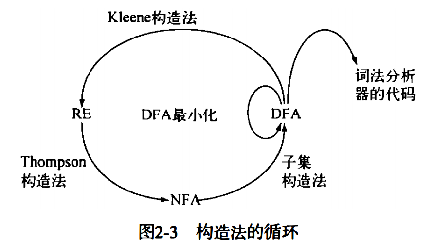

# 一、编译概观

## 1. 简介

《Engineering a Compiler, 2nd 编译器设计》笔记 

编译器是一种工具，**将一种语言编写的软件转换为另一种语言**。为将文本从一种语言转换为另 一 种语言 ，该工具必须理解输入语言的形式和内容 ，或者说语法和语义。它还需要理解输出语言中支配**语法和语义**的规则 。最后 ，它需要一种方案 ，以便将内容从源语言映射到目标语言。

编译器有一个**前端** ，用于处理源语言 。它还有一个**后端** ，用于处理目标语言。为将前端和后端连接起来 ，编译器有一种形式化的结构 ，它用一种**中间形式**来表示程序 。中间形式的语言很大程度上独立于源语言和目标语言 。 为改进转换 ，编译器通常包括一个**优化器**， 来分析并重写中间形式。

```txt
                ___________
     src       |           |     target
-------------> |  compiler | ------------> 
               |___________|
               
                ______________
     src       |              |     result
-------------> |  Interpreter | ------------> 
               |______________|
```

编译器和解释器的区别：

编译器一般都是生成目标平台的机器指令，而解释器一般生成某种中间表示，在运行时才会将中间代码转化为目标平台的机器指令，也就是解释执行。

还有一些语言既包括编译，也包括解释，比如 Java/C# 从源代码编译为字节码，通过在 JVM 上运行字节码来执行，许多 JVM 实现包含运行时执行的编译器 JIT(just-in-time)。

虚拟机是针对某种处理器的模拟器，它是针对该机器指令集的解释器。


**基本原则**

编译器必须保持被编译程序的语义。

编译器必须以某种可觉察的方式改进输入程序。


## 2. 编译器结构

```txt
           +------------------------------------------------------------+
           |  ____________          ____________         ____________   |
   src     | |            |  IR    |            |  IR   |            |  |    target 
---------> | | front end  | ---->  |  optimizer | ----> |  back end  |  | -----------> 
           | |____________|        |____________|       |____________|  |
           |                                                            |
           +------------------------------------------------------------+
                                      compiler
```

IR 为中间表示

改变编译器使之针对新处理器生成代码 的任务，通常称为将该编译器**重定目标**。    


```txt
前端：
词法分析器 -> 语法分析器 -> 加工 ->
优化器：
优化 1 -> 优化 2 -> ... -> 优化 n ->
后端：
指令选择 -> 指令调度 -> 寄存器分配 -> 
```


## 3. 转换概述

### (1) 前端

前端根据语法和语义，判断输入代码是否是良构的。如果前端发现代码是有效的，它会以编译器的 IR 格式来建立该代码的一个表示，否则，它向用户回报诊断错误信息 ，以标识该代码的问题。    

**1. 检查语法**

词法分析器：将字符构成的串转换为单词构成的流。

语法分析器：判断输入流是否是源语言的一个句子。

类型检查：检查输入程序中对名字的使用在类型方面是否一致。

**2. 中间表示**

编译器可以使用不同种类的 IR。一些 IR 将程序表示为图。 其他的类似于有序的汇编代码程序。     


### (2) 优化器

**1. 分析**

分析判断编译器可以在何处安全地应用优化技术且有利可图。

**数据流分析**在编译时推断运行时值的流动。 数据流分析器通常需要解一个联立方程组，该方程组是根据被转换代码的结构得出的。编译时一种对运动时数据值流动的推断。

**相关性分析** ( dependence analysis ) 使用数论中的测试方法来推断下标表达式的可能值。它用于消除引用数组元素时的歧义。


**2. 转换**

编译器还必须使用分析的结果来将代码重写为种更高放的形式。此前已经发明了更高效的转换技术，用于改进可执行代码的时间或空间需求。


### (3) 后端

后端会遍历代码的 IR 形式并针对目标机输出代码。对于每个 IR 操作，后端都会选择对应的目标机操作来实现它。 同时后端会选择一种次序，使得操作能够高效执行。后端还会确定哪些值能够驻留在寄存器中，哪些值需要放置到内存中，并插入代码来实施相应的决策。


**1. 指令选择**

指令选择将每个 IR 操作在各 自 的上下文中映射为一个或多个目标机操作。     

指令选择器隐式依融于寄存器分配器，以便将这些符号寄存器名，或称为虚拟寄存器，映射到目标机的实际寄存器

**虚拟寄存器**：一个符号寄存器名，编译器用其表示某个值可以保存在寄存器中。

**2. 寄存器分配**

在指令选择期间，编译器有意忽略了目标机寄存器数目有限的事实。它反而假定有 "足够" 的寄存器存在，并使用所谓的虚拟寄存器。

寄存器分配器必须将这些虚拟寄存器映射到实际的目标机寄存器。

**3. 指令调度**

为产生执行快速的代码，代码生成器可能需要重排操作，以照顾 目 标机在特定方面的性能约束。不同操作的执行时间可能是不同的。内存访问操作可能需要花费几十甚至数百个CPU周期，但某些算 术操作 ( 以除法为例 ) ，只需要几个CPU周期。这种延迟较长的操作对编译后代码性能的影响可能是惊人的。

指令调度器重排代码中 的各个操作。它试图最小化等待操作数所浪费的周期数。


# 二、词法分析器

## 1. 简介

词法分析器读取字符流，并产生单词流。它聚合字符形成单词流，井应用一组规则来判断每个单词在源语言中是否合法。如果单词有效，词法分析器会分配给它一个语法范畴或词类。

用于生成词法分析器的自动化工具很常见。这些工具处理语言词法的数学描述并产生一个快速的识别器。另外，许多编译器使用于工编写的词法分析器，因为该任务相对简单，这种词法分析器同样可以很快速且健壮。


## 2. 识别单词

### (1) 识别器的形式化

转移图还可以看做是形式化的数学对象，称为有限自动机，它定义了识别器的规格。

**有限自动机 ( FA )** 是一个五元组($S, Σ, δ, s_0, S_A$) ， 其中各分量的含义如下所示 。    

- $S$ 是识别器中有限状态集，以及错误状态 $s_e$。
- $\Sigma $ 是识别器中使用的有限字母表，通常是图中边标签的合集。
- $\delta(s, c)$ 是识别器的转移函数。将每个状态 $s\in S$ 和每个字符 $c \in \Sigma$ 的组合 $(s, c)$ 映射到下一个状态。在状态 $s_i$ 遇到输入字符 c，FA 将采用转移 $s_i \xrightarrow{c} \delta(s_i, c)$
- $s_0$ 是 S 的起始状态
- $S_A$ 是可接受状态的集合，$S_A \subseteq S$。$S_A$ 中每个状态在转移图中使用双层圆圈。


接下来以 `new/not/while` 为例


$S = \{s_0, s_1, ..., s_{10}, s_e\}$, $s_e$ 为错误状态 

$\Sigma = \{ e, h, i, l, n, o, t, w \}$

$\delta = \{ s_0 \xrightarrow n s_1, s_0 \xrightarrow w s_6, ..., s_9 \xrightarrow e s_{10} \}$

$s_0 = s_0$

$S_A = \{ s_3, s_5, s_{10} \}$

最后直至耗尽所有输入或者在处理字符串中产生一个错误。

如果耗尽所有输入并且最后状态时一个可接受状态时，FA 就接受字符串。


### (2) 识别更复杂的单词

比如识别无符号整形。


```txt
// 伪代码描述
char = NextChar();
state = s0;

while (char != eof and state != se) do
    state = delta(state, char);
    char = NextChar();

if (state in S_A) then // S_A = {s1, s2}
    acceptance
else 
    failure
```


## 3. 正则表达式

有限自动机 F 所接受单词的集合，形成了一种语言，记作 L(F)。对于任一 FA，可以使用*正则表达式(regular expression)* 的符号来描述其语言。

基本概念

**常量**

- 空集 $\emptyset$
- 空串 $\epsilon$ `""`
- 字符 $a$ 表示在 $\Sigma$ 中的字符 $a$


**算子**

- 连接：记作 $RS$，其中包含 R 中任意元素后接 S 中任意一个元素所形成的所有字符串集 $\{ xy|x\in R \;\&\&\; y \in S\}$。 $\{ab, c\} \{d, ef\} = \{abd, abef, cd, cef\}$
- 选择：记作 $R|S$，并集，$\{x|x\in R \;||\; x\in S \}$。$a|b$ 可简写为 $[ab]$，0 ~ 9 可简写为 [0...9]
- 闭包：集合 $R$ 的克林(Kleene)闭包，记作 $R^*$。$R$ 与自身连接零或多次形成的所有集合取并集。

为了消除二义性，引入 `()` 来控制优先级，`()` 具有最高优先级，接下来依次是闭包、连接、选择。


**额外算子**

- 正闭包：$RR^*$。记作 $R^+$
- ? 匹配零次或者一次
- 求补：$\land c$，及 c 相对于 $\Sigma$ 的补集。


**完全 FA**是显示包含所有错误转移的 FA

任何使用正则表达式定义的语言都称为正则语言。


## 4. 从正则表达式到词法分析器




### (1) 非确定有限状态自动机NFA

$\epsilon$ 转移：针对空串输入 $\epsilon$ 进行的转移，不会改变输入流中的读写位置。

如果一个 FA 包含了单个输入字符有多种可能转移的状态，被称为非确定有限状态机。允许在空串输入 $\epsilon$ 来进行转移的 FA。

转移函数为单值的 FA 称为 DFA，DFA 不允许 $\epsilon$ 转移。


为了澄清 NFA 的语义，需要一组规则来描述其行为。

- 每次 NFA 必须进行非确定转移时，如果有使得输入字符串接受状态的转移存在，则采用这样的转移。NFA 在每个状态都需要猜测正确的转移。
- 每次 NFA 必须进行非确定转移时，NFA 都克隆自身，以追踪每个可能的转移。NFA 并发地追踪所有转移路径。NFA 并发活动地状态集合叫做 NFA 配置。当 NFA 到达一个配置，此时输入字符串已耗尽，且配置中一个或多个克隆副本处于某个接受状态，则 NFA 接受输入字符串。

NFA 和 DFA 在表达力上时等价的。DFA 只是某个 NFA 的特例。任何 NFA 都可以通过一个 DFA 模拟。


### (2) 从正则表达式到 NFA: Thompson 构造法


一个例子，见图 2-5


### (3) 从 NFA 到 DFA：子集构造法

**DFA**：确定性有限自动状态机，转移函数为单值的有限自动状态机，不允许 ε 转移。

NFA 和 DFA 在表达力上是等价的，任何 DFA 只是某个 NFA 的一个特例。通过子集构造法确定。

在用 Tompson 构造法构造的 NFA 中，有许多不必要的 $\epsilon$ 转移，需要在后续消除它们。也就是从 NFA 转化为 DFA。

与 NFA 相比，DFA 的执行和模拟j简单很多。从NFA到DFA的算法，叫做**子集构造法**。

子集构造法以 $NFA(N, \Sigma,  \delta_N, n_0, N_A)$ 为输入，生成一个 $DFA(D, \Sigma, \delta_D, d_0, D_A)$。DFA的初始状态 $d_0$ 和接受状态集 $D_A$ 是通过子集构造法逐渐得到的。这个构造法比较复杂的一部分是推导出 DFA 的状态集 $D$ 以及 DFA 的转移函数 $\delta_D$。

该算法构造一个集合 $Q$，使得每个元素 $q$ 都是 $N$ 的一个子集，即$q_i\in 2^N$，推导看集合相关知识。该算法停止时，每个 $q_i \in Q$  对应 DFA 中的一个状态 $d_i \in D$。

```cpp
// NFA to DFA 伪代码描述：
// {si} 表示由 si 构成的集合
q0 = epsilon_closure({n0});
Q.add(q0);
workList = {q0};
while (!workList.emptySet())
{
    q = workList.remove(); // remove from workList and assign to q
    for (char c : Sigma)
    {
        t = epsilon_closure(delta(q, c)); // delta 函数见下
        T[q, c] = t;
        if (Q.find(t) != Q.end()) // t is not in Q
        {
            Q.add(t);
            workList.add(t);
        }
    }
}
```

$\delta(q, c)$ 将 NFA 的转移函数应用到 q 中的每个元素，也就是返回 $\cup_{s\in q_i}\delta_N(s, c)$

*有效配置*：在 NFA 中，可以通过某个输入字符串到达的配置，包含 $n_0$。

算法结束 $Q$ 包含了NFA的所有有效配置，$T$ 包含了这些配置间所有可能的转移。

现在对图2-5的 NFA转换到 DFA。

首先对 NFA 的编号重排，见下图(a)：


| 集合名称 | $\epsilon-closure(\delta(q,a))$ | $\epsilon-closure(\delta(q,b))$ | $\epsilon-closure(\delta(q,c))$ |
| :------: | :-----------------------------: | :-----------------------------: | :-----------------------------: |
|  $q_0$   |              $q_1$              |              none               |              none               |
|  $q_1$   |              none               |              $q_2$              |              $q_3$              |
|  $q_2$   |              none               |              $q_2$              |              $q_3$              |
|  $q_3$   |              none               |              $q_2$              |              $q_3$              |

$T[q_0, a] = q_1 =\{n_1, n_2, n_3, n_4,n_6,n_9\}$

$T[q_1, b] = q_2 = \{n_5, n_8, n_9, n_3, n_4,n_6\}$ 

$T[q_1, c] = q_3 = \{n_7, n_8, n_9, n_3, n_4, n_6\}$ 

$T[q_2, b] = q_2$

$T[q_2, c] = q_3$

$T[q_3, b] = q_2$

$T[q_3, c] = q_3$

最后生成的 DFA 转移图为 (c)：


```cpp
// epsilon-closure() 伪代码描述
// 输入为 NFA(N, Sigma, delta)
// 输出为 E，其中 E[ni] 表示 NFA 中 ni 的 epsilon 闭包
for (Status n : N)
{
    E[n] = {n};
}
workList = N;

while (!workList.emptySet())
{
    n = workList.remove();
    t = unionSet({n}, allEpsilonFromN()); // 解释见下
    if (t != E[n]) // t 和 E[n] 都是集合
    {
        E[n].unionSet(t);
        workList.unionSet(allEpsilonToN());
    }
}
```

`allEpsilonFromN` 找到从 n 出发的所有 $\epsilon$ 转移，用集合语言表达为 $\cup_{ n \xrightarrow{\epsilon} p\; \in \;\delta_N} E[p]$ 。

`allEpsilonToN` 找到所有到 n 的 $\epsilon$ 转移，用集合语言表达为 $\{m|m\xrightarrow{\epsilon} n \in \delta_N\}$


### (4) 从 DFA 到最小 DFA: hopcroft 算法

从 Regex 到 DFA 的最后一步，最小化 DFA 状态的数目。需要一种技术来检测两个状态是否等价（对二者输入相同的字符都产生相同的行为）。

对于 $DFA(D, \Sigma, \delta, d_0, D_A)$

```cpp
// hopcroft 伪代码描述
T = {DA, D-DA};
P = EmptySet;
while (T != P)
{
 	P = T;
    T = EmptySet;
    for (Set p : P)
    {
        T.unionSet(split(p));
    }
}

// split(s) 伪代码描述
for (char c : Sigma)
{
    if (canSplitToS1AndS2(s, c)) // 只需要考虑 s 能否接受 c 以及目标是否在相同集合
    {
        return {s1, s2};
    }
    return s;
}
```

考虑之前 $a(b|c)^*$ 的例子，对产生的 DFA 进行最小化。

初始划分为 $\{\{d_0\}, \{d_1, d_2, d_3\}\}$，对 $\{d_0\}$($p_1$) 只有一个元素，不能被拆分。对于 b 和 c，$\{d_1, d_2, d_3\}$($p_2$) 都有一个转移，最终又回到了 $p_2$。因此最终划分就是 $\{\{d_0\}, \{d_1, d_2, d_3\}\}$。 

得到


### (5) 将 DFA 用作识别器

到现在为止，我们可以根据一个RE构造出对应的DFA实现。我们需要一个识别器，能够处理某种语言的所有微语法对应的 RE，也就是 $r_1|r_2|...|r_k$

在识别器的层次上 ， 我们可以改变DFA的实现及其对 "接受" 的定义。为找到与某个RE匹配的**最长单词**，DFA应该一直运行下去，直至当前状态 s 对下一个输入字符没有转移可用为止。此时，实现必须判断它到底匹配哪个RE。 会发生两种情况。

第一种比较简单。如果 s 是一个接受状态，那么DFA已经发现了该语言中的一个token，应该报告该token及其语法范畴。

第二种时如果 s 不是接受状态， 事情会较为复杂 。 这时会出现两种情况。 如果在DFA到达s的路径上穿越了一个或多个接受状态 ， 那么识别器应该 回转到最近一个接受状态 。 这种策略可以 匹配输入字符串中的最长有效缀。 如果在到达当前状态的路径上，DFA并未经过接受状态，那么输入字符串的任何前组都不是有效token，识别器应该报告错误 。  

还有需要处理优先级关系，比如关键词和标识符。


## 5. 实现词法分析器

对大多数语言来说，编译器的编写着可以从一组正则表达式生成一个速度可以接受的词法分析器。编译器的编写者可以为每种语法范畴建立一个 RE，并将这些 RE 提供给词法分析器的生成器作为输入。生成器会为每个REj构建一个NFA，并用 $\epsilon$ 转移将各个 NFA 合并起来，而后转换为一个对应的 DFA，最后最小化 DFA。到这里，词法分析器将 DFA 转化为可执行代码。

本节谈论 DFA 转换为可执行代码的三种实现策略：**表驱动词法分析器、直接编码的词法分析器、手工编码的词法分析器**。都通过模拟 DFA 的方式进行工作。重复读入输入中的下一个字符，并模拟输入字符进行 DFA 的状态转移。

### (1) 表驱动词法分析器

表驱动的方法是使用一个框架词法分析器进行控制，使用一组生成的表来编码特定于语言的知识。


框架词法分析器分为四部分：**初始化、模拟DFA的行为对输入进行循环扫描、在DFA超过标记末尾时用以处理的回滚循环、解释并报告结果**。

扫描循环重复词法分析器的两个基本操作：读取一个字符并模拟 DFA 进行滚动。当进入一个错误状态 $s_e$ 时循环停止。两个表 `CharCat` 和转移表 $\delta$ 编码了关于 DFA 的所有知识。

回滚循环使用一个状态栈，将词法分析器恢复到最近的接受状态。

分类器表 CharCat：

|    r     |  0-9  |  EOF  | Other |
| :------: | :---: | :---: | :---: |
| register | digit | other | other |

转移表 $\delta$： 

|       | register | digit | other |
| :---: | :------: | :---: | :---: |
| $s_0$ |  $s_1$   | $s_e$ | $s_e$ |
| $s_1$ |  $s_e$   | $s_2$ | $s_e$ |
| $s_2$ |  $s_e$   | $s_2$ | $s_e$ |
| $s_e$ |  $s_e$   | $s_e$ | $s_e$ |

标记类型表Type：

|  $s_0$  |  $s_1$  |  $s_2$   |  $s_e$  |
| :-----: | :-----: | :------: | :-----: |
| invalid | invalid | register | invalid |

```cpp
state = s0;
lexeme = "";
stack.clear();
stack.push(bad); // bad is a flag
while (state != se) 
{
	ch = nextChar();
    lexeme += ch;
    if (state is in SA) // SA state accessed
        stack.clear();
    stack.push(state);
    cat = CharChat[ch];
    state = delta[state, cat];
}

while (state is not in SA && state != bad)
{
    state = stack.pop();
    lexeme.pop_back();
    rollback(); // FrontChar
}

if (state is in SA)
{
    return Type[state];
}
else
{
    return invalid;
}
```

可能会出现的情况是过度回滚，比如正则表达式 `ab|(ab)*c`，如果输入为 `ababababab`，第一次调用会扫描所有字符，接受 `ab`，返回 `abababab`。第二次调用仍然会扫描重复的部分，也就是第一次调用之后的剩余部分`abababab`。最坏情况下，读取整个输入流的时间复杂度为 $O(n^2)$，n为单词(token)数目。

可以使用 InputPos 来记录输入流的位置和一个二维比特数组 failed[state, InputPos] 来记录分析器发现的死胡同。这个词法分析器称为**最长匹配词法分析器(maximal munch scanner)**。


### (2) 直接编码的词法分析器

为了提高表驱动词法分析器的性能，使用直接编码的词法分析器，降低了计算DFA转移的成本。

在上一节的实现中，需要两次查表。一次对 CharCat，另一次是对 $\delta$。需要两个地址计算和两个 load 操作。

用代码隐含DFA转换。

```cpp
sinit: // ...;
s0:
	ch = nextChar();
	// ...;
	if (ch == 'r')
        goto s1;
	else
        goto sout;
s1:
	ch = nextChar();
	// ...;
	if (std::isdigit(ch))
        goto s2;
	else 
        goto sout;
s2:   //...
sout: // ...
```


### (3) 手工编码的词法分析器

手工编码的词法分析器可以减少词法分析器和系统其余组件之间的接口的开销。 特别地 ，缜密的实现既可以改进输入端读取和操作字符的机制，也可以改进输出端生成实际词素副本所需的操作。

**输入缓冲区**

为减少这种每个字符都有的IO代价，编译器编写者可 以使用缓冲IO，其中每个读操作返回字符的一个长串或缓冲 区，词法分析器接下来对缓冲区进行索引 。  

**生成词素**

如果词法分析器输出 的语法范畴只是词素的副本，那么这些方案是很高效的。比如寄存器编号，由 `r` 后跟一串数字，可以在接口某处，字符串转换为整数。


### (4) 处理关键字

处理关键字的一种策略是向生成DFA和识别器的描述中显式添加对应的RE，来识别输入语言中的关键字。 

另一种策略:  使用DFA将潜在的关键字归类为标识符，然后测试每个标识符以判断它是否是关键字。

在于工实现词法分析器的情况下，这种策略会起作用。显式检查关键字增加的复杂性将导致DFA状态的数目显著膨胀。在于工编码的程序中，需要权衡这种增加的实现负担。利用合理的散列表。每次查找的预期代价应该是常数量级。实际上 ，这个方案已经是完美散列(perfect hashing)的一个经典应用 。  


## 6. 高级主题

### (1) 从 DFA 到 RE

### (2) DFA最小化: Brzozowski 算法

### (3) 无闭包的 RE


# 三、语法分析器

语法分析器的任务是判断单词流表示的输入程序在程序设计语言中是否是一个有效的句子 。  

本章将介绍上下文无关语法(**C**ontext-**F**ree **G**rammar，CFG)， 这种符号表示法用于规定程序设计语言的语法。上下文无关语法开发了几种技术，在给定语法和输入程序的情况下，可用于查找适用于输入程序的推导。 

## 1. 简介

输入的程序是一个单词流，其中各个单词都标注 了语法范畴 (词类)。 

语法分析器为该程序推导一个语法结构，将各个单词适配到源程序设计语言的语法模型中。如果语法分析器确定输入流是一个有效程序，将构建该程序的一个具体模型，供编译后续各阶段使用；如果输入流不是一个有效程序，语法分析器将向用户报告问题和适当的诊断信息。

工具生成的语法分析器更为常见。 

需要一种形式化的机制来规定源语言的语法，又需要一种系统化的方法，来判定输入程序是否属于这种形式化定义的语言（成员资格问题）。通过将源语言的形式限制到一个称为上下文无关语言(context-free language)的语言集。

已经有很多算法来解决CFG成员资格的问题，有递归下降语法分析器(recursive-descent parser)和LL(1)语法分析器，自顶向下的语法分析(top-down parsing)。LR(1)语法分析器，自底向上的语法分析(bottom-up parsing)。

**语法分析**：给出单词流 s 和语法 G，找到 G 中生成 s 的 一个推导 。 


## 2. 语法的表示

对大多数程序设计语言来说，RE 缺乏描述语言完整语法的能力 。 

大部分程序设计语言的语法都可 以通过上下文无关语法的形式表示 。 本节引入并定义 CFG。


### (1) 为什么不用RE

把括号添加到 RE 中的适当位置毕竟棘手，编程语言中有很多需要处理优先级顺序的地方，比如 `a+b*c`。

RE无法匹配括号左右平衡(成对结构 begin/end)，与 RE 对应的识别器无法进行计数。


### (2) CFG

对于语言 L， 其 CFG 定义了表示 L 中有效语句的符号串的集合。 

上下文无关语法G是一组规则，描述了语句是如何形成的。可以从 G 导出的语句集称为 G 定义的语言，记作L(G)。

**产生式**：CFG 中的每个规则都被称为是一个产生式

**非终结符**：语法产生式使用的语法变量。可以继续推导

**终结符**：出现在语句中的单词，不能继续向下推导。

**推导**：从开始符号开始，对其右部的每一个非终结符，用此非终结符对应的产生式中的任一个右部来代替它。

*SheepNoise* -> baa *SheepNoise*

​                     |  baa


经常可以看到*巴科斯-瑙尔范式(**B**ackus-**N**aur **F**orm, **BNF**)*表示法及其扩展形式。

`<>` 表示非终结符，`::=` 表示推导出，`|` 表示还能推导出，<u>baa</u> 表示终结符(代码块打不出下划线)。

上述 SN 式的 BNF 形式：

```BNF
<SheepNoise> ::= baa <SheepNoise>   # baa 有下划线，下同
              |  baa
```


上下文无关语法G是一个四元组(T, NT,S, P)

- T 是终结符或语言L(G)单词的集合
- NT 是 G 的产生式中出现的非终结符的集合，引入非终结符用于产生式中提供抽象和结构
- S 是一个非终结符，被指定为语法的目标符号或起始符号。S表示L(G)中语句的集合。
- P 是 G 中产生式或重写规则的集合。P中的每个规则形如 $NT\rightarrow(T∪NT)^+$，即每次将一个非终结符替换为一个或多个语法符号构成的串。


### (3) 例子

```b
Expr ::= '(' Expr ')'
      |  Expr Op name
      |  name

Op   ::= + 
      |  -
      |  *
      |  /
```

`(a + b) * c`对应的语法分析树


**最右推导**：在每个步骤都重写最右侧的非终结符。
**最左推导**：在每个步骤都重写最左侧的非终结符。 

两种推导得出的语法分析树是相同的。如果在某个语法中，一个语句存在多个最右(或最左)推导，该语法称为**二义性**语法。

```txt
Statement ::= if Expr then Statement else Statement
           |  if Expr then Statement
           |  Assignment
           |  Other Statements
```

比如下面的语句

```txt
if expr1 then if expr2 then assignment1 else assignment2
```

产生了两种不同的最右推导，分别匹配第一个和第二个 `if`

需要对语法进行改进：

```txt
Statement ::= if Expr then Statement
           |  if Expr then WithElse else Statement
           |  Assignment
           |  Other Statements
WithElse  ::= if Expr then WithElse else WithElse
           |  Assignment
           |  Other Statements
```


上下文无关语法及对应语法分析器的类

RG(regular grammar)

```txt
+-----------------------------------+
| +-------------------------------+ |
| | +-----------+                 | |
| | |  +------+ |                 | |
| | |  |  RG  | |                 | | 
| | |  +------+ |     LR(1)       | |
| | |  +------+ |                 | |
| | |  | LL(1)| |                 | |
| | |  +------+ |                 | |
| | +-----------+                 | |
| +-------------------------------+ |
|        Context-Free Grammar       |
+-----------------------------------+
```

LR(**L**eft  **R**ight derivation) 语法可以通过从左至右的线性扫描自底向上进行语法分析，任何时候都只需从当前输入符号前瞻最多一个单词。

LL(1) 语法是LR语法的一个重要子集。LL(1)语法可以通过从左至右的线性扫描自顶向下进行语法分析，只需前瞻一个单词 。 

- **自顶向下语法分析器(top-down parser)**：从根开始构建语法树，并使树向叶子的方向增长。自顶向下语法分析器都在树的下边缘选择一个表示某个非终结符的结点，用一个子树来扩展该节点；子树表示了重写该非终结符时所用产生式的右侧部分 。
- **自底向上语法分析器(bottom-up parser)**：从叶子结点开始构建语法树，并使树向根的方向增长。


## 3. 自顶向下语法分析

自顶向下语法分析器从语法分析树的根开始，系统化地向下扩展树，直至树的叶结点与词法分析器返回的已归类单词相匹配。这个过程会一直持续下去，直到

- 语法分析树的下边缘只包含终结符， 且输入流已经耗尽；或者
- 部分完成的语法分析树的下边缘各结点，与输入流存在着明确的不匹配。（两种情况，可以回溯到一个正确的选择序列，并构建出正确的AST；另一种情况是如果输入的符号串不是有效的语句，回溯将失败，报告语法错误）。

可以高效进行的一个原因：上下文无关语法的很大一个子集不进行回溯即可完成语法分析。 

构建自顶向下语法分析器有两种技术：**手工编写递归下降分析器**和**生成的LL(1) 语法分析器**。


自顶向下语法分析器的效率依赖于其在扩展非终结符时选择正确产生式的努力，如果 parser 总是产生正确的选择，则是高效的；如果它做出糟糕的选择，parser 的代价将直线上升。

### (1) 具有“神谕”能力的

考虑 `a + b * c` 符号串，暂时假定 parser 具有“神谕”，即在语法分析过程中的每一点选择正确的产生式。

```txt
# 具备"神谕"，对 a + b * c 进行最左匹配，自顶向下语法分析
step1: Expr -> Expr + Term
step2: Expr -> Term + Term
step3: Expr -> Factor + Term
step4: Expr -> name + Term
step3: Expr -> name + Term * Factor
# ...
```

在具有“神谕”的选择情况下，parser 花费的步骤与推导的长度加上输入长度成正比。


### (2) 消除左递归

在使用经典的最左匹配自顶向下 parser 时，语法本身的结构导致出现一个问题。实现 parser 的规则总是按语法出现的顺序。按照之前对加减乘除的语法进行 parse 的过程：

```txt
Expr -> Expr + Term
Expr -> Expr + Term + Term
# ...
```

这样就产生了**左递归**问题，parser 无限地扩展 AST 的下边缘，因为扩展过程没有在语句开头生成一个非终结符。可以分别重写各个产生式使之使用右递归。

```txt
Fee -> Fee α
     | β
     
Fee  -> β Fee'
Fee' -> α Fee'
      | ε
```

上面那种形式叫做**直接左递归**，还有一种**间接左递归**，比如：

```txt
α -> β
β -> γ
γ -> αδ
```

这样就导致了 `α -> αδ`，需要一种更加系统化的方法消除间接左递归：**前向替换(forward substitution)**，将间接左递归转换为直接左递归，直接左递归再转换为右递归。

```c
// nonterminals A1, A2, ..., An
for (int i = 1; i <= n; ++i) {
    for (int j = 1; j < i; ++j) {
        if (∃Ai->Ajγ) {
            replace Ai->Ajγ with one or more productions that expand Aj;
        }
    }
    
    rewrite the productions to eliminate any direct left recursion on Ai;
}
```


### (3) 无回溯语法分析

最左匹配的自顶向下语法分析器中，低效的主要原因是回溯。如果语法分析器用错误的产生式扩展 AST 的下边缘，在 AST 的下边缘与 lexer 返回的单词出现不匹配的情况。在出现这种不匹配的情况，必须撤销构建出错误的 AST 下边缘的操作，并尝试其他的产生式。

**无回溯语法**：一种 CFG，最左自顶向下语法分析器可以在至多前瞻一个单词的情况下，总能够预测正确的产生式规则。


