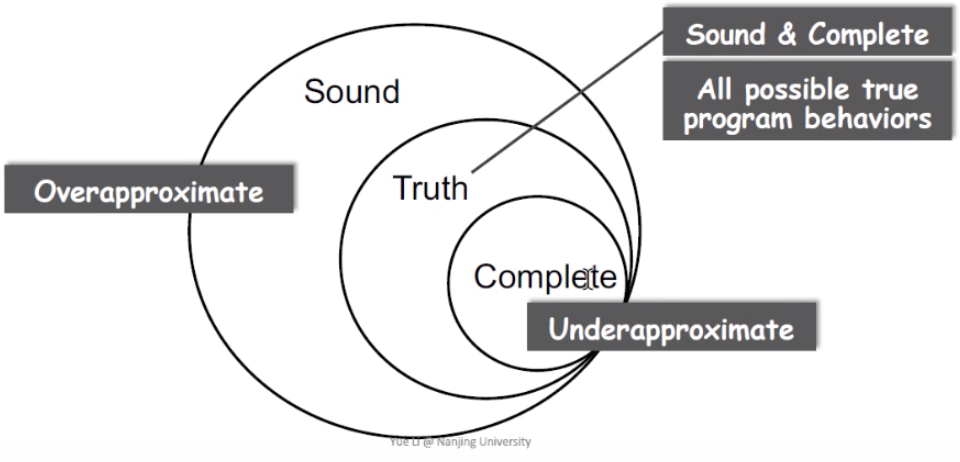

# Static Analysis

NJU 《static program analysis》

# 一、Intro

## 1. Rice's theorem

Any **non-trivial** property of the behavior of programs in a r.e. language is **undecidable**.


Perfect static analysis is not exist.

- Sound - false positive
- Complete - false negative



Mostly compromising completeness: **Sound** but not **fully-precise** static analysis.

Ensure(or get close to soundness), while making good trade-offs between analysis precision and analysis speed.


## 2. Abstraction and over-approximation

- Concrete -> Abstraction

- over-approximation
  - Transfer functions: Transfer functions define how to evaluate different program statements on abstract values.
  - Control flows


# 二、IR

IR(**I**ntermediate **R**epresentation): 3-address code(3AC)

example:

```c
// source
a + b + 3;  

// 3AC
t1 = a + b;
t2 = t1 + 3;
```


## 1. Common 3AC forms

```c
x = y bop z;       // bop: binary operator
x = uop y;         // uop: unary operator
x = y;
goto L;            // L: label to represent a program location
if x goto L;
if x rop y goto L; // rop: relational operator(<, >, ==, !=, <=, >=)
```


## 2. AST vs IR

AST

- high-level and closed to grammar structure
- usually language dependent
- suitable for fast type checking
- lack of control flow information

IR

- low-level and closed to machine code
- usually language independent
- compact and uniform
- contains control flow information
- usually considered as the basic for static analysis


## 3. real 3AC example

3AC(Java Soot, jimple)

```java
public static void main(String[] args) {
    int x = 0;
    for (int i = 0; i < 10; ++i) {
        x = x + 1;
    }    
}
```

```ir
public static void main(java.lang.String[]) {
    java.lang.String[] r0;
    int i1;
    r0 := @parameter0: java.lang.String[];
    i1 = 0;
label1:
    if i1 >= 10 goto label2;
    i1 = i1 + 1;
    goto label1;
    
label2:
    return;
}
```

C/C++(LLVM)

## 4. SSA

SSA(Static Single Assignment)

Every variable has exactly one definition.

**example 1**:

```c
p = a + b;
q = p - c;
p = q * d;
p = e - p;
q = p + q;
```

```ssa
// SSA
p1 = a + b;
q1 = p1 - c;
p2 = q1 * d;
p3 = e - p2;
q2 = p3 + q1;
```

**example 2**:

```c
if (e)
    x = 0
else
    x = 1;
y = x + 7;
```

```ssa
// SSA
if (e)
    x0 = 0;
else
    x1 = 1;
x2 = Φ(x0, x1)
y = x2 + 7
```


Why SSA?

- Flow information is indirectly incorporated into the unique variable names
- Define-and-Use pairs are explicit

Why not SSA?

- SSA may introduce too many variables and phi-functions
- Many introduce inefficiency problem when translating to machine code


## 5. Basic Block

Basic Blocks(BB) are maximal sequences of consecutive 3-address instructions with the properties that:

- It can be entered only at the beginning. (first instruction)
- It can be exited only at the end. (last instruction)

3AC -> Basic Block -> CFG


## 6. CFG

Control Flow Graph Analysis

- CFG serves as the basic structure for static analysis
- The node in CFG can be an individual 3-address instruction, or Basic Block(BB)

