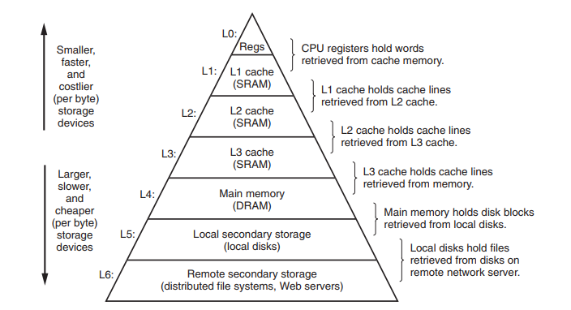
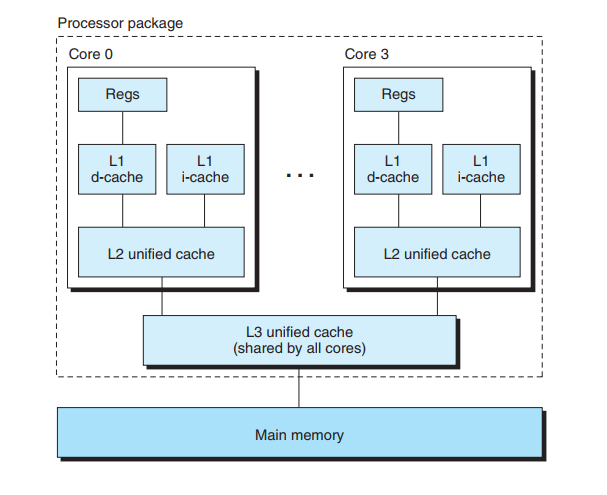

温故而知新。之前已经看过一遍第二版的 CSAPP，当年还没有第三版，这次把第三版简单过一遍，查漏补缺，完成一些当时没有动手的 lab。

# 一、计算机系统漫游

信息就是**比特位 + 上下文**。在计算机中所有的数据都是比特位，在不同的上下文中，这些字节序列可以表示整型、浮点型、字符串、

机器指令等等。


C 源码编译过程：

```txt
                                            printf.o ----->
hello.c -----> hello.i -----> hello.s -----> hello.o -----> hello
         cpp             cc1            as             ld
```


计算机硬件组成：

- 总线，携带信息字节并负责在各个部件间传递。通常总线被设为传递定长的字节块，也就是**字(word)**。

- CPU(运算符、控制器)，解释(执行)存储在内存中的指令的引擎。所执行的指令模型由指令集架构决定。
- 存储器(内存)，内存由一组 DRAM 芯片组成，从逻辑上来说，内存就是一个线性的字节数组。
- I/O 设备，系统与外部世界联系的通道，每个 I/O 设备通过一个控制器(controller)或适配器(adapter)与 I/O 总线相连。


因为 CPU 速度比内存速度快的多，使用**局部性**原理，在 CPU 和内存之间添加了高速缓存，能够有效增加程序的执行效率。

存储器的体系结构：



操作系统对硬件进行管理，应用程序通过操作系统提供的服务（接口）来对硬件进行访问。

**进程**是操作系统对一个正在运行程序的抽象，操作系统提供了一种假象，就好像系统上只有这个程序在运行。其实一个操作系统可以有多个进程，进行**并发**执行，一个进程的指令可以和另一个进程的指令交错执行。操作系统需要跟踪进程运行所需的所有状态信息，也叫**上下文(context)**。当操作系统将控制权从当前进程转移到另一个进程时，就会发生**上下文切换(context switch)**。

在现代系统中，一个进程中可以由多个称为 **线程(thread)** 的执行单元组成，每个线程都运行在进程的上下文中，并共享相同的代码和全局数据。

**虚拟内存**是一个抽象概念，为每个进程提供了一个假象，即每个进程都在独占使用内存。每个进程看到的内存都是一致的，被称为**虚拟地址空间**。


上图是 x86-Linux 虚拟内存布局，x64 的和 x86 的虚拟内存布局类似，最大区别在可寻址范围。

虚拟内存包括（从下网上）：

- text segment 代码段，机器指令代码，只读。
- data segment 数据段，已初始化的全局变量和静态变量。
- BSS segment，未初始化的全局变量和静态变量（默认值为 0，只在虚拟内存预留空间，并不占可执行程序的硬盘空间）
- heap segment 堆段，运行时堆段，堆可以动态收缩和扩张。可以通过 `brk` 系统调用或 `sbrk` 或 `malloc/free` C 库间接调用 `brk` 动态调整堆段大小。
- memory mapping segment 内存映射段，详见 `mmap/munmap syscall`。文件（包括动态库）映射、通过 `malloc/free` 间接调用 `mmap/munmap` 进行大块内存分配（匿名映射）。
- stack segment 栈段，编译器使用它实现函数调用，用户栈在程序执行过程中会自动进行扩展和收缩。
- kernel space 内核空间，内核保留，用户空间不可访问。


并发(concurrency)：通用的概念，通常把不同进程的逻辑控制流在时间上交错或重叠的情况叫做并发。

并行(parallelism) 是并发的一个特例，用并发来使一个系统运行得更快，在同一时刻运行在不同的处理器核心上。


接下来对一些并发层次进行讨论：

- 线程级并发，线程是操作系统调度的最小单元，自从出现时间共享以来，计算机就开始了对并发的支持。这种并发只是模拟出来的，通过快速切换正在执行的任务来实现。多处理器的使用可以提供系统性能。
- 指令级并行，现代处理器可以同时执行多条指令。比如 8086 处理器，需要多个时钟周期(3~10)来执行一条指令，而现在的处理器每个时钟周期可以处理 2~4 条指令。其实每条指令从开始到结束需要长的多的时间，使用了流水线(pipeline)并行，来加速指令的执行。如果处理器可以达到比一周期一条指令更快的执行效率，就称之为超标量处理器。
- 单指令多数据并行，允许一条指令产生出多个可以并行执行的操作，即 SIMD 并行。提供这些指令为了提高处理影像、声音、视频的执行速度。


多核处理器的组织结构：




**抽象**是计算机科学中最为重要的概念之一。提供了不同的层次的抽象，大大降低了设计系统的复杂度。比如操作系统对硬件功能进行了抽象，使得应用程序程序员不需要处理硬件的细节。


# 二、信息的表示和处理

在计算机中，信息都是使用二进制表示。当把位组合到一起，再加上某种解释，我们就能表示任意有限集合的元素。

主要研究整型和浮点型数据的编码。


大多数计算机系统使用 8-bit 的块(字节)，作为最小可寻址的内存单元，而不是访问单独的位。机器级程序可以将内存视为一个非常大的字节数组，称为虚拟内存，内存中每个字节都由一个唯一的数字来标识，称之为**地址(address)**。所有可能的地址集合称为虚拟地址空间(virtual address space)。


**大端(big endian)和小端(little endian)**

大端法：最高的有效位在最前面；小端法：最低的有效位在最前面

比如变量 `x` 的类型是 `int32_t`，位于地址 `0x100` 处，它的十六进制表示为 `0x01234567`，地址范围 `0x100 ~ 0x103` 的字节顺序取决于机器类型

| 类型 | `0x100` | `0x101` | `0x102` | `0x103` | ...  |
| :--: | :-----: | :-----: | :-----: | :-----: | :--: |
| 大端 |   01    |   23    |   45    |   67    |      |
| 小端 |   67    |   45    |   23    |   01    |      |


大多数常见的计算机都是小端模式，一小部分是大端模式，也有特殊的大端和小端可以通过配置决定(比如 ARM)。

移位操作包括左移、算术右移（最高位是 1 则补 1）、逻辑右移（补 0）。

C 中 `>>` 操作符为实现定义，大多数编译器都实现为算术右移。在 Java 中，`>>` 定义为算术右移，`>>>` 定义为逻辑右移。

C 中强制类型转换保持位值不变（如果长度不同可能需要截断或填充），只是改变了解释这些为的方式。


整型的表示具体可以见**补码**。

对 w 位的无符号整型运算可能会产生溢出（回绕）问题，需要最后结果 mod 2^w。


关于浮点数表示详见 IEEE 754。


