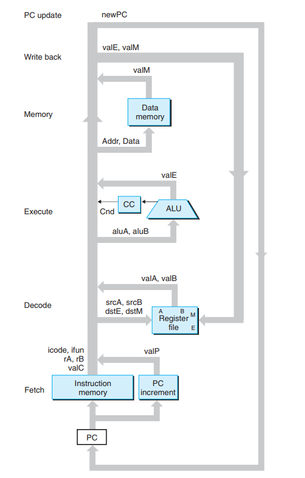

温故而知新。之前已经看过一遍第二版的 CSAPP，当年还没有第三版，这次把第三版简单过一遍，查漏补缺，完成一些当时没有动手的 lab。

# 一、计算机系统漫游

信息就是**比特位 + 上下文**。在计算机中所有的数据都是比特位，在不同的上下文中，这些字节序列可以表示整型、浮点型、字符串、

机器指令等等。


C 源码编译过程：

```txt
                                            printf.o ----->
hello.c -----> hello.i -----> hello.s -----> hello.o -----> hello
         cpp             cc1            as             ld
```


计算机硬件组成：

- 总线，携带信息字节并负责在各个部件间传递。通常总线被设为传递定长的字节块，也就是**字(word)**。

- CPU(运算符、控制器)，解释(执行)存储在内存中的指令的引擎。所执行的指令模型由指令集架构决定。
- 存储器(内存)，内存由一组 DRAM 芯片组成，从逻辑上来说，内存就是一个线性的字节数组。
- I/O 设备，系统与外部世界联系的通道，每个 I/O 设备通过一个控制器(controller)或适配器(adapter)与 I/O 总线相连。


因为 CPU 速度比内存速度快的多，使用**局部性**原理，在 CPU 和内存之间添加了高速缓存，能够有效增加程序的执行效率。

存储器的体系结构：


操作系统对硬件进行管理，应用程序通过操作系统提供的服务（接口）来对硬件进行访问。

**进程**是操作系统对一个正在运行程序的抽象，操作系统提供了一种假象，就好像系统上只有这个程序在运行。其实一个操作系统可以有多个进程，进行**并发**执行，一个进程的指令可以和另一个进程的指令交错执行。操作系统需要跟踪进程运行所需的所有状态信息，也叫**上下文(context)**。当操作系统将控制权从当前进程转移到另一个进程时，就会发生**上下文切换(context switch)**。

在现代系统中，一个进程中可以由多个称为 **线程(thread)** 的执行单元组成，每个线程都运行在进程的上下文中，并共享相同的代码和全局数据。

**虚拟内存**是一个抽象概念，为每个进程提供了一个假象，即每个进程都在独占使用内存。每个进程看到的内存都是一致的，被称为**虚拟地址空间**。


上图是 x86-Linux 虚拟内存布局，x64 的和 x86 的虚拟内存布局类似，最大区别在可寻址范围。

虚拟内存包括（从下往上）：

- text segment 代码段，机器指令代码，只读。
- data segment 数据段，已初始化的全局变量和静态变量。
- BSS segment，未初始化的全局变量和静态变量（默认值为 0，只在虚拟内存预留空间，并不占可执行程序的硬盘空间）
- heap segment 堆段，运行时堆段，堆可以动态收缩和扩张。可以通过 `brk` 系统调用或 `sbrk` 或 `malloc/free` C 库间接调用 `brk` 动态调整堆段大小。
- memory mapping segment 内存映射段，详见 `mmap/munmap syscall`。文件（包括动态库）映射、通过 `malloc/free` 间接调用 `mmap/munmap` 进行大块内存分配（匿名映射）。
- stack segment 栈段，编译器使用它实现函数调用，用户栈在程序执行过程中会自动进行扩展和收缩。
- kernel space 内核空间，内核保留，用户空间不可访问。


并发(concurrency)：通用的概念，通常把不同进程的逻辑控制流在时间上交错或重叠的情况叫做并发。

并行(parallelism) 是并发的一个特例，用并发来使一个系统运行得更快，在同一时刻运行在不同的处理器核心上。


接下来对一些并发层次进行讨论：

- 线程级并发，线程是操作系统调度的最小单元，自从出现时间共享以来，计算机就开始了对并发的支持。这种并发只是模拟出来的，通过快速切换正在执行的任务来实现。多处理器的使用可以提供系统性能。
- 指令级并行，现代处理器可以同时执行多条指令。比如 8086 处理器，需要多个时钟周期(3~10)来执行一条指令，而现在的处理器每个时钟周期可以处理 2~4 条指令。其实每条指令从开始到结束需要长的多的时间，使用了流水线(pipeline)并行，来加速指令的执行。如果处理器可以达到比一周期一条指令更快的执行效率，就称之为超标量处理器。
- 单指令多数据并行，允许一条指令产生出多个可以并行执行的操作，即 SIMD 并行。提供这些指令为了提高处理影像、声音、视频的执行速度。


多核处理器的组织结构：


**抽象**是计算机科学中最为重要的概念之一。提供了不同的层次的抽象，大大降低了设计系统的复杂度。比如操作系统对硬件功能进行了抽象，使得应用程序程序员不需要处理硬件的细节。


# 二、信息的表示和处理

在计算机中，信息都是使用二进制表示。当把位组合到一起，再加上某种解释，我们就能表示任意有限集合的元素。

主要研究整型和浮点型数据的编码。


大多数计算机系统使用 8-bit 的块(字节)，作为最小可寻址的内存单元，而不是访问单独的位。机器级程序可以将内存视为一个非常大的字节数组，称为虚拟内存，内存中每个字节都由一个唯一的数字来标识，称之为**地址(address)**。所有可能的地址集合称为虚拟地址空间(virtual address space)。


**大端(big endian)和小端(little endian)**

大端法：最高的有效位在最前面；小端法：最低的有效位在最前面

比如变量 `x` 的类型是 `int32_t`，位于地址 `0x100` 处，它的十六进制表示为 `0x01234567`，地址范围 `0x100 ~ 0x103` 的字节顺序取决于机器类型

| 类型 | `0x100` | `0x101` | `0x102` | `0x103` | ...  |
| :--: | :-----: | :-----: | :-----: | :-----: | :--: |
| 大端 |   01    |   23    |   45    |   67    |      |
| 小端 |   67    |   45    |   23    |   01    |      |


大多数常见的计算机都是小端模式，一小部分是大端模式，也有特殊的大端和小端可以通过配置决定(比如 ARM)。

移位操作包括左移、算术右移（最高位是 1 则补 1）、逻辑右移（补 0）。

C 中 `>>` 操作符为实现定义，大多数编译器都实现为算术右移。在 Java 中，`>>` 定义为算术右移，`>>>` 定义为逻辑右移。

C 中强制类型转换保持位值不变（如果长度不同可能需要截断或填充），只是改变了解释这些为的方式。


整型的表示具体可以见**补码**。

对 w 位的无符号整型运算可能会产生溢出（回绕）问题，需要最后结果 mod 2^w。


关于浮点数表示详见 IEEE 754。


# 三、程序的机器级表示

计算机执行的机器指令，用字节序列编码底层的操作，包括处理数据、管理内存、读写存储设备上的文件等等。

编译器通过语言的规则、目标机器的指令级和操作系统遵循的约定，经过一系列的过程生成机器代码。

主要对于 x86-64 汇编进行说明，x86-64 汇编的一些详细信息见[这里](https://github.com/syn1w/CS_Notes/blob/master/notes/architecture/x86_64_assembly.md)。这里主要使用 AT&T 格式的汇编，而不是 Intel 格式的。


# 四、处理器体系架构

可以参考[这里](https://cs.millersville.edu/~wkillian/archive/2019/fall/files/csci370/Y86-64%20Reference.pdf)

设计了一个玩具的 Y86-64 指令集，简称 Y64，类似于 AT&T x64。

Y64 架构对程序员的可见部分包括：`rax/rbx/rcx/rdx/rsp/rbp/rsi/rdi/r8~r14` 寄存器、`ZF/SF/OF` 状态码、`PC` 寄存器、内存、Stat 程序状态

Y64 指令：

```txt
+----------------+-----+-----+-----+-----+-----+-----+-----+-----+-----+-----+
|  insts \ byte  |  0  |  1  |  2  |  3  |  4  |  5  |  6  |  7  |  8  |  9  |
+----------------+--+--+-----+-----+-----+-----+-----+-----+-----+-----+-----+
|      halt      |0 |1 |
+----------------+--+--+
|       nop      |1 |0 |
+----------------+--+--+--+--+
| rrmovq rA, rB  |2 |0 |rA|rB|
+----------------+--+--+--+--+
| cmovXX rA, rB  |2 |fn|rA|rB|
+----------------+-----+--+--+-----+-----+-----+-----+-----+-----+-----+-----+
| irmovq V, rB   |3 |0 |F |rB|                    V                          |
+----------------+--+--+--+--+-----+-----+-----+-----+-----+-----+-----+-----+
|rmmovq rA, D(rB)|4 |0 |rA|rB|                    D                          |
+----------------+--+--+--+--+-----+-----+-----+-----+-----+-----+-----+-----+
|mrmovq D(rB), rA|5 |0 |rA|rB|                    D                          |
+----------------+--+--+--+--+-----+-----+-----+-----+-----+-----+-----+-----+
|   OPq rA, rB   |6 |fn|rA|rB|
+----------------+--+--+--+--+-----+-----+-----+-----+-----+-----+-----+
|   jXX Dest     |7 |fn|                  Dest                         |
+----------------+--+--+-----+-----+-----+-----+-----+-----+-----+-----+
|  call Dest     |8 |0 |                  Dest                         |
+----------------+--+--+-----+-----+-----+-----+-----+-----+-----+-----+
|      ret       |9 |0 |
+----------------+--+--+--+--+
|    pushq rA    |A |0 |rA|F |
+----------------+--+--+--+--+
|     popq rA    |B |0 |rA|F |
+----------------+--+--+--+--+

note:
cmov: ~rrmovq. 
XX: in [le, l, e, ne, ge, g]
OP: add, sub, and, xor
```

寄存器对应标号：

| 寄存器 | 标号 |  寄存器  | 标号 |
| :----: | :--: | :------: | :--: |
| `%rax` |  0   |  `%r8`   |  8   |
| `%rcx` |  1   |  `%r9`   |  9   |
| `%rdx` |  2   |  `%r10`  |  A   |
| `%rbx` |  3   |  `%r11`  |  B   |
| `%rsp` |  4   |  `%r12`  |  C   |
| `%rbp` |  5   |  `%r13`  |  D   |
| `%rsi` |  6   |  `%r14`  |  E   |
| `%rdi` |  7   | 无寄存器 |  F   |


Y64 状态码：

| Stat | name  |       含义       |
| :--: | :---: | :--------------: |
|  1   | `AOK` |       正常       |
|  4   | `HLT` | 执行 `halt` 指令 |
|  2   | `ADR` |     非法地址     |
|  3   | `INS` |     非法指令     |

当 Y64 遇到异常时，会调用异常处理程序，来处理某种类型的异常。

Y64 汇编使用 `.` 开头的汇编器伪指令，告诉汇编器调整地址，以便在那里产生数据或插入一些数据。

汇编伪指令：

`.pos 0`：告诉汇编器应该从地址 0 产生代码，0 是 Y64 程序的起点

`.align 8`：8 字节对齐

`.quad imm`：9 字节立即数数据


实现一个指令集的模拟器，称为 YIS，模拟 Y64 机器代码的执行。


需要注意的事情：

`pushq %rsp` 指令会将 `%rsp` 减 8，并且将一个寄存器值写入到内存中。当执行 `pushq %rsp` 指令时，会把 `%rsp` 原始值入栈

`popq %rsp` 将栈指针设置为从栈中弹出的值。


要实现一个数字系统需要三个主要组成部分，计算对位进行操作的函数组合逻辑、存储位的存储器单元，以及控制存储器单元更新的时钟信号。

使用 HCL(Hardware Control Language) 来描述不同处理器的控制逻辑，现在大多数设计使用 HDL(Hardware Description Language) 来表达，最常使用的语言是 Verilog，语法类似于 C；另一种是 VHDL，语法类似于 Ada。

组合电路从本质上讲，不存储任何信息，相反，只是简单响应输入信号，产生某个函数的输出。为了产生**时序电路**，也就是有状态并在这个状态上进行计算的系统，必须引入按位存储的设备，存储设备都是由同一个时钟控制，时钟是一个周期性信号，决定什么时候把新值加载到设备中。


我们描述一个称为 SEQ 的处理器。每个时钟周期，SEQ 执行处理一个完整的命令所需要的所有步骤。SEQ 执行只是第一步，最后要实现一个高效的流水化的处理器。

处理一条指令包含很多操作，将其组织成特殊的指令序列：

- 取指(`fetch`)：从内存读取指令，地址为 PC 的值，从指令中读取第一个字节的两个 4-bit 部分。称为 `icode` 和 `ifun`。然后根据指令类型，计算出该指令长度，也就得到了下一条指令的位置（PC + 该指令长度）。
- 译码(`decode`)：从寄存器中读入最多两个操作数（`valA` 和 `valB`），而且有些指令需要读取 `rsp` 寄存器
- 执行(`execute`)：算术逻辑单元要么执行指令的操作， 计算内存引用的有效地址，要么增加或减小指针，得到的值叫 `valE`，在此可能设置条件码。而且对于条件指令，也会检验条件码和传送条件。
- 访存(`memory`)：访存阶段可以将数据写入内存，或者从内存中读出数据，读出的值为 `valM`。
- 写回(`write back`)：写回阶段最多可以写两个结果到寄存器
- 更新 PC

处理器会无限循环执行上述指令，除非发生任何异常或停止 CPU。




接下来将 Y64 的硬件结构对应到各个处理指令的阶段：

- 取指：将 PC 作为地址，从该地址读取指令的字节到指令内存(instruction memory, `icode, ifun, rA, rB, valC`)，然后经过 PC Increment 计算得到 `valPC`
- 译码：寄存器文件有两个端口(A 和 B)，同时从这两个端口读取寄存器值 `valA` 和 `valB`
- 执行：执行阶段会根据指令类型，将算术逻辑单元 ALU 用于不同的目的。输入 `valA` 和 `valB`，结果输出到 `valE`，并且根据结果设置分支信号 `Cnd`
- 访存：数据内存读出或写入一个内存字，读出到 `valM` 中或写入到内存中。
- 写回：寄存器文件有两个写端口，端口 E 用来写 ALU 计算的值，端口 M 用来写从内存中读取的值
- 更新 PC: PC 的新值来自 `valPC`，下一条指令的地址


# 五、优化程序性能

**优化编译器的能力和局限性**

可以开启某些编译器选项，比如 GCC、Clang 的 `-O1/-O2` 选项来进行生成优化的代码，但是对于一些不确定的地方，编译器也不会进行优化

我们引入**每元素的周期数(Cycles Per Element, CPE)**的概念来表示程序性能，因为时钟周期表示的是执行了多少条指令


**消除循环的低效率**

比如在循环求某个表达式的值是固定的，可以将该语句拿到循环之外，比如 

```c
// 1
for (int i = 0; i < vec_length(v); ++i) {
    // ...
}

// 2
int len = vec_length(v);
for (int i = 0; i < len; ++i) {
    // ...
}
```

不过编译器开启优化一般会对上面的代码进行常量折叠


**减少过程调用**，函数调用会带来巨大的时间开销，可以将循环中每次调用的方法拿到循环外

```c
// 1
for (int i = 0; i < len; ++i) {
    data_t* data = get_element(v);
    // use data
}

// 2
data_t* data = get_element(v);
for (int i = 0; i < len; ++i) {
    // use data
}
```


**消除不必要的存储器引用**，每次读写内存都会耗时，因此可以使用临时变量，从而使每次循环只有一次读即可

**提高并行性**，某些过程可以使用并行操作，提高执行效率，还有可以优化为 SIMD 指令来提高效率


现代编译器对源代码的优化能力非常夸张，不必要进行过分的提前优化，需要养成良好的编程习惯，使用合适的数据结构和算法，如果出现性能瓶颈对造成瓶颈的部分进行性能调优。


# 六、存储器层次结构

**存储技术**

- 静态 RAM: SRAM 将每个位存储到一个双稳态的存储器单元中，只要有电，永远会保持它的值，速度非常快，价格昂贵，一般用来作为 cache
- 动态 RAM: DRAM 将每个位存储为对一个电容的充电，而且对干扰非常敏感，速度较快，价格中等，一般用来做内存，内存系统必须周期性通过读出或重写来刷新内存的每一位，有些系统也用纠错码，电路可以自动发现并纠错任何单个错误位
- ROM: 只读存储器，非易失性存储器，一般用作固件（BIOS 等等固件）、闪存（U盘、固态硬盘）
- 磁盘


**访问主存**

数据流通过总线的共享电子电路在处理器和 DRAM 主存之间来回。每次 CPU 和主存的数据传送都是通过一系列的步骤完成的，这些步骤叫总线事务。

读事务从主存传送到 CPU，写事务将数据从 CPU 传送到主存。


考虑 `movq A, %rax` 操作将会发生什么（假设只有 CPU 和内存，真实情况复杂的多）：

地址 A 的值将会被加载到 `%rax` 中

CPU 芯片上的总线接口的电路发起读事务，首先 CPU 将地址 A 放到系统总线上，I/O 桥将信号传递到内存总线。

主存从内存总线上读取地址，然后从 DRAM 中取出字，并将数据写到内存总线。

I/O 桥将内存总线的信号翻译为系统总线的信号，然后传递到 CPU，然后从系统总线上读取数据，并将数据复制到 `%rax`。


**固态硬盘**

固态硬盘(SSD) 是一种基于闪存的技术，一个 SSD 封装了一个或多个闪存芯片和闪存翻译层。而翻译层是一个硬件/固件设备，扮演和磁盘控制器相同的角色，对逻辑块的请求翻译为对底层物理设备的访问。

比起磁盘，SSD 由半导体存储器构成，没有移动的部件，因而随机访问时间比旋转磁盘要快很多，能耗更低，同时也更结实。不过因为反复擦写，SSD 也容易磨损，而且单位字节价格相对磁盘要贵一些。


**局部性**

一个编写良好的程序通常具有良好的局部性。也就是倾向于引用邻近于最近引用过的数据项的数据项。这种倾向性，被称为局部性原理。

局部性通常有时间局部性和空间局部性。一般而言，有良好局部性的程序比局部性差的程序运行的更快。

对于步长为 k 的引用模式的程序，步长越小，空间局部性越好。对于取指令来说，循环体越小，循环迭代次数越多，局部性越好。


**存储器层次结构**已经在第一章记录，这里不再重复。


计算机中的一些缓存机制：

CPU 寄存器，由调用约定以及编译规则规定，由编译器进行管理(实现)

TLB(Translation Lookaside Buffer 页表缓存)，缓存虚拟地址和其映射的物理地址，由 MMU 管理

L1/L2/L3 cache，缓存 64 字节块，由硬件管理

虚拟内存，缓存 4 KB 页，由硬件 + 操作系统管理

...


如果要写一个已缓存副本的值：

- write-through，直写，立即将缓存块写到低一层存储器中，简单但低效
- write-back 写回，尽可能推迟更新，只有当替换算法把该块替换出去时，才会写到低一层的存储器中


我们需要做的是尽量编写高速缓存友好的代码，也就是局部性良好的代码


