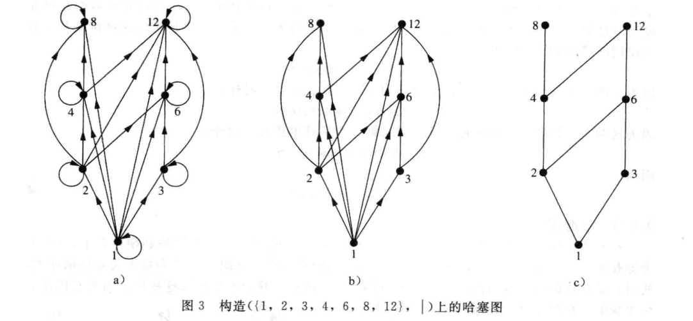
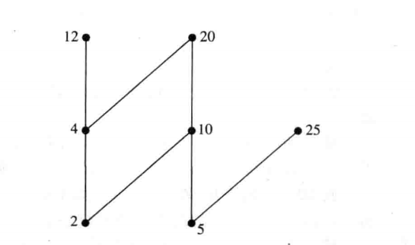
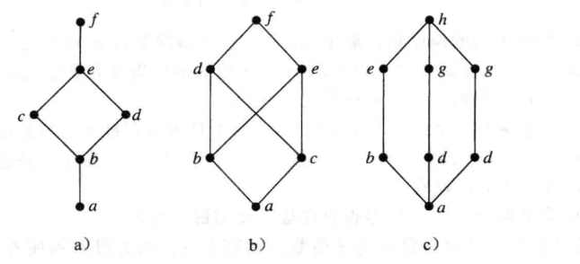

# 一、逻辑和证明

## 1. 命题逻辑

### (1) 命题

**命题**是一个陈述语句(陈述事实)，它或真或假，但不能既真又假。  

使用字母来表示**命题变元**，习惯使用 $p, q, r, s, ...$  表示命题。如果一个命题是真命题，真值为真，用 $T$  表示；如果是假命题，真值为假，用 $F$ 表示。  

涉及命题的逻辑领域叫**命题演算**或**命题逻辑**。**复合命题**是由已知命题用逻辑运算符组合而来。  


> **定义一**  令 $p$ 为一个命题，则 $p$ 的否定记作 $\lnot p$(也可记作 $\bar p$)，读作非 $p$，指不是 $p$ 所指的情形。  

| $p$  | $\lnot p$ |
| :--: | :-------: |
| $T$  |    $F$    |
| $F$  |    $T$    |


> **定义二** 令 $p$ 和 $q$ 为命题，$p, q$ 的合取即命题 $p$ 且 $q$，记作 $p \land q$。当 $p$ 和 $q$ 均为真时，$p \land q$ 为真，否则为假。  

| $p$  | $q$  | $p \land q$ |
| :--: | :--: | :---------: |
| $T$  | $T$  |     $T$     |
| $T$  | $F$  |     $F$     |
| $F$  | $T$  |     $F$     |
| $F$  | $F$  |     $F$     |


> **定义三** 令 $p$ 和 $q$ 为命题，$p, q$ 的析取即命题 $p$ 或 $q$，记作 $p \lor q$ 。当 $p$ 和 $q$ 均为假时，$p \lor q$ 为假，否则为真。  

| $p$  | $q$  | $p \lor q$ |
| :--: | :--: | :--------: |
| $T$  | $T$  |    $T$     |
| $T$  | $F$  |    $T$     |
| $F$  | $T$  |    $T$     |
| $F$  | $F$  |    $F$     |


> **定义四** 令 $p$ 和 $q$ 为命题，$p, q$ 的异或，记作 $p \oplus q$  是：当 $p$ 和 $q$ 中恰好只有一个命题为真时为真，否则为假。  

| $p$  | $q$  | $p \oplus q$ |
| :--: | :--: | :----------: |
| $T$  | $T$  |     $F$      |
| $T$  | $F$  |     $F$      |
| $F$  | $T$  |     $F$      |
| $F$  | $F$  |     $F$      |


> **定义五** 令 $p$ 和 $q$ 为命题，条件语句 $p \to q$ 是命题“如果 $p$，则 $q$”，当 $p$ 为真且 $q$ 为假时，条件语句 $p \to q$ 为假，否则为真。在条件语句 $p \to q$ 中，$p$ 称为假设(条件)，$q$ 称为结论。  
>
> $p \to q$ 可以断定在条件 $p$ 成立的时候 $q$ 为真，条件语句也称为**蕴含**。

| $p$  | $q$  | $p \to q$ |
| :--: | :--: | :-------: |
| $T$  | $T$  |    $T$    |
| $T$  | $F$  |    $F$    |
| $F$  | $T$  |    $T$    |
| $F$  | $F$  |    $T$    |


**逆命题、反命题与逆否命题**  

原命题为 $p \to q$，命题 $q \to p$ 称为 $p \to q$ 的逆命题，命题 $\lnot p \to \lnot q$ 称为 $p \to q$ 的反命题，命题 $\lnot q \to p$ 称为 $p \to q$ 的逆否命题。  

逆否命题和原命题具有相同的真值，逆命题和反命题具有相同的真值。  


> **定义六** 令 $p$ 和 $q$ 为命题，双条件语句 $p \leftrightarrow q$ 是命题“$p$ 当且仅当 $q$”。当 $p$ 和 $q$ 拥有相同的真值时，双条件语句为真，否则为假。双条件语句也叫双向蕴含。  

| $p$  | $q$  | $p \leftrightarrow q$ |
| :--: | :--: | :-------------------: |
| $T$  | $T$  |          $T$          |
| $T$  | $F$  |          $F$          |
| $F$  | $T$  |          $F$          |
| $F$  | $F$  |          $T$          |


### (2) 逻辑运算符的优先级

|      运算符       | 优先级 |
| :---------------: | :----: |
|      $\lnot$      |  $1$   |
|      $\land$      |  $2$   |
|      $\lor$       |  $3$   |
|       $\to$       |  $4$   |
| $\leftrightarrow$ |  $5$   |


### (3) 逻辑运算和位运算

*位(bit)* 一词来自于*二进制数字(binary digit)*，1位可以表示真值。习惯上，用 1 表示真($T$)，用 0 表示假($F$)。如果一个变量的值为真或假时，则该变量为**布尔变量**。  


> **定义七**  *位串*是 0 位或多位的序列。位串的长度是其所含位的数目。
>
> 可以把两个长度相同的两个位串的相应位进行 OR、AND、XOR 操作，叫做位串的按位运算。  


## 2. 命题逻辑的应用

- 将语句翻译为命题变量和逻辑联结词组成的表达式
- 描述硬件系统或软件系统时，将自然语言翻译为逻辑表达式
- 逻辑联结词广泛用于大量信息搜索中，比如网页索引。叫做**布尔搜索**
- 用逻辑推理解决的谜题是**逻辑谜题**
- **逻辑电路**设计


## 3. 命题等价性

### (1) 逻辑等价式

> **定义一** 一个真值永远是真的命题称为永真式(tautology)，也称为重言式。一个真值永远为假的命题为矛盾式(contradiction)，既不是永真式又不是矛盾式的命题是可能式。  

> **定义二** 如果 $p \leftrightarrow q$ 为永真式，则命题 $p$ 和 $q$ 称为逻辑等价的。记作 $p \equiv q$ 或者 $p \Leftrightarrow q$   

判断两个复合命题是否等价的方法之一是使用真值表  


### (2) 德·摩根律

$$\lnot (p \land q) \equiv \lnot p \lor \lnot q$$  

$$\lnot (p \lor q) \equiv \lnot p \land \lnot q$$  


### (3) 命题的可满足性

如果存在一个对其变元的真值赋值使命题为真，则该复合命题称为**可满足的**，否则是**不可满足的**。  

注意一个命题是不可满足的当且仅当它的否定对所有的变元的真赋值都是真的，也就是当且仅当它的否定是永真式。  

当找到一个特定的使得复合命题为真的真值赋值时，这样的一个赋值称为这个特定的可满足性问题的一个**解**。  


### (4) 可满足性的应用

在机器人学、软件测试、计算机辅助设计、机器视觉、继承电路设计、计算机网络等等都可以使用命题可满足性来建立模型。  


## 4. 谓词和量词

### (1) 谓词(Predicate)

谓词表明语句主语是否满足一个性质，比如 $x > 3$，其中 $x$ 是语句的主语，谓词 $>3$ 表明主语是否满足某个特性。  

可以使用 $P(x)$ 来表示 $x > 3$，其中 $P$ 表示谓词 $>3$，而 $x$ 是变量。一旦给 $x$ 赋一个值，语句 $P(x)$ 就称为命题并具有真值。  

形式为 $P(x_1,\;x_2,\;\dots,\;x_n)$  的语句是命题函数 $P$ 在 n 元组 $(x_1,\;x_2,\;\dots,\;x_n)$ 的值，$P$ 也称为 **n 元谓词**或 n 位谓词。  


### (2) 量词

在自然语言中，所有、某些、许多、没有等等量词都可以用在**量化**上。量化可以从命题函数生成一个命题。  

这里集中讨论两类量化：**全称量化**和**存在量化**。  

量化表示在一定范围内的个体对于某个谓词成立，这个范围被叫做**论域**(domain of discourse)或**全体域**(universe of discourse)，简称为**域**(domain)。  

> **定义一** $P(x)$ 的全称量化是语句 ”$P(x)$ 对 $x$ 在其论域的所有值为真“
>
> 符号 $\forall xP(x)$ 表示 $P(x)$ 的全称量化，其中 $\forall$ 称为全称量词，命题 $\forall xP(x)$ 读作“对于所有的 $x$，$P(x)$“

> **定义二** $P(x)$ 的存在量词是命题”论域中存在一个 $x$ 满足 $P(x)$“
>
> 符号 $\exist xP(x)$ 表示 $P(x)$ 的存在量化。  

唯一性量词：存在唯一一个 $x$ 使得 $P(x)$ 为真，用符号 $\exist !$ 或 $\exist_1$ 表示。  


量词 $\forall$ 和 $\exist$ 的优先级比命题演算中所有的逻辑符有更高的优先级。比如 $\forall xP(x) \lor Q(x)$ 表示 $(\forall xP(x)) \lor Q(x)$。  

<br>

**变量绑定 ** 

当量词作用于变量 $x$ 时，我们说此变量的这次出现为**约束的**；如果没有被量词约束或设置为等于某一特定值，则这个变量的出现称为是**自由的**。命题函数中的所有变量出现必须是约束的或者是被设置为某个的值，才能把它转变为一个命题。可以通过采用一组全称量词、存在量词和赋值进行实现。  

逻辑表达式中的一个量词作用到的部分叫做这个量词的作用域。  

例如 $\exist x (x + y = 1)$，变量 $x$ 受存在量词约束，$y$ 是自由的。$\exist x(P(x) \land Q(x)) \lor \forall xR(x)$ 中，所有变量都是约束的，而且 


**涉及量词的逻辑等价式**  

> **定义三** 涉及谓词和量词的语句是逻辑等价的当且仅当无论用什么谓词代入这些语句，也无论这些命题函数里的变量指定什么论域，它们都有相同的真值。用 $S \equiv T$ 表示涉及谓词和量词的两个语句 $S$ 和 $T$ 是逻辑等价的。

<br>

**量化表达式的否定**  

量词否定的规则称为**量词的德·摩根律**。  

|          否定           |        等价语句         |        何时为真         |        何时为假         |
| :---------------------: | :---------------------: | :---------------------: | :---------------------: |
|  $\lnot\,\exist xP(x)$  | $\forall x \lnot P(x)$  | 对每个 $x$，$P(x)$ 为假 |  存在 $x$，$P(x)$ 为真  |
| $\lnot \forall x\,P(x)$ | $\exist x\,\lnot\,P(x)$ | 存在 $x$ 使 $P(x)$ 为假 | 对每个 $x$，$P(x)$ 为真 |


## 5. 嵌套量词

**嵌套量词**是一个量词出现在另一个量词的作用域中。比如 $\forall\,x \exist\,y (x + y = 0)$   

多重量化中，量词的顺序很重要，不同的顺序将表示不同的含义，除非全部是全称量词或者存在量词。  

$\forall x\; \exist y \; P(x, y)$ 指对每个 $x$，都存在一个 $y$ 使得 $P(x, y)$ 为真  

$\exist x\;\forall y \; P(x, y)$ 指存在一个 $x$，使得 $P(x, y)$ 对所有的 $y$ 均为真  

<br>

**嵌套量词的否定**  

带嵌套量词语句的否定可以通过连续地应用单个量词地否定规则得到。  

例：求表达式语句 $\forall x \; \exist y\;(xy = 1)$ 的否定  

$$\begin{align} \lnot \forall x \;\exist y \; (xy = 1) & = \exist x\;\lnot \exist y\;(xy=1) \\ & = \exist x\;\forall y\;\lnot(xy=1) \\ & = \exist x\; \forall y\; (xy\ne 1) \end{align}$$  

<br>


## 6. 推理规则

数学中的证明是建立在数学命题真实性的有效论证。所谓的**论证**(argument)，是指一连串的命题并以结论为最后的命题，所谓**有效性**(valid)，是指结论或论证的最后一个命题必须根据论证过程前面的命题或**前提**(premise)的真实性推出。  

错误的错误推理，称为**谬误**(fallacy)，直接导致无效论证。  


### (1) 命题逻辑的有效论证

比如”如果你有一个当前密码，那么你就可以登录到当前网络“，”你有一个当前密码“，所以”你可以登录到网络“。前面的论证使用了三段论形式，论证形式化可以表示为 $p \to q, \;p \; \therefore q$，其中 $p$ 代表 ”你有一个当前密码“，$q$ 代表”你可以登录到网络“。  

> **定义一** 命题逻辑中的一个论证是一连串的命题，除了论证中最后一个命题外都叫做前提，最后的命题叫做结论。一个论证是有效的，如果它的所有前提为真蕴含着结论为真。  

从有效论证形式的定义可知，当 $(p_1 \land p_2 \land \dots \land p_n) \to q$ 是永真式时，带有前提 $p_1, p2, \dots, p_n$ 以及结论 $q$ 的论证形式都是有效的  

<br>

### (2) 命题逻辑的推理规则

|  推理规则  |                        永真式                        |
| :--------: | :--------------------------------------------------: |
|  假言推理  |             $(p \land (p \to q)) \to q$              |
|   取拒式   |        $(\lnot q\land(p \to q)) \to \lnot p$         |
| 假言三段论 |     $((p \to q) \land (q \to r)) \to (p \to r)$      |
| 析取三段论 |          $((p \lor q) \land \lnot p) \to q$          |
|   附加律   |                  $p \to (p \lor q)$                  |
|   化简律   |                 $(p \land q) \to p$                  |
|   合取律   |          $((p) \land (q)) \to (p \land q)$           |
|   消解律   | $((p \lor q) \land (\lnot p \lor r)) \to (q \lor r)$ |


### (3) 量化命题的推理规则

**全称实例**是从给定前提 $\forall x P(x)$ 得出 $P(c)$ 为真的推理规则，其中 $c$ 是论域中的一个特定成员。  

**全称引入**是从论域中的所有元素 $c$ 都有 $P(c)$ 为真的前提推出 $\forall x P(x)$ 为真的推理规则。  

**存在实例**是从给定前提 $\exist xP(x)$ 得出在论域中存在一个元素 $c$ 使得 $P(c)$ 为真。  

**存在引入**是从已知有一个特定的 $c$ 使得 $P(c)$ 为真时得出 $\exist xP(x)$ 为真的推理规则。  

<br>


## 7. 证明导论

### (1) 概念

**定理(theorem)** 是一个能够被证明是真的语句。数学描述中，定理一词被专指那些被认为有些重要的语句。不太重要的定理有时候被称为**命题**、**事实(fact)**或**结论(result)**。  

用一个**证明(proof)**来展示一个定理是真的。证明就是建立定理真实性的一个有效论证。  

证明中可以用到公理(假设)，**公理(axiom)**(或**假设(postulate)**)是可以假定为真的语句。  

**引理(lemma)**是不太重要但有助于证明其他结论的定理。  

**推论(corollary)**是从一个已经被证明的定理可以直接建立起来的一个定理。  

**猜想(conjecture)**是一个被提出认为是真的命题，通常是基于部分证据、启发式论证或直觉。当猜想被证明之后，猜想就变成了定理。  


### (2) 证明定理的方法

- 直接证明法
- 反证法：证明 $p \to q$ 可以通过它的逆否命题 $\lnot q \to \lnot p$ 来证明
- 归谬证明法：找到一个矛盾式 $q$ 使得 $\lnot p \to q$ 为真，则 $\lnot p$ 为假，即 $p$ 为真。
- 穷举证明法
- 分情况证明法
- ...


# 二、基本结构

**基本结构：集合、函数、序列、求和、矩阵**  

## 1. 集合

> **定义一** 集合是对象的一个无序的聚集，对象也称为集合的元素(element)或成员(member)。集合包含(contain)它的元素。我们用 $a \in A$ 来表示 $a$ 是集合 $A$ 中的一个元素。而记号 $a\notin A$ 表示 $a$ 不是集合 $A$ 中的一个元素。  

通常使用大写字母来表示集合，使用小写字母来表示集合中的元素。  

描述集合的方式：  

- 列举法(花名册方法)，比如 $\{ a,\, b\,, c,\, d\}$, $\{1,\, 2,\, 3,\, \dots,\, 99\}$
- 集合构造器，比如 $O = \{x |x 是小于10的正奇数\}$
- 文氏图

常用集合：

- $\mathbf N$，自然数集
- $\mathbf Z$，整数集
- $\mathbf Z^+$，正整数集
- $\mathbf Q$，有理数集
- $\mathbf R$，实数集
- $\mathbf R^+$，正实数集
- $\mathbf C$，复数集

**区间**：$[a,\,b]$ 闭区间，$(a,\,b)$ 开区间，$[a,\,b)$ 左闭右开区间，$(a,\,b]$ 左开右闭区间  

> **定义二** 两个集合相等当且仅当它们拥有相同的元素。如果 $A$ 和 $B$ 是集合，则 $A$ 和 $B$ 是相等的当且仅当 $\forall x (x\in A \leftrightarrow x\in B)$。如果 $A$ 和 $B$ 是相等集合，记为 $A \equiv B$  

**空集**：不含任何元素的集合。用 $\varnothing$ 表示，也可以使用 $\{\}$ 表示。只有一个元素的集合叫做**单元素集**。注意区分 $\varnothing$ 和 $\{\varnothing\}$。  

**全集 U**：包含所考虑的全部对象。

**罗素悖论**：是罗素用来比喻罗素悖论的一个通俗说法，也称为理发师悖论，由于**朴素集合论**对于集合不加限定的定义。导致了数学危机，最终形成了现在的**公理化集合论**。悖论的内容是：他只为城里所有不为自己刮胡子的人刮胡子，理发师应该给自己刮胡子吗？  

> **定理一** 对于任意集合 $S$，$\varnothing \in S$ 和 $S \subseteq S$  


> **定义三** 集合 $A$ 是集合 $B$ 的子集当且仅当 $A$ 的每个元素也是 $B$ 的元素。使用 $A \subseteq B$ 表示集合 $A$ 是集合 $B$ 的子集  
>
> **定义四** 令 $S$ 是集合，如果 $S$ 中恰有 n 个不同的元素，这里 n 是非负整数，我们就说 $S$ 是有限集，而 n 是 $S$ 的基数。$S$ 的基数记为 $|S|$  
>
> **定义五** 如果一个集合不是有限的，则称为无限的  
>
> **定义六** 给定集合 $S$，$S$ 的幂集(power set)是集合 $S$ 所有子集的集合。$S$ 的幂集记作 $\mathcal  {{P}}(S)$

 $\mathcal  {{P}}(\{0,\,1,\,2\}) = \{\varnothing, \{0\}, \{1\}, \{2\}, \{0,1\}, \{0,2\}, \{1, 2\}, \{0,1,2\} \}$   

 $\mathcal  {{P}}(\varnothing) = \{\varnothing\}$  

 $\mathcal  {{P}}(\{\varnothing\}) = \{\varnothing, \{\varnothing\}\}$  


> **定义七** 有序 n 元组(ordered n-tuple) $a_1, a_2, \dots, a_n$ 是以 $a_1$ 为第一个元素，$a_2$ 为第二个元素，$\dots$，$a_n$ 为第 n 个元素的有序聚集  

**序偶(有序对)**(ordered pair)：有序二元组  

> **定义八** 令 $A$ 和 $B$ 是集合，$A$ 和 $B$ 的**笛卡尔积**(Cartesian product) 用 $A \times B$ 表示，是所有序偶 $(a, b)$ 的集合，其中 $a \in A$ 且 $b \in B$，于是 $A \times B = \{(a,b)|a \in A \land b \in B\}$  
>
> **定义九** 集合 $A_1, A_2, \dots, A_n$ 的笛卡尔积用 $A_1 \times A_2 \times \dots \times A_n$ 表示，是有序 n 元组 $(a_1, a_2, \dots, a_n)$ 的集合，其中 $a_i$ 属于 $A_i$，$i = 1, 2, \dots, n$。换言之，$A_1 \times A_2 \times \dots \times A_n = \{(a_1, a_2, \dots, a_n)|a_i\in A_i, i = 1, 2, \dots, n\}$  


## 2. 集合运算

### (1) 定义

> **定义一** 令 $A$ 和 $B$ 是集合。集合 $A$ 和 $B$ 的**并集**用 $A\cup B$ 来表示，是一个集合，包含 $A$ 或 $B$ 或同时在 $A$ 和 $B$ 中的元素。  
>
> $A \cup B = \{x|x\in A \lor x \in B\}$  
> 
> **定义二** 令 $A$ 和 $B$ 是集合。集合 $A$ 和 $B$ 的**交集**用 $A\cap B$ 来表示，是一个集合，包含同时在 $A$ 和 $B$ 中的元素。  
>
> $A \cap B = \{x|x\in A \land x \in B\}$  

> **定义三** 如果两个集合的交集是空集，则它们是不相交的。  

> **定义四** 令 $A$ 和 $B$ 是集合。集合 $A$ 和 $B$ 的**差集**用 $A - B$  或 $A \setminus B$ 来表示，是一个集合，包含属于 $A$ 但不属于 $B$ 的元素，$A$ 和 $B$ 的差集也称为 $B$ 相对于 $A$ 的**补集**。  
>
> $A - B = \{x|x \in A \land x \notin B\}$  
>
> **定义五** 令 $U$ 为全集，集合 $A$ 的补集用 $\overline A$ 表示，是 $A$ 相对于 $U$ 的补集。
>
> $\overline A = \{x\in U | x \notin A\}$  


### (2) 集合恒等式

|   名称    |                            恒等式                            |
| :-------: | :----------------------------------------------------------: |
|  恒等律   |           $A\cap U = A \\ A \cup \varnothing = A$            |
|  支配律   |      $A\cup U = U \\ A\cap \varnothing = \varnothing $       |
|  幂等律   |                 $A\cup A =A \\ A \cap A = A$                 |
|   补律    |                $\overline{(\overline A)} = A$                |
|  交换律   |         $A \cup B = B \cup A \\ A \cap B = B \cap A$         |
|  结合律   | $A \cup (B \cup C) = (A \cup B) \cup C \\ A \cap (B\cap C) = (A \cap B) \cap C$ |
|  分配律   | $A \cup (B \cap C) = (A\cup B) \cap (A \cup C) \\ A \cap (B \cup C) = (A \cap B) \cup (A \cap C)$ |
| 德·摩根律 | $\overline {A \cap B} = \overline A \cup \overline B \\ \overline {A \cup B} = \overline A \cap \overline B$ |
|  吸收律   |       $A\cup (A \cap B) = A \\ A \cap (A \cup B) = A$        |
|  互补律   | $A \cup \overline A = U \\ A \cap \overline A = \varnothing $ |


>  **定义六** 一组集合的并集是包含那些至少是这组集合中一个集合成员的元素的集合。
>
> $A_1 \cup A_2 \cup \dots \cup A_n = \underset{i=1}{\overset{n}{\bigcup}} A_i$  
>
> **定义七** 一组集合的交集是包含那些属于这组集合中所有成员集合的元素的集合。
>
> $A_1 \cap A_2 \cap \dots \cap A_n = \underset{i=1}{\overset{n}{\bigcap}} A_i$  


### (3) 函数

> **定义一** 令 $X$ 和 $Y$ 是非空集合。从 $X$ 映射到 $Y$ 的函数 $f$ 是 $X$ 与 $Y$ 笛卡尔积 $X \times Y$ 的子集，$X$ 中任意 $x$ 都与 $Y$ 中的 $y$ 唯一对应，且有序对 $(x, y)$   属于 $f$  

函数也称为**映射(mapping)**或**变换(transformation)**  


> **定义二** 如果 $f$ 是从 $X$ 到 $Y$ 的函数，我们说 $X$ 是 $f$ 的**定义域(domain)**，$Y$ 是 $f$ 的**陪域(codomain)**，如果 $f(x) = y$，则称 $b$ 是 $a$ 的**像(image)**，$a$ 为 $b$ 的**原像(pre-image)**。$f$ 的**值域(range)** 为 $\{y|y=f(x)\}$，也就是 $X$   中元素所有像的集合。  

> **定义三** 令 $f_1$ 和 $f_2$ 是从 $X$ 到 $\mathbf R$ 的函数， 那么 $f_1 + f2$ 和 $f_1 f_2$ 也是从 $X$ 到 $\mathbf R$ 的函数，其定义对于任意 $x\in X$  
>
> **定义四** 令 $f$ 是从 $X$ 到 $Y$ 的函数，令 $S$ 是 $X$ 的一个子集。$S$ 在函数 $f$ 下的像是由 $S$ 中的元素的像组成 $Y$ 的子集。我们用 $f(S)$ 表示 $S$ 的像，于是 
>
> $f(S) = \{t|\exist s \in S\}$  

> **定义五** 函数 $f$ 是一对一的或**单射函数**(injection)，当且仅当对于 $f$ 的定义域中所有的 $a$ 和 $b$  有 $f(a) = f(b)$ 蕴含 $a = b$  
>
> **定义六** 对于定义域和陪域都是实数集子集的函数 $f$，如果定义域中的 $x$ 和 $y$，当 $x < y$ 时有 $f(x) \le f(y)$，称为 $f$ 是递增的；如果 $x < y$ 时有 $f(x) < f(y)$，称为是严格递增的。类似地，如果 $x < y$ 时有 $f(x) \ge f(y)$，称为是递减的；如果 $x < y$ 时有 $f(x) > f(y)$ 称为是严格递减的。  
>
> **定义七** 一个从 $X$ 到 $Y$ 的函数 $f$ 称为**映上**(onto)或**满射函数**(surjection)，当且仅当对每个 $y \in Y$ 有元素 $x \in X$ 使得 $f(x) = y$，即值域就是其陪域。  
>
> **定义八** 既是单射又是满射的函数叫做**双射函数**(bijection)。  

> **定义九** 令 $f$ 为从集合 $X$ 到 $Y$ 的一一对应，对每一个 $x\in X$ 有 $g(f(x)) = x$，则称 $g$ 为 $f$ 的反函数，记之为 $f^{-1}$ 
>
> 如果 $f$ 存在反函数，$f$ 是一一对应的，即 $f$ 是双射函数，也称 $f$ 是**可逆的**。否则，$f$ 是不可逆的。  

> **定义十** 令 $g$  是从集合 $X$ 到 $Y$ 的函数，$f$ 是从 $Y$ 到 $Z$ 的函数，函数 $f$ 和 $g$ 的合成(composition) 记作 $f \circ g$，定义对任意的 $x \in X$ 有 $(f \circ g)(x) = f(g(x))$  

> **定义十一** 令 $f$ 是从集合 $X$ 到 $Y$ 的函数，函数 $f$ 的图像是序偶集合 $\{(x,y) | x\in X \land f(x) = y \}$  

> **定义十二** 
>
> 向下取整函数(floor) $\lfloor x \rfloor =$  小于或等于 $x$ 的最大整数；向上取整函数(ceiling) $\lceil x \rceil = $ 大于或等于 $x$ 的最小整数  
>
> 阶乘函数 $f(x) = x! = 1*2*\dots*(n-1)*n$ 并且 $f(0) = 0! = 1$  

> **定义十三** 一个从集合 $X$ 到 $Y$ 的**部分函数**(partial function) $f$ 是给 $X$ 的一个子集(成为 $f$ 的定义域) 中的每个元素 $x$ 都映射到唯一一个 $Y$ 中的元素 $y$。集合 $X$ 和 $Y$ 分别称为 $f$ 的定义域和陪域。当 $f$ 对于在 $X$ 中但不在 $f$ 定义域中的元素称为无定义(undefined)。当 $f$ 的定义域等于 $X$ 时，称 $f$ 为全函数(total function)。  


## 3. 序列和求和

### (1) 序列

> **定义一** 序列是从一个整数集的一个子集，到一个集合 $S$ 的函数，用记号 $a_n$ 表示整数 $n$ 的像，称 $a_n$ 为序列的一个项(term)。  

> **定义二** 几何级数(等比序列)是形如 $a, ar, ar^2, \dots, ar^n, \dots$ 的序列，其中初始项 $a$ 和公比 $r$ 都是实数  
>
> **定义三** 算术级数(等差序列)是形如 $a, a+1, a+2d, \dots, a+nd, \dots$ 的序列，其中 $a$ 和公差 $d$ 都是实数  

> **定义四** 递推序列是一种递推地定义的一个序列，序列的每一项目是定义为前一项的函数  
>
> **定义五** 斐波那契数列 $f_0, f_1, f_2, \dots $，$f_n = \begin{cases} 0 & if\;n == 0 \\ 1 & if \; n == 1 \\ (f_{n-1} + f_{n-2}) & if\; n >= 2  \end{cases}$  

当我们为为序列的项找到一个显式公式，称为**闭公式**(closed formula)。  


### (2) 求和

考虑序列项累加问题，引入**求和符号** $\sum$   

我们用记号 $\underset{j=m}{\overset{n}{\sum}} a_j$ 或 $\underset{m\le j \le n}{\sum} a_j$ 表示 $a_m + a_{m+1} + \dots + a_n$   

有用的求和公式


|                           和                            |               闭形式               |
| :-----------------------------------------------------: | :--------------------------------: |
|   $\underset{k=0}{\overset{n}{\sum }} ar^k (r \ne 0)$   | $\dfrac{ar^{n+1}-a}{r-1}, r \ne 1$ |
|          $\underset{k=1}{\overset{n}{\sum}}k$           |        $\dfrac {n(n+1)}{2}$        |
|         $\underset{k=1}{\overset{n}{\sum}}k^2$          |     $\dfrac {n(n+1)(2n+1)}{6}$     |
|         $\underset{k=1}{\overset{n}{\sum}}k^3$          |      $\dfrac{n^2(n+1)^2}{4}$       |
|  $\underset{k=0}{\overset{\infty}{\sum}}x^k, |x| < 1$   |         $\dfrac {1}{1-x}$          |
| $\underset{k=1}{\overset{\infty}{\sum}}kx^{k-1}, |x|<1$ |       $\dfrac {1}{(1-x)^2}$        |


## 4. 集合的基数

> **定义一** 集合 $A$ 和集合 $B$ 有相同的**基数**(cardinality)，当且仅当存在从 $A$ 到 $B$ 的一个一一对应，当 $A$ 和 $B$ 具有相同的基数时，就写成 $|A| = |B|$ 
>
> **定义二** 如果存在一个从 $A$ 到 $B$ 的一对一函数，则 $A$ 的基数小于等于 $B$ 的基数，写成 $|A| \le |B|$，并且 $A$ 和 $B$ 有不同的基数时，说 $A$ 的基数小于 $B$ 的基数，写成 $|A| < |B|$  

> **定义三** 一个集合是有限集或者与自然数集合具有相同的基数，这个集合称为是**可数的**。一个集合不是可数的，就称为不可数的。如果一个无限集 $S$ 是可数的，用符号 $\aleph_0$  来表示集合 $S$ 的基数，这里 $\aleph$ 是阿列夫，希伯来语字母表的第一个字母。写作 $|S| = \aleph_0$ 

关于 $\aleph_0$  一个有趣的科普视频 [怎样数到无限之后？](https://www.bilibili.com/video/av4369007)  


> **定理一** 如果 $A$ 和 $B$ 是可数集合，则 $A \cup B$ 也是可数集合  
>
> **定理二**  **Schröder–Bernstein theorem 定理** 如果 $A$ 和 $B$ 是集合且 $|A|\le |B|$ 和 $|B|\le |A|$，则 $|A|=|B|$。换言之，如果存在一对一函数 $f$ 从 $A$ 到 $B$ 和 $g$ 从 $B$ 到 $A$，则存在 $A$ 和 $B$ 之间的一一对应函数。  

> **定义四** 一个函数称为是**可计算的**，如果存在某种编程语言写的计算机程序能够计算该函数的值。如果一个函数不是可计算的，就说是**不可计算的**。  


## 5. 矩阵

> **定义一** **矩阵(matrix)**是矩形状的数组，$m$ 行 $n$ 列的数组被称为 $m \times n$ 矩阵  
>
> **定义二** 令 $m$ 和 $n$ 是正整数，并令 $\mathbf A = \left [\begin{matrix}   a_{11} & a_{12} & \cdots & a_{1n} \\ a_{21} & a_{22} & \cdots & a_{2n} \\ \vdots & \vdots & \; & \vdots \\ a_{m1} & a_{m2} & \cdots & a_{mn} \end{matrix}   \right ]$  
>
> **定义三** 令 $\mathbf A = [a_{ij}]$ 和 $\mathbf B=[b_{ij}]$ 为 $m \times n$ 矩阵，$\mathbf A$ 和 $\mathbf B$ 的和记作 $\mathbf A + \mathbf B$，其中 $(i, j)$ 元素为 $a_{ij} + b_{ij}$ 的矩阵。换言之，$\mathbf A + \mathbf B = [a_{ij} + b_{ij}]$  
>
> **定义四** 令 $\mathbf A$ 为 $m \times k$ 矩阵，$\mathbf B$ 为 $k \times n$ 矩阵，$\mathbf A$ 和 $\mathbf B$ 的乘积记作 $\mathbf{AB}$，是一个 $m \times n$ 的矩阵，其中 $(i,j)$ 元素等于 $\mathbf A$ 的第 $i$ 行于 $\mathbf B$ 的第 $j$ 列对应元素的乘积之和。换言之，如果 $\mathbf{AB} = [c_{ij}]$，则 $c_{ij} = a_{i1}b_{1j} + a_{i2}b_{2j} + \cdots + a_{ik}b_{kj}$  
>
> **定义五** **n阶单位矩阵(identity matrix of order n)** 是 $n\times n$ 矩阵 $\mathbf I_n=[\delta_{ij}]$，如果 $i=j$，$\delta_{ij} =1$；如果 $i \ne j$， $\delta_{ij} =0$，也就是 $\mathbf I_n = \left [ \begin{matrix} 1 & 0 & \cdots & 0 \\ 0 & 1 & \cdots & 0 \\ \vdots & \vdots & \; & \vdots \\ 0 & 0 & \cdots & 1 \end {matrix} \right ]$  

$\mathbf{AI_n} = \mathbf{I_mA} = \mathbf{A}$  

> **定义六** 令 $\mathbf{A} = [a_{ij}]$  为 $m \times n$ 矩阵，$\mathbf{A}$ 的**转置**(transpose)矩阵记作 $\mathbf{A}^T$，交换行列得到的 $n \times m$ 矩阵。$\mathbf{A}^T = [b_{ij}]$，其中 $b_{ij} = a_{ji},\; i = 1,2, \dots, n; j=1, 2, \dots, m$  
>
> **定义七** 方阵 $\mathbf{A}$ 称为是**对称的**(symmetric)如果 $\mathbf{A} = \mathbf{A}^T$  


所有元素非 0 即 1 的矩阵称为 **0-1 矩阵**  

> **定义八** 令 $\mathbf{A}$ 和 $\mathbf{B}$ 分别为 $m \times n$  阶的 0-1 矩阵。$\mathbf{A} \lor \mathbf{B} = [a_{ij} \lor b_{ij}]$，$\mathbf{A} \land \mathbf{B} = a_{ij} \land b_{ij}$  
>
> **定义九** 令 $\mathbf{A}$ 为 $m \times k$ 阶 0-1 矩阵，$\mathbf{B}$ 是 $k \times n$ 阶 0-1 矩阵，$\mathbf{A}$ 和 $\mathbf{B}$ 的布尔积记作 $\mathbf{A} \bigodot \mathbf{B}$ ，是$m \times n$ 矩阵 $[c_{ij}]$，其中 $c_{ij} = (a_{i1} \land b_{1j}) \lor (a_{i2} \land b_{2j}) \lor \cdots \lor (a_{ik} \land b_{kj})$  
>
> **定义十** 令 $\mathbf{A}$ 为 0-1 方阵，$r$ 为正整数，$\mathbf{A}$ 的 $r$ 次布尔幂是 $r$ 个 $\mathbf{A}$  的布尔积，记作 $\mathbf{A}^{[r]}$  


# 三、算法

简单略过  


# 四、数论

暂时掠过  


# 五、归纳与递归

数学归纳法原理：为了证明对所有的正整数 $n$，$P(n)$ 为真，其中 $P(n)$ 是一个命题函数，需要 

- 基础步骤：证明命题 $P(1)$ 为真
- 归纳步骤：证明对每个正整数 $k$ 来说，蕴含式 $P(k) \to P(k+1)$ 为真  


强归纳法：为了证明对所有的正整数 $n$，$P(n)$ 为真，其中 $P(n)$ 是一个命题函数，需要 

- 基础步骤：证明命题 $P(1)$ 为真
- 归纳步骤：证明对每个正整数 $k$ 来说，蕴含式 $P(1) \land P(2) \land \cdots \land P(k) \to P(k+1)$ 为真 

非负整数集合作为其定义域的递归函数：

- 规定这个函数在 0 处的值
- 递归步骤：给出从较小的整数处的值来求出当前值的规则  


> **定义一** 字母表 $\Sigma$ 上的字符串集合 $\Sigma^{*}$ 递归定义为：
>
> 基础步骤：$\lambda \in \Sigma^{*}$ 其中 $\lambda$ 是不包含任何符号的空串
>
> 递归步骤：若 $w \in \Sigma^{*}$ 且 $x \in \Sigma$ 时，则 $wx \in \Sigma^*$  

比如 $\Sigma=\{0,1\}$，则 $\Sigma^*$ 中的字符串，经过基础步骤得到 $\lambda$，在递归步骤形成 $\{0, 1\}$，$\{00, 01, 10, 11\}$ 等等  

> **定义二** 通过连接运算可以组合两个字符串，设 $\Sigma$ 是符号的集合，$\Sigma^*$ 是 $\Sigma$ 中符号形成字符串的集合，可以使用如下定义两个字符串的连接，用 $\cdot$ 表示。
>
> 基础步骤：若 $w \in \Sigma^*$，则 $w \cdot \lambda = w$，其中 $\lambda$ 是空串  
>
> 递归步骤：若 $w_1 \in \Sigma^*$，且 $w_2 \in \Sigma^*$ 以及 $x \in \Sigma$，则 $ w_1 \cdot (w_2 x) = (w_1 \cdot w_2) x$  


结构归纳法：

- 基础步骤：证明对于递归定义的基础步骤所规定的属于该集合的所有元素来说，结果全部成立
- 递归步骤：证明如果对于定义的递归步骤中的用来构造新元素的每个元素来说命题为真，则对这些新元素来说结果成立  


**递归算法**：如果一个算法通过把问题归约到更小输入的相同问题实例来解决原来的问题，则这个算法是递归的  

证明递归算法的正确性：数学归纳法以及强归纳法都可以证明递归算法的正确性，即可以证明算法对所有可能的输入值，都能产生所需要的输出  


若对每个可能的输入来说，程序都产生正确的输出，则说这个程序是**正确的**。一个程序正确性包括两个部分，一个是程序终止获得正确的答案，证明了**部分正确性**；第二部分是：程序总是终止。  

使用两个命题，**初始断言**，给定输出值必须具有的性质；第二个是**终结断言**，程序的输出应当具有的性质。  


# 六、计数

暂略


# 七、离散概率

暂略


# 八、高级计数

暂略


# 九、关系

## 1. 关系及其性质

> **定义一** 设 $A$ 和 $B$ 是集合，一个从 $A$ 到 $B$ 的二元关系是 $A \times B$ 的子集。一个二元关系是集合 $R$，其中每个有序对的第一个元素取自 $A$  而第二个元素取自 $B$，我们使用 $aRb$ 表示 $(a, b) \in R$，$a\cancel{R}b$ 表示 $(a,b) \notin R$  ，当 $(a,b) \in R$ 时，称 $a$ 与 $b$ 有关系 $R$  
>
> **定义二** 集合 $A$ 上的关系是从 $A$ 到 $A$ 的关系  

> **定义三** 若对每个元素 $a \in A$ 有 $(a, a) \in R$，那么定义在集合$A$ 上的关系 $R$ 是**自反的**  
>
> **定义四** 对于任意的 $a, b\in A$，若只要 $(a,b) \in R$ 就有 $(b, a) \in R$，则称定义在集合 $A$ 上的关系 $R$ 为**对称的**。对于任意的 $a,b\in A$，若 $(a,b) \in R$ 且 $(b,a) \in R$，一定有 $a=b$，则称定义在集合 $A$ 上的关系 $R$ 是**反对称的**。 
>
>  **定义五** 若对于任意的 $a, b, c \in A$ ，$(a,b) \in R$ 且 $(b, c) \in R$ 则 $(a,c)\in R$，那么定义在 $A$ 上的关系 $R$ 称为**传递的**   

例：考虑在 $\{1,2,3,4\}$ 上的关系  

$R_1 = \{(1,1), (1,2), (2,1), (2,2), (3,4), (4,1), (4,4)\}$  

$R_2=\{(1,1),(1,2),(2,1)\}$  

$R_3=\{(1,1), (1,2), (1,4), (2,1), (2,2), (3,3), (4,1), (4,4)\}$  

$R_4 = \{(2,1), (3,1),(3,2),(4,1),(4,2),(4,3)\}$  

$R_5=\{(1,1), (1,2), (1,3), (1,4), (2,2), (2,3),(2,4),(3,3), (3,4),(4,4)\}$  

$R_6=\{(3,4)\}$  

以上关系中， $R_3,R_5$ 是自反的，$R_2,R_3$ 是对称的，$R_4,R_5,R_6$ 是反对称的，$R_4,R_5,R_6$ 是传递的。  

> **定义六** 设 $R$ 是从集合 $A$ 到集合 $B$ 的关系，$S$ 是从集合 $B$ 到集合 $C$ 的关系。$R$ 与 $S$ 的合成是由有序对 $(a,c)$ 的集合构成的关系，其中 $a\in A, c \in C$，并且存在一个 $b \in B$ 的元素。使得 $(a,b) \in R$ 且 $(b,c) \in S$。使用 $S \circ R$ 表示 $R$ 与 $S$ 的合成。  
>
> **定义七** 设 $R$ 是集合 $A$ 上的关系， $R$ 的 n 次幂 $R^n(n=1,2,3,\cdots)$递归定义为 $R^1=R, R^{n+1}=R^n \circ R$  

> **定理一** 集合 $A$ 上的关系 $R$ 是传递的，当且仅当对 $n=1,2,3,\cdots $ 有 $R^n \subseteq R$  


## 2. n元关系

> **定义一** 设 $A_1,A_2,\dots,A_n$ 是集合，定义在这些集合上的 n 元关系是 $A_1 \times A_2 \times \cdots \times A_n$ 的子集，这些集合 $A_1,A_2, \dots, A_n$ 称为关系的域，n 称为关系的阶  

关系型数据库基于关系概念的方法  


**n 元关系的运算**  

> **定义二** 设 $R$ 是一个 n 元关系，$C$ 是 $R$ 中元素可能满足的一个条件，那么**选择**运算符 $s_C$ 将 n 元关系 $R$ 映射到 $R$ 中满足条件 C 的所有 n 元组构成的 n 元关系  

选择运算符($\sigma$)对应关系数据库的 `where` 子句  

> **定义三** **投影** $P_{i_1,i_2,\dots,i_m}$，其中 $i_1 < i_2 < \cdots < i_m$，将 $n$ 元组 $(a_1,a_2,\cdots,a_n)$ 映射到 $m$ 元组 $(a_{i1},a_{i2}, \cdots, a_{im})$，其中 $m \le n$  

投影简单来说就是从 n 元关系中选择 m 个组成新的 m 元关系  

> **定义四** 设 $R$ 是 m 元关系，$S$ 是 n 元关系，**连接**运算 $J_p(R,S)$ 是 m+n-p 元关系，其中 $p \le m$ 且 $p \le n$，包含了所有的 (m+n-p) 元组，其中 m 元组属于 $R$ 且 n 元组属于 $S$。

连接运算符简单来说就是从 $R$ 与 $S$ 的笛卡尔积中选取属性满足某一条件的元组，组合成一个新的关系  


## 3. 关系的表示

- 用矩阵表示，用 0-1 矩阵表示一个有穷集之间的关系，$m_{ij}=\left\{\begin{array} \,1 & (a_i,b_j) \in R \\ 0 & (a_i,b_j) \notin R \end{array} \right.$      
- 用图来表示，把有穷集上的关系看成有向图，集合中的元素是顶点，每个有序对表示一条有向边


## 4. 关系的闭包

设 $R$ 是非空集合 $A$ 上的关系，$R$ 的自反（对称或传递）**闭包**是 $A$ 上的关系 $R'$，且 $R'$ 满足以下条件：

- $R'$ 是自反(对称或传递)的
- $R \subseteq R'$ 

比如 $A=\{1,2,3\},\,R=\{(1,1),(1,3),(2,3),(3,2)\}$，则 $A$ 的**自反闭包**是 $R \cup \Delta =\{(1,1),(1,3),(2,3),(3,2),(2,2),(3,3)\}$  


## 5. 等价关系

> **定义一** 定义在集合 $A$ 上的关系，如果是自反的、对称的和传递的，则该关系是**等价关系**  
>
> **定义二** 如果两个元素 $a$ 和 $b$ 由于等价关系相关联，则称它们是等价的。记法 $a\sim b$ 通常用来表示对于某个特定的等价关系来说，$a$ 和 $b$ 是等价的元素  
>
> **定义三** 设 $R$ 是定义在集合 $A$ 的等价关系，与 $A$ 中的一个元素 $a$ 有关系的所有元素的集合叫做 $a$ 的等价类，$A$ 关于 $R$ 的**等价类**记作 $[a]_R$。当只考虑一个关系时，可以省略 $R$ 记作 $[a]$  
>
> $[a]_R = \{s|(a,s) \in R\}$，如果 $b \in [a]_R$，$b$ 叫做这个等价类的**代表元**，一个等价类的任意元素都可以作为这个类的代表元。  

设 $A = \{0,1,2,\dots, 8\}, xRy \Longleftrightarrow \forall{x,y} \in A, x \equiv y\;(mod\;3) $  

$x \equiv y\;(mod\;3)$ 叫做 $x$ 与 $y$ 模 3 同余，$R$ 为 $A$ 上的等价关系，其中 $1\sim 4, 2\sim 5,3\sim 6$ 等等  

0 的等价类 $[0] = \{0,3,6\}$，1 的等价类 $[1] = \{1,4,7\}$ 等等  

二元关系不一定都是等价关系，比如 $>$ 关系，没有自反性：任何一个数不大于自身；没有对称性：如果 $m > n$，则 $n \cancel{>} m$  

> **定理一** 设 $R$ 是定义在集合 $A$ 上的等价关系，下面关于集合 $A$ 中两个元素的命题是等价的：
>
> $aRb, [a]=[b],[a]\cap[b]\ne \varnothing$  
>
> **定理二** 设 $R$ 是定义在集合 $S$ 上的等价关系，那么 $R$ 的等价类构成 $S$ 的划分，反过来，给定集合 $S$ 的划分$\{A_i|i\in I\}$， 则存在一个等价关系 $R$，它以集合 $A_i(i\in I)$ 作为它的等价类。  

模 3 同余等价类例子中，划分的集合为：

$[0]_3=\{0,3,6\}$  

$[1]_3=\{1,4,7\}$  

$[2]_3=\{2,5,8\}$  


## 6. 偏序

> **定义一** 定义在集合 $S$ 上的关系 $R$，如果它是自反的、反对称的和传递的，就称为偏序。集合 $S$ 和 偏序 $R$ 一起称为偏序集，记作 $(S,R)$。集合 $S$ 中的成员称为偏序集的元素  

$\le,\ge$ 都是整数集合上的偏序关系，整除关系 $|$ 在正整数集合上偏序  

证明 $\ge$ 是是整数集合上的偏序关系：

对于所有整数 $a$ 有 $a \ge a$，所以 $\ge$ 是自反的；如果 $a \ge b$ 且 $b \ge a$，那么 $a = b$，因此 $\ge $ 是反对称的；$a \ge b$ 且 $b \ge c$ 蕴含 $a \ge c$，所以 $\ge$ 是传递的。从而 $\ge $ 是整数集合上的偏序，且 $(\mathbf Z, \ge)$ 是偏序集  


> **定义二** 如果偏序集 $(S, \preccurlyeq)$ 中的元素 $a$ 和 $b$ 满足 $a \preccurlyeq b$ 或 $b \preccurlyeq a$，则称 $a,b$ 是可比的。当 $a,b$  是 $S$ 的元素并且既没有 $a \preccurlyeq b$ 也没有 $b \preccurlyeq a$，则称 $a,b$ 是不可比的  
>
> **定义三** 如果 $(S,\preccurlyeq)$ 是偏序集，且 $S$ 中每对元素都是可比的，则 $S$ 称为全序集或线序集，且 $\preccurlyeq$ 称为全序或线序，一个全序集也称为链  

$a \prec b$ 表示 $a \preccurlyeq b$ 且 $a \ne b$  

$(\mathbf Z, \le)$ 是全序集，因为只要 $a,b$ 是整数，就有 $a \le b$ 或 $b \le a$  

$(\mathbf{Z^+},|)$ 不是全序集，因为包含不可比的元素，比如 5 和 7

> **定义四** 对于偏序集 $(S,\preccurlyeq)$，如果 $\preccurlyeq$ 是全序，并且 $S$ 的每个非空子集都有一个最小元素，就称它为良序集  


**哈斯(Hasse)图**：用来表示有限偏序集的图，从偏序的有向图开始，移除所有环，然后删除所有由传递性可以得到的边，最后删除所有的箭头得到哈斯图  

  


$S=\{x,y,z\}$ 幂集上的偏序 $\{(A,B)|A\}$ 的哈斯图：

  

设 $(S, \preccurlyeq)$ 是一个偏序集，若 $x \prec y$ 且不存在 $z \in S$ 使得 $x \prec z \prec y$，则称 $y$ 覆盖 $x$  


**极大元**：当不存在 $b \in S$ 使得 $a \prec b$，则 $a$ 在偏序集 $(S,\preccurlyeq)$ 中是极大元  

**极小元**：当不存在 $b \in S$ 使得 $b \prec a$，则 $a$ 在偏序集 $(S,\preccurlyeq)$ 中是极小元  

一个偏序集可以有多个极大元和多个极小元  

  

上图中，极大元是 12,20 和 25，极小元是 2 和 5。


有时候可以找到一个元素大于等于偏序集 $(S,\preccurlyeq)$ 的子集 $A$ 中的所有元素，如果 $u$ 是 $S$ 中的元素，使得对所有的元素 $a \in A$ 有 $a \preccurlyeq u$，那么称 $u$ 是 $A$ 的一个**上界**  

如果 $x$ 是一个上界并且它小于 $A$ 的任何其他上界，则 $x$ 叫做**最小上界**，如果 $x$ 存在，则只存在一个这样的元素。  

类似地，也有可能存在一个元素小于或等于 $A$ 中的所有元素，如果 $l$ 是 $S$ 的一个元素，使得对所有的元素 $a \in A$ 有 $l \preccurlyeq a$，那么称 $l$ 为 $A$ 的一个**下界**  

如果 $y$ 是一个下界并且它大于 $A$ 的任何其他下界，则 $y$ 叫做**最大下界**，如果 $y$ 存在，则只存在一个这样的元素。  

**格**：如果一个偏序集的每对元素都有最小上界和最大下界，称这个偏序集为**格**。  




  图 a) 和图 c) 中的哈斯图表示的偏序集是格，图 b 的哈希图 $\{d,e\}$ 下界是 $a,b,c$，但是没有最大下界，所以不是格  

## 7. 拓扑排序

从一个偏序构造一个相容的全序称为拓扑排序  

> **引理一** 每个有穷非空偏序集 $(S,\preccurlyeq)$ 至少有一个极小元  

拓扑排序对任何有穷非空偏序集都有效。为了在偏序集 $(A, \preccurlyeq)$ 上定义一个全序，首先选择一个极小元素 $a_1$，然后 $(A-\{a_1\}, \preccurlyeq)$ 也是一个有穷偏序集，如果 $A-\{a_1\}$ 是空的，过程终止，否则将 $a_2$ 移出，循环上述过程  

伪代码表示

```pseudocode
procedure topological_sort((S, preccurlyeq): Finite partial order Set)
k := 1
while S != EmitySet
    a_k := S.MinimalElement()
    S := S - {a_k}
    k := k + 1
return {a_1, a_2, ..., a_n}
```

