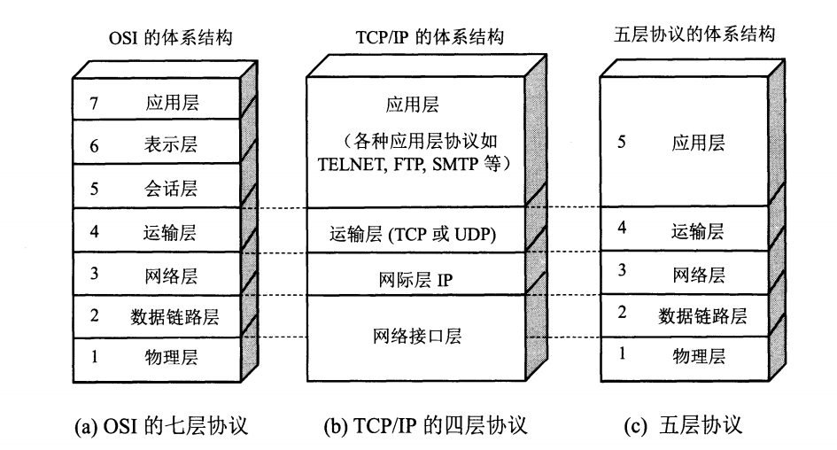
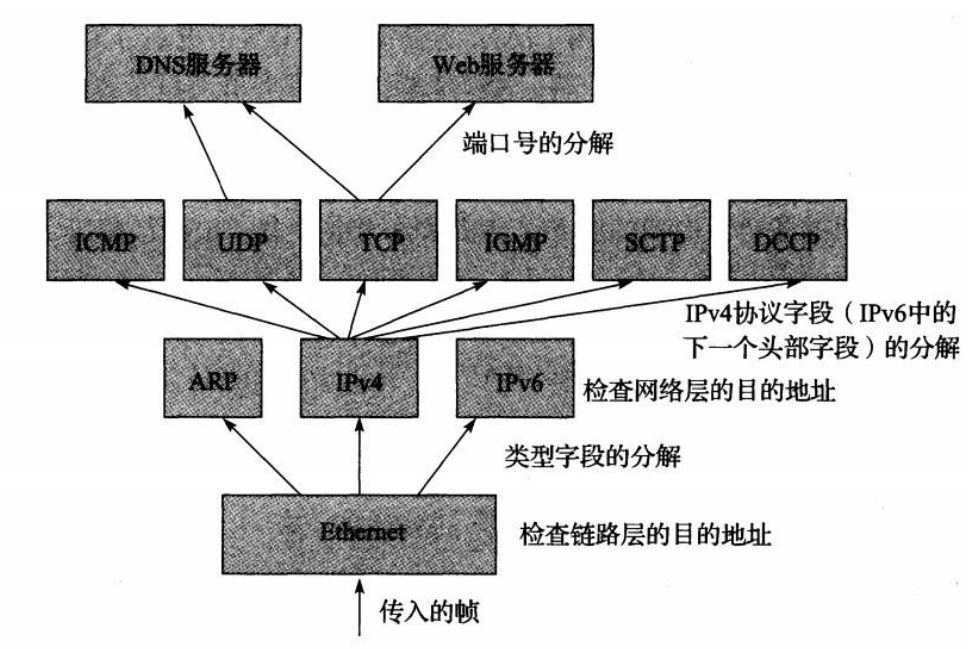
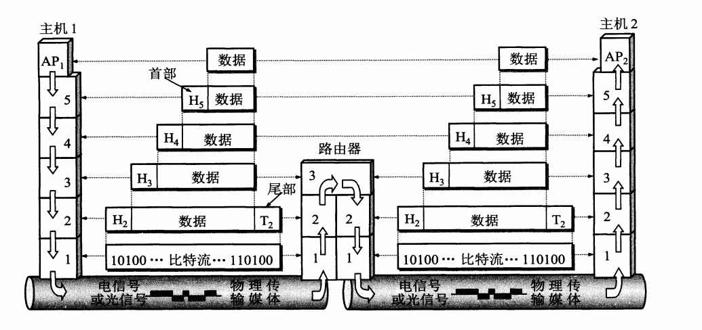

<!-- TOC -->

- [一、概述](#一概述)
    - [1. 计算机网络的体系结构](#1-计算机网络的体系结构)
    - [2. 计算机网络的性能](#2-计算机网络的性能)
    - [3. 设计应用](#3-设计应用)
- [二、物理层](#二物理层)
- [三、数据链路层](#三数据链路层)
    - [1. 点对点协议](#1-点对点协议)
    - [2. 以太网 IEEE 802.3](#2-以太网-ieee-8023)
    - [3. 无线局域网 IEEE 802.11](#3-无线局域网-ieee-80211)
- [四、网络层](#四网络层)
- [五、传输层](#五传输层)
- [六、应用层](#六应用层)
- [附录 A 网络硬件设备](#附录-a-网络硬件设备)
    - [1. 网卡](#1-网卡)
    - [2. 中继器](#2-中继器)
    - [3. 集线器](#3-集线器)
    - [4. 桥接器](#4-桥接器)
    - [5. 交换机](#5-交换机)
    - [6. 路由器](#6-路由器)
- [参考资料](#参考资料)

<!-- /TOC -->

# 一、概述

## 1. 计算机网络的体系结构

**网络体系结构：**

**应用层**：提供为应用软件而设的接口，以设置与另一应用软件之间的通信。比如 HTTP，HTTPS，FTP 等等。

**表示层**：对应用数据格式和转换规则，比如压缩加密等等。

**会话层**：负责在数据传输中设置和维护计算机网络中两台计算机之间的通信连接。

**运输层**：也叫传输层。为应用进程提供端到端的通信服务。 TCP(**报文段 *segment* **)，UDP(**数据报 *datagram* **)。

**网络层**：提供路由和寻址的功能。网络层把运输产生的报文段或用户数据报封装成**分组**或者**包(package)**。分组也叫 IP 数据报，注意和 UDP 区分。

**数据链路层**：两个相邻网络实体之间提供数据链路连接的创建、维持和释放管理。构成**帧(frame)**。并对帧定界、同步、收发顺序的控制。传输过程中的网络流量控制，差错检测和差错控制。

**物理层**：物理层上所传输数据的单位是**比特**。负责管理计算机通信设备和网络媒体之间的互通。

以上各层之后黑体标注为协议数据单元(PDU)。

  

**分层体系结构的优点：**

**分层体系结构**的一个主要优点是具有**协议复用**的能力。这种**复用**形式允许多种协议共存于同一基础设施中。 

它也允许相同协议对象(例如连接)的多个实例同时存在,并且不会被混淆。 

当某层的一个称为协议数据单元的对象(分组、消息等)被低层携带时，这个过程称为在相邻低层的**封装 **。第 N 层的多个对象可以通过第 N-1 层的封装而复用。 

学习计算机网络可以类比寄快递的过程。不过网络中流动的是数据。

  

**目前实际使用的主要还是 TCP/IP 协议栈。**

**TCP/IP 中复用、分解和封装：**

**数据在各层的传递过程**

  

## 2. 计算机网络的性能

**速率**：数据的传输速率，也叫比特率。单位是 bit/s(bps)。kbps 表示  bps，Mbps 为  bps

**带宽**：两种含义

(1) 信号的频带宽度。Hz。

(2) 某通道传送数据的能力，单位时间某通道能通过的最高数据率。bit/s。

**吞吐量**：单位时间内通过某个网络的实际数据量。

**时延**：

总时延 = 发送时延 + 传播时延 + 处理时延 + 排队时延

发送时延 = 数据帧长度(bit) / 发送速率(bit/s)

传播时延 = 信道长度(m) / 电磁波在信道上传播速率(m/s)

处理时延：主机或路由器收到分组需要一定时间进行处理，比如分析首部、提取数据部分、差错检验、寻找路由

排队时延：在路由器的输出队列中排队等待转发。

**时延带宽积**：表示链路可容纳多少比特。时延带宽积 = 传播时延 * 带宽

**往返时间 RTT**

**利用率**：

 为网络空闲时的时延， 为当前时延， 为网络利用率

  

## 3. 设计应用

- C/S
- P2P

# 二、物理层

**物理层确保原始的数据可在各种物理媒体上传输。**

信道：表示某一方向传送信息的媒体。

调制解调：

- 基带调制。也称编码。比如曼彻斯特编码。
- 带通调制。使用载波进行调制，转换为模拟信号，更换地在模拟信道进行传输。比如调幅、调频、调相。
  

码元：常常用时间间隔相同的符号来表示一个二进制数字，这样的时间间隔内的信号称为码元。一个码元携带的信息量是不固定的，而是由调制方法和编码方式决定。

信噪比(dB)：

香农公式：信道的极限信息传输速率  bit/s

信道的带宽或信道中的信噪比越大，信息的极限传输速率就越高，还可以让一个码元携带更多比特的信息量。

传输介质：双绞线、同轴电缆、光缆、微波、通信卫星

信道复用机制：频分复用、时分复用、波分复用、码分复用(正交)。

  

# 三、数据链路层

数据链路层提供的其他服务有：IP 数据报**封装成帧**、**透明传输**(转义序列)、**差错检测**(CRC 冗余校验)。

 

TCP/IP 支持多种不同的链路层，依赖于使用的网络硬件类型：

- 有线局域网：例如以太网
- 无线局域网：例如 Wi-Fi
- 无线数据服务：例如 HSPA、LTE、WiMAX
- 城域网 MAN
- 有线语音网络：支持调制解调的电话线

数据链路层还可以细分为[介质访问控制](https://zh.wikipedia.org/wiki/%E4%BB%8B%E8%B4%A8%E8%AE%BF%E9%97%AE%E6%8E%A7%E5%88%B6 )(MAC)子层和[逻辑链路控制](https://zh.wikipedia.org/wiki/%E9%80%BB%E8%BE%91%E9%93%BE%E8%B7%AF%E6%8E%A7%E5%88%B6 )(LLC)子层。

**逻辑链路控制子层**为网络层提供接口。

**介质访问控制子层**专职处理介质访问的争用与冲突问题。

 

## 1. 点对点协议

## 2. 以太网 IEEE 802.3

**以太网**这个术语通常指一套标准。常见的以太网有10Mb/s 以太网，100 Mb/s 快速以太网等。

 

**以太网帧格式**

由于有多个以太网帧协议，比如 Ethernet II，802.2 LLC，Novell raw 802.3 等等。这里介绍简单的 Ethernet II。

|    6 字节     |   6 字节    | 2 字节 | 46-1500 字节 |     4 字节      |
| :-----------: | :---------: | :----: | :----------: | :-------------: |
| 目标 MAC 地址 | 源 MAC 地址 |  类型  |     数据     | FCS(帧检测序列) |

**MTU**

 

**CRC 冗余检验：**

循环冗余校验(CRC)字段位于尾部，有 32 位。

简单起见，以 CRC4 举例：

CRC4 的生成多项式标准化为 10011，如果要发送 16 位消息 1001 1110 0010 1111。

1001 1110 0010 1111 | 0000 ÷ 10011 = 商 ... 1111 余数

将余数 1111 取反 0000 放置在帧的 CRC 或帧检验序列(FCS) 中。

在接收到数据后，接收方执行相同的除法操作计算出余数，并判断该值与 FCS 字段的值是否匹配。如果两者不匹配，帧可能在传输过程中受损，通常被丢弃。

 

**CSMA/CD：**

以太网的标准拓扑结构为总线型，现在为了减少冲突，提高网络速度和使用效率，使用交换机来进行网络的连接和组织，也就变成星形网络。但在逻辑上，仍使用**总线型拓扑**和**载波侦听多路访问/碰撞检测 CSMA/CD** (Carrier Sense Multiple Access with Collision Detection) 机制。

 

  

  

  

  

## 3. 无线局域网 IEEE 802.11

  

  

# 四、网络层

  

# 五、传输层

  

# 六、应用层

  

  

# 附录 A 网络硬件设备

## 1. 网卡

也叫**网络适配器(network adapter)**，**网络接口控制器(network interface controller)**。

安装在计算机内部，一般内置于主板之上或者插在 PCI 或者 ISA 插槽上。

网卡使用一个特定的物理层和数据链路层标准，为完整的协议栈提供基础，使得在同一局域网的中的计算机，能够进行通讯。

每个网卡都有一个独一无二的 48 位 MAC 地址，被写入网卡的一块 ROM 中。IEEE 负责分配 MAC 地址。

网卡的驱动程序会告诉网卡，应该从存储器中把哪些数据发送出去，还有把从局域网的收到的数据块放到存储器的什么位置。网卡收到差错的帧，直接丢弃。当网卡收到正确的帧时，使用中断来通知计算机，并交付到网络层。

## 2. 中继器

**中继器(Repeater)**，工作在**物理层**，负责波形调整和放大，**以延长传输距离**。因为信号在传输过程中，信号强度随着传输距离的增加而减弱。

## 3. 集线器

**集线器(Hub)** 是指将多条以太网双绞线或光纤集合连接在同一段物理介质下的设备。集线器工作在**物理层**。集线器上有多个 I/O 端口，信号从任意一个端口进入后，会从其他端口出现。由于可以将信号调整放大，因此它可以视作**多端口的中继器**。在检测到冲突时向所有端口转发拥塞信号。

由于集线器会把收到的任何数字信号，经过再生或放大，再从集线器的所有端口提交，这会造成信号之间碰撞的机会很大，而且信号也可能被窃听，并且这代表所有连到集线器的设备，都是属于同一个碰撞网域以及广播网域，因此大部分集线器已被**交换机**取代。

  

## 4. 桥接器

**桥接器(network bridge)**，又称**网桥**， 负责**网络桥接**(network bridging)之用。

**桥接**时将网络的多个网络的**数据链路层**连接起来。网桥功能上类似于集线器，不过工作在数据链路层。

  

## 5. 交换机

**交换机(Switch)**，可以说同时是集线器和网桥的升级换代产品，因为交换机具有集线器一样的集中连接功能，同时它又具有网桥的数据交换功能。

  

## 6. 路由器

**路由器(Router)**，提供路由与转发两种重要机制，可以决定数据包从来源端到目的端所经过的路由路径，这个过程称为路由；将路由器输入端的数据包移送至适当的路由器输出端（在路由器内部进行），这称为转发。路由工作在网络层。

  

# 参考资料

- [Kevin R. Fall & W. Richard Stevens 2016 *TCP/IP 详解 卷 1：协议(原书第二版)* 机械工业出版社](https://book.douban.com/subject/26825411/ )
- [James F.Kurose & Keith W.Ross 2014 *计算机网络：自顶向下方法(原书第六版)* 机械工业出版社](https://book.douban.com/subject/26176870/ )
- [谢希仁 2017 *计算机网络(第七版)* 电子工业出版社](https://book.douban.com/subject/26960678/ )
- [维基百科](https://en.wikipedia.org )
