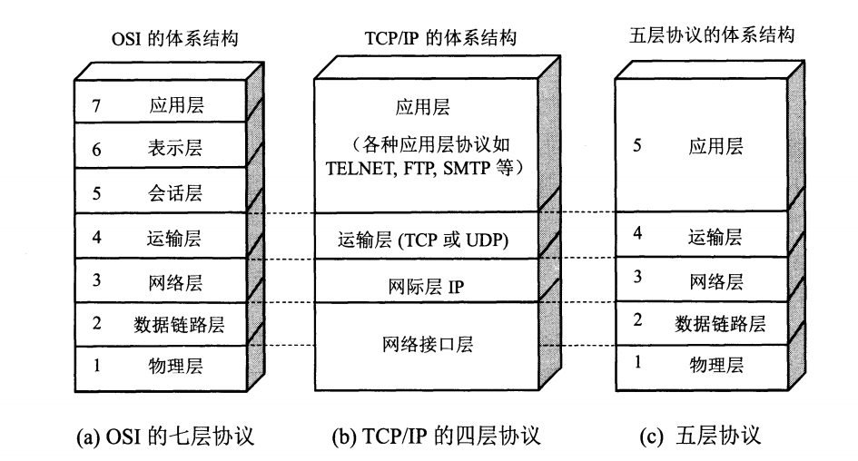
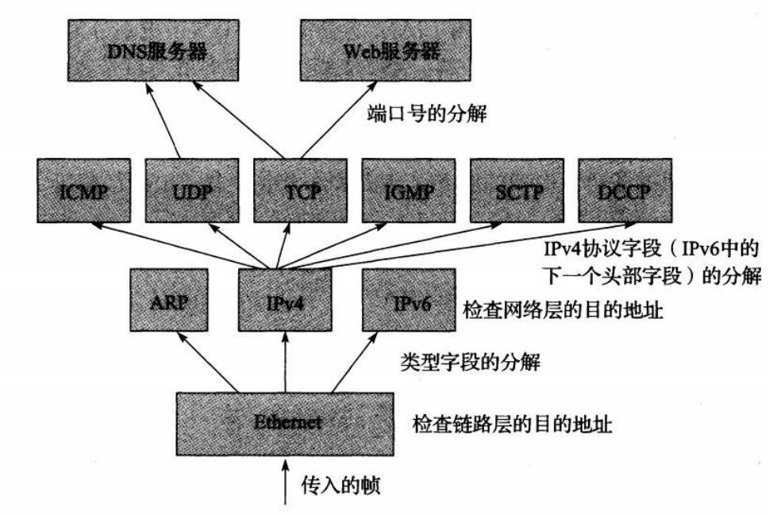
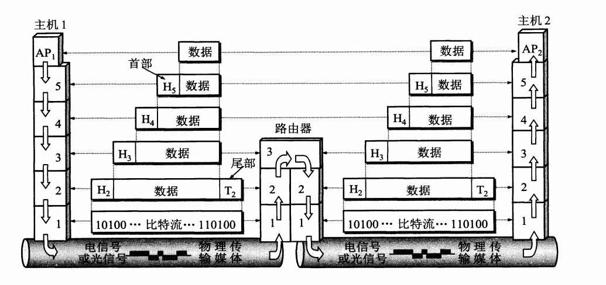

[一、概述](https://github.com/vczn/CS_Notes/blob/master/notes/network/network.md#%E4%B8%80%E6%A6%82%E8%BF%B0)

- [1. 计算机网络的体系结构](https://github.com/vczn/CS_Notes/blob/master/notes/network/network.md#1-%E8%AE%A1%E7%AE%97%E6%9C%BA%E7%BD%91%E7%BB%9C%E7%9A%84%E4%BD%93%E7%B3%BB%E7%BB%93%E6%9E%84)
- [2. 计算机网络的性能](https://github.com/vczn/CS_Notes/blob/master/notes/network/network.md#2-%E8%AE%A1%E7%AE%97%E6%9C%BA%E7%BD%91%E7%BB%9C%E7%9A%84%E6%80%A7%E8%83%BD)
- [3. 设计应用](https://github.com/vczn/CS_Notes/blob/master/notes/network/network.md#3-%E8%AE%BE%E8%AE%A1%E5%BA%94%E7%94%A8)
- [4. 标准化](https://github.com/vczn/CS_Notes/blob/master/notes/network/network.md#4-%E6%A0%87%E5%87%86%E5%8C%96)

[二、物理层](https://github.com/vczn/CS_Notes/blob/master/notes/network/network.md#%E4%BA%8C%E7%89%A9%E7%90%86%E5%B1%82)

[三、数据链路层](https://github.com/vczn/CS_Notes/blob/master/notes/network/network.md#%E4%B8%89%E6%95%B0%E6%8D%AE%E9%93%BE%E8%B7%AF%E5%B1%82)

[四、网络层](https://github.com/vczn/CS_Notes/blob/master/notes/network/network.md#%E5%9B%9B%E7%BD%91%E7%BB%9C%E5%B1%82)

[五、传输层](https://github.com/vczn/CS_Notes/blob/master/notes/network/network.md#%E4%BA%94%E4%BC%A0%E8%BE%93%E5%B1%82)

[六、应用层](https://github.com/vczn/CS_Notes/blob/master/notes/network/network.md#%E5%85%AD%E5%BA%94%E7%94%A8%E5%B1%82)

# 一、概述

## 1. 计算机网络的体系结构\*

**网络体系结构：**

**应用层**：提供为应用软件而设的接口，以设置与另一应用软件之间的通信。比如 HTTP，HTTPS，FTP 等等。

**表示层**：对应用数据格式和转换规则，比如压缩加密等等。

**会话层**：负责在数据传输中设置和维护计算机网络中两台计算机之间的通信连接。

**运输层**：也叫传输层。为应用进程提供端到端的通信服务。 TCP(**报文段 *segment* **)，UDP(**数据报 *datagram* **)。

**网络层**：提供路由和寻址的功能。网络层把运输产生的报文段或用户数据报封装成**分组**或者**包(*package*)**。分组也叫 IP 数据报，注意和 UDP 区分。

**数据链路层**：两个网络实体之间提供数据链路连接的创建、维持和释放管理。构成**帧 *frame***。并对帧定界、同步、收发顺序的控制。传输过程中的网络流量控制，差错检测和差错控制。

**物理层**：物理层上所传输数据的单位是**比特**。负责管理计算机通信设备和网络媒体之间的互通。

以上各层之后黑体标注为协议数据单元(PDU)。

**分层体系结构的优点：**

**分层体系结构**的一个主要优点是具有**协议复用**的能力。这种**复用**形式允许多种协议共存于同一基础设施中。 

它也允许相同协议对象(例如连接)的多个实例同时存在,并且不会被混淆。 

当某层的一个称为协议数据单元的对象(分组、消息等)被低层携带时，这个过程称为在相邻低层的**封装 **。第 N 层的多个对象可以通过第 N-1 层的封装而复用。 

**目前实际使用的主要还是 TCP/IP 协议栈。**

**TCP/IP 中复用、分解和封装：**

**数据在各层的传递过程**

## 2. 计算机网络的性能

**速率**：数据的传输速率，也叫比特率。单位是 bit/s(bps)。kbps 表示  bps，Mbps 为  bps

**带宽**：两种含义

(1) 信号的频带宽度。Hz。

(2) 某通道传送数据的能力，单位时间某通道能通过的最高数据率。bit/s。

**吞吐量**：单位时间内通过某个网络的实际数据量。

**时延**：

总时延 = 发送时延 + 传播时延 + 处理时延 + 排队时延

发送时延 = 数据帧长度(bit) / 发送速率(bit/s)

传播时延 = 信道长度(m) / 电磁波在信道上传播速率(m/s)

处理时延：主机或路由器收到分组需要一定时间进行处理，比如分析首部、提取数据部分、差错检验、寻找路由

排队时延：在路由器的输出队列中排队等待转发。

**时延带宽积**：表示链路可容纳多少比特。时延带宽积 = 传播时延 * 带宽

**往返时间 RTT**

**利用率**：})

D0 为网络空闲时的时延，D 为当前时延，U 为网络利用率

## 3. 设计应用

- C/S
- P2P

## 4. 标准化

> RFC

# 二、物理层

# 三、数据链路层

# 四、网络层

# 五、传输层

# 六、应用层

# 参考资料

- [Kevin R. Fall & W. Richard Stevens 2016 *TCP/IP 详解 卷 1：协议(原书第二版)* 机械工业出版社](https://book.douban.com/subject/26825411/)
- [James F.Kurose & Keith W.Ross 2014 *计算机网络：自顶向下方法(原书第六版)* 机械工业出版社](https://book.douban.com/subject/26176870/)
- [谢希仁 2017 *计算机网络(第七版)* 电子工业出版社](https://book.douban.com/subject/26960678/)
- [维基百科](https://en.wikipedia.org)

