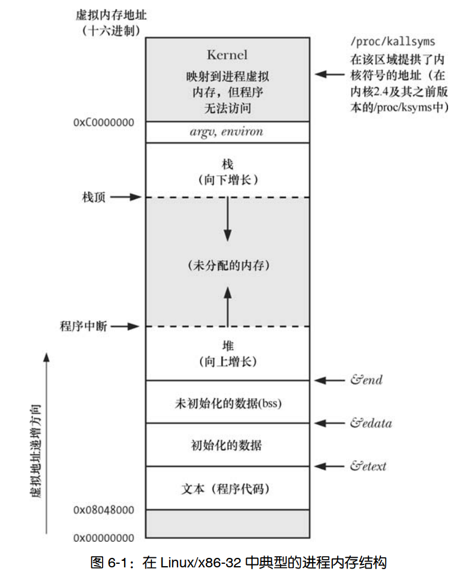

# Linux/UNIX 系统编程手册

# 一、历史和标准  

## 1. Unix

1969 ~ 1979 年，UNIX 经历了前六版  

1973 年，UNIX 用 C 语言对其进行了重写  

1979 年，UNIX 第七版发布，从该版本起，UNIX 分裂成 BSD 和 System V  

1983 年，加州大学伯克利分校计算机系统研究组发布 4.2 BSD，该版本包含了完整的 TCP/IP 实现，4.2 BSD 及其前身 4.1 BSD 在世界上多所大学开始广为流传。以这两者为基础，还形成了 SunOS 操作系统。其他重要的 BSD 版本还有发布于 1986 年的 4.3BSD，以及发布于 1993 年的最终版本 4.4BSD  

与此同时，1981 年 System III  发布，System III 由 AT&T 所属的 (UNIX Support Group， USG) 研发，1983 年， System V 的首个发布版发布，1989 年，USG 推出了 System V Release 4(SVR4)，此时的 System V 纳入了 BSD 的诸多特性  

除此之外，其他发布版有 SUN 的 SunOS 和 Solaris、Digital 公司的 Ultrix 和 OSF/1(现称为 HP Tru64 UNIX)、IBM 公司的 AIX、HP 公司的 HP-UX、NeXT 公司的 NeXTStep、在 Apple Macintosh 机上的 A/UX 以及 Microsoft 和 SCO 公司联合为 Intel x86-32 架构开发的 XENIX  


## 2. Linux

1991 年， Linus Torvalds  为自己的 Intel 80386 PC 开发操作系统，1991 年 Linux 0.01 版发布，1994 年 3 月，发布了 Linux 1.0 版本 ，Linux 2.0 发布于 1996 年 6 月，  Linux 2.4 发布于 2001  年 1 月，Linux 2.6 发布于 2003 年 12 月  


**内核版本号**  

在 Linux1.0 版本之后，内核版本编号方案为 x.y.z，x 表示主版本号， y 为附属于主版本号的次版本号， z 是从属于次版本号的修订版本号  

采用这一发布模式，内核的两个版本会一直处于开发之中，一个是用于生产系统的 stable 分支，其次版本号为偶数；另一个是经常变动的 development 分支，其次版本号为奇数（当前稳定版次版本号+1），比如 开发分支 2.3.z 的 stable 分支版本为 2.4  

随着 2.6 内核的发布，内核开发模式再次发生改变，稳定内核版本之间发布间隔过长  

之后改变为：

- 不再有稳定内核和开发内核的概念，每个 2.6.z 发布版都可以包含新特性
- 有时候需要为某个稳定的 2.6.z 发布版打补丁，可以直接发布 2.6.z.r 版本，r 作为内核版本的次修订版序号


## 3. POSIX

可移植操作系统 Portable Operating System Interface  

POSIX.1 于 1989 年成为 IEEE 标准，并在稍作修订后于 1990 年被正式采纳为 ISO 标准（ISO/
IEC 9945-1:1990）  

POSIX.1 基于 UNIX 系统调用和 C 语言库函数，但无需与任何特殊实现相关。这意味着任
何操作系统都可以实现该接口，而不一定要是 UNIX 操作系统  

POSIX.2（ 1992， ISO/IEC 9945-2:1993）这一与 POSIX.1 相关的标准，对 shell 和包括 C
编译器命令行接口在内的各种 UNIX 工具进行了标准化  

POSIX 1003.1-2001也将该标准称为 Single Unix Specification 版本 3，本书在后续内容中将称其为 SUSv3，包括了：基本定义 、系统接口、Shell 和实用工具、基本原理  

SUSv4 和 POSIX.1-2008，这一修订版本也称为 SUSv4，相比 SUSv3 修改不大  


# 二、基本概念

## 1. 内核

内核的主要任务：

- 进程调度：Linux 属于抢占式多任务操作系统。”多任务”意指多个进程（即运行中的程序）可同时驻留于内存，且每个进程都能获得对 CPU 的使用权。“抢占”则是指一组规则。这组规则控制着哪些进程获得对 CPU 的使用，以及每个进程能使用多长时间，这两者都由内核进程调度程序（而非进程本身）决定  
- 内存管理：内核必须以公平、高效地方式在进程间共享这一资源  
- 提供了文件系统：内核在磁盘之上提供有文件系统，允许对文件执行创建、获取、更新以及删除等操作  
- 创建和终止进程：内核可将新程序载入内存，为其提供运行所需的资源。一旦进程执行完毕，内核还要确保释放其占用资源  
- 对设备的访问：外部输入输出设备的交互
- 网络协议栈
- 提供系统调用应用编程接口(API)：进程可利用系统调用请求内核执行各种任务


## 2. 文件 I/O 模型

UNIX 系统 I/O 模型最为显著的特性之一是其 I/O 通用性概念，同一套系统调用所执行的 I/O 操作，可以对所有的文件类型使用，包括设备文件等等  

就本质而言，内核只提供了一种文件类型：字节流序列  

**文件描述符 fd**  

I/O 系统调用使用文件描述符(小数值的非负整数)来指代打开的文件  

通常由 shell 启动的进程会继承 3 个已经打开的文件描述符：描述符 0 为标准输入(stdin)；描述符 1 为标准输出(stdout)；描述符 2 为标准错误(stderr)  


## 3. 进程

进程是正在执行的程序实例  

执行程序时，内核会将程序代码载入虚拟内存，为程序变量分配空间，记录与进程有关的各种信
息（比如，进程 ID、用户 ID、组 ID 以及终止状态等）  


**进程的内存布局**：

- 代码段：程序的指令
- 数据段：程序使用的静态或全局变量
- 堆：程序可以从该区域动态分配内存
- 栈：随函数调用、返回而增减的一片内存，用于为局部变量和函数调用链接信息分配存储空间 


**进程的用户和组标识符**：  

每个进程都有一组与之相关的 UID 和 GID  

- 真实 UID 和 GID：用来标识进程所属的用户和组，新进程从其父进程处继承这些 ID  
- 有效 UID 和 GID：进程在访问受保护资源时，会使用这两个 ID (结合下述的补充 GID)来确定访问权限
- 补充 GID：用来标识进程所属的额外组。新进程从其父进程处继承补充组 ID  


**init 进程**  

man init(8)  

系统引导时，内核会创建一个名为 init 的特殊进程，其他进程都由或间接由 init 派生，init 进程 PID 总为 1，且总是以超级用户权限运行，谁都不能杀死 init 进程，只有关闭系统才能终止该进程，init 的主要任务是创建并监控系统运行所需的一系列进程  


**资源限制**  

每个进程都会消耗诸如打开文件、内存以及 CPU 时间之类的资源。使用系统调用 setrlimit()，进程可为自己消耗的各类资源设定一个上限。  

此类资源限制的每一项均有两个相关值：软限制（soft limit）限制了进程可以消耗的资源总量，硬限制（ hard limit）软限制的调整上限。非特权进程在针对特定资源调整软限制值时，可将其设置为 0 到相应硬限制值之间的任意值，但硬限制值则只能调低，不能调高  

由 fork()创建的新进程，会继承其父进程对资源限制的设置  


## 4. 进程间通信及同步

Linux 进程间通信(IPC)机制：

- 信号（ signal），用来表示事件的发生  
- pipe 和 FIFO，用于在进程间传递数据
- socket，供同一台主机或是联网的不同主机上所运行的进程之间传递数据  
- 文件锁：为防止其他进程读取或更新文件内容，允许某进程对文件的部分区域加以锁定  
- 消息队列：用于在进程间交换消息（数据包）  
- 信号量：用来同步进程动作  
- 共享内存：允许两个及两个以上进程共享一块内存  


## 5. 信号

虽然信号是 IPC 的方法之一，但是信号在其他方面的广泛应用则更为普遍  

信号也称为软件中断，进程收到信号，就意味着某一事件或异常情况的发生  

采用不同的整数来标识各种信号类型，并以 SIGXXX 形式的符号名加以定义  

发生某些情况时，比如用户键入 Ctrl C、进程的子进程之一终止、定时器到期、进程访问无效内存等等，内核会向进程发送信号  

进程收到信号，会根据信号采取如下的动作之一：

- 忽略信号
- 被信号终止
- 先挂起，之后再被专用信号唤醒


# 三、系统编程概念

## 1. 系统调用

man syscalls(2)

系统调用是受控的内核入口，借助于这一机制，进程可以请求内核以自己的名义去执行某些动作  

以应用程序编程接口（API）的形式，内核提供有一系列服务供程序访问  

关于系统调用：  

- 系统调用将处理器从用户态切换到核心态，以便 CPU 访问受到保护的内核内存  
- 系统调用的组成是固定的，每个系统调用都由一个唯一的数字来标识  
- 每个系统调用可以有一套参数，对用户空间（亦即进程的虚拟地址空间）与内核空
  间之间（相互）传递的信息加以规范  


以 x86 平台为例来分析系统调用的步骤  

1. 应用程序通过 C 语言库函数中的 wrapper 函数，来发起系统调用  
2. 参数传入到 wrapper 函数，wrapper 函数将这些参数置入特定的寄存器中，来实现系统调用的参数传递  
3. 将系统调用编号赋值到 eax 寄存器中
4. wrapper 函数执行 `int 0x80`  中断指令，处理器从用户态切换到内核态，并执行中断向量所指向的代码(较新的 x86 硬件平台实现了 sysenter 指令，2.6 内核及 glibc 2.3.2 之后的版本支持 sysenter 指令)  
5. 内核调用 `system_call` 函数，来处理中断  
   - 在内核栈中保存寄存器值
   - 校验系统调用编号的有效性
   - 以系统调用编号对存放所有调用服务例程的列表（内核变量 sys_call_table）进行索引，发现并调用相应的系统调用服务例程 。若系统调用服务例程带有参数，那么将首先检查参数的有效性。  随后，该服务例程会执行必要的任务。该服务例程会将结果状态返回给 system_call()例程  
   - 从内核栈中恢复各寄存器值，并将系统调用返回值置于栈中  
   - 返回至  wrapper 函数，同时将处理器切换回用户态  
6. 若系统调用服务例程的返回值表明调用有误， wrapper 函数会使用该值来设置全局变量 errno  
7. 最后，从 wrapper 返回到用户代码


# 四、文件 I/O：通用的 I/O 模型

## 1. 概述

UNIX 的一个核心思想是一切皆文件：所有执行 I/O 操作的系统调用都以文件描述符，一个非负整数（通常是小整数），来指代打开的文件，文件描述符用以表示所有类型的已打开文件，包括 pipe、FIFO、 socket、终端、设备和普通文件。针对每个进程，文件描述符都自成一套  


## 2. open

```c
#include <sys/stat.h>
#include <fcntl.h>

int open(const char *pathname, int flags, ... /* mode_t mode */);

// return the new file descriptor(a nonnegative integer)
// or -1 if an error occurred (in which case, errno is set appropriately)
```

|     flags     |                             用途                             |
| :-----------: | :----------------------------------------------------------: |
|  `O_RDONLY`   |                         只读方式打开                         |
|  `O_WRONLY`   |                         只写方式打开                         |
|   `O_RDWR`    |                         读写方式打开                         |
|  `O_CLOEXEC`  |     设置 close-on-exec 标志（自 Linux 2.6.23 版本开始）      |
|   `O_CREAT`   |                     若文件不存在则创建之                     |
|  `O_DIRECT`   |                      无缓冲的输入/输出                       |
| `O_DIRECTORY` |               如果 `pathname` 不是目录，则失败               |
|   `O_EXCL`    | 确保调用创建文件，如果和 `O_CREAT` 一起使用，如果目录存在，`open` 失败且 `errno` 为 `EEXIST` |
| `O_LARGEFILE` |              在 32 位系统中使用此标志打开大文件              |
|  `O_NOATIME`  |          调用 `read()` 时， 不修改文件最近访问时间           |
|  `O_NOCTTY`   |      不要让 `pathname`（所指向的终端设备）成为控制终端       |
| `O_NOFOLLOW`  |                     对符号链接不予解引用                     |
|   `O_TRUNC`   |                  截断已有文件，使其长度为零                  |
|  `O_APPEND`   |                     总在文件尾部追加数据                     |
|   `O_ASYNC`   |        当 I/O 操作可行时，产生信号（ signal）通知进程        |
|   `O_DSYNC`   |    提供同步的 I/O 数据完整性（自 Linux 2.6.33 版本开始）     |
| `O_NONBLOCK`  |                       以非阻塞方式打开                       |
|   `O_SYNC`    |                      以同步方式写入文件                      |


## 3. creat

```c
#include <fcntl.h>

int creat(const char *pathname, mode_t mode);

// return the new file descriptor(a nonnegative integer)
// or -1 if an error occurred (in which case, errno is set appropriately)
```


## 4. read

```c
#include <unistd.h>

ssize_t read(int fd, void *buffer, size_t count);

// On success, the number of bytes read is returned (zero 
// indicates end of file)
// On error, -1 is returned, and errno is set appropriately
```


## 5. write

```c
#include <unistd.h>

ssize_t write(int fd, const void *buffer, size_t count);

// On success, the number of bytes written is returned
// On error, -1 is returned, and 
// errno is set to indicate the cause of the error
```

`read` 和 `write` 的返回值，即读取或写入的字节数可能小于 `count` 值


## 6. close

`close` 系统调用关闭一个打开的文件描述符，并将其释放回调用进程，供该进程继续使用  

当一进程终止时，将自动关闭其已打开的所有文件描述符  

```c
#include <unistd.h>

int close(int fd);

// returns zero on success
// On error, -1 is returned, and errno is set appropriately.
```


## 7. lseek

对于每个打开的文件，系统内核会记录其文件偏移量，有时也将文件偏移量称为读写偏移量或指针。文件偏移量是指执行下一个 read()或 write()操作的文件起始位置，会以相对于文件头部起始点的文件当前位置来表示。文件第一个字节的偏移量为 0  

```c
#include <unistd.h>

off_t lseek(int fd, off_t offset, int whence);

// returns the resulting offset location as measured in 
// bytes from the beginning of the file
// On error, the value (off_t) -1 is returned and 
// errno is set to indicate the error.
```

`lseek` 调用依照 `offset` 和 `whence` 参数值调整该文件的偏移量  

|  `whence`  |                             含义                             |
| :--------: | :----------------------------------------------------------: |
| `SEEK_SET` |   将文件偏移量设置为从文件头部起始点开始的 `offset` 个字节   |
| `SEEK_CUR` |              将当前文件偏移量 + `offset` 个字节              |
| `SEEK_END` | 将文件偏移量设置为起始于文件尾部的 `offset `个字节，文件尾之后未写数据的字节 |


**文件空洞**  

如果文件的偏移量已经跨越了文件结尾，然后执行I/O 操作，如果是 `read` 将会返回 0；但是 `write` 函数可以在文件结尾的任意位置写入数据  

从文件结尾后到新写入数据间的这段空间被称为文件空洞  

文件空洞不占用任何磁盘空间。直到后续某个时点，在文件空洞中写入了数据，文件系统才会为之分配磁盘块。核心转储文件（ core dump）是包含空洞文件的常见例子  


# 五、深入探究文件 I/O

## 1. 原子操作和竞争条件

所有系统调用都是以原子操作方式执行的。内核保证了某系统调用中的所有步骤会作为独立操作而一次性加以执行，其间不会为其他进程或线程所中断  

竞争状态：操作共享资源的两个进程（或线程），其结果取决于一个无法预期的顺序，即这些进程或线程获得 CPU 使用权的先后相对顺序  

**例一**：  

```c
// open 1: check if file exists
int fd = open(argv[1], O_WRONLY);
if (fd != -1) {
    printf(...);
    close(fd);
} else {
    if (errno != ENOENT) {
        errExit("open");
    } else {
        // open 2: create file
        fd = open(argv[1], O_WRONLY | O_CREAT, S_IRUSR | S_IWUSR);
        if (fd == -1) {
            errExit("open");
        }
        
        printf(...);
    }
}
```

当第一次调用 `open` 时，希望打开的文件还不存在，而当第二次调用 `open` 时，其他进程已经创建了该文件  

在这一场景下，进程 A 将得出错误的结论：目标文件是由自己创建的。因为无论目标文件存在与否，进程 A 对 `open` 的第二次调用都会成功  

由于第一个进程在检查文件是否存在和创建文件之间发生了中断，造成两个进程都声称自己是文件的创建者。结合 `O_CREAT` 和 `O_EXCL` 标志来一次性地调用 `open` 可以防止这种情况，因为这确保了检查文件和创建文件的步骤属于一个单一的原子（即不可中断的）操作  


**例二**：  

多个进程同时向同一个文件（例如，全局日志文件）尾部添加数据  

```c
if (lseek(fd, 0, SEEK_END) == -1) {
	errExit("lseek");
}
// ...
if (write(fd, buf, len) != len) {
    fatal(" write failed")
}
```

和上一个例子一样，第一个进程执行到 `lseek` 和 `write` 之间，转而执行第二个进程的相同代码，这两个进程会在写入数据前，将文件偏移量设置为相同的位置，而当第一个进程再次获得调度时，会覆盖第二个进程已写入的数据  

此时再次出现了竞争状态，因为执行的结果依赖于内核对两个进程的调度顺序  

要规避这一问题，需要将文件偏移量的移动与数据写操作纳入同一原子操作。在打开文件时加入 O_APPEND 标志就可以保证这一点  


## 2. fcntl

`fcntl` 根据参数 `cmd` 执行一些控制操作  

```c
#include <unistd.h>
#include <fcntl.h>

int fcntl(int fd, int cmd, ... /* arg */ );
```


接下来会对各种操作进行讨论  


## 3. 打开文件状态

`cmd` 为 `F_GETFL` 获取文件的访问模式和文件状态，`arg` 参数被忽略  

```c
int flags = fcntl(fd, F_GETFL);
if (flags == -1) {
    errExit("fcntl");
}

// test O_SYNC file status
if (flags & O_SYNC) {
    printf("writes are synchronized\n");
}

int accessMode = flags & O_ACCMODE;
if (accessMode == O_WRONLY || accessMode == O_RDWR) {
    printf("file is writable\n");
}
```

使用 `F_SETFL` 命令来修改打开文件的某些状态标志  

允许修改的有 `O_APPEND, O_NONBLOCK, O_NOATIME, O_ASYNC, O_DIRECT`，系统会忽略其他标志的修改(有些 UNIX 实现允许修改其他标志，具体查文档)    

```c
int flags = fcntl(fd, F_GETFL);
if (flags == -1) {
    errExit("fcntl");
}
flags |= O_APPEND;
if (fcntl(fd, F_SETFL, flags) == -1) {
    errExit("fcntl");
}
```


## 4. 文件描述符和打开文件的关系

多个文件描述符可以指向同一打开文件  

内核维护的3个数据结构：  

- 进程级的文件描述符表 
- 系统级的打开文件表  
- 文件系统的 i-node 表  


每个进程，内核为其维护打开文件的描述符（ open file descriptor）表。该表的每一条目都记录了单个文件描述符的相关信息  

- 控制文件描述符操作的一组标志(目前只有 close-on-exec 标志)
- 对打开文件句柄的引用


内核对所有打开的文件维护有一个系统级的描述表格(open file description table)，并将表中各条目称为打开文件句柄（open file handle）。一个打开文件句柄存储了与一个打开文件相关的全部信息：  

- 当前文件偏移量  
- 打开文件时所使用的状态标志(`open` 的 `flags` 参数)  
- 文件访问模式(`O_RDONLY, O_WRONLY, O_RDWR`)  
- 与信号驱动 I/O 相关的设置  
- 对该文件 i-node 对象的引用  


每个文件系统都会为驻留其上的所有文件建立一个 i-node 表，每个文件的 i-node 信息    

- 文件类型和访问权限  
- 指向该文件所持有的锁的列表的指针  
- 文件的各种属性，包括文件大小以及与不同类型操作相关的时间戳  


上述可以推出：

- 两个不同的文件描述符，若指向同一打开文件句柄(不是打开同一文件，而是指向同一打开文件句柄，比如使用 dup 复制)，将共享同一文件偏移量。因此，如果通过其中一个文件描述符来修改文件偏移量，那么从另一文件描述符中也会观察到这一变化。无论这两个文件描述符分属于不同进程，还是同属于一个进程，情况都是如此  
- 要获取和修改打开的文件标志（例如，`O_APPEND`、 `O_NONBLOCK` 和 `O_ASYNC`），可执行 `fcntl` 的 `F_GETFL` 和 `F_SETFL` 操作，其对作用域的约束与上一条类似  
- 文件描述符标志（亦即， close-on-exec 标志）为进程和文件描述符所私有  


## 5. dup

`dup` 复制一个打开的文件描述符  `oldfd`，并返回一个新描述符，二者都指向同一打开的文件句柄  

系统会保证新描述符一定是编号值最低的未用文件描述符  

`dup2` 为 `oldfd` 参数所指定的文件描述符创建副本，其编号由 `newfd` 参数指定，如果由 `newfd` 参数所指定编号的文件描述符之前已经打开，那么 `dup2` 会首先将其关闭，不过 `dup2` 会忽略关闭 `newfd` 出现的任何错误  

`dup3` (始于 Linux 2.6.27)系统调用完成的工作与 `dup2` 相同，只是新增了一个附加参数 `flags`，这是一个可以修改系统调用行为的位掩码，目前只支持 `O_CLOEXEC`  

```c
#include <unistd.h>

int dup(int oldfd);
int dup2(int oldfd, int newfd);

#define _GNU_SOURCE             /* See feature_test_macros(7) */
#include <fcntl.h>              /* Obtain O_* constant definitions */
#include <unistd.h>

int dup3(int oldfd, int newfd, int flags);

// On success, return the new file descriptor
// On error, -1 is returned, and errno is set appropriately
```

`dup` 系列调用可以实现 shell 中 I/O 重定向  

如果 `oldfd` 并非有效的文件描述符，那么 `dup2` 调用将失败并返回错误 `EBADF`，且不关闭 `newfd`。如果 `oldfd` 有效，且与 `newfd` 值相等，那么 `dup2` 将什么也不做，不关闭 `newfd`，并将其作为调用结果返回  


`fcntl` 的 `F_DUPFD` 操作也可以复制文件描述符，且更具有灵活性  

```c
newfd = fcntl(oldfd, F_DUPFD, startfd);
```

该调用为 `oldfd` 创建一个副本，且将使用大于等于 `startfd` 的最小未用值作为描述符编号。该调用还能保证新描述符（`newfd`）编号落在特定的区间范围内。总是能将 `dup` 和 `dup2` 调用改写为对 `close` 和 `fcntl` 的调用，虽然前者更为简洁，还有 `dup` 和 `fcntl` 返回值存在差异  

新文件描述符有其自己的一套文件描述符标志，且其 close-on-exec 标志（`FD_CLOEXEC`）总是处于关闭状态  


## 6. pread/pwrite

`pread` 和 `pwrite` 完成与 `read` 和 `write` 相类似的工作，只是前两者会在 `offset `参数所指定的位置进行文件 I/O 操作，而非始于文件的当前偏移量处，且它们不会改变文件的当前偏移量  

```c
#include <unistd.h>

ssize_t pread(int fd, void *buf, size_t count, off_t offset);
ssize_t pwrite(int fd, const void *buf, size_t count, off_t offset);

// On success, pread() returns the number of bytes read 
// (a return of zero indicates end of file) and 
// pwrite() returns the number of bytes written
// On error, -1 is returned and errno is set to indicate 
// the cause of the error.
```

对 `pread` 和 `pwrite` 而言，必须允许对 `fd` 指向 `lseek` 调用  

多线程应用为这些系统调用提供了用武之地  


## 7. readv/writev

`readv` 和 `writev` 系统调用分别实现了分散输入和集中输出的功能  

```c
#include <sys/uio.h>

ssize_t readv(int fd, const struct iovec *iov, int iovcnt);
ssize_t preadv(int fd, const struct iovec *iov, int iovcnt,
               off_t offset);
ssize_t preadv2(int fd, const struct iovec *iov, int iovcnt,
                off_t offset, int flags);
// On success, return the number of bytes read
// On error, -1 is returned, and errno is set appropriately

ssize_t writev(int fd, const struct iovec *iov, int iovcnt);
ssize_t pwritev(int fd, const struct iovec *iov, int iovcnt,
                off_t offset);
ssize_t pwritev2(int fd, const struct iovec *iov, int iovcnt,
                 off_t offset, int flags);

// On success, return the number of bytes written
// On error, -1 is returned, and errno is set appropriately
```

这些系统调用并非只对单个缓冲区进行读写操作，而是一次即可传输多个缓冲区的数据  

数组 `iov` 定义了一组用来传输数据的缓冲区。整型数 `iovcnt` 则指定了 `iov` 的成员个数。 `iov` 中的每个成员都是如下形式的数据结构  

```c
struct iovec {
    void  *iov_base;
    size_t iov_len;
};
```


SUSv3 标准允许系统实现对 `iov` 中的成员个数加以限制(不少于 16)  

在 `limits.h` 文件中，用 `IOV_MAX` 来确定最大个数  

Linux 把 `IOV_MAX` 设置为 1024  

glibc 对 `readv` 和 `writev` 的封装函数还悄悄做了些额外工作。若系统调用因 `iovcnt` 参数值过大而失败，wrapper 函数将临时分配一块缓冲区，其大小足以容纳 `iov` 参数所有成员所描述的数据缓冲区，随后再执行 `read` 或 `write` 调用  

原子性是 `readv` 的重要属性  


## 8. 截断文件

`truncate` 和 `ftruncate` 系统调用将文件大小设置为 `length` 参数指定的值  

```c
#include <unistd.h>
#include <sys/types.h>

int truncate(const char *path, off_t length);
int ftruncate(int fd, off_t length);
```

若文件当前长度大于参数 length，调用将丢弃超出部分，若小于参数 length，调用将在文
件尾部添加一系列空字节或是一个文件空洞  

两个系统调用之间的差别在于如何指定操作文件。`truncate` 以路径名字符串来指定文件，并要求可访问该文件，且对文件拥有写权限。若文件名为符号链接，那么调用将对其进行解引用。而调用`ftruncate` 之前，需以可写方式打开操作文件，获取其文件描述符以指代该文件，该系统调用不会修改文件偏移量  

若 `ftruncate` 的 `length` 参数值超出文件的当前大小， SUSv3 允许两种行为：要么扩展该文件（如 Linux），要么返回错误。而符合 XSI 标准的系统则必须采取前一种行为。相同的情况，对于 `truncate` 系统调用， SUSv3 则要求总是能扩展文件  


## 9. 非阻塞 I/O

非阻塞 I/O 在打开文件时指定 O_NONBLOCK 标志  

- 若 `open` 调用未能立即打开文件，则返回错误，而非陷入阻塞。有一种情况属于例外，调用 `open`操作 FIFO 可能会陷入阻塞  
- 调用 `open` 成功后，后续的 I/O 操作也是非阻塞的。若 I/O 系统调用未能立即完成，则可能会只传输部分数据，或者系统调用失败，并返回 EAGAIN 或 EWOULDBLOCK 错误。具体返回何种错误将依赖于系统调用  

pipe、FIFO、 套接字、 设备（比如终端、 伪终端） 都支持非阻塞模式  

由于内核缓冲区保证了普通文件 I/O 不会陷入阻塞，故而打开普通文件时一般会忽略 `O_NONBLOCK` 标志。 然而， 当使用强制文件锁时， `O_NONBLOCK` 标志对普通文件也是起作用的  


## 10. 大文件 I/O

通常将存放文件偏移量的数据类型 off_t 实现为一个有符号的长整型(`long`)  

在 32 位体系架构中（比如 x86-32），这将文件大小置于 $2^{31}-1$ 个字节（即 2GB）的限制之下  

32 位 UNIX 实现有处理超过 2GB 大小文件的需求  

始于内核版本 2.4， 32 位 Linux 系统开始提供对 LFS 的支持（glibc 版本必须为 2.2 或更高），相应的文件系统也必须支持大文件操作    

应用程序可使用如下两种方式之一以获得 LFS 功能：  

- 使用支持大文件操作的备选 API  
- 在编译应用程序时，将宏 `_FILE_OFFSET_BITS` 的值定义为 64  

不过在 64 位架构，LFS 增强特性所要突破的限制对其而言并不是问题  


LFS API：

```c
fd = open64(name, O_CREAT | O_RDWR, mode);
off64_t;
struct stat64;
```


## 11. /dev/fd

对每个进程，内核都提供了一个特殊的虚拟目录 `/dev/fd`  

该目录中包含 `/dev/fd/n` 形式的文件名，其中 `n` 是与进程中的打开文件描述符相对应的编号  

SUSv3 对 `/dev/fd` 特性未做规定，但有些其他的 UNIX 实现也提供了这一特性  

打开 `/dev/fd` 目录中文件等同于复制相应的文件描述符，下列两行代码是等价的：  

```c
fd = open("/dev/fd/1", O_WRONLY);
fd = dup(1);
```

在为 `open` 调用设置 `flags` 参数时，需要注意将其设置为与原描述符相同的访问模式  

程序中很少会使用/dev/fd 目录中的文件。其主要用途在 shell 中  


## 12. 临时文件

有些程序需要创建一些临时文件， 仅供其在运行期间使用， 程序终止后即行删除  

GNU C 语言函数库为此而提供了一系列库函数  

介绍其中的两个函数： `mkstemp` 和 `tmpfile`  


基于调用者提供的模板， `mkstemp` 函数生成一个唯一文件名并打开该文件，返回一个可用于 I/O 调用的文件描述符  

```c
#include <stdlib.h>

int mkstemp(char *template);

// On success, return the file descriptor of the temporary file
// On error, -1 is returned, and errno is set appropriately
```

模板参数采用路径名形式，其中最后 6 个字符必须为 `XXXXXX`。这 6 个字符将被替换，以保证文件名的唯一性， 且修改后的字符串将通过 `template` 参数传回。 因为会对传入的 `template` 参数进行修改，所以必须将其指定为字符数组，而非字符串常量  

文件拥有者对 `mkstemp` 函数建立的文件拥有读写权限（其他用户则没有任何操作权限），且打开文件时使用了 `O_EXCL` 标志，以保证调用者以独占方式访问文件  

通常，打开临时文件不久，程序就会使用 unlink 系统调用将其删除，示例程序  

```c
char template[] = "/tmp/someStringXXXXXX";
int fd = mkstemp(template);
if (fd == -1) {
    errExit("mkstemp");
}

printf("tmp file: %s\n", template);
unlink(template);
if (close(fd) == -1) {
    errExit("close");
}
```

`tmpnam`、 `tempnam` 和 `mktemp` 函数也能生成唯一的文件名。然而，由于这会导致应用程序出现安全漏洞，应当避免使用这些函数  


```c
#include <stdio.h>

FILE *tmpfile(void);

// returns a stream descriptor, or NULL if a unique filename 
// cannot be generated or the unique file cannot be opened
// In the latter case, errno is set to indicate the error
```


# 六、进程

进程(process)是一个可执行程序(program)的实例  

程序是包含了一系列信息的文件， 这些信息描述了如何在运行时创建一个进程， 所包括的内容  

- 二进制格式标识，UNIX 可执行文件曾有两种广泛使用的格式，分别为最初的 a.out（汇编程序输出）和更加复杂的 COFF（通用对象文件格式）。现在，大多数 UNIX 实现（包括 Linux）采用可执行连接格式(ELF)
- 机器语言指令  
- 程序入口地址  
- 数据：程序文件包含的变量初始值和程序使用的字面常量（literal constant）值  
- 符号表及重定位表：描述程序中函数和变量的位置及名称。这些表格有多种用途，其中包括调试和运行时的符号解析（动态链接）  
- 共享库和动态链接信息：程序文件所包含的一些字段，列出了程序运行时需要使用的共享库，以及加载共享库的动态链接器的路径名  
- 其他信息：程序文件还包含许多其他信息，用以描述如何创建进程  


进程是由内核定义的抽象的实体，并为该实体分配用以执行程序的各项系统资源  

从内核角度看，进程由用户内存空间(user-space memory)和一系列内核数据结构组成，其中用户内存空间包含了程序代码及代码所使用的变量， 而内核数据结构则用于维护进程状态信息  
记录在内核数据结构中的信息包括许多与进程相关的标识号(ID)、虚拟内存表、打开文件的描述符表、信号传递及处理的有关信息、进程资源使用及限制、当前工作目录和大量的其他信息   


## 1. 进程 ID

每个进程都有一个进程 ID(PID)，PID 是一个正数，用以唯一标识系统中的某个进程。对各种系统调用而言，进程号有时可以作为传入参数，有时可以作为返回值，比如 `kill` 允许调用者向拥有特定进程号的进程发送一个信号    

```c
#include <unistd.h>
 #include <sys/types.h>

// returns the process ID (PID) of the calling process
pid_t getpid(void);

// returns the process ID of the parent of the calling process
pid_t getppid(void);
```


Linux 内核限制进程号需小于等于 32767。新进程创建时，内核会按顺序将下一个可用的进程号分配给其使用。每当进程号达到 32767 的限制时，内核将重置进程号计数器，以便从小整数开始分配  

旦进程号达到 32767，会将进程号计数器重置为 300，而不是 1。之所以如此，是因为低数值的进程号为系统进程和守护进程所长期占用，在此范围内搜索尚未使用的进程号只会是浪费时间  


每个进程的父进程号属性反映了系统上所有进程间的树状关系。每个进程的父进程又有自己的父进程，以此类推，回溯到 1 号进程(init 进程)，即所有进程的始祖  

`pstree` 命令可以查看到这一“家族树”  


## 2. 进程内存布局

每个进程所分配的内存由很多部分组成，通常称之为段(segment，此段非内存硬件分段混淆，此处段主要是 UNIX 系统中进程虚拟内存的逻辑划分，有时候，此处的段也使用术语 section 来代替)    

- text: 文本段(只读)，也叫代码段，包含了进程运行的程序机器语言指令  
- data: 初始化数据段包含显式初始化的全局变量和静态变量  
- bbs: 未初始化数据段包含了未进行显式初始化的全局变量和静态变量  
- statck: 栈是一个动态增长和收缩的段。系统会为每个当前调用的函数分配一个栈帧。栈帧中存储了函数的局部变量（所谓自动变量）、实参和返回值  
- heap: 堆是可在运行时（为变量） 动态进行内存分配的一块区域  


`size` 命令可以显示二进制可执行文件的 text、data、bss 的段大小  

虽然 SUSv3 未作规定，但在大多数 UNIX 实现（包括 Linux）中 C 语言编程环境提供了 3 个全局符号（ symbol）： etext、 edata 和 end，可在程序内使用这些符号以获取相应程序文本段、初始化数据段和非初始化数据段结尾处下一字节的地址  

一个测试验证程序  

```c
#include <stdio.h>

int main() {
    extern char etext, edata, end;
    printf("etext = %p, edata = %p, end = %p\n", &etext, &edata, &end);
    
    return 0;
}

// example output: 
// etext = 0x7f6a82e006fd, edata = 0x7f6a83001010, end = 0x7f6a83001018
```





x64 的 Linux 类似，不过内存扩展到了更大的内存空间  

 

## 3. 虚拟内存管理

上述关于进程内存布局存在于虚拟内存中  

Linux，像多数现代内核一样，采用了虚拟内存管理技术。该技术利用了大多数程序的一个典型特征，即访问局部性（ locality of reference），以求高效使用 CPU 和 RAM（物理内存）资源。大多数程序都展现了两种类型的局部性  

- 空间局部性：程序倾向于访问在最近访问过的内存地址附近的内存（由于指令是顺序执行的，且有时会按顺序处理数据结构）  
- 时间局部性（ Temporal locality）：是指程序倾向于在不久的将来再次访问最近刚访问过的内存地址  

虚拟内存的规划之一是将每个程序使用的内存切割成小型的、固定大小的 page 单元。相应地，将 RAM 划分成一系列与虚存页尺寸相同的页帧。任一时刻，每个程序仅有部分页需要驻留在物理内存页帧中。这些页构成了所谓驻留集(resident set)。程序未使用的页拷贝保存在交换区(swap area)内—这是磁盘空间中的保留区域，作为计算机 RAM 的补充—仅在需要时才会载入物理内存。若进程欲访问的页面目前并未驻留在物理内存中，将会发生页面错误(page fault)，内核即刻挂起进程的执行，同时从磁盘中将该页面载入内存  


Linux 系统上，交换分区的使用和内核参数 `swappiness` 的值有关  

- 当 `swappiness == 0`，表示尽最大可能的使用物理内存以避免换入到 swap
- 当 `swappiness == 100` 表示最大限度使用 swap 分区，并且把内存上的数据及时的换出到 swap空间里面  

大多数 Linux 发行版默认值为 60，可以使用 `cat /proc/sys/vm/swappiness` 来查看  

当内存在使用率到 40%(100%-60%) 的时候，系统就会开始出现有交换分区的使用  


为了支持分页，内核为每个进程维护了一张页表(page table)，该页表描述了每页在进程虚拟地址空间（virtual address space)中的位置（可为进程所用的所有虚拟内存页面的集合）。页表中的每个条目要么指出一个虚拟页面在 RAM 中的所在位置，要么表明其当前驻留在磁盘上  


在进程虚拟地址空间中，并非所有的地址范围都需要页表条目。通常情况下，由于可能存在大段的虚拟地址空间并未投入使用，故而也无必要为其维护相应的页表条目。若进程试图访问的地址并无页表条目与之对应，那么进程将收到一个 `SIGSEGV` 信号  

由于内核能够为进程分配和释放页（和页表条目），所以进程的有效虚拟地址范围在其生命周期中可以发生变化，这可能会发生于如下场景：  

- 由于栈向下增长超出之前曾达到的位置  
- 当在堆中分配或释放内存时，通过调用 brk()、 sbrk()或 malloc 函数族来提升 program break 的位置  
- 当调用 `shmat` 连接 System V 共享内存区时， 或者当调用 `shmdt` 脱离共享内存区时  
- 当调用 `mmap` 创建内存映射时，或者当调用 `munmap` 解除内存映射时  


## 4. 栈和栈帧

函数的调用和返回使栈的增长和收缩呈线性。x86 体系架构之上的 Linux，栈驻留在内存的高端并向下增长（朝堆的方向，栈的实际增长方向是实现细节，存在向上增长的体系结构）。专用寄存器—栈指针(stack pointer)，用于跟踪当前栈顶。每次调用函数时，会在栈上新分配一帧，每当函数返回时，再从栈上将此帧移去  

会用用户栈(user stack)来表示此处所讨论的栈，以便与内核栈区分开来。内核栈是每个进程保留在内核内存中的内存区域，在执行系统调用的过程中供（内核）内部函数调用使用  

每个（用户）栈帧包括如下信息:  

- 函数实参和局部变量：由于这些变量都是在调用函数时自动创建的，因此在 C 语言中
  称其为自动变量  
- 调用的链接信息：每个函数都会用到一些 CPU 寄存器，比如程序计数器，其指向下一条将要执行的机器语言指令。 每当一函数调用另一函数时，会在被调用函数的栈帧中保存这些寄存器的副本，以便函数返回时能为函数调用者将寄存器恢复原状  


## 5. 环境变量列表

每一个进程都有与其相关的称之为环境变量列表(environment list)的字符串数组  

其中每个字符串都以 `name=value` 形式定义  

新进程在创建之时，会继承其父进程的环境副本  

可以通过设置环境变量来改变一些库函数的行为。正因如此，用户无需修改程序代码或者重新链接相关库，就能控制调用该函数的应用程序行为  


**在程序中访问环境变量**  

在 C/C++ 程序中，可以使用 `char **environ` 访问环境变量，`environ` 和 `argv` 类似，具体见 `man environ`  

```c
#include <stdio.h>

int main() {
    extern char **environ;
    for (int i = 0; environ[i] != NULL; ++i) {
        printf("#%d %s\n", i, environ[i]);
    }
    
    return 0;
}
```

也可以使用 `main` 函数的第三个参数来访问环境变量列表  

```c
int main(int argc, char *argv[], char *envp[]);
```

还可以通过 API 来从环境变量中检索单个值  

```c
#include <stdlib.h>

char *getenv(const char *name);

// returns a pointer to the value in the environment
// or NULL if there is no match
```

应用程序不应修改 `getenv` 函数返回的字符串， 这是由于(在大多数 UNIX实现中)该字符串实际上属于境的一部分。若需要改变一个环境变量的值，可以使用 `setenv` 函数或 `putenv` 函数  

允许 `getenv`函数的实现使用静态分配的缓冲区返回执行结果，后续对 `getenv`、`setenv`、 `putenv` 或者 unsetenv()的函数调用可以重写该缓冲区。虽然 glibc 库的 `getenv`函数实现并未这样使用静态缓冲区，但具备可移植性的程序如需保留 `getenv`调用返回的字符串，就应先将返回字符串复制到其他位置，之后方可对上述函数发起调用  


**修改环境变量**  

对进程来说，修改其环境很有用处。原因之一是这一修改对该进程后续创建的所有子进程均可见。 另一个可能的原因在于设定某一变量， 以求对于将要载入进程内存的新程序(execed)  

```c
#include <stdlib.h>

int putenv(char *string);

// returns zero on success, or nonzero if an error occurs
// In the event of an error, errno is set to indicate the cause
```

参数 `string` 是一指针，指向 `name=value` 形式的字符串，`putenv` 函数将设定 `environ` 变量中某一元素的指向与 `string` 参数的指向位置相同，而非 `string` 参数所指向字符串的复制副本    

如果随后修改 `string` 参数所指的内容，这将影响该进程的环境。出于这一原因， `string` 参数不应为自动变量  

glibc 库实现还提供了一个非标准扩展。 如果 string 参数内容不包含一个等号（ =），那么将从环境列表中移除以 string 参数命名的环境变量  

```c
#include <stdlib.h>

int setenv(const char *name, const char *value, int overwrite);

// return zero on success
// or -1 on error, with errno set to indicate the cause of the error
```

和 `putenv` 不同，`setenv` 会复制字符串到缓冲区  


```c
#include <stdlib.h>

int unsetenv(const char *name);
// On success, return 0 
// On error, return -1
```

`unsetenv` 函数从环境中移除由 `name` 参数标识的变量  

```c
#define _BSD_SOURCE
#include <stdlib.h>

int clearenv(void);
// environ = NULL;
// On success return 0
// On error return a nonzero
```

`clearenv` 清除整个环境变量  

使用 `setenv` 函数和 `clearenv` 函数可能会导致程序内存泄露。前面已然提及： `setenv` 函数所分配的一块内存缓冲区，随之会成为进程环境变量的一部分。而调用 `clearenv` 时则没有释放该缓冲区  


## 6. setjmp/longjmp

使用库函数 `setjmp` 和 `longjmp` 可执行非局部跳转（nonlocal goto）  

C 语言的 `goto` 语句存在一个限制，即不能从当前函数跳转到另一函数  

考虑错误处理中经常出现的如下场景：在一个深度嵌套的函数调用中发生了错误，需要放弃当前任务，从多层函数调用中返回，并在较高层级的函数中继续执行  

```c
#include <setjmp.h>

int setjmp(jmp_buf env);
// return 0 when called directly
// return nonzero value specified in val is returned when after longjmp

void longjmp(jmp_buf env, int val);
```

如果 `longjmp` 指定 `val` 参数值为 0，则 `longjmp` 调用实际会将其替换为 1  

这两个函数的入参 `env` 为成功实现跳转提供了黏合剂。 `setjmp` 函数把当前进程环境的各种信息保存到 `env` 参数中。调用 `longjmp` 时必须指定相同的 `env` 变量，以此来执行“伪”返回  

应该将 env 参数定义为全局变量，或者将 env 作为函数入参来传递  

调用 `setjmp` 时，`env` 除了存储当前进程的其他信息外，还保存了程序计数寄存器和栈指针寄存器的副本。这些信息能够使后续的 `longjmp` 调用完成两个关键步骤的操作  

- 将发起 `longjmp` 调用的函数与之前调用 `setjmp` 的函数之间的函数栈帧从栈上剥离。有时又将此过程称为 unwinding stack  
- 重置程序计数寄存器，使程序得以从初始的 setjmp()调用位置继续执行  


SUSv3 和 C99 规定，对 `setjmp` 的调用只能在如下语境中使用：  

- `if/while/for/switch` 的条件表达式中  
- 作为一元操作符 `!` 的操作对象  
- 作为比较操作 `==/!=/</>/<=/>=` 的一部分  
- 作为独立的函数调用，且没有嵌入到更大的表达式之中  


`longjmp` 调用不能跳转到一个已经返回的函数中  


示例代码：  

```c
#include <stdio.h>
#include <setjmp.h>
#include <stdnoreturn.h>
 
jmp_buf env;
 
noreturn void foo(int count) {
    printf("a(%d) called\n", count);
    longjmp(env, count+1);
}
 
int main(void) {
    volatile int count = 0; // setjmp 作用域内要修改的局部变量必须为 volatile
    if (setjmp(env) != 4) {
        foo(count++);
    }

    return 0;
}
```


**编译器优化问题**：  

如果启用编译器优化，局部变量可能会使用寄存器来而非内存来存储变量的值，其值在调用 `longjmp` 之后会丢失  


尽可能避免使用 `setjmp` 函数和 `longjmp` 函数  


# 七、内存分配

进程可以通过增加堆的大小来分配内存，所谓堆是一段长度可变的连续虚拟内存，始于进程的未初始化数据段末尾，随着内存的分配和释放而增减  
通常将堆的当前内存边界称为 program break  

## 1. brk 和 sbrk

改变堆的大小（分配和释放内存），其实就像命令内核改变 program break 位置一样简单  
最初，program break 正好位于未初始化数据段末尾之后，和 `&end`  位置相同  
在 program break 的位置抬升后，程序可以访问新分配区域内的任何内存地址，而此时物理内存页尚未分配。内核会在进程首次试图访问这些虚拟内存地址时自动分配新的物理内存页  

不会直接使用 `brk` 和 `sbrk`，只是有利于弄清内存分配的工作过程  

```c
#include <unistd.h>

int brk(void *addr); 
// On success, return 0
// On error, -1 is returned, and errno is set to ENOMEM

void *sbrk(intptr_t increment);
// On success, returns the previous program break
// On error, (void *) -1 is returned, and errno is set to ENOMEM.
```

`brk` 或 `sbrk` 会根据 `addr` 或 `increment` 改变 program break 的位置当参数有效、系统有足够的内存并且没有超过进程的最大内存限制  

当试图将 program break 设置为一个低于其初始值的位置时（低于 `&end`），有可能导致无法预知的行为  
program break 可以设定的精确上限取决于一系列因素，这包括进程中对数据段大小的资源限制(RLIMIT_DATA)，以及内存映射、共享内存段、共享库的位置  

调用 `sbrk(0)` 将返回 program break 的当前位置  


## 2. malloc/free

```c
#include <stdlib.h>

void *malloc(size_t size);

// If successful, return a pointer to allocated memory
// If there is an error, they return a NULL pointer and set errno to ENOMEM
```

`malloc` 返回内存块所采用的字节对齐方式，总是适宜于高效访问任何类型的 C 语言数据结构  
在大多数硬件架构上，这实际意味着 `malloc` 是基于 8 字节或 16 字节边界来分配内存  

```c
#include <stdlib.h>

void free(void *ptr);
```

`free` 函数释放 `ptr` 参数所指向的内存块，该参数应该是之前由 `malloc` 或其他内存分配函数返回的地址  
一般情况下，`free` 并不降低 program break 的位置，而是将这块内存填加到空闲内存列表中，供后续的 `malloc` 函数循环使用，因为：  

- 被释放的内存块通常会位于堆的中间，而非堆的顶部，因而降低 porgram break 是不可能的 
- 它最大限度地减少了程序必须执行的 `sbrk` 调用次数 
- 在大多数情况下，降低 program break 的位置不会对那些分配大量内存的程序有多少帮助，因为它们通常倾向于持有已分配内存或是反复释放和重新分配内存，而非释放所有内存后再持续运行一段时间  

如果传给 `free` 的是一个空指针，那么函数将什么都不做  

当进程终止时，其占用的所有内存都会返还给操作系统，对大多数程序来说，不调用 `free` 让操作系统自己回收内存也是可以接受的，但是最好在程序中显式释放已分配的内存  


## 3. malloc/free 实现

`malloc` 的实现很简单。它首先会扫描之前由 `free` 所释放的空闲内存块列表，以求找到尺寸大于或等于要求的一块空闲内存。(取决于具体实现，采用的扫描策略会有所不同。例如， first-fit 或 best-fito）。如果这一内存块的尺寸正好与要求相当，就把它直接返回给调用者。如 果是一块较大的内存，那么将对其进行分割，在将一块大小相当的内存返回给调用者的同时， 把较小的那块空闲内存块保留在空闲列表中  
如果在空闲内存列表中根本找不到足够大的空闲内存块，那么 `malloc` 会调用 `sbrk` 以分配更多的内存。为减少对 `sbrk` 的调用次数，`malloc` 并未只是严格按所需字节数来分配内存，而是以更大幅度(以虚拟内存页大小的数倍)来增加 program break，并将超出部分置于空闲内存列表  

需要注意的是：以下很多都是实现定义的，而非所有的 malloc/free 都是这样的实现细节  
当 `free` 将内存块置于空闲列表之上时，是如何知晓内存块大小的?当 `malloc` 分配内存块时，会额外分配几个字节来存放记录这块内存大小的整数值。该整数位于内存块的起始处，而实际返回给调用者的内存地址恰好位于这一长度记录字节之后  

```txt
 +---------+----------------------+
 |  Length | memory by allocated  |
 +---------+----------------------+
            |
   address returned by malloc
```

当将内存块置于空闲内存列表（双向链表，free block list）时，`free()` 会使用内存块本身的空间来存放链表指针，将自身添加到列表中  

pic!!!

应该遵守以下规则来避免一部分的内存错误：

- 分配一块内存后，应当小心谨慎，不要改变这块内存范围外的任何内容 
- 释放同一块已分配内存超过一次是错误的。当两次释放同一块内存时，更常见的后果是导致不可预知的行为 
- 若非经由 `malloc` 函数包中函数所返回的指针，绝不能在调用 `free()` 函数时使用
- 在编写需要长时间运行的程序，如果需要反复分配内存，那么应当确保释放所有已使用完毕的内存，如若不然，堆将稳步增长，直至抵达可用虚拟内存的上限，这种情况被称之为“内存泄漏” 


## 4. malloc 调试工具和库

glibc 提供的 malloc 调试工具：

- `mtrace()` 和 `muntrace()` 函数分别在程序中打开和关闭对内存分配调用进行跟踪的功能。这些函数要与环境变量 `MALLOC_TRACE` 搭配使用，该变量定义了写入跟踪信息的文件名。在被调用时，`mtrace()` 会检查是否定义了该文件，又是否可以打开文件并写入。如果一切正常，那么会在文件里跟踪和记录所有对 `malloc` 函数包中函数的调用。由于生成文件不易于理解，还提供有一个脚本(`mtrace`)用于分析文件，并生成易于理解的汇总报告。出于安全原因，设置了 SUID 和 SGID 的程序会忽略对 `mtrace()` 的调用
- `mcheck()` 和 `mprobe()` 函数允许程序对已分配内存块进行一致性检查。例如，当程序试图在已分配内存之外进行写操作时，它们将捕获这个错误。必须使用 `-lmcheck` 选项与 mcheck 库链接 
- `MALLOC_CHECK_` 环境变量提供了类似于 `mcheck()` 和 `mprobe()` 函数的功能。(两者之间的一个显著区别在于使用 `MALLOC_CHECK_` 无需对程序进行修改和重新编译)。出于安全原因，设置了 SUID 和 SGID 的程序将忽略 `MALLOC_CHECK_` 设置。可能设置的值有：
  - 0，忽略错误;
  - 1，在标准错误输出(stderr)中打印诊断错误;
  - 2，调用 abort()来终止程序。
- Valgrind
- Electric Fence
- dmalloc
- Insure++

glibc 手册介绍了一系列非标准函数，可用于监测和控制 malloc 包中函数的内存分配：

- `mallopt()` 能修改各项参数，以控制 `malloc()` 所采用的算法。指定了在调用 `sbrk()` 函数进行堆收缩之前，在空闲列表尾部必须保有的可释放内存空间的最小值。另一参数则规定了从堆中分配的内存块大小的上限，超出上限的内存块则使用 `mmap()` 系统调用来分配
- `mallinfo()` 函数返回一个结构，其中包含由 `malloc()` 分配内存的各种统计数据


## 5. calloc/realloc

除了 malloc()，C 函数库还提供了一系列在堆上分配内存的其他函数  

```c
#include <stdlib.h>

void *calloc(size_t numitems, size_t size);
void *realloc(void *ptr, size_t size);
```

函数 `calloc()` 用于给一组相同对象分配内存，参数 `mumitems` 指定分配对象的数量，`size` 指定每个对象的大小。在分配了适当大小的内存块后，`calloc()` 返回指向这块内存起始处的指针(如果无法分配内存，则返回 `NULL`)。与 `malloc()` 不同，`calloc()` 会将已分配的内存初始化为 0  


`realloc()` 函数用来调整(通常是增加)一块内存的大小，而此块内存应是之前由 `malloc` 包中函数所分配的  
如果成功，`realloc()` 返回指向大小调整后内存块的指针。与调用前的指针相比，二者指向的位置可能不同  
如果发生错误，`realloc()` 返回 `NULL`，对 `ptr` 指针指向的内存块则原封不动  
若 `realloc()` 增加了已分配内存块的大小，不会对额外分配的字节进行初始化  

使用 `calloc()` 或 `realloc()` 分配的内存应使用 `free()` 来释放  

通常情况下，当增大已分配内存时，`realloc()` 会试图去合并在空闲列表中紧随其后且大小满足要求的内存块。若原内存块位于堆的顶部，那么 `realloc()` 将对堆空间进行扩展。 如果这块内存位于堆的中部，且紧邻其后的空闲内存空间大小不足，`realloc()` 会分配一块 新内存，并将原有数据复制到新内存块中。最后这种情况最为常见，还会占用大量 CPU 资源。一般情况下，应尽量避免调用 `realloc()`  


**分配内存对其的内存**：

```c
#include <malloc.h>
void *memalign(size_t boundary, size_t size);
// reutrn pointer to allocated memory on success or
// NULL on error

int 
```

起始地址要与 2 的整数次幂边界对齐，该特征对于某些应用非常有用  
`memalign()` 分配 `size` 字节的内存，起始地址是参数 `boundary` 的整数倍，而 `boundary` 必须是 2 的整数次幂。函数返回已分配内存的地址  
函数 `memalign()` 并非在所有 UNIX 实现上都存在  

SUSv3 并未纳入 `memalign()`，而是规范了一个类似函数，名为 `posix_memalign()`。只出现在了少数 UNIX 实现上  

```c
#include <stdlib.h>

int posix_memalign(void **memptr, size_t aligment, size_t size);
// return 0 on success or
// return a positive error number on error
```

`alignment` 必须是 `sizeof(void*)` 与 2 的整数次幂两者间的乘积  


## 6. alloca

`alloca` 和 `malloc` 类似，不过不是从堆上分配内存，而是通过增加栈帧来在栈上分配内存  

```c
#include <alloca.h>

void *alloca(size_t size);
// return pointer to allocated block of memory
```

不需要(实际上也绝不能)调用 `free()` 来释放由 `alloca()` 分配的内存。同样，也不可能调用 `realloc()` 来调整由 `alloca()` 分配的内存大小  

虽然 `alloca()` 不是 SUSv3 的一部分，但大多数 UNIX 实现都提供了此函数  
若调用 `alloca()` 造成栈溢出，则程序的行为无法预知，特别是在没有收到一个 `NULL` 返回值通知错误的情况下。(在此情况下，可能会收到一个 SIGSEGV 信号。）  

不能在一个函数的参数列表中调用 `alloca()`，比如 `foo(alloca(size), x)`  
这会使 `alloca()` 分配的堆栈空间出现在当前函数参数的空间内(函数参数都位于栈帧内 的固定位置)  


# 八、用户和组

## 1. /etc/passwd

针对系统的每个用户账号，系统密码文件/etc/passwd 会专列一行进行描述  

每行都包含 7个字段，之间用冒号分隔，比如  

```
username:x:1000:1000:,,,:/home/username:/usr/bin/zsh
```

上面的七个字段依次是：

- 登录名，也将其称为用户名  
- 经过加密的密码：要是启用了 shadow 密码（这是常规做法），系统将会不解析该字段。这时， `/etc/passwd` 中的密码字段通常会包含字母 `x`，而经过加密处理的密码实际上却存储到 shadow 密码文件中  
- UID：如果该字段的值为 0，那么相应账户即具有特权级权限。这种账号一般只有一个，其登录名为 root  
- GID：用户属组中首选属组的数值型 ID  
- 注释：该字段存放关于用户的描述性文字  
- 主目录：用户登录后所处的初始路径，该字段内容来设置 HOME 环境变量  
- 登录 shell：一旦用户登录，便交由该程序控制  


## 2. /etc/shadow

shadow 密码文件 `/etc/shadow` 应运而生。其理念是用户的所有非敏感信息存放于“人人可读”的密码
文件中，而经过加密处理的密码则由 shadow 密码文件单独维护，仅供具有特权的程序读取  


## 3. /etc/group

系统中的每个组在组文件/etc/group 中都对应着一条记录。每条记录包含 4 个字段，之间
以冒号分隔，比如：  

```
groupname:x:1000:
```

四个字段依次是：  

- 组名  
- 经过加密处理的密码：组密码属于非强制特性，对应于该字段  
- GID  
- 用户列表：属于该组的用户名列表，之间以逗号分隔  


## 4. 获取用户和组信息

**获取用户信息**   

```c
#include <pwd.h>

struct passwd {
  	char *pw_name;
    char *pw_passwd;
    uid_t pw_uid;
    gid_t pw_gid;
    char *pw_gecos;  // 用户注释信息
    char *pw_dir;
    char *pw_shell;
};

struct passwd *getpwnam(const char *name);
struct passwd *getpwuid(uid_t uid);

// return NULL on error
```

passwd 结构的 `pw_gecos` 和 `pw_passwd` 字段虽未在 SUSv3 中定义，但获得了所有 UNIX 实现的支持  

由于 `getpwnam()` 和 `getpwuid()` 返回的指针指向由静态分配而成的内存， 故而二者都是不可重入的（not reentrant）。实际上，情况甚至要更加复杂，因为返回的 `passwd` 结构还包含了指向其他信息（比如， `pw_name`）的指针，而这些信息同样也是由静态分配而成的  

SUSv3 为该组函数定义了与之等价的一组可重入函数：`getpwnam_r()`、 `getpwuid_r()`、
`getgrnam_r()` 以及 `getgrgid_r()`。其参数包括 `passwd`（或 `group`）结构，以及一个缓冲区。这
一缓冲区专门用来保存 `passwd`(`group`) 结构中各字段所指向的其他结构  

SUSv3 规定，如果在 `passwd` 文件中未发现匹配记录，那么 `getpwnam()` 和 `getpwuid()` 将返
回 `NULL`，且不会改变 `errno`  

然而，不少 UNIX 实现在这一点上并未遵守 SUSv3 规范。如果未能在 passwd 文件中发现一条匹配记录，那么两个函数均会返回 `NULL`，并将 `errno` 设置为非零值，比如， `ENOENT` 或 `ESRCH`  

2.7 版本之前的 glibc 会产生 `ENOENT` 错误， 而从 2.7 版本开始， glibc 开始遵守 SUSv3 规范  


**获取组信息**  

```c
#include <grp.h>

struct group {
  	char  *gr_name;
    char  *gr_passwd;
    gid_t  gr_gid;
    char **gr_mem;
};

struct group *getgrnam(const char *name);
struct group *getgrgid(gid_t gid);

// return NULL on error
```

上述 group 和 user 类似，不再赘述  


**扫描 /etc/passwd 中的所有记录**  

```c
#include <pwd.h>

struct passwd *getpwent(void);
// return pointer on success, or NULL on end of stream or error

void setpwent(void);
void endpwent(void);
```

函数 `getpwent()` 能够从密码文件中逐条返回记录，当不再有记录（或出错）时，该函数返回 NULL。`getpwent()` 一经调用，会自动打开密码文件。当密码文件处理完毕后，可调用 `endpwent()` 将其关闭 ，还可以调用 `setpwent()` 函数重返文件起始处  


**扫描 /etc/shadow中的所有记录**  

```c
#include <shadow.h>

struct spwd {
  	char *sp_name;
    char *sp_pwdp;   // Encrypted password
    long  sp_lstchg; // Time of last password change
                     // (days since 1 Jan 1970)
    long  sp_min;    // Min # of days between changes
    long  sp_max;    // Max # of days between changes
    long  sp_warn;   // # of days before password expires
                     // to warn user to change it
    long  sp_inact;  // # of days after password expires
                     // until account is disabled
    long  sp_expire; // Date when account expires
                     // (measured in days since
                     //  1970-01-01 00:00:00 +0000 (UTC))
	unsigned long sp_flag;  // Reserved
};
```


## 5. 密码加密和用户认证

由于安全方面的原因， UNIX 系统采用单向加密算法对密码进行加密，这意味着由密码的加密形式将无法还原出原始密码  

验证候选密码的唯一方法是使用同一算法对其进行加密，并将加密结果与存储于 `/etc/shadow` 中的密码进行匹配。加密算法封装于 `crypt()` 函数之中  

```c
#define _XOPEN_SOURCE
#include <unistd.h>

char* crypt(const char *key, const char *salt);
// On success, a pointer to the encrypted password is returned
// On error, NULL is returned.
// -lcrypt
```

`crypt()` 算法会接受一个最长可达 8 字符的密钥（即密码），并施之以数据加密算法（DES）的一种变体。 salt 参数指向一个两字符的字符串，用来扰动（改变） DES 算法，设计该技术，意在使得经过加密的密码更加难以破解。该函数会返回一个指针，指向长度为 13 个字符的字符串，该字符串为静态分配而成，内容即为经过加密处理的密码  

从标准输入读取用户密码：

```c
#include <unistd.h>

char *getpass( const char *prompt);
// returns a pointer to a static buffer containing the password without the trailing newline, terminated by a null byte ('\0')
// On error, the terminal state is restored, errno is set appropriately, and NULL is returned
```

读取密码的程序应立即加密密码，并尽快将密码的明文从内存中抹去。只有这样，才能基本杜绝如下事件的发生：恶意之徒借程序崩溃之机，读取内核转储文件以获取密码  


# 九、进程凭证

每个进程都有一套用数字表示的 UID 和 GID，这些 ID 称之为进程凭证  

- 实际用户 ID 和实际组ID
- 有效(effective)用户 ID(EUID) 和有效组 ID(EGID)
- 设置(set)用户 ID(Set UID) 和设置组 ID(Set GID)
- 文件系统用户 ID 和文件系统组 ID
- 辅助组 ID

## 1. RUID/RGID

实际(Real)用户 ID 和实际组 ID 确定了进程所属的用户和组  
当创建新进程时，将从其父进程中继承这些 ID  

## 2. EUID/EGID

大多数 UNIX 实现（Linux 实现略有差异）中，当进程尝试各种操作时，将结合 EUID、EGID、辅助组 ID 一起确定授予进程的权限  
有效用户 ID 为 0的进程拥有超级用户的所有权限。这样的进程又称为特权级进程(privileged process)。而某些系统调用只能由特权级进程执行  

## 3. Set UID/GID

Set UID 和 Set GID 是文件的标志位  

Set UID 将程序的 EUID 置为可执行文件的所有者 UID，从而在非特权用户模式下拥有文件所有者的权限，一个例子就是 `passwd` 程序  

```sh
ls -lh `which passwd`
# -rwsr-xr-x 1 root root 28K ... .. .... /usr/bin/passwd
```

关于 Set UID 和 Set GID 更详细的内容可以见[这里](https://github.com/syn1w/CS_Notes/blob/master/notes/os/linux_begin.md#8-文件权限)


## 4. Saved Set UID/GID

设计 Saved Set UID 和 Saved Set GID，主要是与 Set UID 和 Set GID 结合使用  

当执行程序时，依次会发生如下事件：

- 若可执行程序的 Set UID 或 Set GID 权限已开启，则将进程的 EUID 或 EGID 设置为可执行程序的属主，若未设置 Set UID 或 Set GID，进程的 EUID 将保持不变  
- Saved Set UID/GID 由对应的 EUID 复制而来

比如某进程的 RUID、EUID、Saved Set UID 都为 1000，当其执行属主是 root 拥有 Set UID 的程序后，进程的用户 ID 将变为：  

RUID = 1000, EUID = 0, Saved Set UID = 0  

关于 Saved Set UID/GID 为什么被需要见 [Stack Overflow Why-Saved-Set-UID-is-needed](https://stackoverflow.com/questions/5665495/why-saved-set-userid-is-needed)  


## 5. 文件系统 UID/GID

在 Linux 系统中，要进行诸如打开文件、改变文件属主、修改文件权限之类的文件系统操作时，决定其操作权限的是文件系统 UID 和 GID（结合辅助 GID），而非 EUID 和 EGID  

通常，FSUID 和 FSGID 的值等同于相应的 EUID 和 EGID，此外，大多数情况下 EUID/EGID 改变，文件系统 UID/GID 也会发生相应的改变  

只有当使用 Linux 特有的两个系统调用（ `setfsuid()` 和 `setfsgid()`）时，才可以刻意制造出文件系统 ID 与相应有效 ID 的不同，因而 Linux 也不同于其他的 UNIX 实现  

主要是历史原因，自内核 2.0 起， Linux 开始在信号发送权限方面遵循 SUSv3 所强制规定的规则，且这些规则不再涉及目标进程的 EUID  

从严格意义上来讲，保留文件系统 ID 特性已无必要，但为了与现有软件保持兼容，这一功能得以保留了下来  


## 6. 辅助 GID

辅助组 ID 用于标识进程所属的若干附加的组。新进程从其父进程处继承这些 ID，登录 shell 从系统组文件中获取其辅助的组 ID  


## 7. 获取和修改进程凭证

可以通过 Linux 系统特有的 `/proc/PID/status` 文件来查看进程凭证信息  


**获取 Real/Effective ID**  

```c
#include <unistd.h>

uid_t getuid(void);  // return real user id of calling process
uid_t geteuid(void); // return effective user id of calling process
gid_t getgid(void);  // return real group id of calling process
gid_t getegid(void); // return effective group id of calling process
```


**修改 Effective ID**  

```c
#include <unistd.h>

int setuid(uid_t uid);
int setgid(gid_t gid);

// return 0 on success or -1 on error
```

- 当非特权进程调用 `setuid()` 时，仅能修改进程的 EUID。而且，仅能将 EUID 修改成相应的 RUID 或 Saved Set UID  

- 当特权进程以一个非 0 参数调用 `setuid()` 时，其 RUID、 EUID 和 Saved Set UID 均被置为 uid 参数所指定的值。这一操作是单向的，一旦特权进程以此方式修改了其 ID，那么所有特权都将丢失，且之后也不能再使用 `setuid()` 调用将有效用户 ID 重置为 0。如果不希望发生这种情况，使用 `seteuid()` 或者 `setreuid()` 系统调用来替代 `setuid()`，对 GID 的修改不会引起进程特权的丢失  

```c
#include <unistd.h>

int seteuid(uid_t uid);
int setegid(gid_t gid);

// return 0 on success or -1 on error
```

- 非特权级进程仅能将其 EUID/EGID 修改为相应的 RUID/RGID 或者 Saved Set UID/GID
- 特权级进程能够将其 EUID/EGID 修改为任意值。 若特权进程使用 `seteuid()` 将其有效用户 ID 修改为非 0 值，那么此进程将不再具有特权（但可以恢复特权）  


**修改 Real ID 和  Effective ID**  

```c
#include <unistd.h>

int setreuid(uid_t ruid, uid_t euid);
int setregid(gid_t rgid, gid_t egid);

// return 0 on success or -1 on error
```

若只想修改其中的一个 ID，可以将另外一个参数指定为 -1  

- 非特权进程只能将其 RUID 设置为当前 RUID 值或 EUID 值，且只能将 EUID 设置为当前 RUID、EUID或 Saved Set UID
- 特权级进程能够设置其 RUID 和 EUID 为任意值  
- 只要如下条件之一成立，就能将 Saved Set UID 设置成 EUID 
  - `ruid` 不为 -1 
  - 对 EUID 所设置的值不同于系统调用之前的 RUID  


**获取 Real、Effective 和 Saved Set ID**  

Linux 提供的非标准的系统调用：  

```c
#define _GNU_SOURCE
#include <unistd.h>

int getresuid(uid_t *ruid, uid_t *euid, uid_t *suid);
int getresgid(gid_t *rgid, gid_t *egid, gid_t *sgid);

// return 0 on success or -1 on error
```


**修改 Real、Effective 和 Saved Set ID**  

```c
#define _GNU_SOURCE
#include <unistd.h>

int setresuid(uid_t ruid, uid_t euid, uid_t suid);
int setresgid(gid_t rgid, gid_t egid, gid_t sgid);

// return 0 on success or -1 on error
```

若不想同时修改某个 ID，则需将无意修改的 ID 参数值指定为 -1  

- 非特权进程能够将 RUID、EUID 和 Saved Set UID 中的任一 ID 设置为 RUID、EUID 或 Saved Set UID 之中的任一当前值  
- 特权级进程能够对其 RUID、EUID 和 Saved Set UID 做任意设置  
- 不管系统调用是否对其他 ID 做了任何改动，总是将 FSUID 设置为与 EUID（可能是新值）相同  


现在 Linux 系统上使用 `setfsuid` 和 `setfsgid` 已不是必要的  

**获取辅助 GID**

```c
#include <unistd.h>

int getgroups(int gidsetsize, gid_t grouplist[]);

// return number of group IDs placed in grouplist on success, or -1 on error
```

调用程序必须负责为 `grouplist` 数组分配存储空间，并在 `gidsetsize` 参数中指定其长度。若调用成功， `getgroups()` 会返回置于 `grouplist` 中的 GID 数量  

若进程属组的数量超出 `gidsetsize`，则 `getgroups()` 将返回错误，可将 `grouplist` 数组的大小调整为常量 `NGROUPS_MAX+1`  

Linux 2.6.4 版本之前，`NGROUPS_MAX` 的值为 32。始于内核版本 2.6.4，`NGROUPS_MAX` 的值为 65536  

获取 `NGROUPS_MAX` 的方法：调用 `sysconf(_SC_NGROUPS_MAX)` 或读取 `/proc/sys/kernel/ngroups_max` 文件  


**修改辅助 GID**  

特权级进程能够使用 `setgroups()` 和 `initgroups()` 来修改其辅助 GID 集合  

```c
#define _BSD_SOURCE
#include <grp.h>

int setgroups(size_t gidsetsize, const gid_t *grouplist);
int initgroups(const char *user, gid_t group);

// return 0 on success or -1 on error
```

`setgroups()` 系统调用用 `grouplist` 数组所指定的集合来替换调用进程的辅助 GID。参数 `gidsetsize` 指定了置于参数 `grouplist` 数组中的 GID 数量  

`initgroups()` 函数将扫描 `/etc/groups` 文件，为 user 创建属组列表，以此来初始化调用进程的辅助 GID。另外，也会将参数 `group` 指定的 GID 追加到进程辅助 GID 的集合中  


