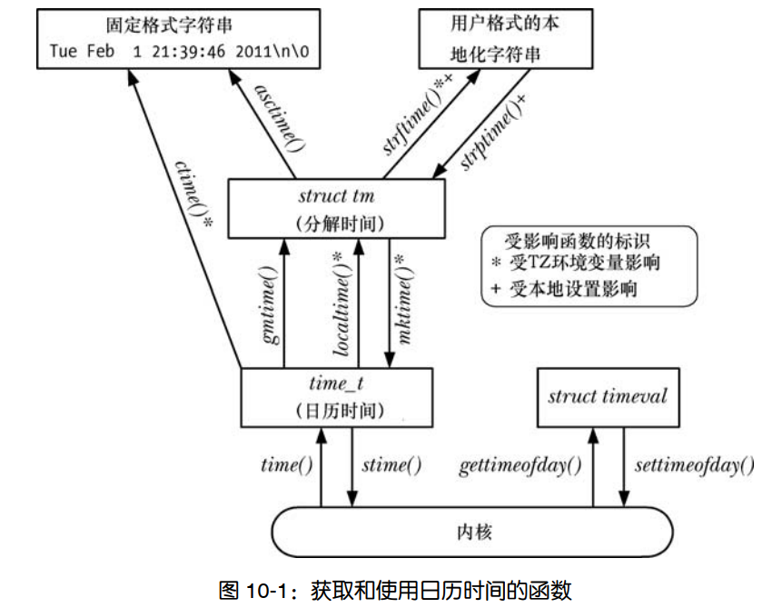
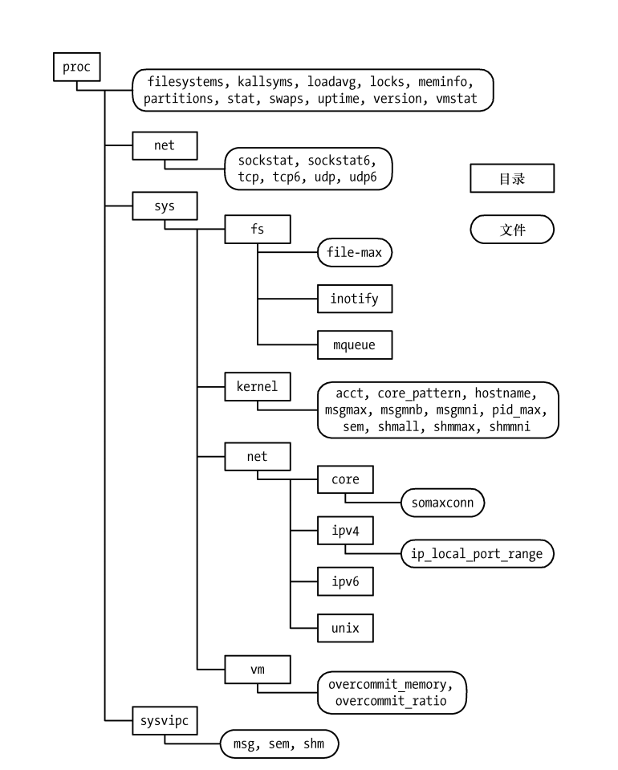
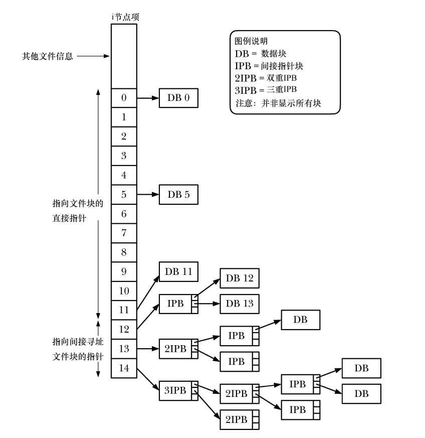
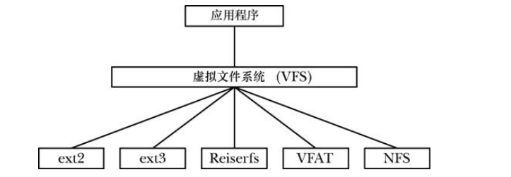
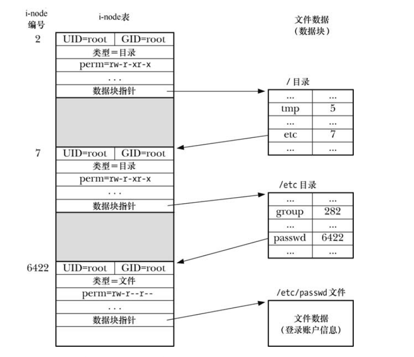
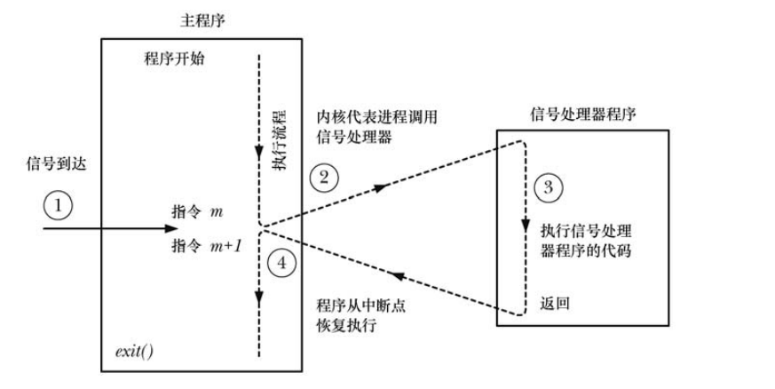

# Linux/UNIX 系统编程手册 上

# 一、历史和标准  

## 1. Unix

1969 ~ 1979 年，UNIX 经历了前六版  

1973 年，UNIX 用 C 语言对其进行了重写  

1979 年，UNIX 第七版发布，从该版本起，UNIX 分裂成 BSD 和 System V  

1983 年，加州大学伯克利分校计算机系统研究组发布 4.2 BSD，该版本包含了完整的 TCP/IP 实现，4.2 BSD 及其前身 4.1 BSD 在世界上多所大学开始广为流传。以这两者为基础，还形成了 SunOS 操作系统。其他重要的 BSD 版本还有发布于 1986 年的 4.3BSD，以及发布于 1993 年的最终版本 4.4BSD  

与此同时，1981 年 System III  发布，System III 由 AT&T 所属的 (UNIX Support Group， USG) 研发，1983 年， System V 的首个发布版发布，1989 年，USG 推出了 System V Release 4(SVR4)，此时的 System V 纳入了 BSD 的诸多特性  

除此之外，其他发布版有 SUN 的 SunOS 和 Solaris、Digital 公司的 Ultrix 和 OSF/1(现称为 HP Tru64 UNIX)、IBM 公司的 AIX、HP 公司的 HP-UX、NeXT 公司的 NeXTStep、在 Apple Macintosh 机上的 A/UX 以及 Microsoft 和 SCO 公司联合为 Intel x86-32 架构开发的 XENIX  


## 2. Linux

1991 年， Linus Torvalds  为自己的 Intel 80386 PC 开发操作系统，1991 年 Linux 0.01 版发布，1994 年 3 月，发布了 Linux 1.0 版本 ，Linux 2.0 发布于 1996 年 6 月，  Linux 2.4 发布于 2001  年 1 月，Linux 2.6 发布于 2003 年 12 月  


**内核版本号**  

在 Linux1.0 版本之后，内核版本编号方案为 x.y.z，x 表示主版本号， y 为附属于主版本号的次版本号， z 是从属于次版本号的修订版本号  

采用这一发布模式，内核的两个版本会一直处于开发之中，一个是用于生产系统的 stable 分支，其次版本号为偶数；另一个是经常变动的 development 分支，其次版本号为奇数（当前稳定版次版本号+1），比如 开发分支 2.3.z 的 stable 分支版本为 2.4  

随着 2.6 内核的发布，内核开发模式再次发生改变，稳定内核版本之间发布间隔过长  

之后改变为：

- 不再有稳定内核和开发内核的概念，每个 2.6.z 发布版都可以包含新特性
- 有时候需要为某个稳定的 2.6.z 发布版打补丁，可以直接发布 2.6.z.r 版本，r 作为内核版本的次修订版序号


## 3. POSIX

可移植操作系统 Portable Operating System Interface  

POSIX.1 于 1989 年成为 IEEE 标准，并在稍作修订后于 1990 年被正式采纳为 ISO 标准（ISO/
IEC 9945-1:1990）  

POSIX.1 基于 UNIX 系统调用和 C 语言库函数，但无需与任何特殊实现相关。这意味着任
何操作系统都可以实现该接口，而不一定要是 UNIX 操作系统  

POSIX.2（ 1992， ISO/IEC 9945-2:1993）这一与 POSIX.1 相关的标准，对 shell 和包括 C
编译器命令行接口在内的各种 UNIX 工具进行了标准化  

POSIX 1003.1-2001也将该标准称为 Single Unix Specification 版本 3，本书在后续内容中将称其为 SUSv3，包括了：基本定义 、系统接口、Shell 和实用工具、基本原理  

SUSv4 和 POSIX.1-2008，这一修订版本也称为 SUSv4，相比 SUSv3 修改不大  


# 二、基本概念

## 1. 内核

内核的主要任务：

- 进程调度：Linux 属于抢占式多任务操作系统。”多任务”意指多个进程（即运行中的程序）可同时驻留于内存，且每个进程都能获得对 CPU 的使用权。“抢占”则是指一组规则。这组规则控制着哪些进程获得对 CPU 的使用，以及每个进程能使用多长时间，这两者都由内核进程调度程序（而非进程本身）决定  
- 内存管理：内核必须以公平、高效地方式在进程间共享这一资源  
- 提供了文件系统：内核在磁盘之上提供有文件系统，允许对文件执行创建、获取、更新以及删除等操作  
- 创建和终止进程：内核可将新程序载入内存，为其提供运行所需的资源。一旦进程执行完毕，内核还要确保释放其占用资源  
- 对设备的访问：外部输入输出设备的交互
- 网络协议栈
- 提供系统调用应用编程接口(API)：进程可利用系统调用请求内核执行各种任务


## 2. 文件 I/O 模型

UNIX 系统 I/O 模型最为显著的特性之一是其 I/O 通用性概念，同一套系统调用所执行的 I/O 操作，可以对所有的文件类型使用，包括设备文件等等  

就本质而言，内核只提供了一种文件类型：字节流序列  

**文件描述符 fd**  

I/O 系统调用使用文件描述符(小数值的非负整数)来指代打开的文件  

通常由 shell 启动的进程会继承 3 个已经打开的文件描述符：描述符 0 为标准输入(stdin)；描述符 1 为标准输出(stdout)；描述符 2 为标准错误(stderr)  


## 3. 进程

进程是正在执行的程序实例  

执行程序时，内核会将程序代码载入虚拟内存，为程序变量分配空间，记录与进程有关的各种信
息（比如，进程 ID、用户 ID、组 ID 以及终止状态等）  


**进程的内存布局**：

- 代码段：程序的指令
- 数据段：程序使用的静态或全局变量
- 堆：程序可以从该区域动态分配内存
- 栈：随函数调用、返回而增减的一片内存，用于为局部变量和函数调用链接信息分配存储空间 


**进程的用户和组标识符**：  

每个进程都有一组与之相关的 UID 和 GID  

- 真实 UID 和 GID：用来标识进程所属的用户和组，新进程从其父进程处继承这些 ID  
- 有效 UID 和 GID：进程在访问受保护资源时，会使用这两个 ID (结合下述的补充 GID)来确定访问权限
- 补充 GID：用来标识进程所属的额外组。新进程从其父进程处继承补充组 ID  


**init 进程**  

man init(8)  

系统引导时，内核会创建一个名为 init 的特殊进程，其他进程都由或间接由 init 派生，init 进程 PID 总为 1，且总是以超级用户权限运行，谁都不能杀死 init 进程，只有关闭系统才能终止该进程，init 的主要任务是创建并监控系统运行所需的一系列进程  


**资源限制**  

每个进程都会消耗诸如打开文件、内存以及 CPU 时间之类的资源。使用系统调用 setrlimit()，进程可为自己消耗的各类资源设定一个上限。  

此类资源限制的每一项均有两个相关值：软限制（soft limit）限制了进程可以消耗的资源总量，硬限制（ hard limit）软限制的调整上限。非特权进程在针对特定资源调整软限制值时，可将其设置为 0 到相应硬限制值之间的任意值，但硬限制值则只能调低，不能调高  

由 fork()创建的新进程，会继承其父进程对资源限制的设置  


## 4. 进程间通信及同步

Linux 进程间通信(IPC)机制：

- 信号（ signal），用来表示事件的发生  
- pipe 和 FIFO，用于在进程间传递数据
- socket，供同一台主机或是联网的不同主机上所运行的进程之间传递数据  
- 文件锁：为防止其他进程读取或更新文件内容，允许某进程对文件的部分区域加以锁定  
- 消息队列：用于在进程间交换消息（数据包）  
- 信号量：用来同步进程动作  
- 共享内存：允许两个及两个以上进程共享一块内存  


## 5. 信号

虽然信号是 IPC 的方法之一，但是信号在其他方面的广泛应用则更为普遍  

信号也称为软件中断，进程收到信号，就意味着某一事件或异常情况的发生  

采用不同的整数来标识各种信号类型，并以 SIGXXX 形式的符号名加以定义  

发生某些情况时，比如用户键入 Ctrl C、进程的子进程之一终止、定时器到期、进程访问无效内存等等，内核会向进程发送信号  

进程收到信号，会根据信号采取如下的动作之一：

- 忽略信号
- 被信号终止
- 先挂起，之后再被专用信号唤醒


# 三、系统编程概念

## 1. 系统调用

man syscalls(2)

系统调用是受控的内核入口，借助于这一机制，进程可以请求内核以自己的名义去执行某些动作  

以应用程序编程接口（API）的形式，内核提供有一系列服务供程序访问  

关于系统调用：  

- 系统调用将处理器从用户态切换到核心态，以便 CPU 访问受到保护的内核内存  
- 系统调用的组成是固定的，每个系统调用都由一个唯一的数字来标识  
- 每个系统调用可以有一套参数，对用户空间（亦即进程的虚拟地址空间）与内核空
  间之间（相互）传递的信息加以规范  


以 x86 平台为例来分析系统调用的步骤  

1. 应用程序通过 C 语言库函数中的 wrapper 函数，来发起系统调用  
2. 参数传入到 wrapper 函数，wrapper 函数将这些参数置入特定的寄存器中，来实现系统调用的参数传递  
3. 将系统调用编号赋值到 eax 寄存器中
4. wrapper 函数执行 `int 0x80`  中断指令，处理器从用户态切换到内核态，并执行中断向量所指向的代码(较新的 x86 硬件平台实现了 sysenter 指令，2.6 内核及 glibc 2.3.2 之后的版本支持 sysenter 指令)  
5. 内核调用 `system_call` 函数，来处理中断  
   - 在内核栈中保存寄存器值
   - 校验系统调用编号的有效性
   - 以系统调用编号对存放所有调用服务例程的列表（内核变量 sys_call_table）进行索引，发现并调用相应的系统调用服务例程 。若系统调用服务例程带有参数，那么将首先检查参数的有效性。  随后，该服务例程会执行必要的任务。该服务例程会将结果状态返回给 system_call()例程  
   - 从内核栈中恢复各寄存器值，并将系统调用返回值置于栈中  
   - 返回至  wrapper 函数，同时将处理器切换回用户态  
6. 若系统调用服务例程的返回值表明调用有误， wrapper 函数会使用该值来设置全局变量 errno  
7. 最后，从 wrapper 返回到用户代码


# 四、文件 I/O：通用的 I/O 模型

## 1. 概述

UNIX 的一个核心思想是一切皆文件：所有执行 I/O 操作的系统调用都以文件描述符，一个非负整数（通常是小整数），来指代打开的文件，文件描述符用以表示所有类型的已打开文件，包括 pipe、FIFO、 socket、终端、设备和普通文件。针对每个进程，文件描述符都自成一套  


## 2. open

```c
#include <sys/stat.h>
#include <fcntl.h>

int open(const char *pathname, int flags, ... /* mode_t mode */);

// return the new file descriptor(a nonnegative integer)
// or -1 if an error occurred (in which case, errno is set appropriately)
```

|     flags     |                             用途                             |
| :-----------: | :----------------------------------------------------------: |
|  `O_RDONLY`   |                         只读方式打开                         |
|  `O_WRONLY`   |                         只写方式打开                         |
|   `O_RDWR`    |                         读写方式打开                         |
|  `O_CLOEXEC`  |     设置 close-on-exec 标志（自 Linux 2.6.23 版本开始）      |
|   `O_CREAT`   |                     若文件不存在则创建之                     |
|  `O_DIRECT`   |                      无缓冲的输入/输出                       |
| `O_DIRECTORY` |               如果 `pathname` 不是目录，则失败               |
|   `O_EXCL`    | 确保调用创建文件，如果和 `O_CREAT` 一起使用，如果目录存在，`open` 失败且 `errno` 为 `EEXIST` |
| `O_LARGEFILE` |              在 32 位系统中使用此标志打开大文件              |
|  `O_NOATIME`  |          调用 `read()` 时， 不修改文件最近访问时间           |
|  `O_NOCTTY`   |      不要让 `pathname`（所指向的终端设备）成为控制终端       |
| `O_NOFOLLOW`  |                     对符号链接不予解引用                     |
|   `O_TRUNC`   |                  截断已有文件，使其长度为零                  |
|  `O_APPEND`   |                     总在文件尾部追加数据                     |
|   `O_ASYNC`   |        当 I/O 操作可行时，产生信号（ signal）通知进程        |
|   `O_DSYNC`   |    提供同步的 I/O 数据完整性（自 Linux 2.6.33 版本开始）     |
| `O_NONBLOCK`  |                       以非阻塞方式打开                       |
|   `O_SYNC`    |                      以同步方式写入文件                      |


## 3. creat

```c
#include <fcntl.h>

int creat(const char *pathname, mode_t mode);

// return the new file descriptor(a nonnegative integer)
// or -1 if an error occurred (in which case, errno is set appropriately)
```


## 4. read

```c
#include <unistd.h>

ssize_t read(int fd, void *buffer, size_t count);

// On success, the number of bytes read is returned (zero 
// indicates end of file)
// On error, -1 is returned, and errno is set appropriately
```


## 5. write

```c
#include <unistd.h>

ssize_t write(int fd, const void *buffer, size_t count);

// On success, the number of bytes written is returned
// On error, -1 is returned, and 
// errno is set to indicate the cause of the error
```

`read` 和 `write` 的返回值，即读取或写入的字节数可能小于 `count` 值


## 6. close

`close` 系统调用关闭一个打开的文件描述符，并将其释放回调用进程，供该进程继续使用  

当一进程终止时，将自动关闭其已打开的所有文件描述符  

```c
#include <unistd.h>

int close(int fd);

// returns zero on success
// On error, -1 is returned, and errno is set appropriately.
```


## 7. lseek

对于每个打开的文件，系统内核会记录其文件偏移量，有时也将文件偏移量称为读写偏移量或指针。文件偏移量是指执行下一个 read()或 write()操作的文件起始位置，会以相对于文件头部起始点的文件当前位置来表示。文件第一个字节的偏移量为 0  

```c
#include <unistd.h>

off_t lseek(int fd, off_t offset, int whence);

// returns the resulting offset location as measured in 
// bytes from the beginning of the file
// On error, the value (off_t) -1 is returned and 
// errno is set to indicate the error.
```

`lseek` 调用依照 `offset` 和 `whence` 参数值调整该文件的偏移量  

|  `whence`  |                             含义                             |
| :--------: | :----------------------------------------------------------: |
| `SEEK_SET` |   将文件偏移量设置为从文件头部起始点开始的 `offset` 个字节   |
| `SEEK_CUR` |              将当前文件偏移量 + `offset` 个字节              |
| `SEEK_END` | 将文件偏移量设置为起始于文件尾部的 `offset `个字节，文件尾之后未写数据的字节 |


**文件空洞**  

如果文件的偏移量已经跨越了文件结尾，然后执行I/O 操作，如果是 `read` 将会返回 0；但是 `write` 函数可以在文件结尾的任意位置写入数据  

从文件结尾后到新写入数据间的这段空间被称为文件空洞  

文件空洞不占用任何磁盘空间。直到后续某个时点，在文件空洞中写入了数据，文件系统才会为之分配磁盘块。核心转储文件（ core dump）是包含空洞文件的常见例子  


# 五、深入探究文件 I/O

## 1. 原子操作和竞争条件

所有系统调用都是以原子操作方式执行的。内核保证了某系统调用中的所有步骤会作为独立操作而一次性加以执行，其间不会为其他进程或线程所中断  

竞争状态：操作共享资源的两个进程（或线程），其结果取决于一个无法预期的顺序，即这些进程或线程获得 CPU 使用权的先后相对顺序  

**例一**：  

```c
// open 1: check if file exists
int fd = open(argv[1], O_WRONLY);
if (fd != -1) {
    printf(...);
    close(fd);
} else {
    if (errno != ENOENT) {
        errExit("open");
    } else {
        // open 2: create file
        fd = open(argv[1], O_WRONLY | O_CREAT, S_IRUSR | S_IWUSR);
        if (fd == -1) {
            errExit("open");
        }
        
        printf(...);
    }
}
```

当第一次调用 `open` 时，希望打开的文件还不存在，而当第二次调用 `open` 时，其他进程已经创建了该文件  

在这一场景下，进程 A 将得出错误的结论：目标文件是由自己创建的。因为无论目标文件存在与否，进程 A 对 `open` 的第二次调用都会成功  

由于第一个进程在检查文件是否存在和创建文件之间发生了中断，造成两个进程都声称自己是文件的创建者。结合 `O_CREAT` 和 `O_EXCL` 标志来一次性地调用 `open` 可以防止这种情况，因为这确保了检查文件和创建文件的步骤属于一个单一的原子（即不可中断的）操作  


**例二**：  

多个进程同时向同一个文件（例如，全局日志文件）尾部添加数据  

```c
if (lseek(fd, 0, SEEK_END) == -1) {
	errExit("lseek");
}
// ...
if (write(fd, buf, len) != len) {
    fatal(" write failed")
}
```

和上一个例子一样，第一个进程执行到 `lseek` 和 `write` 之间，转而执行第二个进程的相同代码，这两个进程会在写入数据前，将文件偏移量设置为相同的位置，而当第一个进程再次获得调度时，会覆盖第二个进程已写入的数据  

此时再次出现了竞争状态，因为执行的结果依赖于内核对两个进程的调度顺序  

要规避这一问题，需要将文件偏移量的移动与数据写操作纳入同一原子操作。在打开文件时加入 O_APPEND 标志就可以保证这一点  


## 2. fcntl

`fcntl` 根据参数 `cmd` 执行一些控制操作  

```c
#include <unistd.h>
#include <fcntl.h>

int fcntl(int fd, int cmd, ... /* arg */ );
```


接下来会对各种操作进行讨论  


## 3. 打开文件状态

`cmd` 为 `F_GETFL` 获取文件的访问模式和文件状态，`arg` 参数被忽略  

```c
int flags = fcntl(fd, F_GETFL);
if (flags == -1) {
    errExit("fcntl");
}

// test O_SYNC file status
if (flags & O_SYNC) {
    printf("writes are synchronized\n");
}

int accessMode = flags & O_ACCMODE;
if (accessMode == O_WRONLY || accessMode == O_RDWR) {
    printf("file is writable\n");
}
```

使用 `F_SETFL` 命令来修改打开文件的某些状态标志  

允许修改的有 `O_APPEND, O_NONBLOCK, O_NOATIME, O_ASYNC, O_DIRECT`，系统会忽略其他标志的修改(有些 UNIX 实现允许修改其他标志，具体查文档)    

```c
int flags = fcntl(fd, F_GETFL);
if (flags == -1) {
    errExit("fcntl");
}
flags |= O_APPEND;
if (fcntl(fd, F_SETFL, flags) == -1) {
    errExit("fcntl");
}
```


## 4. 文件描述符和打开文件的关系

多个文件描述符可以指向同一打开文件  

内核维护的3个数据结构：  

- 进程级的文件描述符表 
- 系统级的打开文件表  
- 文件系统的 i-node 表  


每个进程，内核为其维护打开文件的描述符（ open file descriptor）表。该表的每一条目都记录了单个文件描述符的相关信息  

- 控制文件描述符操作的一组标志(目前只有 close-on-exec 标志)
- 对打开文件句柄的引用


内核对所有打开的文件维护有一个系统级的描述表格(open file description table)，并将表中各条目称为打开文件句柄（open file handle）。一个打开文件句柄存储了与一个打开文件相关的全部信息：  

- 当前文件偏移量  
- 打开文件时所使用的状态标志(`open` 的 `flags` 参数)  
- 文件访问模式(`O_RDONLY, O_WRONLY, O_RDWR`)  
- 与信号驱动 I/O 相关的设置  
- 对该文件 i-node 对象的引用  


每个文件系统都会为驻留其上的所有文件建立一个 i-node 表，每个文件的 i-node 信息    

- 文件类型和访问权限  
- 指向该文件所持有的锁的列表的指针  
- 文件的各种属性，包括文件大小以及与不同类型操作相关的时间戳  


上述可以推出：

- 两个不同的文件描述符，若指向同一打开文件句柄(不是打开同一文件，而是指向同一打开文件句柄，比如使用 dup 复制)，将共享同一文件偏移量。因此，如果通过其中一个文件描述符来修改文件偏移量，那么从另一文件描述符中也会观察到这一变化。无论这两个文件描述符分属于不同进程，还是同属于一个进程，情况都是如此  
- 要获取和修改打开的文件标志（例如，`O_APPEND`、 `O_NONBLOCK` 和 `O_ASYNC`），可执行 `fcntl` 的 `F_GETFL` 和 `F_SETFL` 操作，其对作用域的约束与上一条类似  
- 文件描述符标志（亦即， close-on-exec 标志）为进程和文件描述符所私有  


## 5. dup

`dup` 复制一个打开的文件描述符  `oldfd`，并返回一个新描述符，二者都指向同一打开的文件句柄  

系统会保证新描述符一定是编号值最低的未用文件描述符  

`dup2` 为 `oldfd` 参数所指定的文件描述符创建副本，其编号由 `newfd` 参数指定，如果由 `newfd` 参数所指定编号的文件描述符之前已经打开，那么 `dup2` 会首先将其关闭，不过 `dup2` 会忽略关闭 `newfd` 出现的任何错误  

`dup3` (始于 Linux 2.6.27)系统调用完成的工作与 `dup2` 相同，只是新增了一个附加参数 `flags`，这是一个可以修改系统调用行为的位掩码，目前只支持 `O_CLOEXEC`  

```c
#include <unistd.h>

int dup(int oldfd);
int dup2(int oldfd, int newfd);

#define _GNU_SOURCE             /* See feature_test_macros(7) */
#include <fcntl.h>              /* Obtain O_* constant definitions */
#include <unistd.h>

int dup3(int oldfd, int newfd, int flags);

// On success, return the new file descriptor
// On error, -1 is returned, and errno is set appropriately
```

`dup` 系列调用可以实现 shell 中 I/O 重定向  

如果 `oldfd` 并非有效的文件描述符，那么 `dup2` 调用将失败并返回错误 `EBADF`，且不关闭 `newfd`。如果 `oldfd` 有效，且与 `newfd` 值相等，那么 `dup2` 将什么也不做，不关闭 `newfd`，并将其作为调用结果返回  


`fcntl` 的 `F_DUPFD` 操作也可以复制文件描述符，且更具有灵活性  

```c
newfd = fcntl(oldfd, F_DUPFD, startfd);
```

该调用为 `oldfd` 创建一个副本，且将使用大于等于 `startfd` 的最小未用值作为描述符编号。该调用还能保证新描述符（`newfd`）编号落在特定的区间范围内。总是能将 `dup` 和 `dup2` 调用改写为对 `close` 和 `fcntl` 的调用，虽然前者更为简洁，还有 `dup` 和 `fcntl` 返回值存在差异  

新文件描述符有其自己的一套文件描述符标志，且其 close-on-exec 标志（`FD_CLOEXEC`）总是处于关闭状态  


## 6. pread/pwrite

`pread` 和 `pwrite` 完成与 `read` 和 `write` 相类似的工作，只是前两者会在 `offset `参数所指定的位置进行文件 I/O 操作，而非始于文件的当前偏移量处，且它们不会改变文件的当前偏移量  

```c
#include <unistd.h>

ssize_t pread(int fd, void *buf, size_t count, off_t offset);
ssize_t pwrite(int fd, const void *buf, size_t count, off_t offset);

// On success, pread() returns the number of bytes read 
// (a return of zero indicates end of file) and 
// pwrite() returns the number of bytes written
// On error, -1 is returned and errno is set to indicate 
// the cause of the error.
```

对 `pread` 和 `pwrite` 而言，必须允许对 `fd` 指向 `lseek` 调用  

多线程应用为这些系统调用提供了用武之地  


## 7. readv/writev

`readv` 和 `writev` 系统调用分别实现了分散输入和集中输出的功能  

```c
#include <sys/uio.h>

ssize_t readv(int fd, const struct iovec *iov, int iovcnt);
ssize_t preadv(int fd, const struct iovec *iov, int iovcnt,
               off_t offset);
ssize_t preadv2(int fd, const struct iovec *iov, int iovcnt,
                off_t offset, int flags);
// On success, return the number of bytes read
// On error, -1 is returned, and errno is set appropriately

ssize_t writev(int fd, const struct iovec *iov, int iovcnt);
ssize_t pwritev(int fd, const struct iovec *iov, int iovcnt,
                off_t offset);
ssize_t pwritev2(int fd, const struct iovec *iov, int iovcnt,
                 off_t offset, int flags);

// On success, return the number of bytes written
// On error, -1 is returned, and errno is set appropriately
```

这些系统调用并非只对单个缓冲区进行读写操作，而是一次即可传输多个缓冲区的数据  

数组 `iov` 定义了一组用来传输数据的缓冲区。整型数 `iovcnt` 则指定了 `iov` 的成员个数。 `iov` 中的每个成员都是如下形式的数据结构  

```c
struct iovec {
    void  *iov_base;
    size_t iov_len;
};
```


SUSv3 标准允许系统实现对 `iov` 中的成员个数加以限制(不少于 16)  

在 `limits.h` 文件中，用 `IOV_MAX` 来确定最大个数  

Linux 把 `IOV_MAX` 设置为 1024  

glibc 对 `readv` 和 `writev` 的封装函数还悄悄做了些额外工作。若系统调用因 `iovcnt` 参数值过大而失败，wrapper 函数将临时分配一块缓冲区，其大小足以容纳 `iov` 参数所有成员所描述的数据缓冲区，随后再执行 `read` 或 `write` 调用  

原子性是 `readv` 的重要属性  


## 8. 截断文件

`truncate` 和 `ftruncate` 系统调用将文件大小设置为 `length` 参数指定的值  

```c
#include <unistd.h>
#include <sys/types.h>

int truncate(const char *path, off_t length);
int ftruncate(int fd, off_t length);
```

若文件当前长度大于参数 length，调用将丢弃超出部分，若小于参数 length，调用将在文
件尾部添加一系列空字节或是一个文件空洞  

两个系统调用之间的差别在于如何指定操作文件。`truncate` 以路径名字符串来指定文件，并要求可访问该文件，且对文件拥有写权限。若文件名为符号链接，那么调用将对其进行解引用。而调用`ftruncate` 之前，需以可写方式打开操作文件，获取其文件描述符以指代该文件，该系统调用不会修改文件偏移量  

若 `ftruncate` 的 `length` 参数值超出文件的当前大小， SUSv3 允许两种行为：要么扩展该文件（如 Linux），要么返回错误。而符合 XSI 标准的系统则必须采取前一种行为。相同的情况，对于 `truncate` 系统调用， SUSv3 则要求总是能扩展文件  


## 9. 非阻塞 I/O

非阻塞 I/O 在打开文件时指定 O_NONBLOCK 标志  

- 若 `open` 调用未能立即打开文件，则返回错误，而非陷入阻塞。有一种情况属于例外，调用 `open`操作 FIFO 可能会陷入阻塞  
- 调用 `open` 成功后，后续的 I/O 操作也是非阻塞的。若 I/O 系统调用未能立即完成，则可能会只传输部分数据，或者系统调用失败，并返回 EAGAIN 或 EWOULDBLOCK 错误。具体返回何种错误将依赖于系统调用  

pipe、FIFO、 套接字、 设备（比如终端、 伪终端） 都支持非阻塞模式  

由于内核缓冲区保证了普通文件 I/O 不会陷入阻塞，故而打开普通文件时一般会忽略 `O_NONBLOCK` 标志。 然而， 当使用强制文件锁时， `O_NONBLOCK` 标志对普通文件也是起作用的  


## 10. 大文件 I/O

通常将存放文件偏移量的数据类型 off_t 实现为一个有符号的长整型(`long`)  

在 32 位体系架构中（比如 x86-32），这将文件大小置于 $2^{31}-1$ 个字节（即 2GB）的限制之下  

32 位 UNIX 实现有处理超过 2GB 大小文件的需求  

始于内核版本 2.4， 32 位 Linux 系统开始提供对 LFS 的支持（glibc 版本必须为 2.2 或更高），相应的文件系统也必须支持大文件操作    

应用程序可使用如下两种方式之一以获得 LFS 功能：  

- 使用支持大文件操作的备选 API  
- 在编译应用程序时，将宏 `_FILE_OFFSET_BITS` 的值定义为 64  

不过在 64 位架构，LFS 增强特性所要突破的限制对其而言并不是问题  


LFS API：

```c
fd = open64(name, O_CREAT | O_RDWR, mode);
off64_t;
struct stat64;
```


## 11. /dev/fd

对每个进程，内核都提供了一个特殊的虚拟目录 `/dev/fd`  

该目录中包含 `/dev/fd/n` 形式的文件名，其中 `n` 是与进程中的打开文件描述符相对应的编号  

SUSv3 对 `/dev/fd` 特性未做规定，但有些其他的 UNIX 实现也提供了这一特性  

打开 `/dev/fd` 目录中文件等同于复制相应的文件描述符，下列两行代码是等价的：  

```c
fd = open("/dev/fd/1", O_WRONLY);
fd = dup(1);
```

在为 `open` 调用设置 `flags` 参数时，需要注意将其设置为与原描述符相同的访问模式  

程序中很少会使用/dev/fd 目录中的文件。其主要用途在 shell 中  


## 12. 临时文件

有些程序需要创建一些临时文件， 仅供其在运行期间使用， 程序终止后即行删除  

GNU C 语言函数库为此而提供了一系列库函数  

介绍其中的两个函数： `mkstemp` 和 `tmpfile`  


基于调用者提供的模板， `mkstemp` 函数生成一个唯一文件名并打开该文件，返回一个可用于 I/O 调用的文件描述符  

```c
#include <stdlib.h>

int mkstemp(char *template);

// On success, return the file descriptor of the temporary file
// On error, -1 is returned, and errno is set appropriately
```

模板参数采用路径名形式，其中最后 6 个字符必须为 `XXXXXX`。这 6 个字符将被替换，以保证文件名的唯一性， 且修改后的字符串将通过 `template` 参数传回。 因为会对传入的 `template` 参数进行修改，所以必须将其指定为字符数组，而非字符串常量  

文件拥有者对 `mkstemp` 函数建立的文件拥有读写权限（其他用户则没有任何操作权限），且打开文件时使用了 `O_EXCL` 标志，以保证调用者以独占方式访问文件  

通常，打开临时文件不久，程序就会使用 unlink 系统调用将其删除，示例程序  

```c
char template[] = "/tmp/someStringXXXXXX";
int fd = mkstemp(template);
if (fd == -1) {
    errExit("mkstemp");
}

printf("tmp file: %s\n", template);
unlink(template);
if (close(fd) == -1) {
    errExit("close");
}
```

`tmpnam`、 `tempnam` 和 `mktemp` 函数也能生成唯一的文件名。然而，由于这会导致应用程序出现安全漏洞，应当避免使用这些函数  


```c
#include <stdio.h>

FILE *tmpfile(void);

// returns a stream descriptor, or NULL if a unique filename 
// cannot be generated or the unique file cannot be opened
// In the latter case, errno is set to indicate the error
```


# 六、进程

进程(process)是一个可执行程序(program)的实例  

程序是包含了一系列信息的文件， 这些信息描述了如何在运行时创建一个进程， 所包括的内容  

- 二进制格式标识，UNIX 可执行文件曾有两种广泛使用的格式，分别为最初的 a.out（汇编程序输出）和更加复杂的 COFF（通用对象文件格式）。现在，大多数 UNIX 实现（包括 Linux）采用可执行连接格式(ELF)
- 机器语言指令  
- 程序入口地址  
- 数据：程序文件包含的变量初始值和程序使用的字面常量（literal constant）值  
- 符号表及重定位表：描述程序中函数和变量的位置及名称。这些表格有多种用途，其中包括调试和运行时的符号解析（动态链接）  
- 共享库和动态链接信息：程序文件所包含的一些字段，列出了程序运行时需要使用的共享库，以及加载共享库的动态链接器的路径名  
- 其他信息：程序文件还包含许多其他信息，用以描述如何创建进程  


进程是由内核定义的抽象的实体，并为该实体分配用以执行程序的各项系统资源  

从内核角度看，进程由用户内存空间(user-space memory)和一系列内核数据结构组成，其中用户内存空间包含了程序代码及代码所使用的变量， 而内核数据结构则用于维护进程状态信息  
记录在内核数据结构中的信息包括许多与进程相关的标识号(ID)、虚拟内存表、打开文件的描述符表、信号传递及处理的有关信息、进程资源使用及限制、当前工作目录和大量的其他信息   


## 1. 进程 ID

每个进程都有一个进程 ID(PID)，PID 是一个正数，用以唯一标识系统中的某个进程。对各种系统调用而言，进程号有时可以作为传入参数，有时可以作为返回值，比如 `kill` 允许调用者向拥有特定进程号的进程发送一个信号    

```c
#include <unistd.h>
 #include <sys/types.h>

// returns the process ID (PID) of the calling process
pid_t getpid(void);

// returns the process ID of the parent of the calling process
pid_t getppid(void);
```


Linux 内核限制进程号需小于等于 32767。新进程创建时，内核会按顺序将下一个可用的进程号分配给其使用。每当进程号达到 32767 的限制时，内核将重置进程号计数器，以便从小整数开始分配  

旦进程号达到 32767，会将进程号计数器重置为 300，而不是 1。之所以如此，是因为低数值的进程号为系统进程和守护进程所长期占用，在此范围内搜索尚未使用的进程号只会是浪费时间  


每个进程的父进程号属性反映了系统上所有进程间的树状关系。每个进程的父进程又有自己的父进程，以此类推，回溯到 1 号进程(init 进程)，即所有进程的始祖  

`pstree` 命令可以查看到这一“家族树”  


## 2. 进程内存布局

每个进程所分配的内存由很多部分组成，通常称之为段(segment，此段非内存硬件分段混淆，此处段主要是 UNIX 系统中进程虚拟内存的逻辑划分，有时候，此处的段也使用术语 section 来代替)    

- text: 文本段(只读)，也叫代码段，包含了进程运行的程序机器语言指令  
- data: 初始化数据段包含显式初始化的全局变量和静态变量  
- bbs: 未初始化数据段包含了未进行显式初始化的全局变量和静态变量  
- statck: 栈是一个动态增长和收缩的段。系统会为每个当前调用的函数分配一个栈帧。栈帧中存储了函数的局部变量（所谓自动变量）、实参和返回值  
- heap: 堆是可在运行时（为变量） 动态进行内存分配的一块区域  


`size` 命令可以显示二进制可执行文件的 text、data、bss 的段大小  

虽然 SUSv3 未作规定，但在大多数 UNIX 实现（包括 Linux）中 C 语言编程环境提供了 3 个全局符号（ symbol）： etext、 edata 和 end，可在程序内使用这些符号以获取相应程序文本段、初始化数据段和非初始化数据段结尾处下一字节的地址  

一个测试验证程序  

```c
#include <stdio.h>

int main() {
    extern char etext, edata, end;
    printf("etext = %p, edata = %p, end = %p\n", &etext, &edata, &end);
    
    return 0;
}

// example output: 
// etext = 0x7f6a82e006fd, edata = 0x7f6a83001010, end = 0x7f6a83001018
```


x64 的 Linux 类似，不过内存扩展到了更大的内存空间  

 

## 3. 虚拟内存管理

上述关于进程内存布局存在于虚拟内存中  

Linux，像多数现代内核一样，采用了虚拟内存管理技术。该技术利用了大多数程序的一个典型特征，即访问局部性（ locality of reference），以求高效使用 CPU 和 RAM（物理内存）资源。大多数程序都展现了两种类型的局部性  

- 空间局部性：程序倾向于访问在最近访问过的内存地址附近的内存（由于指令是顺序执行的，且有时会按顺序处理数据结构）  
- 时间局部性（ Temporal locality）：是指程序倾向于在不久的将来再次访问最近刚访问过的内存地址  

虚拟内存的规划之一是将每个程序使用的内存切割成小型的、固定大小的 page 单元。相应地，将 RAM 划分成一系列与虚存页尺寸相同的页帧。任一时刻，每个程序仅有部分页需要驻留在物理内存页帧中。这些页构成了所谓驻留集(resident set)。程序未使用的页拷贝保存在交换区(swap area)内—这是磁盘空间中的保留区域，作为计算机 RAM 的补充—仅在需要时才会载入物理内存。若进程欲访问的页面目前并未驻留在物理内存中，将会发生页面错误(page fault)，内核即刻挂起进程的执行，同时从磁盘中将该页面载入内存  


Linux 系统上，交换分区的使用和内核参数 `swappiness` 的值有关  

- 当 `swappiness == 0`，表示尽最大可能的使用物理内存以避免换入到 swap
- 当 `swappiness == 100` 表示最大限度使用 swap 分区，并且把内存上的数据及时的换出到 swap空间里面  

大多数 Linux 发行版默认值为 60，可以使用 `cat /proc/sys/vm/swappiness` 来查看  

当内存在使用率到 40%(100%-60%) 的时候，系统就会开始出现有交换分区的使用  


为了支持分页，内核为每个进程维护了一张页表(page table)，该页表描述了每页在进程虚拟地址空间（virtual address space)中的位置（可为进程所用的所有虚拟内存页面的集合）。页表中的每个条目要么指出一个虚拟页面在 RAM 中的所在位置，要么表明其当前驻留在磁盘上  


在进程虚拟地址空间中，并非所有的地址范围都需要页表条目。通常情况下，由于可能存在大段的虚拟地址空间并未投入使用，故而也无必要为其维护相应的页表条目。若进程试图访问的地址并无页表条目与之对应，那么进程将收到一个 `SIGSEGV` 信号  

由于内核能够为进程分配和释放页（和页表条目），所以进程的有效虚拟地址范围在其生命周期中可以发生变化，这可能会发生于如下场景：  

- 由于栈向下增长超出之前曾达到的位置  
- 当在堆中分配或释放内存时，通过调用 brk()、 sbrk()或 malloc 函数族来提升 program break 的位置  
- 当调用 `shmat` 连接 System V 共享内存区时， 或者当调用 `shmdt` 脱离共享内存区时  
- 当调用 `mmap` 创建内存映射时，或者当调用 `munmap` 解除内存映射时  


## 4. 栈和栈帧

函数的调用和返回使栈的增长和收缩呈线性。x86 体系架构之上的 Linux，栈驻留在内存的高端并向下增长（朝堆的方向，栈的实际增长方向是实现细节，存在向上增长的体系结构）。专用寄存器—栈指针(stack pointer)，用于跟踪当前栈顶。每次调用函数时，会在栈上新分配一帧，每当函数返回时，再从栈上将此帧移去  

会用用户栈(user stack)来表示此处所讨论的栈，以便与内核栈区分开来。内核栈是每个进程保留在内核内存中的内存区域，在执行系统调用的过程中供（内核）内部函数调用使用  

每个（用户）栈帧包括如下信息:  

- 函数实参和局部变量：由于这些变量都是在调用函数时自动创建的，因此在 C 语言中
  称其为自动变量  
- 调用的链接信息：每个函数都会用到一些 CPU 寄存器，比如程序计数器，其指向下一条将要执行的机器语言指令。 每当一函数调用另一函数时，会在被调用函数的栈帧中保存这些寄存器的副本，以便函数返回时能为函数调用者将寄存器恢复原状  


## 5. 环境变量列表

每一个进程都有与其相关的称之为环境变量列表(environment list)的字符串数组  

其中每个字符串都以 `name=value` 形式定义  

新进程在创建之时，会继承其父进程的环境副本  

可以通过设置环境变量来改变一些库函数的行为。正因如此，用户无需修改程序代码或者重新链接相关库，就能控制调用该函数的应用程序行为  


**在程序中访问环境变量**  

在 C/C++ 程序中，可以使用 `char **environ` 访问环境变量，`environ` 和 `argv` 类似，具体见 `man environ`  

```c
#include <stdio.h>

int main() {
    extern char **environ;
    for (int i = 0; environ[i] != NULL; ++i) {
        printf("#%d %s\n", i, environ[i]);
    }
    
    return 0;
}
```

也可以使用 `main` 函数的第三个参数来访问环境变量列表  

```c
int main(int argc, char *argv[], char *envp[]);
```

还可以通过 API 来从环境变量中检索单个值  

```c
#include <stdlib.h>

char *getenv(const char *name);

// returns a pointer to the value in the environment
// or NULL if there is no match
```

应用程序不应修改 `getenv` 函数返回的字符串， 这是由于(在大多数 UNIX实现中)该字符串实际上属于境的一部分。若需要改变一个环境变量的值，可以使用 `setenv` 函数或 `putenv` 函数  

允许 `getenv`函数的实现使用静态分配的缓冲区返回执行结果，后续对 `getenv`、`setenv`、 `putenv` 或者 unsetenv()的函数调用可以重写该缓冲区。虽然 glibc 库的 `getenv`函数实现并未这样使用静态缓冲区，但具备可移植性的程序如需保留 `getenv`调用返回的字符串，就应先将返回字符串复制到其他位置，之后方可对上述函数发起调用  


**修改环境变量**  

对进程来说，修改其环境很有用处。原因之一是这一修改对该进程后续创建的所有子进程均可见。 另一个可能的原因在于设定某一变量， 以求对于将要载入进程内存的新程序(execed)  

```c
#include <stdlib.h>

int putenv(char *string);

// returns zero on success, or nonzero if an error occurs
// In the event of an error, errno is set to indicate the cause
```

参数 `string` 是一指针，指向 `name=value` 形式的字符串，`putenv` 函数将设定 `environ` 变量中某一元素的指向与 `string` 参数的指向位置相同，而非 `string` 参数所指向字符串的复制副本    

如果随后修改 `string` 参数所指的内容，这将影响该进程的环境。出于这一原因， `string` 参数不应为自动变量  

glibc 库实现还提供了一个非标准扩展。 如果 string 参数内容不包含一个等号（ =），那么将从环境列表中移除以 string 参数命名的环境变量  

```c
#include <stdlib.h>

int setenv(const char *name, const char *value, int overwrite);

// return zero on success
// or -1 on error, with errno set to indicate the cause of the error
```

和 `putenv` 不同，`setenv` 会复制字符串到缓冲区  


```c
#include <stdlib.h>

int unsetenv(const char *name);
// On success, return 0 
// On error, return -1
```

`unsetenv` 函数从环境中移除由 `name` 参数标识的变量  

```c
#define _BSD_SOURCE
#include <stdlib.h>

int clearenv(void);
// environ = NULL;
// On success return 0
// On error return a nonzero
```

`clearenv` 清除整个环境变量  

使用 `setenv` 函数和 `clearenv` 函数可能会导致程序内存泄露。前面已然提及： `setenv` 函数所分配的一块内存缓冲区，随之会成为进程环境变量的一部分。而调用 `clearenv` 时则没有释放该缓冲区  


## 6. setjmp/longjmp

使用库函数 `setjmp` 和 `longjmp` 可执行非局部跳转（nonlocal goto）  

C 语言的 `goto` 语句存在一个限制，即不能从当前函数跳转到另一函数  

考虑错误处理中经常出现的如下场景：在一个深度嵌套的函数调用中发生了错误，需要放弃当前任务，从多层函数调用中返回，并在较高层级的函数中继续执行  

```c
#include <setjmp.h>

int setjmp(jmp_buf env);
// return 0 when called directly
// return nonzero value specified in val is returned when after longjmp

void longjmp(jmp_buf env, int val);
```

如果 `longjmp` 指定 `val` 参数值为 0，则 `longjmp` 调用实际会将其替换为 1  

这两个函数的入参 `env` 为成功实现跳转提供了黏合剂。 `setjmp` 函数把当前进程环境的各种信息保存到 `env` 参数中。调用 `longjmp` 时必须指定相同的 `env` 变量，以此来执行“伪”返回  

应该将 env 参数定义为全局变量，或者将 env 作为函数入参来传递  

调用 `setjmp` 时，`env` 除了存储当前进程的其他信息外，还保存了程序计数寄存器和栈指针寄存器的副本。这些信息能够使后续的 `longjmp` 调用完成两个关键步骤的操作  

- 将发起 `longjmp` 调用的函数与之前调用 `setjmp` 的函数之间的函数栈帧从栈上剥离。有时又将此过程称为 unwinding stack  
- 重置程序计数寄存器，使程序得以从初始的 setjmp()调用位置继续执行  


SUSv3 和 C99 规定，对 `setjmp` 的调用只能在如下语境中使用：  

- `if/while/for/switch` 的条件表达式中  
- 作为一元操作符 `!` 的操作对象  
- 作为比较操作 `==/!=/</>/<=/>=` 的一部分  
- 作为独立的函数调用，且没有嵌入到更大的表达式之中  


`longjmp` 调用不能跳转到一个已经返回的函数中  


示例代码：  

```c
#include <stdio.h>
#include <setjmp.h>
#include <stdnoreturn.h>
 
jmp_buf env;
 
noreturn void foo(int count) {
    printf("a(%d) called\n", count);
    longjmp(env, count+1);
}
 
int main(void) {
    volatile int count = 0; // setjmp 作用域内要修改的局部变量必须为 volatile
    if (setjmp(env) != 4) {
        foo(count++);
    }

    return 0;
}

// a(0) called
// a(1) called
// a(2) called
// a(3) called
```


**编译器优化问题**：  

如果启用编译器优化，局部变量可能会使用寄存器来而非内存来存储变量的值，其值在调用 `longjmp` 之后会丢失  


尽可能避免使用 `setjmp` 函数和 `longjmp` 函数  


# 七、内存分配

进程可以通过增加堆的大小来分配内存，所谓堆是一段长度可变的连续虚拟内存，始于进程的未初始化数据段末尾，随着内存的分配和释放而增减  
通常将堆的当前内存边界称为 program break  

## 1. brk 和 sbrk

改变堆的大小（分配和释放内存），其实就像命令内核改变 program break 位置一样简单  
最初，program break 正好位于未初始化数据段末尾之后，和 `&end`  位置相同  
在 program break 的位置抬升后，程序可以访问新分配区域内的任何内存地址，而此时物理内存页尚未分配。内核会在进程首次试图访问这些虚拟内存地址时自动分配新的物理内存页  

不会直接使用 `brk` 和 `sbrk`，只是有利于弄清内存分配的工作过程  

```c
#include <unistd.h>

int brk(void *addr); 
// On success, return 0
// On error, -1 is returned, and errno is set to ENOMEM

void *sbrk(intptr_t increment);
// On success, returns the previous program break
// On error, (void *) -1 is returned, and errno is set to ENOMEM.
```

`brk` 或 `sbrk` 会根据 `addr` 或 `increment` 改变 program break 的位置当参数有效、系统有足够的内存并且没有超过进程的最大内存限制  

当试图将 program break 设置为一个低于其初始值的位置时（低于 `&end`），有可能导致无法预知的行为  
program break 可以设定的精确上限取决于一系列因素，这包括进程中对数据段大小的资源限制(RLIMIT_DATA)，以及内存映射、共享内存段、共享库的位置  

调用 `sbrk(0)` 将返回 program break 的当前位置  


## 2. malloc/free

```c
#include <stdlib.h>

void *malloc(size_t size);

// If successful, return a pointer to allocated memory
// If there is an error, they return a NULL pointer and set errno to ENOMEM
```

`malloc` 返回内存块所采用的字节对齐方式，总是适宜于高效访问任何类型的 C 语言数据结构  
在大多数硬件架构上，这实际意味着 `malloc` 是基于 8 字节或 16 字节边界来分配内存  

```c
#include <stdlib.h>

void free(void *ptr);
```

`free` 函数释放 `ptr` 参数所指向的内存块，该参数应该是之前由 `malloc` 或其他内存分配函数返回的地址  
一般情况下，`free` 并不降低 program break 的位置，而是将这块内存填加到空闲内存列表中，供后续的 `malloc` 函数循环使用，因为：  

- 被释放的内存块通常会位于堆的中间，而非堆的顶部，因而降低 porgram break 是不可能的 
- 它最大限度地减少了程序必须执行的 `sbrk` 调用次数 
- 在大多数情况下，降低 program break 的位置不会对那些分配大量内存的程序有多少帮助，因为它们通常倾向于持有已分配内存或是反复释放和重新分配内存，而非释放所有内存后再持续运行一段时间  

如果传给 `free` 的是一个空指针，那么函数将什么都不做  

当进程终止时，其占用的所有内存都会返还给操作系统，对大多数程序来说，不调用 `free` 让操作系统自己回收内存也是可以接受的，但是最好在程序中显式释放已分配的内存  


## 3. malloc/free 实现

`malloc` 的实现很简单。它首先会扫描之前由 `free` 所释放的空闲内存块列表，以求找到尺寸大于或等于要求的一块空闲内存。(取决于具体实现，采用的扫描策略会有所不同。例如， first-fit 或 best-fito）。如果这一内存块的尺寸正好与要求相当，就把它直接返回给调用者。如 果是一块较大的内存，那么将对其进行分割，在将一块大小相当的内存返回给调用者的同时， 把较小的那块空闲内存块保留在空闲列表中  
如果在空闲内存列表中根本找不到足够大的空闲内存块，那么 `malloc` 会调用 `sbrk` 以分配更多的内存。为减少对 `sbrk` 的调用次数，`malloc` 并未只是严格按所需字节数来分配内存，而是以更大幅度(以虚拟内存页大小的数倍)来增加 program break，并将超出部分置于空闲内存列表  

需要注意的是：以下很多都是实现定义的，而非所有的 malloc/free 都是这样的实现细节  
当 `free` 将内存块置于空闲列表之上时，是如何知晓内存块大小的?当 `malloc` 分配内存块时，会额外分配几个字节来存放记录这块内存大小的整数值。该整数位于内存块的起始处，而实际返回给调用者的内存地址恰好位于这一长度记录字节之后  

```txt
 +---------+----------------------+
 |  Length | memory by allocated  |
 +---------+----------------------+
            |
   address returned by malloc
```

当将内存块置于空闲内存列表（双向链表，free block list）时，`free()` 会使用内存块本身的空间来存放链表指针，将自身添加到列表中  

pic!!!

应该遵守以下规则来避免一部分的内存错误：

- 分配一块内存后，应当小心谨慎，不要改变这块内存范围外的任何内容 
- 释放同一块已分配内存超过一次是错误的。当两次释放同一块内存时，更常见的后果是导致不可预知的行为 
- 若非经由 `malloc` 函数包中函数所返回的指针，绝不能在调用 `free()` 函数时使用
- 在编写需要长时间运行的程序，如果需要反复分配内存，那么应当确保释放所有已使用完毕的内存，如若不然，堆将稳步增长，直至抵达可用虚拟内存的上限，这种情况被称之为“内存泄漏” 


## 4. malloc 调试工具和库

glibc 提供的 malloc 调试工具：

- `mtrace()` 和 `muntrace()` 函数分别在程序中打开和关闭对内存分配调用进行跟踪的功能。这些函数要与环境变量 `MALLOC_TRACE` 搭配使用，该变量定义了写入跟踪信息的文件名。在被调用时，`mtrace()` 会检查是否定义了该文件，又是否可以打开文件并写入。如果一切正常，那么会在文件里跟踪和记录所有对 `malloc` 函数包中函数的调用。由于生成文件不易于理解，还提供有一个脚本(`mtrace`)用于分析文件，并生成易于理解的汇总报告。出于安全原因，设置了 SUID 和 SGID 的程序会忽略对 `mtrace()` 的调用
- `mcheck()` 和 `mprobe()` 函数允许程序对已分配内存块进行一致性检查。例如，当程序试图在已分配内存之外进行写操作时，它们将捕获这个错误。必须使用 `-lmcheck` 选项与 mcheck 库链接 
- `MALLOC_CHECK_` 环境变量提供了类似于 `mcheck()` 和 `mprobe()` 函数的功能。(两者之间的一个显著区别在于使用 `MALLOC_CHECK_` 无需对程序进行修改和重新编译)。出于安全原因，设置了 SUID 和 SGID 的程序将忽略 `MALLOC_CHECK_` 设置。可能设置的值有：
  - 0，忽略错误;
  - 1，在标准错误输出(stderr)中打印诊断错误;
  - 2，调用 abort()来终止程序。
- Valgrind
- Electric Fence
- dmalloc
- Insure++

glibc 手册介绍了一系列非标准函数，可用于监测和控制 malloc 包中函数的内存分配：

- `mallopt()` 能修改各项参数，以控制 `malloc()` 所采用的算法。指定了在调用 `sbrk()` 函数进行堆收缩之前，在空闲列表尾部必须保有的可释放内存空间的最小值。另一参数则规定了从堆中分配的内存块大小的上限，超出上限的内存块则使用 `mmap()` 系统调用来分配
- `mallinfo()` 函数返回一个结构，其中包含由 `malloc()` 分配内存的各种统计数据


## 5. calloc/realloc

除了 malloc()，C 函数库还提供了一系列在堆上分配内存的其他函数  

```c
#include <stdlib.h>

void *calloc(size_t numitems, size_t size);
void *realloc(void *ptr, size_t size);
```

函数 `calloc()` 用于给一组相同对象分配内存，参数 `mumitems` 指定分配对象的数量，`size` 指定每个对象的大小。在分配了适当大小的内存块后，`calloc()` 返回指向这块内存起始处的指针(如果无法分配内存，则返回 `NULL`)。与 `malloc()` 不同，`calloc()` 会将已分配的内存初始化为 0  


`realloc()` 函数用来调整(通常是增加)一块内存的大小，而此块内存应是之前由 `malloc` 包中函数所分配的  
如果成功，`realloc()` 返回指向大小调整后内存块的指针。与调用前的指针相比，二者指向的位置可能不同  
如果发生错误，`realloc()` 返回 `NULL`，对 `ptr` 指针指向的内存块则原封不动  
若 `realloc()` 增加了已分配内存块的大小，不会对额外分配的字节进行初始化  

使用 `calloc()` 或 `realloc()` 分配的内存应使用 `free()` 来释放  

通常情况下，当增大已分配内存时，`realloc()` 会试图去合并在空闲列表中紧随其后且大小满足要求的内存块。若原内存块位于堆的顶部，那么 `realloc()` 将对堆空间进行扩展。 如果这块内存位于堆的中部，且紧邻其后的空闲内存空间大小不足，`realloc()` 会分配一块 新内存，并将原有数据复制到新内存块中。最后这种情况最为常见，还会占用大量 CPU 资源。一般情况下，应尽量避免调用 `realloc()`  


**分配内存对其的内存**：

```c
#include <malloc.h>
void *memalign(size_t boundary, size_t size);
// reutrn pointer to allocated memory on success or
// NULL on error

int 
```

起始地址要与 2 的整数次幂边界对齐，该特征对于某些应用非常有用  
`memalign()` 分配 `size` 字节的内存，起始地址是参数 `boundary` 的整数倍，而 `boundary` 必须是 2 的整数次幂。函数返回已分配内存的地址  
函数 `memalign()` 并非在所有 UNIX 实现上都存在  

SUSv3 并未纳入 `memalign()`，而是规范了一个类似函数，名为 `posix_memalign()`。只出现在了少数 UNIX 实现上  

```c
#include <stdlib.h>

int posix_memalign(void **memptr, size_t aligment, size_t size);
// return 0 on success or
// return a positive error number on error
```

`alignment` 必须是 `sizeof(void*)` 与 2 的整数次幂两者间的乘积  


## 6. alloca

`alloca` 和 `malloc` 类似，不过不是从堆上分配内存，而是通过增加栈帧来在栈上分配内存  

```c
#include <alloca.h>

void *alloca(size_t size);
// return pointer to allocated block of memory
```

不需要(实际上也绝不能)调用 `free()` 来释放由 `alloca()` 分配的内存。同样，也不可能调用 `realloc()` 来调整由 `alloca()` 分配的内存大小  

虽然 `alloca()` 不是 SUSv3 的一部分，但大多数 UNIX 实现都提供了此函数  
若调用 `alloca()` 造成栈溢出，则程序的行为无法预知，特别是在没有收到一个 `NULL` 返回值通知错误的情况下。(在此情况下，可能会收到一个 SIGSEGV 信号。）  

不能在一个函数的参数列表中调用 `alloca()`，比如 `foo(alloca(size), x)`  
这会使 `alloca()` 分配的堆栈空间出现在当前函数参数的空间内(函数参数都位于栈帧内 的固定位置)  


# 八、用户和组

## 1. /etc/passwd

针对系统的每个用户账号，系统密码文件/etc/passwd 会专列一行进行描述  

每行都包含 7个字段，之间用冒号分隔，比如  

```
username:x:1000:1000:,,,:/home/username:/usr/bin/zsh
```

上面的七个字段依次是：

- 登录名，也将其称为用户名  
- 经过加密的密码：要是启用了 shadow 密码（这是常规做法），系统将会不解析该字段。这时， `/etc/passwd` 中的密码字段通常会包含字母 `x`，而经过加密处理的密码实际上却存储到 shadow 密码文件中  
- UID：如果该字段的值为 0，那么相应账户即具有特权级权限。这种账号一般只有一个，其登录名为 root  
- GID：用户属组中首选属组的数值型 ID  
- 注释：该字段存放关于用户的描述性文字  
- 主目录：用户登录后所处的初始路径，该字段内容来设置 HOME 环境变量  
- 登录 shell：一旦用户登录，便交由该程序控制  


## 2. /etc/shadow

shadow 密码文件 `/etc/shadow` 应运而生。其理念是用户的所有非敏感信息存放于“人人可读”的密码
文件中，而经过加密处理的密码则由 shadow 密码文件单独维护，仅供具有特权的程序读取  


## 3. /etc/group

系统中的每个组在组文件/etc/group 中都对应着一条记录。每条记录包含 4 个字段，之间
以冒号分隔，比如：  

```
groupname:x:1000:
```

四个字段依次是：  

- 组名  
- 经过加密处理的密码：组密码属于非强制特性，对应于该字段  
- GID  
- 用户列表：属于该组的用户名列表，之间以逗号分隔  


## 4. 获取用户和组信息

**获取用户信息**   

```c
#include <pwd.h>

struct passwd {
  	char *pw_name;
    char *pw_passwd;
    uid_t pw_uid;
    gid_t pw_gid;
    char *pw_gecos;  // 用户注释信息
    char *pw_dir;
    char *pw_shell;
};

struct passwd *getpwnam(const char *name);
struct passwd *getpwuid(uid_t uid);

// return NULL on error
```

passwd 结构的 `pw_gecos` 和 `pw_passwd` 字段虽未在 SUSv3 中定义，但获得了所有 UNIX 实现的支持  

由于 `getpwnam()` 和 `getpwuid()` 返回的指针指向由静态分配而成的内存， 故而二者都是不可重入的（not reentrant）。实际上，情况甚至要更加复杂，因为返回的 `passwd` 结构还包含了指向其他信息（比如， `pw_name`）的指针，而这些信息同样也是由静态分配而成的  

SUSv3 为该组函数定义了与之等价的一组可重入函数：`getpwnam_r()`、 `getpwuid_r()`、
`getgrnam_r()` 以及 `getgrgid_r()`。其参数包括 `passwd`（或 `group`）结构，以及一个缓冲区。这
一缓冲区专门用来保存 `passwd`(`group`) 结构中各字段所指向的其他结构  

SUSv3 规定，如果在 `passwd` 文件中未发现匹配记录，那么 `getpwnam()` 和 `getpwuid()` 将返
回 `NULL`，且不会改变 `errno`  

然而，不少 UNIX 实现在这一点上并未遵守 SUSv3 规范。如果未能在 passwd 文件中发现一条匹配记录，那么两个函数均会返回 `NULL`，并将 `errno` 设置为非零值，比如， `ENOENT` 或 `ESRCH`  

2.7 版本之前的 glibc 会产生 `ENOENT` 错误， 而从 2.7 版本开始， glibc 开始遵守 SUSv3 规范  


**获取组信息**  

```c
#include <grp.h>

struct group {
  	char  *gr_name;
    char  *gr_passwd;
    gid_t  gr_gid;
    char **gr_mem;
};

struct group *getgrnam(const char *name);
struct group *getgrgid(gid_t gid);

// return NULL on error
```

上述 group 和 user 类似，不再赘述  


**扫描 /etc/passwd 中的所有记录**  

```c
#include <pwd.h>

struct passwd *getpwent(void);
// return pointer on success, or NULL on end of stream or error

void setpwent(void);
void endpwent(void);
```

函数 `getpwent()` 能够从密码文件中逐条返回记录，当不再有记录（或出错）时，该函数返回 NULL。`getpwent()` 一经调用，会自动打开密码文件。当密码文件处理完毕后，可调用 `endpwent()` 将其关闭 ，还可以调用 `setpwent()` 函数重返文件起始处  


**扫描 /etc/shadow中的所有记录**  

```c
#include <shadow.h>

struct spwd {
  	char *sp_name;
    char *sp_pwdp;   // Encrypted password
    long  sp_lstchg; // Time of last password change
                     // (days since 1 Jan 1970)
    long  sp_min;    // Min # of days between changes
    long  sp_max;    // Max # of days between changes
    long  sp_warn;   // # of days before password expires
                     // to warn user to change it
    long  sp_inact;  // # of days after password expires
                     // until account is disabled
    long  sp_expire; // Date when account expires
                     // (measured in days since
                     //  1970-01-01 00:00:00 +0000 (UTC))
	unsigned long sp_flag;  // Reserved
};
```


## 5. 密码加密和用户认证

由于安全方面的原因， UNIX 系统采用单向加密算法对密码进行加密，这意味着由密码的加密形式将无法还原出原始密码  

验证候选密码的唯一方法是使用同一算法对其进行加密，并将加密结果与存储于 `/etc/shadow` 中的密码进行匹配。加密算法封装于 `crypt()` 函数之中  

```c
#define _XOPEN_SOURCE
#include <unistd.h>

char* crypt(const char *key, const char *salt);
// On success, a pointer to the encrypted password is returned
// On error, NULL is returned.
// -lcrypt
```

`crypt()` 算法会接受一个最长可达 8 字符的密钥（即密码），并施之以数据加密算法（DES）的一种变体。 salt 参数指向一个两字符的字符串，用来扰动（改变） DES 算法，设计该技术，意在使得经过加密的密码更加难以破解。该函数会返回一个指针，指向长度为 13 个字符的字符串，该字符串为静态分配而成，内容即为经过加密处理的密码  

从标准输入读取用户密码：

```c
#include <unistd.h>

char *getpass( const char *prompt);
// returns a pointer to a static buffer containing the password without the trailing newline, terminated by a null byte ('\0')
// On error, the terminal state is restored, errno is set appropriately, and NULL is returned
```

读取密码的程序应立即加密密码，并尽快将密码的明文从内存中抹去。只有这样，才能基本杜绝如下事件的发生：恶意之徒借程序崩溃之机，读取内核转储文件以获取密码  


# 九、进程凭证

每个进程都有一套用数字表示的 UID 和 GID，这些 ID 称之为进程凭证  

- 实际用户 ID 和实际组ID
- 有效(effective)用户 ID(EUID) 和有效组 ID(EGID)
- 设置(set)用户 ID(Set UID) 和设置组 ID(Set GID)
- 文件系统用户 ID 和文件系统组 ID
- 辅助组 ID

## 1. RUID/RGID

实际(Real)用户 ID 和实际组 ID 确定了进程所属的用户和组  
当创建新进程时，将从其父进程中继承这些 ID  

## 2. EUID/EGID

大多数 UNIX 实现（Linux 实现略有差异）中，当进程尝试各种操作时，将结合 EUID、EGID、辅助组 ID 一起确定授予进程的权限  
有效用户 ID 为 0的进程拥有超级用户的所有权限。这样的进程又称为特权级进程(privileged process)。而某些系统调用只能由特权级进程执行  

## 3. Set UID/GID

Set UID 和 Set GID 是文件的标志位  

Set UID 将程序的 EUID 置为可执行文件的所有者 UID，从而在非特权用户模式下拥有文件所有者的权限，一个例子就是 `passwd` 程序  

```sh
ls -lh `which passwd`
# -rwsr-xr-x 1 root root 28K ... .. .... /usr/bin/passwd
```

关于 Set UID 和 Set GID 更详细的内容可以见[这里](https://github.com/syn1w/CS_Notes/blob/master/notes/os/linux_begin.md#8-文件权限)


## 4. Saved Set UID/GID

设计 Saved Set UID 和 Saved Set GID，主要是与 Set UID 和 Set GID 结合使用  

当执行程序时，依次会发生如下事件：

- 若可执行程序的 Set UID 或 Set GID 权限已开启，则将进程的 EUID 或 EGID 设置为可执行程序的属主，若未设置 Set UID 或 Set GID，进程的 EUID 将保持不变  
- Saved Set UID/GID 由对应的 EUID 复制而来

比如某进程的 RUID、EUID、Saved Set UID 都为 1000，当其执行属主是 root 拥有 Set UID 的程序后，进程的用户 ID 将变为：  

RUID = 1000, EUID = 0, Saved Set UID = 0  

关于 Saved Set UID/GID 为什么被需要见 [Stack Overflow Why-Saved-Set-UID-is-needed](https://stackoverflow.com/questions/5665495/why-saved-set-userid-is-needed)  


## 5. 文件系统 UID/GID

在 Linux 系统中，要进行诸如打开文件、改变文件属主、修改文件权限之类的文件系统操作时，决定其操作权限的是文件系统 UID 和 GID（结合辅助 GID），而非 EUID 和 EGID  

通常，FSUID 和 FSGID 的值等同于相应的 EUID 和 EGID，此外，大多数情况下 EUID/EGID 改变，文件系统 UID/GID 也会发生相应的改变  

只有当使用 Linux 特有的两个系统调用（ `setfsuid()` 和 `setfsgid()`）时，才可以刻意制造出文件系统 ID 与相应有效 ID 的不同，因而 Linux 也不同于其他的 UNIX 实现  

主要是历史原因，自内核 2.0 起， Linux 开始在信号发送权限方面遵循 SUSv3 所强制规定的规则，且这些规则不再涉及目标进程的 EUID  

从严格意义上来讲，保留文件系统 ID 特性已无必要，但为了与现有软件保持兼容，这一功能得以保留了下来  


## 6. 辅助 GID

辅助组 ID 用于标识进程所属的若干附加的组。新进程从其父进程处继承这些 ID，登录 shell 从系统组文件中获取其辅助的组 ID  


## 7. 获取和修改进程凭证

可以通过 Linux 系统特有的 `/proc/PID/status` 文件来查看进程凭证信息  


**获取 Real/Effective ID**  

```c
#include <unistd.h>

uid_t getuid(void);  // return real user id of calling process
uid_t geteuid(void); // return effective user id of calling process
gid_t getgid(void);  // return real group id of calling process
gid_t getegid(void); // return effective group id of calling process
```


**修改 Effective ID**  

```c
#include <unistd.h>

int setuid(uid_t uid);
int setgid(gid_t gid);

// return 0 on success or -1 on error
```

- 当非特权进程调用 `setuid()` 时，仅能修改进程的 EUID。而且，仅能将 EUID 修改成相应的 RUID 或 Saved Set UID  

- 当特权进程以一个非 0 参数调用 `setuid()` 时，其 RUID、 EUID 和 Saved Set UID 均被置为 uid 参数所指定的值。这一操作是单向的，一旦特权进程以此方式修改了其 ID，那么所有特权都将丢失，且之后也不能再使用 `setuid()` 调用将有效用户 ID 重置为 0。如果不希望发生这种情况，使用 `seteuid()` 或者 `setreuid()` 系统调用来替代 `setuid()`，对 GID 的修改不会引起进程特权的丢失  

```c
#include <unistd.h>

int seteuid(uid_t uid);
int setegid(gid_t gid);

// return 0 on success or -1 on error
```

- 非特权级进程仅能将其 EUID/EGID 修改为相应的 RUID/RGID 或者 Saved Set UID/GID
- 特权级进程能够将其 EUID/EGID 修改为任意值。 若特权进程使用 `seteuid()` 将其有效用户 ID 修改为非 0 值，那么此进程将不再具有特权（但可以恢复特权）  


**修改 Real ID 和  Effective ID**  

```c
#include <unistd.h>

int setreuid(uid_t ruid, uid_t euid);
int setregid(gid_t rgid, gid_t egid);

// return 0 on success or -1 on error
```

若只想修改其中的一个 ID，可以将另外一个参数指定为 -1  

- 非特权进程只能将其 RUID 设置为当前 RUID 值或 EUID 值，且只能将 EUID 设置为当前 RUID、EUID或 Saved Set UID
- 特权级进程能够设置其 RUID 和 EUID 为任意值  
- 只要如下条件之一成立，就能将 Saved Set UID 设置成 EUID 
  - `ruid` 不为 -1 
  - 对 EUID 所设置的值不同于系统调用之前的 RUID  


**获取 Real、Effective 和 Saved Set ID**  

Linux 提供的非标准的系统调用：  

```c
#define _GNU_SOURCE
#include <unistd.h>

int getresuid(uid_t *ruid, uid_t *euid, uid_t *suid);
int getresgid(gid_t *rgid, gid_t *egid, gid_t *sgid);

// return 0 on success or -1 on error
```


**修改 Real、Effective 和 Saved Set ID**  

```c
#define _GNU_SOURCE
#include <unistd.h>

int setresuid(uid_t ruid, uid_t euid, uid_t suid);
int setresgid(gid_t rgid, gid_t egid, gid_t sgid);

// return 0 on success or -1 on error
```

若不想同时修改某个 ID，则需将无意修改的 ID 参数值指定为 -1  

- 非特权进程能够将 RUID、EUID 和 Saved Set UID 中的任一 ID 设置为 RUID、EUID 或 Saved Set UID 之中的任一当前值  
- 特权级进程能够对其 RUID、EUID 和 Saved Set UID 做任意设置  
- 不管系统调用是否对其他 ID 做了任何改动，总是将 FSUID 设置为与 EUID（可能是新值）相同  


现在 Linux 系统上使用 `setfsuid` 和 `setfsgid` 已不是必要的  

**获取辅助 GID**

```c
#include <unistd.h>

int getgroups(int gidsetsize, gid_t grouplist[]);

// return number of group IDs placed in grouplist on success, or -1 on error
```

调用程序必须负责为 `grouplist` 数组分配存储空间，并在 `gidsetsize` 参数中指定其长度。若调用成功， `getgroups()` 会返回置于 `grouplist` 中的 GID 数量  

若进程属组的数量超出 `gidsetsize`，则 `getgroups()` 将返回错误，可将 `grouplist` 数组的大小调整为常量 `NGROUPS_MAX+1`  

Linux 2.6.4 版本之前，`NGROUPS_MAX` 的值为 32。始于内核版本 2.6.4，`NGROUPS_MAX` 的值为 65536  

获取 `NGROUPS_MAX` 的方法：调用 `sysconf(_SC_NGROUPS_MAX)` 或读取 `/proc/sys/kernel/ngroups_max` 文件  


**修改辅助 GID**  

特权级进程能够使用 `setgroups()` 和 `initgroups()` 来修改其辅助 GID 集合  

```c
#define _BSD_SOURCE
#include <grp.h>

int setgroups(size_t gidsetsize, const gid_t *grouplist);
int initgroups(const char *user, gid_t group);

// return 0 on success or -1 on error
```

`setgroups()` 系统调用用 `grouplist` 数组所指定的集合来替换调用进程的辅助 GID。参数 `gidsetsize` 指定了置于参数 `grouplist` 数组中的 GID 数量  

`initgroups()` 函数将扫描 `/etc/groups` 文件，为 user 创建属组列表，以此来初始化调用进程的辅助 GID。另外，也会将参数 `group` 指定的 GID 追加到进程辅助 GID 的集合中  


# 十、时间

程序可能会关注两种时间类型：真实时间和进程时间  

大多数计算机体系结构都内置有硬件时钟，使内核得以计算真实时间和进程时间  


## 1. 日历时间

无论地理位置如何， UNIX 系统内部对时间的表示方式均是以自 Epoch 以来的秒数来度量的， Epoch 亦即通用协调时间（ UTC，以前也称为格林威治标准时间，或 GMT）的 1970 年 1 月 1 日早晨零点。这也是 UNIX 系统问世的大致日期。日历时间存储于类型为 `time_t` 的变量中，此类型是由 SUSv3 定义的整数类型  

```c
#include <sys/time.h>

struct timeval {
    time_t      tv_sec;  // Seconds since UTC 1970 Jan 1 00:00:00 
    suseconds_t tv_usec; // Additional microseconds(long int)
};

int gettimeofday(struct timeval *tv, struct timezone *tz);
// return 0 on success or -1 on error

#include <time.h>

time_t time(time_t *timep);
// return number of seconds since the Epoch, or (time)-1 on error
```

`gettimeofday` 的 `tz` 参数已经废弃，现在始终将其置为 `NULL`，返回的微秒依赖于具体的架构  

如果 `timep` 参数不为 `NULL`，那么还会将自 Epoch 以来的秒数置于 `timep` 所指向的位置  

`time` 以两种方式（返回值和参数）返回相同的值，不过往往会采用 `t = time(NULL);` 调用  


## 2. 时间转换函数

  

**将 `time_t` 转换为可打印格式**  

```c
#include <time.h>

char* ctime(const time_t *timep);
// return pointer to statically allocated string terminated
// by newline and \0 on success, or NULL on error
```

将返回一个 26 字节(包含换行符和终止字符)的字符串，包含保准格式的日期和时间，比如 `Mon Aug 10 07:32:34 2020`  

`ctime()` 函数在进行转换时，会自动对本地时区和 DST 设置加以考虑  

返回的字符串经由静态分配，下一次对 `ctime()` 的调用会将其覆盖，调用 `ctime()`、 `gmtime()`、 `localtime()` 或 `asctime()` 中的任一函数，都可能会覆盖由其他函数返回，且经静态分配的数据结构  

`ctime_r()` 是 `ctime()` 的可重入版本  


**`time_t` 和 `struct tm` 之间转换**  

```c
#include <time.h>

struct tm {
  	int tm_sec;     // Seconds [0, 60]
    int tm_min;     // Minutes [0, 59]
    int tm_hour;    // Hours [0, 23]
    int tm_mday;    // Day of the month [1, 31]
    int tm_mon;     // Month [0, 11]
    int tm_year;    // Year since 1900
    int tm_wday;    // Day of the week (Sunday = 0)
    int tm_yday;    // Day in the year [0-365] (1 Jan = 0)
    int tm_isdst;   // Daylight saving time flag
                    //   > 0: DST is in effect;
                    //   = 0: DST is not effect;
                    //   < 0: DST information not available
};

// time_t -> UTC(GM) tm
struct tm *gmtime(const time_t *timep);
// time_t -> local tm
struct tm *localtime(const time_t *timep);

// return a pointer to a statically allocated broken-down(tm)
// time structure on success or NULL on error
```

`gm` 是格林威治标准时间  

```c
// local tm -> time_t
time_t mktime(struct tm* timeptr);
```

函数 `mktime()` 可能会修改 `timeptr` 所指向的结构体，至少会确保对 `tm_wday` 和 `tm_yday` 字段值的设置，会与其他输入字段的值能对应起来  

任何一个字段的值超出范围， `mktime()` 都会将其调整回有效范围之内，并适当调整其他字段。所有这些调整，均发生于 `mktime()` 更新 `tm_wday` 和 `tm_yday` 字段并计算返回值 `time_t` 之前  

`mktime()` 在进行转换时会对时区进行设置。此外， DST 设置的使用与否取决于输入字段 `tm_isdst` 的值  

若 `tm_isdst` 为 0，则将这一时间视为标准间，即忽略夏令时；若 `tm_isdst` 大于 0，则将这一时间视为夏令时；若 `tm_isdst` 小于 0，则试图判定 DST 在每年的这一时间是否生效  


**`struct tm` 转换为打印时间**

```c
#include <time.h>

char *asctime(const struct tm *timeptr);
// return pointer to statically allocated string terminated by 
// newline and \0 on success or NULL on error
```

可重入版本为 `asctime_r`  

本地时区设置对 `asctime()` 没有影响，因为其所转换的是一个分解时间，该时间通常要么已然通过 `localtime()` 作了本地化处理，要么早已经由 `gmtime()` 转换成了 UTC  


把一个 `struct tm` 转换为打印格式时，函数 `strftime()` 可以提供更为精确的控制  

```c
#include <time.h>

size_t strftime(char *outstr, size_t maxsize, const char *format,
                const struct tm *timeptr);
// return number of bytes placed in outstr(excluding
// terminating null byte) on success or 0 on error
```

`strftime format` 说明见[这里](https://zh.cppreference.com/w/c/chrono/strftime)  


**打印时间转换为 `struct tm`**

```c
#define _XOPEN_SOURCE
#include <time.h>

char *strptime(const char *str, const char *format, struct tm* timeptr);
// return pointer to next unprocessed character in str
// on success or NULL on error
```

函数 `strptime()` 是 `strftime()` 的逆向函数，将包含日期和时间的字符串转换成一分解时间  `struct tm`  

函数 `strptime()` 按照参数 `format` 内的格式要求， 对由日期和时间组成的字符串 `str` 加以解析，并将转换后的分解时间置于指针 `timeptr` 所指向的结构体中  

如果成功， `strptime()` 返回一指针，指向 `str` 中下一个未经处理的字符。 （如果字符串中还包含有需要应用程序处理的额外信息，这一特性就能派上用场。 ）如果无法匹配整个格式字符串， `strptime()` 返回 `NULL`，以示出现错误  

glibc 在实现 `strptime()` 时，并不修改 `tm` 结构体中那些未获 `format` 说明符初始化的字段。这也意味着可以根据多个字符串  

大多数情况下，用 `memset()` 把整个结构体置为 0 也就足够了，但要留心，在 glibc 和许多其他时间转换函数的实现中， `m_mday` 字段值为 0，意为上月的最后一天。最后还要注意，`strptime()` 从不设置 `tm` 结构体的 `tm_isdst` 字段  


## 3. 时区

不同的国家（有时甚至是同一国家内的不同地区）使用不同的时区和夏时制。关于时区和夏时制的细节都被 C 库函数包办了  

时区信息文件位于 `/usr/share/zoneinfo` 中，该目录下的每个文件都包含了一个特定国家或地区内时区制度的相关信息，且往往根据其所描述的时区来加以命名  

时区的本地时间由时区文件 `/etc/localtime` 定义  


## 4. locale

SUSv3 对 locale 的定义为：用户环境中依赖于语言和文化习俗的一个子集  

理想情况下，意欲在多个地理区位运行的任何程序都应处理地区（ locales）概念，以期以用户的语言和格式来显示和输入信息。这也构成了一个相当复杂的课题——国际化（internationalization)。  

经常将术语 internationalization 写为 I18N  

地区信息维护于/usr/share/local（在一些发行版本中为/usr/lib/local）之下的目录层次结构中。该目录下的每个子目录都包含一特定地区的信息  

可以使用 `locale -a` 列出定义的整套地区  


**设置 locale**  

```c
#include <locale.h>

char* setlocale(int category, const char* locale);
// return pointer to a string(usually statically allocated) identifying
// the new or current locale on success, or NULL or error
```

关于 `category` 参数：

|   category    |                      目的                      |
| :-----------: | :--------------------------------------------: |
|  `LC_CTYPE`   |         包含字符分类以及大小写转换规则         |
| `LC_COLLATE`  |             针对一字符集的排序规则             |
| `LC_MONETARY` |              对货币值的格式化规则              |
| `LC_NUMERIC`  |          对货币值以外的数字格式化规则          |
|   `LC_TIME`   |          包含对时间和日期的格式化规则          |
| `LC_MESSAGES` | 针对肯定和否定（是/否）响应消息，比如 `yes/no` |
|   `LC_ALL`    |               以上所有 category                |

`category` 参数选择设置那一部分，因此可以设置时间显示格式是德国的，货币符号是美国的  

`locale` 参数指定系统上已定义的一个地区，如果是空字符串，从环境变量获取地区的设置  


## 5. 更新系统时钟

两个系统时钟的接口：`settimeofday` 和 `adjtime`  

这些接口都很少被应用程序使用，因为系统时间通常是由工具软件维护，如网络时间协议（Network Time Protocol）守护进程，并且它们需要调用者已被授权（ `CAP_SYS_TIME`）  

```c
#define _BSD_SOURCE
#include <sys/time.h>

int settimeofday(const struct timeval *tv, const struct timezone *tz);
// return 0 on success or -1 on error
```

和 `gettimeofday` 一样，`tz` 参数被废弃，应该指定为 `NULL`  

`settimeofday()` 调用所造成的那种系统时间的突然变化， 可能会对依赖于系统时钟单调递增的应用造成有害的影响  

当对时间做微小调整时（几秒钟误差），通常是推荐使用库函数 `adjtime()`，它将系统时钟逐步调整到正确的时间  

```c
#define _BSD_SOURCE
#include <sys/time.h>

int adjtime(struct timeval *delta, struct timeval *olddelta);
```

`delta` 参数指向一个 `timeval` 结构体， 指定需要改变时间的秒和微秒数。 如果这个值是正数，那么每秒系统时间都会额外拨快一点点，直到增加完所需的时间。如果 `delta` 值为负时，时钟以类似的方式减慢  

在 `adjtime()` 函数执行的时间里，它可能无法完成时钟调整。在这种情况下，剩余未经调整的时间存放在 `olddelta` 指向的 `timeval` 结构体内  

SUSv3 未定义 `adjtime()`，可大多数 UNIX 实现提供了这个函数  


## 6. 软件时钟(jiffies)

 时间相关的各种系统调用的精度是受限于系统软件时钟（ software clock)的分辨率，它的度量单位被称为 jiffies。 jiffies 的大小是定义在内核源代码的常量 HZ。这是内核按照 round-robin 的分时调度算法分配 CPU 进程的单位  

最终导致软件时钟频率成为一个可配置的内核的选项（包括处理器类型和特性，定时器的频率）。自 2.6.13 内核，时钟频率可以设置到 100、250（默认）或 1000 赫兹，对应的 jiffy 值分别为 10、 4、 1 毫秒。自内核 2.6.20，增加了一个频率： 300 赫兹，它可以被两种常见的视频帧速率 25 帧每秒（ PAL）和 30 帧每秒（ NTSC）整除  


## 7. 进程时间

进程时间是进程创建后使用的 CPU 时间数量  

- 用户 CPU 时间是在用户模式下执行所花费的时间。有时也称为虚拟时间(virtual time)
- 系统 CPU 时间是在内核模式中执行所花费的时间  

`time` 命令可以列出 real、user、sys 时间  

```c
#include <sys/times.h>

struct tms {
    clock_t tms_utime;  // User CPU time
    clock_t tms_stime;  // System CPU time
    clock_t tms_cutime; // User CPU time of all (waited for) children
    clock_t tms_csime;  // System CPU time of all (waited for children)
};

clock_t times(struct tms *buf);
// return number of clock ticks sysconf(_SC_CLK_TCK)
// since arbitrary time in past on success or (clock_t)-1 on error
```

`clock_t` 用时钟计时单元（clock tick）为单位度量时间的整型值  

我们可以调用 `sysconf(_SC_CLK_TCK)` 来获得每秒包含的时钟计时单元数，然后用这个数字除以 clock_t 转换为秒  

大多数 Linux 的硬件架构， `sysconf(_SC_CLK_TCK)` 返回 100  

因为返回是从过去任意点流逝的 clock tick，因此这个返回值唯一的用法是通过计算一对 `times()` 调用返回的值的差，来计算进程执行消耗的时间  

需要注意 `times` 的返回值是不靠谱的，因为可能溢出 `clock_t` 的有效表示范围，此时 `clock_t` 将再次从 0 开始  

在 Linux 上，我们可以指定 buf 参数为 NULL，SUSv3 并未定义 buf 可以使用 NULL  

```c
// Linux
long SC_CLK_TCK = sysconf(_SC_CLK_TCK); // usually 100
clock_t t1 = times(NULL);
// do something
clock_t t2 = times(NULL);
long second = (t2 - t1) / SC_CLK_TCK;
```


```c
#include <time.h>

clock_t clock(void);
// return total CPU time used by calling process measured in
// CLOCKS_PER_SEC, or (clock_t)-1 on error
```

虽然 `clock()` 和 `times()` 返回相同的数据类型 `clock_t`，这两个接口使用的测量单位却并不相同。这是历史原因造成了 `clock_t` 定义的冲突  

返回值差值 除以 `CLOCKS_PER_SEC` 活得秒数，`CLOCKS_PER_SEC` 是常量 10000


# 十一、系统限制和选项

## 1. 系统限制

SUSv3 要求，针对其所规范的每个限制，所有实现都必须支持一个最小值  

在大多数情况下，会将这些上限最小值定义为 `<limits.h>` 文件中的常量，其命名则冠以字符串`_POSIX_`，而且（通常）还包含字符串`_MAX`，因此，常量命名形如 `_POSIX_XXX_MAX`  

最小值的意思是实现定义不能小于最小值  

在特定系统上获取限制，通常更为可取的方法是使用 `<limits.h>`文件、 `sysconf()` 或 `pathconf()`  

SUSv3 限制总结：

|       名称        | 上限最小值 |    `sysconf/pathconf`参数命名     |                             描述                             |
| :---------------: | :--------: | :-------------------------------: | :----------------------------------------------------------: |
|     `ARG_MAX`     |    4096    |           `_SC_ARG_MAX`           |  提供给 `exec` 的参数与环境变量所占存储空间之和的最大字节数  |
|       none        |    none    |           `_SC_CLK_TCK`           |                   `times()` 提供的度量单位                   |
| `LOGIN_NAME_ MAX` |     9      |       `_SC_LOGIN_NAME_MAX`        |                 登录名的最大长度(含终止字符)                 |
|    `OPEN_MAX`     |     20     |          `_SC_OPEN_MAX`           | 进程同时可打开的文件描述符的最大 数量，比可用文件描述符的最大数量 多 1 个 |
|   `NGROUPS_MAX`   |     8      |         `_SC_NGROUPS_MAX`         |                进程所属辅助组 ID 数量的最大值                |
|       none        |     1      | `_SC_PAGESIZE`<br>`_SC_PAGE_SIZE` |                  一个虚拟内存页的大小(字节)                  |
|    `RTSIG_MAX`    |     8      |          `_SC_RTSIG_MAX`          |                    单一实时信号的最大数量                    |
|  `SIGQUEUE_MAX`   |     32     |        `_SC_SIGQUEUE_MAX`         |                    排队实时信号的最大数量                    |
|   `STREAM_MAX`    |     8      |         `_SC_STREAM_MAX`          |               同时可打开的 stdio 流的最大数量                |
|    `NAME_MAX `    |     14     |          `_PC_NAME_MAX`           |        排除终止空字符外，文件名称可达的 最大字节长度         |
|    `PATH_MAX`     |    256     |          `_PC_PATH_MAX`           |          路径名称可达的最大字节长度，含尾 部空字符           |
|    `PIPE_BUF`     |    512     |          `_PC_PIPE_BUF`           |       一次性（原子操作）写入管道或 FIFO 中的最大字节数       |


从 Shell 中获取限制和选项：

```sh
getconf variable-name [ pathname ]
# example 
getconf ARG_MAX
```


运行时获得系统限制  

```c
#include <unistd.h>

long sysconf(int name);
long pathconf(const char* pathname, int name);
long fpathconf(int fd, int name);
// return value of limit specified by name
// or -1 if limit is indeterminate or an error occurred
```

`pathconf()` 和 `fpathconf()` 参数 name 则是定义于 `<unistd.h>` 文件中的 `_PC_` 系列常量之一  


## 2. 系统选项

某些选项在 SUSv3 中是必需的，即编译时其常量值总应大于 0。历史上，这些选项一度确实曾是可选项，但如今已是时过境迁。“备注”栏会以字符“+”标识此类选项  

对于某些选项，其编译时常量必须为-1 以外的值。换言之，要么必须支持该选项，要么必须有方法可以检查出系统在运行时是否支持该选项。这些选项的“备注”栏以字符“*”标识这些选项  

|                           选项名                           |                            描 述                             | 备注 |
| :--------------------------------------------------------: | :----------------------------------------------------------: | :--: |
|       `_POSIX_ASYNCHRONOUS_IO (_SC_ASYNCHRONOUS_IO)`       |                           异步 I/O                           |      |
|      `_POSIX_CHOWN_RESTRICTED (_PC_CHOWN_RESTRICTED)`      | 仅有特权级进程能够使用 chown() 和 fchown() 函数将文件的用户 ID 和组 ID 修改为任意值 |  *   |
|           `_POSIX_JOB_CONTROL (_SC_JOB_CONTROL)`           |                           作业控制                           |  +   |
|       `_POSIX_MESSAGE_PASSING (_SC_MESSAGE_PASSING)`       |                        POSIX 消息队列                        |      |
|   `_POSIX_PRIORITY_SCHEDULING (_SC_PRIORITY_SCHEDULING)`   |                           进程调度                           |      |
|      `_POSIX_REALTIME_SIGNALS (_SC_REALTIME_SIGNALS)`      |                         实时信号扩展                         |  +   |
|                 `_POSIX_SAVED_IDS(none) `                  |     进程拥有的 (saved)set-user-ID 和 (saved)set-group-ID     |      |
|            `_POSIX_SEMAPHORES (_SC_SEMAPHORES)`            |                          POSIX 信号                          |      |
| `_POSIX_SHARED_MEMORY_OBJECTS (_SC_SHARED_MEMORY_OBJECTS)` |                      POSIX 共享内存对象                      |      |
|               `_POSIX_THREADS (_SC_THREADS)`               |                          POSIX 线程                          |      |
|               `_XOPEN_UNIX (_SC_XOPEN_UNIX)`               |                      支持 XSI 扩展功能                       |      |


# 十二、系统和进程信息

讨论 `/proc` 和 `uname`系统调用  


## 1. /proc

UNIX 实现提供了一个 `/proc` 虚拟文件系统。该文件系统驻留于`/proc` 目录中，包含了各种用于展示内核信息的文件，并且允许进程通过常规文件 I/O 系统调用来方便地读取，有时还可以修改这些信息  

之所以将 `/proc` 文件系统称为虚拟，是因为其包含的文件和子目录并未存储于磁盘上，而是由内核在进程访问此类信息时动态创建而成  

获取与进程有关的信息： `/proc/PID`  

**`/proc/PID` 目录下文件节选**：  

|  文件   |                       描述                        |
| :-----: | :-----------------------------------------------: |
| cmdline |             以 `\0` 分隔的命令行参数              |
|   cwd   |            指向当前工作目录的符号链接             |
| Environ |     `NAME=value` 键值对环境列表，以 `\0` 分隔     |
|   exe   |            指向正在执行文件的符号链接             |
|   fd    |   文件目录，包含了指向由进程打开文件的符号链接    |
|  maps   |                     内存映射                      |
|   mem   |                   进程虚拟内存                    |
| mounts  |                   进程的安装点                    |
|  root   |               指向根目录的符号链接                |
| status  | 各种信息（比如，进程 ID、凭证、内存使用量、信号） |
|  task   |        为进程中的每个线程均包含一个子目录         |

**`/proc` 目录下的其他信息**：  




## 2. uname()

`uname()` 系统调用返回了一系列关于主机系统的标识信息，存储于 utsbuf 所指向的结构中  

```c
#include <sys/utsname.h>

struct utsname {
    char sysname[];    /* Operating system name (e.g., "Linux") */
    char nodename[];   /* Name within "some implementation-defined network" */
    char release[];    /* Operating system release (e.g., "2.6.28") */
    char version[];    /* Operating system version */
    char machine[];    /* Hardware identifier */
#ifdef _GNU_SOURCE
    char domainname[]; /* NIS or YP domain name */
#endif
};

int uname(struct utsname* utsbuf);
// return 0 on success or -1 on error
```


`uname` 同时也是一条 shell 命令，可能的输出比如 `Linux`  


# 十三、文件I/O缓冲

## 1. I/O内核缓冲

`read()` 和 `write()` 系统调用在操作磁盘文件时不会直接发起磁盘访问，而是仅仅在用户空间缓冲区与内核缓冲区高速缓存（ kernel buffer cache）之间复制数据  

例如，如下调用将 3 个字节的数据从用户空间内存传递到内核空间的缓冲区中  

```c
write(fd, "abc", 3);
```

`write()` 随即返回。在后续某个时刻，内核会将其缓冲区中的数据写入磁盘  

如果在此期间，另一进程试图读取该文件的这几个字节，那么内核将自动从缓冲区高速缓存中提供这些数据，而不是从文件中读取过期内容  

对输入而言，内核从磁盘中读取数据并存储到内核缓冲区中。 `read()` 调用将从该缓冲区中读取数据，直至把缓冲区中的数据取完，这时，内核会将文件的下一段内容读入缓冲区高速缓存  

意在使 `read()` 和 `write()` 调用的操作更为快速，因为它们不需要等待（缓慢的）磁盘操作。  

如果与文件发生大量的数据传输，通过采用大块空间缓冲数据，以及执行更少的系统调用，可以极大地提高 I/O 性能  

根据 profile 测试，`BUF_SIZE` 为 4096 就将近达到最快的速度，所以在使用 `read/write` 读写大块文件时调用时，设置 buffer size 为 4096 字节比较合适  


## 2. stdio 库缓存

当操作磁盘文件时，缓冲大块数据以减少系统调用， C 语言函数库的 I/O 函数（比如，`fprintf()`、 `fscanf()`、 `fgets()`、 `fputs()`、 `fputc()`、 `fgetc()`）正是这么做的。因此，使用 stdio 库可以使编程者免于自行处理对数据的缓冲，无论是调用 `write()` 来输出，还是调用 `read()` 来输入  


**设置 stdio 流的缓冲模式**  

调用 `setvbuf()` 函数，可以控制 stdio 库使用缓冲的形式  

```c
#include <stdio.h>

int setvbuf(FILE *stream, char *buf, int mode, size_t size);
// return 0 on success or nonzero on error
```

如果参数 buf 不为 NULL，那么其指向 size 大小的内存块以作为 stream 的缓冲区，而且 buf 应该是在堆中为该缓冲区分配的一块空间；若 buf 为 NULL，那么 stdio 库会为 stream 自动分配一个缓冲区  

`mode` 参数：

- `_IONBF`：不对 I/O 进行缓冲。每个 stdio 库函数将立即调用 write()或者 read()，并且忽略 buf 和 size
  参数，可以分别指定两个参数为 NULL 和 0，`stderr` 默认属于这种模式  
- `_IOLBF`：采用行缓冲 I/O。指代终端设备的流默认属于这一类型。对于输出流，在输出一个换行符
  （除非缓冲区已经填满）前将缓冲数据。对于输入流，每次读取一行数据  
- `_IOFBF`：采用全缓冲 I/O。单次读、写数据（通过 `read()` 或 `write()` 系统调用）的大小与缓冲区相同  


`setbuf` 和 `setbuffer` 类似于 `setvbuf` 函数  

```c
#include <stdio.h>
void setbuf(FILE *stream, char *buf);
// BUFSIZ 定义于 stdio.h 文件中，glibc 库一般为常量 8192
// <=> setvbuf(fp, buf, (buf != NULL) ? _IO_FBF : _IONBF, BUFSIZ);

#define _BSD_SOURCE
#include <stdio.h>
void setbuffer(FILE *stream, char *buf, size_t size);
// <=> setvbuf(fp, buf, (buf != NULL) ? _IO_FBF : _IONBF, size);
```


**刷新 stdio 缓冲区**  

```c
#include <stdio.h>

int fflush(FILE *stream);
// return 0 on success or EOF on error
```

若参数 stream 为 NULL，则 fflush()将刷新所有的 stdio 缓冲区  

也能将 fflush()函数应用于输入流，这将丢弃业已缓冲的输入数据  

当关闭相应流时，将自动刷新其 stdio 缓冲区  

若打开一个流同时用于输入和输出，则 C99 标准中提出了两项要求。首先，一个输出操作不能紧跟一个输入操作，必须在二者之间调用 fflush()函数或是一个文件定位函数（ fseek()、 fsetpos()或者 rewind()）。其次，一个输入操作不能紧跟一个输出操作，必须在二者之间调用一个文件定位函数，除非输入操作遭遇文件结尾  


**同步 I/O 数据完整性和同步 I/O 文件完整性**  

SUSv3 将同步 I/O 完成1定义为：某一 I/O 操作，要么已成功完成到磁盘的数据传递，要么被诊断为不成功  

SUSv3 定义了两种不同类型的同步 I/O 完成：

第一种同步 I/O 完成类型是 synchronized I/O data integrity completion， 旨在确保针对文件的一次更新传递了足够的信息（到磁盘），以便于之后对数据的获取  

- 就读操作而言，这意味着被请求的文件数据已经（从磁盘）传递给进程。若存在任何影响到所请求数据的挂起写操作，那么在执行读操作之前，会将这些数据传递到磁盘  
- 就写操作而言，这意味着写请求所指定的数据已传递（至磁盘）完毕，且用于获取数据的所有文件元数据也已传递（至磁盘）完毕。此处的要点在于要获取文件数据，并非需要传递所有经过修改的文件元数据属性。发生修改的文件元数据中需要传递的属性之一是文件大小（如果写操作确实扩展了文件）。相形之下，如果是文件时间戳发生了变化，就无需在下次获取数据前将其传递到磁盘。  

另一种是 synchronized I/O file integrity completion，是 synchronized I/O data integrity completion 的超集，区别在于在对文件的一次更新过程中，要将所有发生更新的文件元数据都传递到磁盘上，即使有些在后续对文件数据的读操作中并不需要  

针对 synchronized I/O data completion 状态，如果是诸如最近修改时间戳之类的元数据属性发生了变化，那么是无需传递到磁盘的  


**用于控制文件 I/O 内核缓冲的系统调用**  

`fsync()` 系统调用将使缓冲数据和与打开文件描述符 fd 相关的所有元数据都刷新到磁盘上。调用 `fsync()` 会强制使文件处于 Synchronized I/O file integrity completion 状态  

fdatasync()系统调用的运作类似于 fsync()，只是强制文件处于 synchronized I/O data integrity completion 的状态  

sync()系统调用会使包含更新文件信息的所有内核缓冲区（即数据块、指针块、元数据等）刷新到磁盘上  

```c
#include <unistd.h>

int fsync(int fd);
int fdatasync(int fd);
// return 0 on success or -1 on error

void sync(void);
```

在 Linux 实现中， sync()调用仅在所有数据已传递到磁盘上（或者至少高速缓存）时返回。然而， SUSv3 却允许 sync()实现只是简单调度一下 I/O 传递，在动作未完成之前即可返回  


**`O_SYNC/` 标志**  

调用 `open` 函数时，如果指定 `O_SYNC` 标志，则会使所有后续输出同步  

调用 `open()` 后，每个 `write()` 调用会自动将文件数据和元数据刷新到磁盘上，即按照 Synchronized I/O file integrity completion 的要求执行写操作  

`O_SYNC` 标志对性能影响极大，如果需要强制刷新内核缓冲区，那么在设计应用程序时就应考虑是否可以使用大尺寸的 write()缓冲区，或者在调用 `fsync()` 或 `fdatasync()` 时谨慎行事，而不是在打开文件时就使用 `O_SYNC` 标志  


**`O_DSYNC` 和 `O_RSYNC` 标志**  

`O_DSYNC` 标志要求写操作按照 synchronized I/O data integrity completion 来执行（类似于
`fdatasync()`）。与之对应的是 `O_SYNC` 标志，遵从 synchronized I/O file integrity completion
（类似于 `fsync()` 函数）  

`O_RSYNC` 标志是与 `O_SYNC` 标志或 `O_DSYNC` 标志配合一起使用的，将这些标志对写操作的作用结合到读操作中  


## 3. I/O 模式建议

`posix_fadvise()` 系统调用允许进程就自身访问文件数据时可能采取的模式通知内核  

```c
#define _XOPEN_SOURCE 600
#include <fcntl.h>

int posix_fadvise(int fd, off_t offset, off_t len, int advice);
```

内核可以（但不必非要）根据 `posix_fadvise()` 所提供的信息来优化对缓冲区高速缓存的使用，进而提高进程和整个系统的性能  

参数 `offset` 和 `len` 确定了建议所适用的文件区域。 `offset` 指定了区域起始的偏移量， `len` 指定了区域
的大小（以字节数为单位）。 `len` 为 0 表示从 `offset` 开始，直至文件结尾  

`advice` 参数：

- `POSIX_FADV_NORMAL`： 默认行为，无特别建议  
- `POSIX_FADV_SEQUENTIAL`：从低偏移量到高偏移量顺序读取，在 Linux 上，该操作将文件预读窗口大
  小置为默认值的两倍  
- `POSIX_FADV_RANDOM`：进程预计以随机顺序访问数据。在 Linux 中，该选项会禁用文件预读  
- `POSIX_FADV_WILLNEED`：进程预计会在不久的将来访问指定的文件区域。内核将由 offset 和 len 指定区域的文件数据预先填充到缓冲区高速缓存中。后续对该文件的 `read()` 调用将不会阻塞磁盘 I/O，只需从缓冲区高速缓存中抓取数据即可  
- `POSIX_FADV_DONTNEED`：进程预计在不久的将来将不会访问指定的文件区域。这一操作给内核的建议是释放相关的高速缓存页面（如果存在的话）。  
- `POSIX_FADV_NOREUSE`：进程预计会一次性地访问指定文件区域，不再复用。这等于提示内核对指定区域访问一次后即可释放页面  


## 4. 直接 I/O

本节为 Linux 特有  

始于内核 2.4， Linux 允许应用程序在执行磁盘 I/O 时绕过缓冲区高速缓存，从用户空间直接将数据传递到文件或磁盘设备。有时也称此为直接 I/O（direct I/O）或者裸 I/O(raw I/O)  

使用直接 I/O 可能会大大降低性能  

直接 I/O 只适用于有特定 I/O 需求的应用。例如数据库系统，其高速缓存和 I/O 优化机制均自成一体，无需内核消耗 CPU 时间和内存去完成相同任务  

可针对一个单独文件或块设备（比如，一块磁盘）执行直接 I/O。要做到这点，需要在调用 `open()` 打开文件或设备时指定 `O_DIRECT` 标志  


**直接 I/O 的对齐限制**  

- 用于传递数据的缓冲区，其内存边界必须对齐为块大小的整数倍  
- 数据传输的开始点，亦即文件和设备的偏移量，必须是块大小的整数倍块大小（ block size）指设
  备的物理块大小（通常为 512 字节）  
- 待传递数据的长度必须是块大小的整数倍  

不遵守上述任一限制均将导致 `EINVAL` 错误  


## 5. 库函数和系统调用

在同一文件上执行 I/O 操作时， 还可以将系统调用和标准 C 语言库函数混合使用  

```c
#include <stdio.h>

int fileno(FILE *stream);
// return the file descriptor on success or -1 on error

FILE *fdopen(int fd, const char *mode);
// return new file pointer on success or NULL on error
```

`mode` 参数与 `fopen()` 函数中 `mode` 参数含义相同。例如， r 为读， w 为写， a 为追加  


# 十四、系统编程概念

本章深入探讨文件相关一系列主题  


## 1. 设备文件

设备专用文件与系统的某个设备相对应。在内核中，每种设备类型都有与之相对应的设备驱动程序，用来处理设备的所有 I/O 请求  

设备驱动程序属内核代码单元，可执行一系列操作，（通常）与相关硬件的输入/输出动作相对应。由设备驱动程序提供的 API 是固定的，包含的操作对应于系统调用 `open()`、 `close()`、 `read()`、 `write()`、 `mmap()` 以及 `ioctl()`。每个设备驱动程序所提供的接口一致， 这隐藏了每个设备在操作方面的差异， 从而满足了 I/O 操作的通用性  

可将设备划分为两种类型：

- **字符型**设备基于每个字符来处理数据的，比如终端和键盘就属于字符设备  
- 块设备则每次处理一块数据。块的大小取决于设备类型，但通常为 512 字节的倍数。磁盘和磁带设备都属于块设备  


和其他类型的文件一样，设备文件也会出现在文件系统中，通常位于 `/dev` 目录下，root 用户可以使用 `mknod` 命令创建设备文件，特权级程序 `CAP_MKNOD` 执行 `mknod()` 系统调用也可以完成相同的任务  


**设备 ID**  

每个设备文件都有主、辅 ID 号各一。主 ID 号标识一般的设备等级，内核会使用主 ID 号查找与该类设备相应的驱动程序。辅 ID 号能够在一般等级中唯一标识特定设备。命令 `ls –l` 可显示出设备文件的主、辅 ID  

设备文件的 i 节点中记录了设备文件的主、辅 ID。每个设备驱动程序都会将自己与特定主设备号的关联关系向内核注册，藉此建立设备专用文件和设备驱动程序之间的关系。内核是不会使用设备文件名来查找驱动程序的  


## 2. 磁盘分区

常规文件和目录通常存放在硬盘里  

可将每块磁盘划分为一个或多个（不重叠的）分区。内核则将每个分区视为位于 /dev 路径下的单独设备  

系统管理员可使用 `fdisk` 命令来决定磁盘分区的编号、大小和类型。命令 `fdisk –l` 会列出磁盘上的所有分区。 Linux 专有文件 `/proc/partitions` 记录了系统中每个磁盘分区的主辅设备编号、大小和名称  

磁盘分区可以容纳任何类型的信息，但通常只会包含以下之一 ：

- **文件系统**：用来存放常规文件  
- **数据区域**：可做为裸设备对其进行访问，一些数据库管理系统会使用  
- **交换区域**：供内核的内存管理之用  

可通过 `mkswap(8)` 命令来创建交换区域。特权级进程(`CAP_SYS_ADMIN`)可利用 `swapon()` 系统调用向内核报告将磁盘分区用作交换区域。 `swapoff()` 系统调用则会执行逆向功能，停止将磁盘分区用作交换区域  

SUSv3 并未对上述系统调用进行规范，但它们却获得了许多 UNIX 实现的支持  


## 3. 文件系统

文件系统是对常规文件和目录的组织集合。用于创建文件系统的命令是 `mkfs`  

Linux 的强项之一便是支持种类繁多的文件系统，比如：  

- 传统的 ext2
- native UNIX 文件系统，比如 Minix/System V/BSD 文件系统
- 微软的 FAT/FAT32/NTFS 文件系统
- ISO 9660 CD-ROM 文件系统
- Apple Macintosh 的 HFS
- 网络文件系统 SUN NFS、IMB 和微软的 SMB、Coda 等
- 一系列的日志文件系统，比如 ext3、ext4、JFS、XFS、Reiserfs、Btrfs  


之后的一些内容以 ext2 文件进行介绍  

**文件系统结构**  

在文件系统中，用来分配空间的基本单位是逻辑块，亦即文件系统所在磁盘设备上若干连续的物理块  

在 ext2 文件系统上，逻辑块的大小为 1024、 2048 或 4096 字节  

磁盘分区和文件系统的关系：  

```txt
            +---------+----------------------------------+------+
   disk:    |  part   |              part                | part |
            +---------+----------------------------------+------+
                     /                                    \
                  /                                          \
               /                                                \
              +------------+-------------+-------------+---------+
file system:  | boot block | super block | inode table | data... |
              +------------+-------------+-------------+---------+
```

ext 文件系统由以下几部分组成：  

- 引导块：总是作为文件系统的首块。引导块不为文件系统所用，只是包含用来引导操作系统的信息。操作系统虽然只需一个引导块，但所有文件系统都设有引导块  
- 超级块：紧随引导块之后的一个独立块，包含与文件系统有关的参数信息，包括 i节点表容量、逻辑块大小、文件系统的逻辑块数目
- i 节点表：文件系统中的每个文件或目录在 i 节点表中都对应着唯一一条记录。这条记录登记了关乎文件的各种信息  
- 数据块：文件系统的大部分空间都用于存放数据，以构成驻留于文件系统之上的文件和目录  


实际的文件系统比上述描述要更为复杂一些  


## 4. inode

针对驻留在文件系统上的每个文件，文件系统的 i 节点表会包含一个 i 节点(index node 简写)，采用的是 i 节点表中的顺序位置，以数字表示，文件的 i 节点号是可以用 `ls -li` 命令所显示的第一列  

i 节点所维护的信息如下：  

- 文件类型，比如常规文件、目录、符号链接、字符设备、块设备等等
- 文件属主，也称 UID
- 文件属组，也称 GID
- 3 类用户访问权限，UID、GID 以及 other
- 3 个时间戳：对文件的最后访问时间(`ls -lu`)、对文件的最后修改时间(`ls -l`)、文件状态最后改变的时间(`ls -lc`)
- 指向文件的硬链接数量
- 文件的大小，以字节为单位
- 实际分配给文件的块数量


类似于大多数 UNIX 文件系统， ext2 文件系统在存储文件时，数据块不一定连续，甚至不一定按顺序存放  

为了定位文件数据块，内核在 i 节点内维护有一组指针  

 


在 ext2 中，每个 i 节点包含 15 个指针。其中的前 12 个指针(0-11)指向文件前 12 个块在文件系统中的位置  

接下来，是一个指向指针块的指针，提供了文件的第 13 个以及后续数据块的位置  

指针块中指针的数量取决于文件系统中块的大小  

这么设计的原因主要是因为大多数文件的大小小于 直接指针所能表示的数据范围，比如块大小是 4096 字节，12 个直接指针，所能容纳 49152 字节，正常使用的情况下，系统中 95% 的文件大小都小于该容量，使得索引文件位置尽可能快速  

上述的设计也考虑了巨型文件的处理，对于 4096 的指针来说，最后的 3 重指针可以表示 1024 * 1024 * 1024 * 4096 字节的数据，相当于 4 TB 数据，不过之后的文件系统对单个文件的最大空间进行的扩大  

该设计的另一优点在于文件可以有黑洞，文件系统只需将 i 节点和间接指针块中的相应指针打上标记（值 0），表明这些指针并未指向实际的磁盘块即可，而无需为文件黑洞分配空字节数据块  


## 5. VFS

Linux 所支持的各种文件系统，其实现细节均不相同  

虚拟文件系统是一种内核特性，通过为文件系统操作创建抽象层来解决  

- VFS 针对文件系统定义了一套通用接口。所有与文件交互的程序都会按照这一接口来进行操作  
- 每种文件系统都会提供 VFS 接口的实现  

  

VFS 接口的操作与涉及文件系统和目录的所有常规系统调用相对应，这些系统调用有 `open()`、 `read()`、 `write()`、 `lseek()`、 `close()`、 `truncate()`、 `stat()`、 `mount()`、 `umount()`、 `mmap()`、`mkdir()`、`link()`、`unlink()`、`symlink()` 以及 `rename()`  

VFS 的抽象层建模精确仿照传统的 UNIX 文件系统模型  


## 6. 日志文件系统

ext2 文件系统是传统 UNIX 文件系统的优秀典范，自然也受制于其短板：系统崩溃之后，为确保文件系统的完整性，重启时必须对文件系统的一致性进行检查（ fcsk）。由于系统每次崩溃时，对文件的更新可能只完成了一部分，而文件系统元数据（目录项、 i 节点信息以及文件数据块指针）也将处于不一致状态，一旦这一问题得不到修复，那么文件系统会遭到进一步破坏  

问题在于，一致性检查需要遍历整个文件系统。如果文件系统较小，只需几秒或几分钟便可完成。而在大型文件系统上，上述操作可能会历时数小时，这对于需要保持高可用性的系统来说（比如，网络服务器），情况就非常严重  

采用日志文件系统，则无需在系统崩溃后对文件进行漫长的一致性检查。在实际更新元数据之前，日志文件系统会将这些更新操作记录于专用的磁盘日志文件中。对元数据更新的记录是按其相关性分组（以事务的方式记录）进行的。在事务处理过程中，一旦系统崩溃，系统重启时便可利用日志重做（redo）任何不完整的更新，同时为文件系统恢复一致 性状态。  

日志文件系统最为昭著的臭名在于增加了文件更新的时间，当然，良好的设计可以降低这方面的开销  

Linux 支持的日志文件系统：

- Reiserfs 是首个被集成进内核（版本号为 2.4.1）的日志文件系统
- ext3 文件系统，源于一个旨在以最小改动为 ext2 追加日志功能的项目（内核 2.4.15） 
- JFS 由 IBM 开发，内核版本 2.4.20 对其进行了集成  
- XFS 最初是由 SGI 于 20 世纪 90 年代初期开发， 所针对的是自己的私有 UNIX 实现： Irix。 2001 年， XFS 被移植到了 Linux 平台。2.4.24 内核对其进行了集成
- ext4 文件系统。Linux2.6.19 将其首个实现并入，内核的后续版本中又陆续添加了各种特性，特性包括 extents（预留连续存储块）、旨在降低文件碎片化的其他分配特性、在线文件系统的磁盘碎片整理、更为快捷的文件系统检查以及对纳秒级时间戳的支持  
- Btrfs（ B-树 FS ）是一种自下而上进行设计的新型文件系统，意在提供一系列现代化特性，其中包括 extents、可写快照（等价于对元数据和数据的日志功能）、 对数据和元数据的校验和、 在线文件系统检查、在线文件系统的磁盘碎片整理、高效利用空间的小文件打包存放和可检索目录。  


## 7. 单根目录和挂载点

与其他的 UNIX 系统一样，Linux 上所有的文件系统都位于单根目录树下，树根就是根目录 `/`  

其他的文件系统都挂载在根目录之下，被视为整个目录层级的子树  

root 用户可以实用 `mount device directory` 来挂载文件系统

可使用 `unmount` 命令卸载文件系统，然后在另一个挂载点再次挂载文件系统，从而改变文件系统的挂载点  

如今，内核支持针对每个进程的挂载命名空间（mount namespace）。这意味着每个进程都可能拥有属于自己的一组文件系统挂载点，因此进程视角下的单根目录层级彼此会有所不同  


## 8. 文件系统的挂载和卸载

系统调用 `mount()` 和 `umount()` 运行特权级进程(CAP_SYS_ADMIN)以挂载或卸载文件系统。大多数 UNIX 实现都提供了这两个系统调用。不过，SUSv3 并未对其进行规范，因此其操作也随 UNIX 实现和文件系统的不同而不同  

已挂载或可挂载的文件系统信息：

- Linux 专有的虚拟文件`/proc/mounts` 可查看当前已挂载文件系统的列表。`/proc/mounts` 是内核数据结构的接口，因此总是包含已挂载文件系统的精确信息  
- `mount` 和 `umount` 命令会自动维护 `/etc/mtab` 文件，该文件所包含的信息与 `/proc/mounts` 的内容相类似，只是略微详细一些。但是，因为系统调用 `mount` 和 `umount` 并不更新 `/etc/mtab`，如果某些挂载或卸载了设备的应用程序没有更新该文件，那么 `/etc/mtab` 可能会变得不准确  
- `/etc/fstab`（由系统管理员手工维护）包含了对系统支持的所有文件系统的描述，该文件可供 `mount`、`umount` 以及 `fsck` 所用  


**挂载文件系统**  

```c
#include <sys/mount.h>

int mount(const char *source, const char *target, const char *fstype,
          unsigned long mountflags, const void *data);
// return 0 on success or -1 on error
```

将 `source` 指定设备所包含的文件系统，挂载到由 `target` 指定的目录下  

`fstype` 是同来标识设备所含文件系统的类型，比如 `ext4`   

`mountflags` 是一标志位掩码  

|   `mountflags`   |                             说明                             |
| :--------------: | :----------------------------------------------------------: |
|    `MS_BIND`     | 建立绑定挂载，忽略 `fstype, data` 参数，以及除 `MS_REC` 之外的标志，之后会详述，自 Linux2.4 |
|   `MS_DIRSYNC`   | 用来同步更新路径，类似于 `open` 的 `O_SYNC` 标志，但只针对路径，自 2.6 |
|  `MS_MANDLOCK`   |       允许对该文件系统中的文件强行锁定记录，之后会详述       |
|    `MS_MOVE`     | 将由 `source` 指定的现有挂载点移到由 `target` 指定的新位置，整个动作为一原子操作，不可分割。这与 `mount`命令的 `--move` 选项相对应 |
|   `MS_NOATIME`   | 针对该文件系统中的文件，不更新其最后访问时间。使用该标志意在消除额外的磁盘访问，避免在每次访问文件时都去更新文件 i 节点 |
|    `MS_NODEV`    | 不允许访问此文件系统上的块设备和字符设备。设计这一特性的目的是为了保障系统安全 |
| `MS_NODIRATIME`  |             不更新此文件系统中目录的最后访问时间             |
|   `MS_NOEXEC`    |            不允许在此文件系统上执行程序（或脚本）            |
|   `MS_NOSUID`    |             禁用此文件系统上的 SUID 和 SGID 程序             |
|   `MS_RDONLY`    |                    以只读方式挂载文件系统                    |
|     `MS_REC`     |    以递归方式将挂载动作施之于子树下的所有挂载，自 2.4.11     |
|  `MS_RELATIME`   | 只有当文件最后访问时间戳的当前值小于或等于最后一次修改或状变更的时间戳时，才对其进行更新，自 2.6.20 |
|   `MS_REMOUNT`   |      针对已挂载的文件系统，改变其 `mountflag` 和 `data`      |
| `MS_STRICTATIME` | 只要访问此文件系统上的文件，就总是更新文件的最后访问时间戳，定义了 `MS_NOATIME` 或 `MS_RELATIME` 该标志会被忽略 |
| `MS_SYNCHRONOUS` |          对文件系统上的所有文件和目录保持同步更新。          |


**卸载文件系统**   

```c
#include <sys/mount.h>

int umount(const char *target);
int umount2(const char* target, int flags);
// return 0 on success or -1 on error
```

`target` 参数指定待卸载文件系统的挂载点  

`umount2` 的 `flags` 同样是标志位掩码  

|       flags       |                             说明                             |
| :---------------: | :----------------------------------------------------------: |
|   `MNT_DETACH`    | 执行 lazy 卸载。对挂载点加以标记，一方面允许已使用了挂载点的进程得以继续使用，同时禁止任何其他进程对该挂载点发起新的访问。当所有进程不再使用访问点时，系统会卸载相应的文件系统 |
|   `MNT_EXPIRE`    | 将挂载点标记为到期（expired）。若首次调用 `umount2` 时指定了该标志，且挂载点处于空闲状态，则该调用将以失败告终，并返回 `EAGAIN` 错误，同时将挂载点标记为到期。（如果挂载点处于在用状态， 那么调用也将失败， 并返回 `EBUSY` 错误， 但不会将挂载点标记为到期。 ）再次调用 `umount2` 时，如指定 `MNT_EXPIRE` 标志，将卸载到期的挂载点 |
|    `MNT_FORCE`    | 即便文件系统（只对 NFS 挂载有效）处于在用状态，依然将其强行卸载。采用这一选项可能会造成数据丢失 |
| `UMOUNT_NOFOLLOW` |          若 `target` 为符号链接，则不对其进行解引用          |


## 9. 高级挂载特性

**在多个挂载点挂载文件系统**  

内核版本 2.4 之前，一个文件系统只能挂载于单个挂载点。从内核版本 2.4 开始，可以将一个文件系统挂载于文件系统内的多个位置  

```sh
su

mkdir /testfs
mkdir /demo
mount /dev/sda12 /testfs
mount /dev/sda12 /demo
mount | grep sda12
# /dev/sda12 on /testfs type ext4 (rw)
# /dev/sda12 on /demo type ext4 (rw)

touch /testfs/myfile
ls /demo
# lost+found myfile
```


**多次挂载同一挂载点**  

在内核版本 2.4 之前，一个挂载点只能使用一次。从内核 2.4 开始， Linux 允许针对同一挂载点执行多次挂载。每次新挂载都会隐藏之前可见于挂载点下的目录子树。卸载最后一次挂载时，挂载点下上次挂载的内容会再次显示  

```sh
su
mount /dev/sda12 /testfs
touch /testfs/myfile
mount /dev/sda13 /testfs
mount | grep testfs
# /dev/sda12 on /testfs type ext4 (rw)
# /dev/sda13 on /testfs type reiserfs (rw)
touch /testfs/newfile
ls /testfs
# newfile
umount /testfs
mount | grep testfs
# /dev/sda13 on /testfs type ext4 (rw)
ls /testfs
# lost+found myfile
```


**基于每次挂载的挂载标志**  

```sh
su
mount /dev/sda12 /testfs
mount -o noexec /dev/sda12 /demo
cat /proc/mounts | grep sda12
# /dev/sda12 /testfs ext4 rw 0 0 
# /dev/sda12 /demo ext4 rw,noexec 0 0
cp /bin/echo /testfs
/testfs/echo "..."
# ...
/demo/echo "..."
# bash: /demo/echo: Permission denied
```


**绑定挂载**  

在现有且在用的挂载点上执行新的挂载操作是此类堆叠挂载的用法之一  

始于内核版本 2.4， Linux 支持了创建绑定挂载。绑定挂载（由使用 `MS_BIND` 标志的 `mount` 调用来创建）是指在文件系统目录层级的另一处挂载目录或文件。这将导致文件或目录在两处同时可见。绑定挂载有些类似于硬链接，但存在两个方面的差异  

- 绑定挂载可以跨越多个文件系统挂载点，甚至不拘于 chroot jail 区
- 可针对目录执行绑定挂载 

```sh
su
cd /testfs
mkdir d1
touch d1/x
mkdir d2
mount --bind d1 d2
ls d2
# x
touch d2/y
ls d1
# x y
```


## 10. tmpfs

虚拟内存文件系统 tmpfs

Linux 同样支持驻留于内存中的虚拟文件系统  

对应用程序来说，此类文件系统看起来与任何其他文件系统别无二致—可施以相同操作（`open()`、 `read()`、`write()`、`link()`、`mkdir()` 等）。不过，二者之间还是存在一个重要差别：由于不涉及磁盘访问，虚拟文件系统的文件操作速度极快  

该文件系统不但使用 RAM，而且在 RAM 耗尽的情况下，还会利用交换空间  

```sh
mount -t tmpfs source target
```

`source` 名字可以任意，最终在 `/proc/mounts` 中显示，并通过mount 和 df 命令显示出来  

无需使用 `mkfs` 预先创建一个文件系统，内核会将此视为 `mount()` 系统调用的一部分自动加以执行  

默认情况下，允许将 tmpfs 文件系统的大小提高至 RAM 容量的一半，但在创建文件系统或之后重新挂载时， 可使用 `mount` 的 `size=nbytes` 选项为该文件系统的大小设置不同的上限值  

一旦卸载 tmpfs 文件系统，或者遭遇系统崩溃，那么该文件系统中的所有数据都将丢失  

tmpfs 文件系统还有以下两个特殊用途：

- 由内核内部挂载的隐形 tmpfs 文件系统，用于实现 System V 共享内存和共享匿名内存映射  
- 挂载于/dev/shm 的 tmpfs 文件系统， 为 glibc 用以实现 POSIX 共享内存和 POSIX 信号量  


## 11. statvfs

获得与文件系统有关的信息：`statvfs`  

```c
#include <stat/statvfs.h>

struct statvfs {
	unsigned long f_bsize;  // File system block size, in bytes
    unsigned long f_frsize; // Fundamental file system block size, in bytes
    fsblkcnt_t    f_blocks; // Total number of blocks in file system, in f_frsize
    fsblkcnt_t    f_bfree;  // Total number of free blocks
    fsblkcnt_t    f_bavail; // Number of free blocks available to
                            // unprivileged process
    fsfilcnt_t    f_files;  // Total number of i-nodes
    fsfilcnt_t    f_ffree;  // Total number of free i-nodes
    fsfilcnt_t    f_favail; // Number of i-nodes available to unprivileged process
    
    unsigned long f_fsid;   // File system ID
    unsigned long f_flag;   // Mount flags
    unsigned long f_namemax;// Maximum length of filenames on this file system  
};

int statvfs(const char *pathname, struct statvfs *statvfsbuf);
int fstatvfs(int fd, struct statvfs *statvfsbuf);
```

`f_bsize` 和 `f_frsize` 在大多数 Linux 上是相同的  

`fsblkcnt_t` 和 `fsfilcnt_t` 数据类型是由 SUSv3 所定义的整型  


# 十五、文件属性

探讨文件的各种属性（文件元数据）  


## 1. stat

```c
#include <sys/types.h>
#include <sys/stat.h>
#include <unistd.h>

struct stat {
    dev_t     st_dev;         /* ID of device containing file */
    ino_t     st_ino;         /* Inode number */
    mode_t    st_mode;        /* File type and mode */
    nlink_t   st_nlink;       /* Number of hard links */
    uid_t     st_uid;         /* User ID of owner */
    gid_t     st_gid;         /* Group ID of owner */
    dev_t     st_rdev;        /* Device ID (if special file) */
    off_t     st_size;        /* Total size, in bytes */
    blksize_t st_blksize;     /* Block size for filesystem I/O */
    blkcnt_t  st_blocks;      /* Number of 512B blocks allocated */
    /* Since Linux 2.6, the kernel supports nanosecond
       precision for the following timestamp fields.
       For the details before Linux 2.6, see NOTES. */
    struct timespec st_atim;  /* Time of last access */
    struct timespec st_mtim;  /* Time of last modification */
    struct timespec st_ctim;  /* Time of last status change */
#define st_atime st_atim.tv_sec      /* Backward compatibility */
#define st_mtime st_mtim.tv_sec
#define st_ctime st_ctim.tv_sec
};

int stat(const char *pathname, struct stat *statbuf);
int lstat(const char *pathname, struct stat *statbuf);
int fstat(int fd, struct stat *statbuf);

// return 0 on success or -1 on error
```

`st_dev` 字段标识文件所驻留的设备，包括设备的主辅 ID；如果是针对设备的 i-node，用 `st_rdev` 包含设备的主辅 ID ，利用宏 `major/minor` 可以提取 `dev_t` 类型的主、辅 ID，`#define _BSD_SOURCE #include <sys/types.h>`。  

`st_ino` 字段则包含了文件的 i 节点号。  

利用以上两者，可在所有文件系统中唯一标识某个文件  


`st_mode` 字段内含位掩码，起标识文件类型和指定文件权限的双重作用  

```txt
 |<- file type ->|<----------------  privilege  ---------------->|
 +---+---+---+---+---+---+---+---+---+---+---+---+---+---+---+---+
 |   |   |   |   | U | G | T | R | W | X | R | W | X | R | W | X |
 +---+---+---+---+---+---+---+---+---+---+---+---+---+---+---+---+
                             |<--- U --->|<--- G --->|<--- O --->|

U: Set UID
G: Set GID
T: Sticky
```

`st_mode` 与 `S_IFMT` 相位与(&) 可以析取出文件类型  

可以使用以下的代码来判断常规文件，其他类型同理  

```c
if ((statbuf.st_mode & S_IFMT) == S_IFREG) {
    printf("regular file\n");
}

// or

if (S_ISREG(statbuf.st_mode)) {
    printf("regular file\n");
}
```


|    常量    |    测试宏    |  文件类型   |
| :--------: | :----------: | :---------: |
| `S_IFREG`  | `S_ISREG()`  |  常规文件   |
| `S_IFDIR`  | `S_ISDIR()`  |    目录     |
| `S_IFCHR`  | `S_ISCHR()`  |  字符设备   |
| `S_IFBLK`  | `S_ISBLK()`  |   块设备    |
| `S_IFIFO`  | `S_ISFIFO()` | FIFO 或管道 |
| `S_IFSOCK` | `S_ISSOCK()` |   套接字    |
| `S_IFLNK`  | `S_ISLNK()`  |  符号链接   |


`st_atime/st_mtime/st_ctime` 分别记录了对文件上次的访问时间、上次修改时间和文件状态发生改变的时间，  都是 `time_t` 类型，是标准 UNIX 时间，记录了自 Epoch 以来的秒数  

Linux 2.6 将精度提升到纳秒级，glibc API 的每个字段都是 `strcut timespec` 类型的，字段名称变为 `st_atim/st_mtim/st_ctim`，使用 `st_atim.tv_sec` 和 `st_atim.tv_nsec` 来获取时间  


## 2. 文件时间戳

**用 utime/utimes 来改变文件时间戳**  

```c
#include <sys/types.h>
#include <utime.h>

struct utimbuf {
    time_t actime;       /* access time */
    time_t modtime;      /* modification time */
};

int utime(const char *filename, const struct utimbuf *buf);
// On success, zero is returned. 
// On error, -1 is returned, and errno is set appropriately
```

`utime` 有两种情况：

- 如果 `buf` 为 `NULL` 而且是 root 用户或 EUID 是拥有写权限的文件属主，会将文件的上次访问时间和修改时间设置为当前时间
- 如果 `buf` 不为 `NULL` 而且是 root 用户或是 EUID 是文件属主  


```c
#include <sys/time.h>

struct timeval {
    long tv_sec;        /* seconds */
    long tv_usec;       /* microseconds */
};

int utimes(const char *filename, const struct timeval times[2]);
int futimes(int fd, const struct timeval tv[2]);
int lutimes(const char *filename, const struct timeval tv[2]);
// On success, zero is returned. 
// On error, -1 is returned, and errno is set appropriately
```

`utime()` 与 `utimes()` 之间最显著的差别在于后者可以以微秒级精度来指定时间值，Linux 2.6 为文件时间戳提供了纳秒级的精度支持， 在这里也部分得以体现。  
新的文件访问时间在 `tv[0]` 中指定，新的文件修改时间在 `tv[1]` 中指定  

`futimes` 和 `utimes` 的区别只是传参方式不同  

`lutimes` 若路径名指向一符号链接，则调用不会对该链接进行解引用，而是更改链接自身的时间戳  


**使用 `utimensat/futimens` 改变文件时间戳**  

utimensat()系统调用（内核自 2.6.22 版本开始支持）和 futimens()库函数（glibc 自版本 2.6开始支持）为设置对文件的上次访问和修改时间戳提供了扩展功能  

- 可按纳秒级精度设置时间戳  
- 可独立设置某一时间戳  
- 可独立将任一时间戳置为当前时间  


```c
#include <fcntl.h>
#include <sys/stat.h>

// since Epoch
struct timespec {
    time_t tv_sec;
    long   tv_nsec;
};

int utimensat(int dirfd, const char *pathname,
              const struct timespec times[2], int flags);

int futimens(int fd, const struct timespec times[2]);
// On success, zero is returned.
// On error, -1 is returned, and errno is set appropriately.
```


`dirfd`：

- `AT_FDCWD`，此时对 `pathname` 参数处理和 `utimes` 类似，也可以将其指定为指代目录的文件描述符
- 为 `AT_SYMLINK_NOFLLOW` 或 `flags` 为 0，意味着 `pathname` 为符号链接时，不会对其解引用  


如果有意将时间戳之一置为当前时间，则可将相应的 `tv_nsec` 字段指定为特殊值 `UTIME_NOW`  

若希望某一时间戳保持不变，则需把相应的 `tv_nsec` 字段指定为特殊值 `UTIME_OMIT`  


## 3. 文件属主

每个文件都有一个与之关联的 UID 和 GID，籍此可以判定文件的属主和属组  

文件创建时，其用户 ID 取自进程的 EUID。而新建文件的组 ID 则取自进程的 EGID（等同于 System V 系统的默认行为），或父目录的组 ID（ BSD 系统的行为）  


**改变属主**  

```c
#include <unistd.h>

int chown(const char *pathname, uid_t owner, gid_t group);
int fchown(int fd, uid_t owner, gid_t group);
int lchown(const char *pathname, uid_t owner, gid_t group); // symbol link
// On success, zero is returned.
// On error, -1 is returned, and errno is set appropriately.
```

只有特权级进程(`CAP_CHOWN`)才能使用 `chown()` 改变文件的用户 ID。 非特权级进程可使用 `chown()` 将自己所拥有文件的组 ID 改为其所从属的任一属组的 ID，前提是进程的 EUID 与文件的用户 ID 相匹配。特权级进程则可将文件的组 ID 修改为任意值  


## 4. 文件权限

**普通文件权限**  

之前的 `stat` 调用涉及到文件权限，可以使用 `st_mode` 和下列常量相与来检查对应的权限  

|   常量    | 值(八进制) |    权限位     |
| :-------: | :--------: | :-----------: |
| `S_ISUID` |   04000    |    Set UID    |
| `S_ISGID` |   02000    |    Set GID    |
| `S_ISVTX` |   01000    |    Sticky     |
| `S_IRUSR` |   00400    |   User Read   |
| `S_IWUSR` |   00200    |  User Write   |
| `S_IXUSR` |   00100    | User Execute  |
| `S_IRGRP` |   00040    |  Group Read   |
| `S_IWGRP` |   00020    |  Group Write  |
| `S_IXGRP` |   00010    | Group Execute |
| `S_IROTH` |   00004    |  Other Read   |
| `S_IWOTH` |   00002    |  Other Write  |
| `S_IXOTH` |   00001    | Other Execute |

还分别将各类（属主、属组及其他）权限掩码定义为常量：`S_IRWXU` (0700)、`S_IRWXG`(070)和 `S_IRWXO`(07)    


**目录权限**  

读权限：可列出目录之下的内容（即目录下的文件名）。  

写权限：可在目录内创建、删除文件  

可执行权限：可访问目录中的文件。因此，有时也将对目录的执行权限称为 search 权限  


**sticky 位**  

在老的 UNIX 实现中，提供 sticky 位的目的在于让常用程序的运行速度更快  

若对某程序文件设置了 sticky 位，则首次执行程序时，系统会将其文本1拷贝保存于交换区中，即“粘”（stick）在交换区内，故而能提高后续执行的加载速度。现代 UNIX 实现对内存的管理更为精准，故而也将权限位的这一用法束之高阁  

在现代 UNIX 实现中，sticky 权限位所起的作用全然不同于老的 UNIX 实现  

作用于目录时，sticky 权限位起限制删除位的作用。为目录设置该位，则表明仅当非特权进程具有对目录的写权限，且为文件或目录的属主时，才能对目录下的文件进行删除操作，可藉此机制来创建为多个用户共享的一个目录，各个用户可在其下创建或删除属于自己的文件，但不能删除隶属于其他用户的文件。为 `/tmp` 目录设置 sticky 权限位，原因正在于此  

可通过 `chmod +t file` 或 `chmod()` 系统调用来设置文件的 sticky 权限位  


**检查文件的访问权限： `access`**  

```c
#include <unistd.h>

/// @param mode F_OK: exist | R_OK | W_OK | X_OK
int access(const char *pathname, int mode);
// On success(all permissions are granted), zero is returned.
// On error, -1 is returned, and errno is set appropriately.
```


**进程文件模式的创建掩码：umask**  

对于新建文件，内核会使用 `open()` 或 `creat()` 中 `mode` 参数所指定的权限。对于新建目录，则会根据 `mkdir()` 的 `mode` 参数来设置权限  

然而，文件模式创建掩码（简称为 `umask`）会对这些设置进行修改。 `umask` 是一种进程属性，当进程新建文件或目录时，该属性用于指明应屏蔽哪些权限位  

进程的 `umask` 通常继承自其父 shell，其结果往往正如人们所期望的那样：用户可以使用 shell 的内置命令 `umask` 来改变 shell 进程的 `umask`，从而控制在 shell 下运行程序的 `umask`  

大多数 shell 的初始化文件会将 `umask` 默认置为八进制值 022，其含义为对于同组或其他用户，应总是屏蔽写权限  

```c
#include <sys/types.h>
#include <sys/stat.h>

mode_t umask(mode_t mask);

//  This system call always succeeds and the previous value of the mask is returned.
```


## 5. 改变文件权限

```c
#include <sys/stat.h>

int chmod(const char *pathname, mode_t mode);
int fchmod(int fd, mode_t mode);

// On success, zero is returned.
// On error, -1 is returned, and errno is set appropriately.
```


# 十六、扩展属性

介绍文件的扩展属性(Extended Attributes)，即以名称-值对形式将任意元数据与文件 i 节点关联起来的技术  


## 1. 概述

扩展属性可用于实现访问列表和文件能力，还可利用 EA 去记录文件的版本号、与文件的 MIME 类型/字符集有关的信息，或是指向图符的指针？？  

扩展需要有底层文件系统来提供支撑，ext2/3/4，JFS、XFS 等文件系统都支持扩展属性  

**扩展属性的命名空间**  

扩展属性的命名空间格式为 `namespace.name`，可供 `namespace` 使用的值有四个：

- `user`：将在文件权限检查的制约下由非特权级进程操控， 读写扩展属性需要有对文件相应的权限
- `trusted`：也可由用户进程“驱使”，进程必须具有特权(`CAP_SYS_ADMIN`)  
- `system`：供内核使用，将系统对象与一文件关联。目前仅支持访问控制列表  
- `security`：其一，用来存储服务于操作系统安全模块的文件安全标签；其二，将可执行文件与能力关联起来  


通过 shell 读写扩展属性  

```sh
# To install attr, such as Debian, need to execute `apt install attr`
touch tfile
setfattr -n user.x -v "The past is not dead" tfile
getfattr -n user.x tfile
# # file: tfile
# user.x="The past is not dead."

setfattr -n user.y -v "In fact, is't not even past." tfile

getfattr -d tfile         # dump values of all user EAs
# # file: tfile
# user.x="The past is not dead."
# user.y="In fact, is't not even past."

setfattr -n user.x tfile  # change value of EA to be an empty string
getfattr -d tfile
# # file: tfile
# user.x
# user.y="In fact, is't not even past."

setfattr -x user.y tfile

getfattr -d tfile
# # file: tfile
# user.x
```


## 2. 细节

`user` 扩展属性只能作用于文件或目录

此外，若某一目录启用了粘性位（sticky 位），且为其他用户所拥有，则非特权进程不能将一 user 扩展属性置于该目录之上  


## 3. 相关系统调用

**设置扩展属性**  

```c
#include <sys/xattr.h>

int setxaatr(const char *pathname, const char *name, const void *value,
             size_t size, int flags);
int lsetxaatr(const char *pathname, const char *name, const void *value,
              size_t size, int flags);
int fsetxaatr(int fd, const char *name, const void *value,
              size_t size, int flags);

// return 0 on succcess or -1 on error
```

`flags`:

- `XATTR_CREATE`：若具有给定 `name` 的扩展属性已经存在，则失败  
- `XATTR_REPLACE`：若具有给定名称 `name` 的扩展属性不存在，则失败  


**获取扩展属性**  

```c
#include <sys/xattr.h>

int getxattr(const char *pathname, const char *name, void *value, size_t size);
int lgetxattr(const char *pathname, const char *name, void *value, size_t size);
int fgetxattr(int fd, const char *name, void *value, size_t size);

// return nonnegative size of EA value on success or -1 on error
```


**删除扩展属性**  

```c
#include <sys/xattr.h>

int removexattr(const char *pathname, const char *name);
int lremovexattr(const char *pathname, const char *name);
int fremovexattr(int fd, const char *name);

// return 0 on success or -1 on error
```


**获取与文件相关联的所有扩展名称的名字**  

```c
#include <sys/xattr.h>

ssize_t listxattr(const char *pathname, char *list, size_t size);
ssize_t llistxattr(const char *pathname, char *list, size_t size);
ssize_t flistxattr(int fd, char *list, size_t size);

// return number of bytes copied into list on success or -1 on error
```

名称列表以一系列以空字符结尾的字符串形式置于 `list` 所指向的缓冲区中。缓冲区的大小由 `size` 指定  

想获取与某文件相关联的扩展属性名列表，只需对文件拥有读权限  

出于安全考虑， `list` 中返回的扩展属性名称可能不包含调用进程无权访问的属性名  

如果设置 `size`  为 0，会忽略 `list`，可以将 `size` 设置为 `XATTR_SIZE`  


# 十七、访问控制列表

许多 UNIX 系统对传统的 UNIX 文件权限模型进行了名为访问控制列表(ACL)的扩展，利用 ACL，可以在任意数量的用户和组之中，为单个用户或组指定文件权限。自版本 2.6 起， Linux 内核开始支持 ACL  

但由于在各种 ACL 实现之间还存在着许多差异，故而如果运用了 ACL 技术，就会危及应用的可移植性  

跳过该章节  


# 十八、目录和链接

## 1. 目录和硬链接

在文件系统中，目录的存储方式类似于普通文件，区别是：

- 在其 i-node 条目中，会将目录标记为一种不同的文件类型  
- 目录是经特殊组织而成的文件。本质上说就是一个表格，包含文件名和 i-node 编号  

i-node 表的编号始于 1，而非 0，因为若目录条目的 i-node 字段值为 0，则表明该条目尚未使用  

i-node 1 用来记录文件系统的坏块。文件系统根目录(/)总是存储在 i-node 条目 2 中  

 

i 节点的信息中，并未包含文件名，仅通过列表中的映射来定义文件名称，能够在相同或不同目录中，创建多个名称的文件，每个文件都有相同的 i-node，也将这些名字称为硬链接  

```sh
echo -n "It is good to collect things, " > abc
ls -li abc
# 10696049115034450 -rw-r--r-- 1 user group 29 Sep  7 22:33 abc
ln abc xyz
echo " but is it better to go on walks." >> xyz
cat abc
# It is good to collect things, but is it better to go on walks.
ls -li abc xyz
# 10696049115034450 -rw-r--r-- 2 user group 63 Sep  7 22:34 abc
# 10696049115034450 -rw-r--r-- 2 user group 63 Sep  7 22:34 xyz
rm abc
ls -li xyz
# 10696049115034450 -rw-r--r-- 1 user group 63 Sep  7 22:34 xyz
```

仅当 i-node 的链接计数降为 0 时，也就是移除了文件的所有名字时，才会删除文件的 i-node 记录和数据块  

硬链接的限制，均可用符号链接来加以规避：

- 因为目录条目（硬链接）对文件的指代采用了 i-node 编号，而 i-node 编号的唯一性仅在一个文件系统之内才能得到保障，所以硬链接必须与其指代的文件驻留在同一文件系统中  
- 不能为目录创建硬链接，从而避免出现令诸多系统程序陷于混乱的链接环路  


## 2. 符号链接

符号链接，有时也称为软链接，是一种特殊的文件类型，其数据是另一文件的名称  

SUSv3 规定，针对路径名中的每个符号链接部件，系统实现应允许对其实施至少 `_POSIX_SYMLOOP_MAX ` 次解引用操作。 `_POSIX_SYMLOOP_MAX` 的规定值为 8。  

会对符号链接进行解引用的系统调用有  `access acct bind chdir chmod chown chroot creat exec getxattr listxattr opendir pivot_root quotactl removeexattr setxattr stat statfs statvfs swapon swapoff truncate uselib utime utimes`  

不会解引用的有：`lchown lgetxattr link llistxattr lremoveexattr lsetxattr lstat lutimes readlink rename rmdir unlink`  

`open` 除非指定了 `O_NOFOLLOW` 或 `O_EXCL | O_CREAT` 不会解引用  


## 3. link/unlink

```c
#include <unistd.h>

int link(const char *oldpath, const char *newpath);
// return 0 on success or -1 on error
```

如果 `newpath` 已存在，不会覆盖，将产生 `EEXIST`  

如果 `oldpath` 是符号链接，在 Linux 中，将创建一个新的符号链接，指向 `oldpath` 指向的文件，不同的 Unix 系统，对于符号链接的处理可能有差异  


```c
#include <unistd.h>

int unlink(const char *pathname);
// return 0 on success or -1 on error
```

`unlink()` 系统调用移除一个链接（删除一个文件名），且如果此链接是指向文件的最后一个链接，那么还将移除文件本身。若 `pathname` 中指定的链接不存在，则 `unlink()` 调用失败，并将 `errno` 置为 `ENOENT`。  

`unlink()` 不能移除一个目录，完成这一任务需要使用 `rmdir()` 或 `remove()`  

`unlink()` 系统调用不会对符号链接进行解引用操作，若 `pathname` 为符号链接，则移除链接本身，而非链接指向的名称  

仅当关闭所有文件描述符时，方可删除一个已打开的文件，内核除了为每个 i-node 维护链接计数之外，还对文件的打开文件描述计数。  


## 4. rename

`rename` 既可以重命名文件，又可以将文件移至同一文件系统中的另一目录  

```c
#include <stdio.h>

int rename(const char *oldpath, const char *newpath);
// return 0 on success or -1 on error
```

`rename()`  调用仅操作目录条目，而不移动文件数据。改名既不影响指向该文件的其他硬链接，也不影响持有该文件打开描述符的任何进程，因为这些文件描述符指向的是打开文件描述，与文件名并无瓜葛  

`rename()` 调用有以下规则：

- 如果 `newpath` 已经存在，则将它覆盖
- 如果 `newpath` 和 `oldpath` 指向同一文件，则不发生变化且调用成功  
- 对其两个参数中的符号链接均不进行解引用，如果 `oldpath` 是符号链接，将重命名该符号链接，如果 `newpath` 是符号链接，将其视为由 `oldpath` 重命名为 `newpath`(覆盖 `newpath` 符号链接)  
- 如果 `oldpath` 指代文件，则不能将 `newpath` 指定为目录  
- 如果 `oldpath` 指代目录，必须保证 `newpaht` 要么不存在，要么是一个空目录名，而且 `newpath` 不能包含 `oldpath` 作为前缀
- `oldpath` 和 `newpath` 所指代的文件必须位于同一文件系统  


## 5. symlink/readlink

```c
#include <unistd.h>

int symlink(const char *filepath, const char *linkpath);
// return 0 on success or -1 on error
```

`symlink()` 系统调用会针对由 `filepath` 所指定的路径名创建一个新的符号链接—`linkpath`。（移除符号链接，需使用 `unlink()` 调用。 ）  

若 `linkpath` 中给定的路径名已然存在，则调用失败  

由 `filepath` 所命名的文件或目录在调用时无需存在。即便当时存在，也无法阻止后来将其删除。这时， `linkpath` 成为“悬空链接”，其他系统调用试图对其进行解引用操作都将出错  


`readlink` 会获取符号链接指向的文件名置于 `buffer` 中，比如 `linkfile -> xxx`，对 `linkfile` 进行 `readlink` 调用，将会把 `xxx` 返回到 `buffer` 中  

```c
#include <unistd.h>

ssize_t readlink(const char *pathname, char *buffer, size_t bufsize);
// return number of bytes placed in buffer on success or -1 on error
```

可以将 `bufsize` 长度设置为 `PATH_MAX`  


## 6. mkdir/rmdir

```c
#include <sys/stat.h>
#include <sys/types.h>

int mkdir(const char *pathname, mode_t mode);
// return 0 on success or -1 on error
```

`pathname` 参数指定了新目录的路径名。该路径名可以是相对路径，也可以是绝对路径。若具有该路径名的文件已经存在，则调用失败并将 `errno` 置为 `EEXIST`  

mode 参数指定了新目录的权限，与 `open` 调用相同，不过会忽略 Set GID(`S_ISGID`)

SUSv3 规定， `mkdir()` 对 Set UID、Set GID 以及 Sticky 位的处理方式由实现定义  


```c
#include <unistd.h>
int rmdir(const char *pathname);
// return 0 on success or -1 on error
```

要使 `rmdir()` 调用成功，则要删除的目录必须为空。如果 `pathname` 的最后一部分为符号链接，那么 `rmdir()` 调用将不对其进行解引用操作，并返回错误  


## 7. remove

`remove()` 库函数移除一个文件或一个空目录  

```c
#include <stdio.h>

int remove(const char *pathname);
// return 0 on success or -1 on error
```

如果 `pathname` 是一文件，那么 `remove()` 去调用 `unlink()`；如果 `pathname` 为一目录，那么 `remove()` 去调用 `rmdir()`。  


## 8. opendir/readdir

`opendir()` 函数打开一个目录，并返回指向该目录的指针，供后续调用使用  

```c
#include <dirent.h>

DIR *opendir(const char *dirpath);
DIR *fopendir(int fd);
// return DIR stream pointer on success or -1 on error
```


`readdir()` 函数从一个目录流中读取连续的条目，每调用 `readdir()` 一次，就会从 `dirp` 所指代的目录流中读取下一目录条目，并返回一个指针，指向经静态分配而得的 `dirent` 类型结构  

```c
#include <dirent.h>

struct dirent {
    ino_t          d_ino;       /* Inode number */
    // Linux only
    off_t          d_off;       /* Not an offset; see below */
    unsigned short d_reclen;    /* Length of this record */
    unsigned char  d_type;      /* Type of file; not supported
		    					   by all filesystem types */
    // Linux only
    char           d_name[256]; /* Null-terminated filename */
};

struct dirent *readdir(DIR *dirp);
// return pointer to a statically allocated structure describing
// next directory entry, or NULL on end-of-directory on error
```

`readdir()` 返回时并未对文件名进行排序，而是按照文件在目录中出现的天然次序（这取决于文件系统向目录添加文件时所遵循的次序  

如果目录内容恰逢应用调用 `readdir()` 扫描该目录时发生变化，那么应用程序可能无法观察到这些变动。 SUSv3 明确指出，对于 `readdir()` 是否会返回自上次调用 `opendir()` 或 `rewinddir()` 后在目录中增减的文件，规范不做要求  

`rewinddir()` 函数将目录重新流回起点，以便下次调用 `readdir()` 从目录的第一个文件开始  

```c
#include <sys/types.h>
#include <dirent.h>

void rewinddir(DIR *dirp);
```


关闭目录流  

```c
#include <sys/types.h>
#include <dirent.h>

int closedir(DIR *dirp);
// return 0 on success or -1 on error
```


返回目录流的文件描述符  

```c
#include <sys/types.h>
#include <dirent.h>

int dirfd(DIR *dirp);
// return file descriptor on success or -1 on error
```


## 9. 文件树遍历 nftw

nftw()函数允许程序对整个目录子树进行递归遍历，并为子树中的每个文件执行某些操作  

```c
#include <ftw.h>

struct FTW {
    int base;   // offset of the filename
    int level;  // depth of fpath in the directory tree, root is 0
};

int nftw(const char *dirpath,
         int (*fn) (const char *fpath, const struct stat *sb,
                    int typeflag, struct FTW *ftwbuf),
         int nopenfd, int flags);

int ftw(const char *dirpath,
        int (*fn) (const char *fpath, const struct stat *sb,
                   int typeflag),
        int nopenfd);
// return 0 after successful walk of entire tree or -1 on error
// or the first nonzero value returned by a call to fn
```

`nopenfd` 指定可使用文件描述符的最大值 ，如果超过这个值，`nftw` 将做好记录，关闭并重新打开文件描述符  

`fn` 参数：回调函数，其中的参数：

- `fpath`：如果 `dirpath` 是绝对路径，`fpath` 就可能是绝对路径；反之，可能是相对路径

- `typeflag`：标志位

  | `typeflag` |                             说明                             |
  | :--------: | :----------------------------------------------------------: |
  |  `FTW_F`   |                     普通文件，除符号链接                     |
  |  `FTW_D`   |                             目录                             |
  | `FTW_DNR`  |                        不能读取的目录                        |
  |  `FTW_DP`  | 正在对一个目录进行后序遍历，当前项是一个目录，其所包含的文件和子目录已经处理完毕 |
  |  `FTW_NS`  |        对该文件调用 `stat()` 失败，可能是因为权限限制        |
  |  `FTW_SL`  |                           符号链接                           |
  | `FTW_SLN`  |                        悬空的符号链接                        |

`flags` 参数  

|    flags    |                             说明                             |
| :---------: | :----------------------------------------------------------: |
| `FTW_CHDIR` | 在处理目录内容之前先调用 `chdir()` 进入每个目录。如果打算让 func 在 pathname 参数所指定文件的驻留目录下展开某些工作，那么就应当使用这一标志 |
| `FTW_DEPTH` |            深度优先原则后序遍历，默认为先序遍历。            |
| `FTW_MOUNT` |                  不会越界进入另一文件系统。                  |
| `FTW_PHYS`  | 默认情况下， nftw()对符号链接进行解引用操作。而使用该标志则告知 nftw()函数不要这么做。 |

`nftw()` 的 `FTW_ACTIONRETVAL` 标识  

始于 2.3.3 版本， glibc 允许在 `ntfw()` 的 `flags` 参数中指定一个额外的非标准标志 `FTW_ACTIONRETVAL`。此标志改变了 `nftw()` 函数对 `fn()` 返回值的解释方式  

|      fn 返回值      |                             说明                             |
| :-----------------: | :----------------------------------------------------------: |
|   `FTW_CONTINUE`    |   与传统 `fn()` 函数返回 0 时一样，继续处理目录树中的条目    |
| `FTW_SKIP_SIBLINGS` |      不再进一步处理当前目录中的条目，恢复对父目录的处理      |
| `FTW_SKIP_SUBTREE`  | 如果 `pathname` 是目录（即 `typeflag` 为 `FTW_D`），那么就不对该目录下的条目调用 `fn()` |
|     `FTW_STOP`      | 与传统 `fn()` 函数返回非 0 值时一样，不再进一步处理目录树下的任何条目 |


## 10. 当前工作目录

一个进程的当前工作目录（ current working directory）定义了该进程解析相对路径名的起点  

**获取当前的工作目录**  

```c
#include <unistd.h>

char *getcwd(char *cwdbuf, size_t size);
// return cwdbuf on success or NULL on error
```

`getcwd()` 函数将内含当前工作目录绝对路径的字符串（包括结尾空字符）置于 `cwdbuf` 指向已分配缓冲区中。调用者必须为 `cwdbuf` 缓冲区分配至少 `sizeg` 个字节的空间。 （通常，`cwdbuf` 的大小与 `PATH_MAX` 常量相当。  

Linux 也可以读取 `/proc/PID/cwd` 来确定进程的当前工作目录  


**改变当前的工作目录**  

```c
#include <unistd.h>

int chdir(const char *pathname);
int fchdir(int fd);
// return 0 on success or -1 on error
```

如 `pathname` 属于符号链接，还会对其解除引用  


## 11. 目录 fd 的相关操作

始于版本 2.6.16， Linux 内核提供了一系列新的系统调用，在执行与传统系统调用相似任务的同时，还提供了一些附加功能  

它们对进程当前工作目录的传统语义做了改动  

|     新接口     |   传统接口   |                        说明                        |
| :------------: | :----------: | :------------------------------------------------: |
| `faccessat()`  |  `access()`  |  支持 `AT_EACCESS` 和 `AT_SYMLINK_NOFOLLOW` 标志   |
|  `fchmodat()`  |  `chmod()`   |                                                    |
|  `fchownat()`  |  `chown()`   |          支持 `AT_SYMLINK_NOFOLLOW` 标志           |
|  `fstatat()`   |   `stat()`   |          支持 `AT_SYMLINK_NOFOLLOW` 标志           |
|   `linkat()`   |   `link()`   | 支持（始于 Linux 2.6.18） `AT_SYMLINK_FOLLOW` 标志 |
|  `mkdirat()`   |  `mkdir()`   |                                                    |
|  `mkfifoat()`  |  `mkfifo()`  |             基于 `mknodat()` 的库函数              |
|  `mknodat()`   |  `mknod()`   |                                                    |
|   `openat()`   |   `open()`   |                                                    |
| `readlinkat()` | `readlink()` |                                                    |
|  `renameat()`  |  `rename()`  |                                                    |
| `symlinkat()`  | `symlink()`  |                                                    |
|  `unlinkat()`  |  `unlink()`  |              支持 `AT_REMOVEDIR` 标志              |
| `utimensat()`  |  `utimes()`  |          支持 `AT_SYMLINK_NOFOLLOW` 标志           |

以 openat()为例  

```c
#include <fcntl.h>

int openat(int dirfd, const char *pathname, int flags, ... /*mode_t mode*/);
// return fd on success or -1 on error
```

对于 `open` 来说，只是添加了一个 dirfd 参数：

- 如果 `pathname` 中为一相对路径名，那么对其解释则以打开文件描述符 `dirfd` 所指向的目录为参照点，而非进程的当前工作目录  
- 如果 `pathname` 中为一相对路径，且 `dirfd` 是特殊值 `AT_FDCWD`，那么对 `pathname` 的解释则相对与进程当前工作目录(和 `open` 相同)而言  
- 如果 `pathname` 中为绝对路径，那么将忽略 `dirfd` 参数  

上表部分接口支持上面列出的 `flags` 参数


支持上述的系统调用还有其他原因：

- 当调用 `open` 打开位于当前工作目录以外的文件时，可能会发生某些竞争条件，使用 `openat` 可以避免这个问题
- 工作目录时进程的属性之一，为进程的所有进程所共享，而对某些程序来说，需要对不同的线程拥有不同的虚拟工作目录，将 `openat` 与应用所维护的目录文件描述符相结合，就可以模拟这一功能


## 12. chroot

每个进程都有一个根目录，该目录是解释绝对路径（即那些以/开始的目录）时的起点  

```c
#include <unistd.h>

int chroot(const char *pathname);
// return 0 on success or -1 on error
```

`chroot()` 系统调用将进程的根目录改为由 `pathname` 指定的目录（如果 `pathname` 是符号链接，还会解引用）  

鉴于这会将应用程序限定于文件系统的特定区域，有时也将此称为设立了一个 `chroot` 监禁区  

根目录 `/` 的父目录 `..` 其实是 `/` 的一个链接  


通常情况下，不是随便什么程序都可以在 `chroot` 监禁区中运行的，因为大多数程序与共享库之间采取的是动态链接的方式。因此，要么只能局限于运行静态链接程序，要么就在监禁区中复制一套标准的共享库系统目录（或使用绑定挂载特性）  

`chroot()` 系统调用从未被视为一个完全安全的监禁机制。首先，特权级程序可以在随后对 `chroot()` 的进一步调用中利用种种手段而越狱成功。例如，特权级进程可以使用 `mknod` 创建一个内存设备文件，类似于 `/dev/mem`，并通过该设备来访问 RAM 的内容，也就一切皆有可能了


即便是对于无特权程序，也必须小心防范如下几条可能的越狱路线 ：

- 调用 chroot()并未改变进程的当前工作目录，在 `chroot` 之后需要调用 `chdir("/")`

- 如果进程针对监禁区之外的某一目录持有一打开文件描述符，那么结合 `fchdir()` 和 `chroot()` 即可越狱成功  

  ```c
  int fd = open("/", O_RDONLY);
  chroot("/home/mtk"); // jailed
  fchdir(fd);
  chroot(".");  // out of jail
  ```


## 13. 解析路径名

`realpath` 库函数对 `pathname` 的符号链接进行解引用，并返回相应的绝对路径  

```c
#include <stdlib.h>

char *realpath(const char *pathname, char *resolved_path);
// return pointer to resolved pathname on success or NULL on error
```

glibc 的 `realpath()` 实现允许调用者将 `resolved_path` 参数指定为空。这时， `realpath()` 会为经解析生成的路径名分配一个多达 `PATH_MAX` 个字节的缓冲区， 并将指向该缓冲区的指针作为结果返回。（调用者必须自行调用 `free()`来释放该缓冲区。）  


## 14. 解析路径名字符串

`dirname()` 和 `basename()` 函数将一个路径名字符串分解成目录和文件名两部分  

```c
#include <libgen.h>

char *dirname(char *pathname);
char *basename(char *pathname);
// return a pointer to a null-terminaled(possibly statically allocated) string
```

比如 `/home/britta/prog.c`，`dirname` 返回 `/home/britta`，`basename`  返回 `prog.c`  

需要注意以下几点：

- 将忽略 `pathname` 中尾部的斜线字符  
- 如果 `pathname` 中未包含斜线字符，那么 `dirname()` 将返回字符串 `.`，而 `basename()` 将返回 `pathname`  
- 如果 `pathname` 仅由一个 `/` 组成，那么 `dirname()` 和 `basename()` 均将返回字符串 `/`
- 如果 `pathname` 为空指针或者空字符串，那么 `dirname()` 和 `basename()` 均将返回字符串 `.`  


# 十九、监控文件事件

某些应用程序需要对文件或目录进行监控，已侦测其是否发生了特定事件  

自内核 2.6.13 起， Linux 开始提供 inotify 机制，以允许应用程序监控文件事件  

inotify  是 Linux 专有机制，少数系统提供类似的，比如 BSD 的 kqueue  


## 1. 概述

使用 inotify API 需要以下几个关键步骤：

- 应用程序使用 `inotify_init` 创建一个 inotify 实例  
- 应用程序使用 `inotify_add_watch` 向 inotify 实例添加条目(也可以使用 `inotify_rm_watch` 来移除不需要的监控项)
- 为获得事件通知，应用程序需要针对 inotify 文件描述符执行 `read` 操作，每次 `read` 成功，都会返回一个或多个 `inotify_event` 结构，其中各自记录了处于 inotify 实例监控之下的某一路径名所发生的事件  
- 应用程序在结束监控时会关闭 inotify 文件描述符。这会自动清除与 inotify 实例相关的所有监控项  


inotify 机制可用于监控文件或目录。当监控目录时，与路径自身及其所含文件相关的事件都会通知给应用程序  

inotify 监控机制为非递归。若应用程序有意监控整个目录子树内的事件，则需对该树中的每个目录发起 `inotify_add_watch()` 调用  

可使用 `select()`、 `poll()`、 `epoll()` 以及由信号驱动的 I/O（自 Linux 2.6.25 起）来监控 inotify 文件描述符  


## 2. inotify API

`inotify_init`  

```c
#include <sys/inotify.h>

int inotify_init(void);

// flags: IN_NONBLOCK | IN_CLOEXEC
int inotify_init1(int flags);

// return inotify fd on success or -1 on error
```


`inotify_add_watch`  既可以追加新的监控项，也可以修改现有监控项   

```c
#include <sys/inotify.h>

int inotify_add_watch(int fd, const char *pathname, uint32_t mask);
// return watch fd on success or -1 on error


//         an inotify instance
//                 +--+              +--------+------+
//             fd1 |  |  ----------> |  path  | mask |
//                 +--+              +--------+------+
//             fd2 |  |  ----------> |  path  | mask |
//                 +--+              +--------+------+
//             fd3 |  |  ----------> |  path  | mask |
//                 +--+              +--------+------+
// 
```

`fd` 参数是执行 inotify 实例的文件描述符  

`pathname` 是想要创建或修改的监控项所对应的文件（调用程序必须对该文件具有读权限  ）  

参数 `mask` 为一位掩码，针对 `pathname` 定义了意欲监控的事件，下一节详细说明  


`inotify_rm_watch`  

```c
#include <sys/inotify.h>

int inotify_rm_watch(int fd, uint32_t wd);
// return 0 on success or -1 on error
```

`fd` 指代 inotify 实例  

`wd` 是之前 `inotify_add_watch()` 调用的返回  

删除监控项会为该监控描述符生成 `IN_IGNORED` 事件  


## 3. inotify 事件

|         位         |  In  | Out  |             描述              |
| :----------------: | :--: | :--: | :---------------------------: |
|    `IN_ACCESS`     |  ●   |  ●   |       文件被访问(read)        |
|    `IN_ATTRIB`     |  ●   |  ●   |        文件元数据改变         |
|  `IN_CLOSE_WRITE`  |  ●   |  ●   |   关闭为了写入而打开的文件    |
| `IN_CLOSE_NOWRITE` |  ●   |  ●   |   关闭以只读方式打开的文件    |
|    `IN_CREATE`     |  ●   |  ●   | 在受监控目录内创建了文件/目录 |
|    `IN_DELETE`     |  ●   |  ●   |  在受监控目录内删除文件/目录  |
|  `IN_DELETE_SELF`  |  ●   |  ●   |    删除受监控目录/文件本身    |
|    `IN_MODIFY`     |  ●   |  ●   |          文件被修改           |
|   `IN_MOVE_SELF`   |  ●   |  ●   |    移动受监控目录/文件本身    |
|  `IN_MOVED_FROM`   |  ●   |  ●   |   文件移出到受监控目录之外    |
|   `IN_MOVED_TO`    |  ●   |  ●   |     将文件移入受监控目录      |
|     `IN_OPEN`      |  ●   |  ●   |          文件被打开           |
|   `IN_ALL_EVENTS`   |  ●   |      |    以上所有输出事件的统称     |
|      `IN_MOVE`      |  ●   |      | `IN_MOVED_FROM | IN_MOVED_TO` |
|      `IN_CLOSE`      |  ●   |      | `IN_CLOSE_WRITE | IN_CLOSE_NOWRITE` |
| `IN_DONT_FOLLOW` | ● |  | 不对符号链接解引用（始于 Linux 2.6.15） |
| `IN_MASK_ADD` | ● |  | 将事件追加到 pathname 的当前监控掩码 |
| `IN_ONESHOT` | ● |  | 只监控 pathname 的一个事件 |
| `IN_ONLYDIR` | ● |  | pathname 不为目录时会失败（始于 Linux 2.6.15） |
| `IN_IGNORED` |  | ● | 监控项为内核或应用程序所移除 |
| `IN_ISDIR` |      |  ●   | name 中所返回的文件名为路径 |
| `IN_Q_OVERFLOW` |      |  ●   | 事件队列溢出 |
| `IN_UNMOUNT` |      |  ●   | 包含对象的文件系统遭卸载 |


## 4. 读取 inotify 事件

```c
struct inotify_event {
  	int wd;           // Watch descriptor on which event occurred
    uint32_t mask;    // Mask describing event
    uint32_t cookie;  // Unique cookie associating related
                      // events (for rename(2))
    uint32_t len;     // Size of name field
    char name[];      // Optional null-terminated name
};
```

移除监控项时，会产生 `IN_IGNORED` 事件，以 `IN_ONESHOT` 而建立的监控项因事件触发而遭自动移除时，不会产生 `IN_IGNORED` 事件  

如果事件的主体为路径，那么除去其他位以外，在 `mask` 中还会设置 `IN_ISDIR` 位  

`IN_UNMOUNT` 事件会通知应用程序包含受监控对象的文件系统已遭卸载。该事件发生之后，还会产生包含 `IN_IGNORED` 置位的附加事件  

使用 `cookie` 字段可将相关事件联系在一起。目前，只有在对文件重命名时才会用到该字段。当这种情况发生时，系统会针对待重命名文件所在目录产生 `IN_MOVED_FROM` 事件，然后，还会针对重命名后文件的所在目录生成 `IN_MOVED_TO` 事件。 （若仅是在同一目录内为文件改名，系统则会针对同一目录产生上述两个事件。 ）两个事件的 cookie 字段值相等，故而应用程序得以将它们关联起来。  

当受监控目录中有文件发生事件时，`name` 字段返回一个以空字符结尾的字符串，以标识该文件。若受监控对象自身有事件发生，则不使用 `name` 字段，将 `len` 字段置 0  

单个 inotify 事件的长度是 `sizeof(struct inotify_event) + len`  

传给 `read()` 的缓冲区应至少为 `sizeof(struct inotify_event) + NAME_MAX + 1` 字节，其中 `NAME_MAX` 是文件名的最大长度，此外在加上终止空字符使用的 1 个字节。  


## 5. 队列限制

对 inotify 事件做排队处理，需要消耗内核内存。正因如此，内核会对 inotify 机制的操作施以各种限制。超级用户可配置 `/proc/sys/fs/inotify` 路径中的 3 个文件来调整这些限制  

- `max_queued_events`：调用 inotify_init() 时，使用该值来为新 inotify 实例队列中的事件数量设置上限。一旦超出这一上限，系统将生成 `IN_Q_OVERFLOW` 事件，并丢弃多余的事件。溢出事件的 `wd` 字段值为-1。  
- `max_user_instances`：对由每个真实用户 ID 创建的 inotify 实例数的限制值。
- `max_user_watches`：对由每个真实用户 ID 创建的监控项数量的限制值  


# 二十、信号：概念

## 1. 概述

**信号是事件发生时对进程的通知机制。有时也称之为软件中断。**  

一个（具有合适权限的）进程能够向另一进程发送信号。信号的这一用法可作为一种同步技术，甚至是进程间通信（ IPC）的原始形式。进程也可以向自身发送信号。然而，发往进程的诸多信号，通常都是源于内核。  

引发内核为进程产生信号的各类事件：

- 硬件发生异常，即硬件检测到一个错误条件并通知内核，随即再由内核发送相应信号给相关进程。比如被 0 除，访问无法访问的内存
- 用户键入产生信号的终端特殊字符，比如 Ctrl+C 和 Ctrl+Z
- 发生软件事件，例如针对文件描述符的输出变为有效，调整了窗口大小，定时器到期，进程执行的 CPU 时间超限，进程的某个子进程退出等

对每个信号，都定义了一个小整数，从 1 开始。在 `<signal.h>` 以 SIGXXX 的形式对这些信号做了定义  

信号分为两类，第一组用于内核向进程通知事件，构成所谓传统或者标准信号。 Linux 中标准信号的编号范围为 1～31；另一组信号由实时信号  

信号因某些事件而产生。信号产生后，会于稍后被传递给某一进程，而进程也会采取某些措施来响应信号。在产生和到达期间，信号处于等待（ pending）状态  

有时需要确保一段代码不为传递来的信号所中断。为了做到这一点，可以将信号添加到进程的信号掩码中—目前会阻塞该组信号的到达。如果所产生的信号属于阻塞之列，那么信号将保持等待状态，直至稍后对其解除阻塞（从信号掩码中移除）。  


信号到达后，进程视具体信号执行如下默认操作之一：  

- 忽略信号：也就是说，内核将信号丢弃，信号对进程没有产生任何影响  
- 终止（杀死）进程：这有时是指进程异常终止，而不是进程因调用 `exit()` 而发生的正常终止。  
- 产生转储文件，同时终止进程
- 暂停进程
- 暂停后恢复进程


程序也能改变信号到达时的响应行为。也将此称之为对信号的处置（ disposition）设置。程序可以将对信号的处置设置为如下之一：

- 采取默认行为。这适用于撤销之前对信号处置的修改、恢复其默认处置的场景  
- 忽略信号。这适用于默认行为为终止进程的信号
- 执行信号处理程序。（需要安装信号处理程序）


无法将信号处置设置为终止进程或者转储核心（除非这是对信号的默认处置）。最为接近的是安装处理器程序，在其中调用 `exit()?` 或 `abort()`，`abort()`  为进程产生一个 SIGABRT 信号，该信号会产生转储文件并终止进程  


## 2. 信号类型

Linux 信号类型，有些 SUSv3 没有规定，而且在不同架构下，信号值不同，下表为 x64 架构  

默认操作 term 表示终止，core 表示核心转储，ignore 表示忽略，stop 表示暂停，cont 表示恢复已暂停进程  

|    名称     | 信号值 |         描述          | 默认操作 |
| :---------: | :----: | :-------------------: | :------: |
|  `SIGABRT`  |   6    |       中止进程        |   core   |
|  `SIGALRM`  |   14   |      定时器到期       |   term   |
|  `SIGBUS`   |   7    |     内存访问错误      |   core   |
|  `SIGCHLD`  |   17   |  终止或者停止子进程   |  ignore  |
|  `SIGCONT`  |   18   |    如果暂停则继续     |   cont   |
|  `SIGEMT`   | undef  |       硬件错误        |   term   |
|  `SIGFPE`   |   8    |       算术异常        |   core   |
|  `SIGHUB`   |   1    |         挂起          |   term   |
|  `SIGILL`   |   4    |       非法指令        |   core   |
|  `SIGINT`   |   2    |         中断          |   term   |
|   `SIGIO`   |   29   |    I/O 时可能产生     |   term   |
|  `SIGPOLL`  |        |                       |          |
|  `SIGKILL`  |   9    |       确保杀死        |   term   |
|  `SIGPIPE`  |   13   |       管道断开        |   term   |
|  `SIGPROF`  |   27   |  性能分析定时器过期   |   term   |
|  `SIGPWR`   |   30   |     电量将要耗尽      |   term   |
|  `SIGQUIT`  |   3    |       终端退出        |   core   |
|  `SIGSEGV`  |   11   |    无效的内存引用     |   core   |
| `SIGSTKFLT` |   16   |     协处理器错误      |   term   |
|  `SIGSTOP`  |   19   |       确保暂停        |   stop   |
|  `SIGSYS`   |   31   |    无效的系统调用     |   term   |
|  `SIGTERM`  |   15   |       终止进程        |   term   |
|  `SIGTRAP`  |   5    |     跟踪/断点陷阱     |   core   |
|  `SIGTSTP`  |   20   |       终端暂停        |   stop   |
|  `SIGTTIN`  |   21   |  后台进程从终端读取   |   stop   |
|  `SIGTTOU`  |   22   |   后台进程向终端写    |   stop   |
|  `SIGURG`   |   23   |  套接字上的紧急数据   |  ignore  |
|  `SIGUSR1`  |   10   |   用户自定义信号 1    |   term   |
|  `SIGUSR2`  |   12   |   用户自定义信号 2    |   term   |
| `SIGVTALRM` |   26   |    虚拟定时器过期     |   term   |
| `SIGWINCH`  |   28   | 终端窗口尺寸发生变化  |  ignore  |
|  `SIGXCPU`  |   24   | 突破对 CPU 时间的限制 |   core   |
|  `SIGXFSZ`  |   25   | 突破对文件大小的限制  |   core   |

关于 `INT, QUIT, KILL, TERM, STOP, HUB` 的区别见[这里](https://github.com/syn1w/CS_Notes/blob/master/notes/os/linux_begin.md#3-%E7%AE%A1%E7%90%86%E8%BF%9B%E7%A8%8B)


- 在其他 UNIX 实现中，对 SIGPWR 信号的默认行为通常是将其忽略  
- 几个 UNIX 实现（特别是 BSD 衍生系统）默认情况下将忽略 SIGIO 信号  


## 3. signal

改变信号处理方法  

UNIX 系统提供了两种方法来改变信号处置：`signal()` 和 `sigaction()`。  

`signal()` 的行为在不同 UNIX 实现间存在差异，这也意味着对可移植性有所追求的程序不能使用此调用来建立信号处理器函数  

`signal()` 虽然在 Linux 手册的第二部分，但是却被实现为基于 `sigaction()` 系统调用的 glibc 库函数


```c
#include <signal.h>

typedef void (*sighandler_t)(int);
sighandler_t signal(int signum, sighandler_t handler);

// returns the previous value of the signal handler
// or SIG_ERR on error.
```

可以使用如下值来代替函数地址：

- `SIG_DFL` 将信号处理函数重置为默认值
- `SIG_IGN` 忽略该信号  


## 4. 信号处理流程




## 5. 发送信号 `kill`

```c
#include <signal.h>

int kill(pid_t pid, int sig);
// return 0 on success or -1 on error
```

`pid` 参数标识一个或多个进程，`sig` 指定了要发送的信号  

关于 `pid`：

- 如果 `pid` 大于 0，发送信号到 `pid` 指定的进程
- 如果 `pid` 等于 0，发送信号给与调用进程同组的每个进程
- 如果 `pid` 小于 -1，那么会向 GID 等于该 `pid` 绝对值的进程组内所有下属进程发送信号，在 shell 作业控制中有特殊用途
- 如果 `pid` 等于 -1，那么信号的发送范围是： 调用进程有权将信号发往的每个目标进程，除去 init（进程 ID 为 1）和调用进程自身，也被称为广播信号


发送信号权限的规则：

- 特权级进程可以向任何进程发送信号
- init 进程是一个特例，仅接收已安装处理函数的信号，可以防止意外杀死 init 进程
- 如果发送者的 RUID 或 EUID 匹配于接收者的 RUID 或 Saved Set UID，那么非特权进程也可以向另一进程发送信号
- `SIGCONT` 信号需要特殊处理。无论对用户 ID 的检查结果如何，非特权进程可以向同一会话中的任何其他进程发送这一信号。利用这一规则，运行作业控制的 shell 可以重启已停止的作业（进程组），即使作业进程已经修改了它们的用户 ID  


## 6. 检查进程的存在

使用 `kill` 对某个 `pid` 发送信号，如果调用失败且 `errno` 为 `ESRCH` 表示目标进程不存在  

但是不能保证是特定的进程仍在运行，因为 `pid` 是循环使用的，也不能保证指定 `pid` 的进程仍在运行，比如僵尸进程  


其他检查进程存在的方法：

- `wait` 系统调用，只能监控调用者的子程序
- 信号量和独占文件锁
- pipe/FIFO 等 IPC 方法
- `/proc/PID` 目录（循环使用 `pid`，可能不是特定进程）


## 7. 发送信号 `raise/killpg`

```c
#include <signal.h>

int raise(int sig);
// return 0 on success or nonzero on error
```

在单线程程序中调用 `raise(sig)` 相当于 `kill(getpid(), sig)`  

支持线程的系统讲 `raise(sig)` 实现为：`pthread_kill(pthread_self(), sig)`  


```c
#include <signal.h>

int killpg(pid_t pgrp, int sig);
// return 0 on success or -1 on error
// <=> kill(-pgrp, sig);
```


## 8. 信号描述

可以从 `sys_siglist` 数组中获取，更好使用 `strsignal()` 函数获取  

```c
#include <signal.h>
extern const char *const sys_siglist[];

#include <string.h>
char *strsignal(int sig);

#include <signal.h>
void psignal(int sig, const char* msg); // print signal. msg: sigxxx
```


## 9. 信号集

许多信号相关的系统调用都需要能表示一组不同的信号。例如 `sigaction()` 和 `sigprocmask()` 允许程序指定一组将由进程阻塞的信号，而 `sigpending()` 则返回一组目前正在等待送达给一进程的信号  

多个信号可使用一个称之为信号集的数据结构来表示，其系统数据类型为 `sigset_t`  

`sigemptyset()` 函数初始化一个未包含任何成员的信号集。 `sigfillset()` 函数则初始化一个信号集，使其包含所有信号（包括所有实时信号）  

```c
#include <signal.h>

typedef struct {
  unsigned long int __val[_SIGSET_NWORDS];
} __sigset_t;
typedef __sigset_t sigset_t;

int sigemptyset(sigset_t *set);
int sigfillset(sigset *set);
// return 0 on success or -1 on error
```

必须使用 `sigemptyset()` 或者 `sigfillset()` 来初始化信号集。这是因为 C 语言不会对自动变量进行初始化，信号集初始化后，使用 `sigaddset` 和 `sigdelset` 函数向一个集合中添加或移除信号  

```c
#include <signal.h>

int sigaddset(sigset_t *set, int sig);
int sigdelset(sigset_t *set, int sig);
// return 0 on success or -1 on error

int sigismember(const sigset_t *set, int sig);
// return 1 if sig is a member of set otherwise 0

// GNU C
int sigandset(sigset_t *set, sigset_t *left, sigset_t *right); // set = left & right
int sigorset(sigset_t *set, sigset_t *left, sigset_t *right);  // set = left | right
// return 0 on success or -1 on error

// GNU C
int sigisempty(const sigset_t *set);
// return 1 if sig set is empty, otherwise 0
```


## 10. 信号掩码

内核会为每个进程维护一个信号掩码，即一组信号，并将阻塞其针对该进程的传递  

如果将遭阻塞的信号发送给某进程，那么对该信号的传递将延后，直至从进程信号掩码中移除该信号，从而解除阻塞为止。（信号掩码实际属于线程属性，在多线程进程中，每个线程都可使用 `pthread_sigmask()` 函数来独立检查和修改其信号掩码。）  

向信号掩码中添加一个信号的方法：

- 当调用信号处理程序时，可将引发调用的信号自动添加到信号掩码中，不过是否发生这种情况，取决于 `sigaction()` 函数在安装信号处理程序时的标志而定  
- 使用 `sigaction()` 函数建立信号处理程序时，可以指定一组额外信号，当调用该处理程序时会将其阻塞
- 使用 `sigprocmask()` 系统调用，随时可显式向信号掩码中添加或移除信号

```c
#include <signal.h>

int sigprocmask(int how, const sigset_t *set, sigset_t *oldset);
// return 0 on success or -1 on error
```

`how`：

- `SIG_BLOCK`：将 `set` 指向的信号集中的信号添加到信号掩码中
- `SIG_UNBLOCK`：将 `set` 指向的信号集中的信号从信号掩码中移除
- `SIG_SETMASK`：将信号掩码设置为 `set`


## 11. 处于等待的信号

如果某进程接受了一个该进程正在阻塞的信号，那么会将该信号填加到进程的等待信号集中。当之后解除了对该信号的锁定时，会随之将信号传递给此进程。为了确定进程中处于等待状态的是哪些信号，可以使用 `sigpending()`。  

```c
#include <signal.h>

int sigpending(sigset_t *set);
// return 0 on success or -1 on error
```

如果信号处理置为 `SIG_IGN` 或 `SIG_DFL`(默认行为是忽略)，从而阻止传递处于等待状态的信号  


## 12. 不对等待信号排队

等待信号集只是一个掩码，仅表明一个信号是否发生，而未表明其发生的次数，如果一个信号在阻塞状态下产生多次，但是在稍后仅传递一次  


## 13. `sigaction`

`sigaction()` 较之 `signal()` 函数可移植性更佳  

```c
#include <signal.h>

struct sigaction {
	void       (*sa_handler)(int);
	void       (*sa_sigaction)(int, siginfo_t *, void *);
	sigset_t   sa_mask;
	int        sa_flags;
	void       (*sa_restorer)(void);
};

int sigaction(int sig, const struct sigaction *act, struct sigaction *oldact);
```

`sig` 是想要获取或改变的信号，该参数是除了 `SIGKILL` 和 `SIGSTOP` 之外的任何信号  

`act` 是描述新处理方式的数据 

- `sa_handler` 对应 `signal()` 的 `handler` 参数，如果 `sa_handler` 的取值在 `SIG_IGN` 和 `SIG_DFL` 之外，才对 `sa_mask` 和 `sa_flags` 参数进行处理

- `sa_mask` 字段定义了一组信号，在调用由 `sa_handler` 所定义的处理器程序时将阻塞该组信号，可以利用 `sa_mask` 字段可指定一组信号，不允许它们中断此信号处理程序的执行。引发对信号处理程序调用的信号将自动添加到进程信号掩码中。这意味着，当正在执行处理器程序时，如果同一个信号实例第二次抵达，信号处理器程序将不会递归中断自己。  

- `sa_flags` 是一个位掩码

  - `SA_NOCLDSTOP`：若 `sig` 为 `SIGCHLD` 信号，则当因接受一信号而停止或恢复某一子进程时，将不会产生此信号  
  - `SA_NOCLDWAIT`：若 `sig` 为 `SIGCHLD` 信号，则当子进程终止时不会将其转化为僵尸  
  - `SA_NODEFER`：捕获该信号时， 不会在执行信号处理程序时将该信号自动添加到进程掩码中  
  - `SA_ONSTACK`：针对此信号调用信号处理函数时，使用了由 `sigaltstack()` 安装的备选栈  
  - `SA_RESETHAND`：当捕获该信号时，会在调用信号处理函数之前将信号处置重置为默认值(`SIG_DFL`)
  - `SA_RESTART`：自动重启由信号处理程序中断的系统调用  
  - `SA_SIGINFO`：调用信号处理器程序时携带了额外参数，其中提供了关于信号的深入信息，使用 `sa_sigaction`  来进行信号处理

  

## 14. 等待信号

```c
#include <unistd.h>

int pause(void);
// always return -1 with errno set to EINTR
```

处理信号时，`pause()` 遭到中断，并总是返回 -1，并将 `errno` 置为 `EINTR`  


# 二十一、信号处理函数

## 1. 设计信号处理函数

一般而言，将信号处理器函数设计得越简单越好。这将降低引发竞争条件的风险。  

两种常见设计：

- 信号处理函数设置全局性标志变量并退出。主程序对此标志进行周期性检查，一旦置位随即采取相应动作。  主程序若因监控一个或多个文件描述符的 I/O 状态而无法进行这种周期性检查时，则可令信号处理器函数向一专用管道写入一个字节的数据，同时将该管道的读取端置于主程序所监控的文件描述符范围之内。  
- 信号处理器函数执行某种类型的清理动作，接着终止进程或者使用非本地跳转将栈解开并将控制返回到主程序中的预定位置  


在产生相同的信号时，不进行排队处理，设计处理函数也要考虑处理多次同类信号产生的情况  


信号处理函数中，并非所有的系统调用和库函数都可以安全调用  

**可重入(reentrant)与非可重入函数**：  

如果同一个进程的多条线程可以同时安全地调用某一函数，那么该函数就是可重入的。此处， “安全”意味着，无论其他线程调用该函数的执行状态如何，函数均可产生预期结果  

更新全局变量或静态数据结构的函数可能是不可重入的。  


**异步信号安全(async-signal-safe)函数**：  

异步信号安全的函数是指当从信号处理器函数调用时，可以保证其实现是安全的。如果某一函数是可重入的，又或者信号处理函数无法将其中断时，就称该函数是异步信号安全的。  

具体哪些函数是异步信号安全的函数可以见 [man signal-safety](https://man7.org/linux/man-pages/man7/signal-safety.7.html)


编写信号处理函数有如下两种选择：  

- 确保信号处理器函数代码本身是可重入的，且只调用异步信号安全的函数  
- 当主程序执行不安全函数或是去操作信号处理器函数也可能更新的全局数据结构时，阻塞信号的传递  


信号处理函数内部对 `errno` 修改也会导致处理函数不可重入，可以这样处理：

```c
void handler(int sig) {
    int savedErrno = errno;
    
    // execute some function that might modify errno
    
    error = savedErrno;
}
```


尽管存在可重入问题，有时仍需要在主程序和信号处理器函数之间共享全局变量。一种常见的设计是，信号处理器函数只做一件事情，设置全局标志。主程序则会周期性地检查这一标志，并采取相应动作来响应信号传递（同时清除标志）。  

主程序和信号处理函数之间共享变量都应该类似以下声明：

```c
volatile sig_atomic flag;
```


## 2. 终止信号处理函数

信号处理函数中终止的其他办法：

- 使用 `_exit()` 终止进程。`exit()` 是不安全的，因为会刷新 stdio 的缓冲区
- 使用 `kill()` 发送信号杀死进程  
- 在信号处理函数中执行非本地跳转
- 使用 `abort` 终止进程，产生 core dump


在信号处理器函数中也可以使用这种技术。这也是因硬件异常（例如内存访问错误）而导致信号传递之后的一条恢复途径，允许将信号捕获并把控制返回到程序中某个特定位置。例如，一旦收到 SIGINT 信号（通常由键入 Ctrl-C 产生）， shell 执行一个非本地跳转，将控制返回到主输入循环中（以便读取下一条命令）。  

因为标准的 `longjmp` 从处理函数中退出有一个问题，进入信号处理函数时，内核自动将引发调用的信号以及 `act.sa_mask` 所指定信号添加到信号的信号掩码中，并在正常返回时从掩码中清除。使用 `longjmp` 对不同的 Unix 系统可能不一样。System V 一脉中，`longjmp()` 不会将信号掩码恢复，比如 Linux  

于是产生 `sigsetjmp` 和 `siglongjmp`  

```c
#include <setjmp.h>

int sigsetjmp(sigjmp_buf env, int savesigs);
// return 0 on initial call, nonzero on return via siglongjmp

void siglongjmp(sigjmp_buf env, int val);
```

如果指定 `savesigs` 为非 0，那么会将调用 `sigsetjmp()` 时进程的当前信号掩码保存于 `env` 中，之后通过指定相同 `env` 参数的 `siglongjmp()` 调用进行恢复。如果 `savesigs` 为 0，则不会保存和恢复进程的信号掩码  

`longjmp/siglongjmp` 不在异步信号安全函数的范围之内，规避这一问题需要借助 `sigprocmask()` 临时将信号阻塞起来  


`abort`  

```c
#include <stdlib.h>

void abort(void);
```

函数 `abort()` 通过产生 `SIGABRT` 信号来终止调用进程。对 `SIGABRT` 的默认动作是产生 core dump 文件并终止进程  

无论阻塞或者忽略 `SIGABRT` 信号， `abort()` 调用均不受影响。除非进程捕获 `SIGABRT` 信号后信号处理器函数尚未返回，否则 `abort()` 必须终止进程。也就是使用非本地跳转退出处理函数，将抵消 `abort` 的效果，否则 `abort()` 总是终止进程


## 3. 在备选栈中处理信号

在调用信号处理器函数时，内核通常会在进程栈中为其创建一帧。不过，如果进程对栈的扩展突破了对栈大小的限制时，这种做法就不大可行了  

当进程对栈的扩展试图突破其上限时，内核将为该进程产生 SIGSEGV 信号。不过，因为栈空间已然耗尽，内核也就无法为进程已经安装的 SIGSEGV 处理器函数创建栈帧。结果是，处理器函数得不到调用，而进程也就终止了  

如果想要避免这种问题，可以使用以下方法：

- 分配一块备选信号栈的内存区域，作为信号处理函数的栈帧  
- 调用 `sigaltstack` 告知内核该备选栈的存在
- 注册信号处理函数时指定 `SA_ONSTACK` 标志


```c
#include <signal.h>

typedef struct {
  	void *ss_sp;             // starting address of alternate stack
    int   ss_flags;          // SS_ONSTACK || SS_DISABLE
    size_t ss_size;          // size of alternate stack
} stack_t;

int sigaltstack(const stack_t sigstack, stack_t *old_sigstack);
// return 0 on success or -1 on error
```

备选信号栈通常既可以静态分配，也可以在堆上动态分配。 SUSv3 规定将常量 `SIGSTKSZ` 作为划分备选栈大小的典型值，而将 `MINSSIGSTKSZ` 作为调用信号处理器函数所需的最小值  

`ss_flags`：

- `SS_ONSTACK`：如果该标志已经置位，表明进程正在备选栈上执行，如果再次试图调用 `sigaltstack()` 来创建一个备选栈，将会产生一个错误(`EPERM`)
- `SS_DISABLE`：在 `old_sigstack` 中返回，表示当前不存在已创建的备选信号栈。如果在 `sigstack` 中指定，则会禁用当前已创建的备选信号栈。  


## 4. SA_SIGINFO

如果使用 `sigaction()` 注册处理函数时设置了 `SA_SIGINFO` 标志，将会调用 `sa_sigaction` 处理函数(20.13)  

```c
#include <signal.h>

typedef struct siginfo_t {
    int      si_signo;     /* Signal number */
    int      si_errno;     /* An errno value */
    int      si_code;      /* Signal code */
    int      si_trapno;    /* Trap number that caused
                              hardware-generated signal
                              (unused on most architectures) */
    pid_t    si_pid;       /* Sending process ID */
    uid_t    si_uid;       /* Real user ID of sending process */
    int      si_status;    /* Exit value or signal */
    clock_t  si_utime;     /* User time consumed */
    clock_t  si_stime;     /* System time consumed */
    sigval_t si_value;     /* Signal value */
    int      si_int;       /* POSIX.1b signal */
    void    *si_ptr;       /* POSIX.1b signal */
    int      si_overrun;   /* Timer overrun count;
                              POSIX.1b timers */
    int      si_timerid;   /* Timer ID; POSIX.1b timers */
    void    *si_addr;      /* Memory location which caused fault */
    long     si_band;      /* Band event (was int in
                              glibc 2.3.2 and earlier) */
    int      si_fd;        /* File descriptor */
    short    si_addr_lsb;  /* Least significant bit of address
                              (since Linux 2.6.32) */
    void    *si_lower;     /* Lower bound when address violation
                              occurred (since Linux 3.19) */
    void    *si_upper;     /* Upper bound when address violation
                              occurred (since Linux 3.19) */
    int      si_pkey;      /* Protection key on PTE that caused
                              fault (since Linux 4.6) */
    void    *si_call_addr; /* Address of system call instruction
                              (since Linux 3.5) */
    int      si_syscall;   /* Number of attempted system call
                              (since Linux 3.5) */
    unsigned int si_arch;  /* Architecture of attempted system call
                              (since Linux 3.5) */
} siginfo_t;

void sa_sigaction(int sig, siginfo_t *siginfo, void *ucontext);
```

`siginfo_t` 结构过于复杂，需要使用再说  

`ucontext` 提供了所谓的用户上下文信息，用于描述调用信号处理器函数前的进程状态，其中包括上一个进程信号掩码以及寄存器的保存值，例如程序计数器（ cp）和栈指针寄存器（ sp）。信号处理器函数很少用到此类信息，所以此处也略而不论  


## 5. 系统调用的中断和重启

考虑以下场景：

- 为某信号注册处理函数
- 发起一个阻塞系统调用
- 之前注册过的信号传递过来，随即引发信号处理函数的调用

默认情况下，系统调用失败，并将 `errno` 置为 `EINTR`  

不过，更为常见的情况是希望遭到中断的系统调用得以继续运行。为此，可在系统调用遭信号处理器中断的事件中，利用如下代码来手动重启系统调用。  

```c
while ((nread = read(fd, buf, BUF_SIZE)) == -1 && errno == EINTR) {
    continue;
}

if (nread == -1) {
    errExit("read");
}
```


但是这样也比较不太方便，因为只要有意重启阻塞的调用，就需要为每个阻塞的系统调用添加代码  

可以在调用 `sigaction` 指定 `SA_RESTART` 标志来创建信号处理函数，从而令内核自动重启系统调用，还无需处理可能返回的 `EINTR` 错误  

在 Linux 中，如下系统调用是可以重启的：

- 等待子进程：wait()、waitpid()、wait3()、wait4() 和 waitid()  
- 访问慢速设备时的阻塞 I/O 系统调用： read()、readv()、write()、writev() 和 ioctl()  
- 系统调用 open()，在可能阻塞的情况下  
- 用于套接字的各种系统调用： accept()、accept4()、connect()、send()、sendmsg()、sendto()、
  recv()、recvfrom() 和 recvmsg()。如果使用 setsockopt()来设置超时，这些系统调用就不会自动重启。
- 对 POSIX 消息队列进行 I/O 操作的系统调用： mq_receive()、mq_timedreceive()、mq_send()和 mq_timedsend()。  
- 设置文件锁的系统调用和库函数： flock()、fcntl() 和 lockf()  
- Linux 特有系统调用 futex() 的 FUTEX_WAIT 操作  
- 用于递减 POSIX 信号量的 sem_wait() 和 sem_timedwait()函数
- 用于同步 POSIX 线程的函数： pthread_mutex_lock()、pthread_mutex_trylock()、pthread_
  mutex_timedlock()、pthread_cond_wait() 和 pthread_cond_timedwait()  


以下阻塞系统调用绝不会自动重启：

- poll()、ppoll()、select() 和 pselect() 这些 I/O 多路复用调用  
- Linux 特有的 epoll_wait() 和 epoll_pwait()系统调用  
- Linux 特有的 io_getevents()系统调用  
- 操作 System V 消息队列和信号量的阻塞系统调用：semop()、semtimedop()、msgrcv() 和 msgsnd()  
- 对 inotify 文件描述符发起的 read() 调用  
- 用于将进程挂起指定时间的系统调用和库函数：sleep()、nanosleep() 和clock_nanosleep()  
- 特意设计用来等待某一信号到达的系统调用：pause()、sigsuspend()、sigtimedwait() 和 sigwaitinfo()  


为信号修改 `SA_RESTART` 标志：  

```c
#include <signal.h>

int siginterrupt(int sig, int flag);
// return 0 on success or -1 on error
```

若参数 flag 为 1，则针对信号 sig 的处理器函数将会中断阻塞的系统调用的执行。如果 flag 为 0，那么在执行了 sig 的处理器函数之后，会自动重启阻塞的系统调用  


在 Linux 系统调用中，未处理的暂停信号会产生 `EINTR` 错误  

如果系统调用遭到阻塞，并且进程因为信号 `SIGSTOP/SIGTSTP/SIGTTIN/SIGTTOU` 而停止，之后收到 `SIGCONT` 而恢复就会出现这种情况  

以下系统调用具有这一行为：

- epoll_pwait()，epoll_wait()
- 对 inotify 文件描述符执行的 read() 调用  
- semop()、semtimedop()
- sigtimedwait() 和 sigwaitinfo()  


# 二十二、信号高级特性

## 1. core dump

```sh
ulimit -c unlimited
```


特定信号会引发进程创建一个 core dump 文件并终止运行。引发程序生成核心转储文件的方式之一是键入退出字符（通常为 `Ctrl + \`)，从而产生 SIGQUIT 信号  

core dump 文件名格式也可以修改，需要使用时查阅资料  


## 2. 传递的特殊情况

SIGKILL 信号的默认行为是终止一个进程， SIGSTOP 信号的默认行为是停止一个进程，二者的默认行为均无法改变。当试图用 `signal()` 和 `sigaction()` 来改变对这些信号的处理时，将总是返回错误。同样，也不能将这两个信号阻塞  

可使用 SIGCONT 信号来使某些处于暂停的进程得以继续运行，因为暂停信号具有独特目的，某些情况下内核对他们的处理有别于其他信号  

如果一个进程处于暂停状态，那么一个 SIGCONT 信号的到来总是会促使其恢复运行，即使该进程正在阻塞或者忽略 SIGCONT 信号  

如果有任一其他信号发送给了一个已经停暂停的进程，那么在进程收到 SIGCONT 信号而恢复运行之前，信号实际上并未传递。 SIGKILL 信号则属于例外，因为该信号总是会杀死进程，即使进程目前处于停止状态。  

每当进程收到 SIGCONT 信号时，会将处于等待状态的暂停信号丢弃（即进程根本不知道这些信号）。相反，如果任何暂停信号传递给了进程，那么进程将自动丢弃任何处于等待状态的 SIGCONT 信号。之所以采取这些步骤，意在防止之前发送的一个暂停信号会在随后撤销SIGCONT 信号的行为，反之亦然  

由终端产生的信号若已被忽略，则不应改变其信号处理，相关信号有：SIGHUP、SIGINT、SIGQUIT、SIGTTIN、SIGTTOU、SIGTSTP  


## 3. 可中断和不可中断进程

SIGKILL 和 SIGSTOP 信号对进程的作用是立竿见影的，不过还有一点限制，内核经常需要令进程进入休眠，休眠分为两种（Linux 3 种）：

- interruptible：进程正在等待某一事件。比如终端输入等等，在 `ps` 命令中可中断任务会将 STAT 标记为 S
- uninterruptible：正在等待某些特定类型事件，无法中断。比如磁盘 I/O 的完成。`ps` 命令中不可中断任务的 STAT 标记为 D
- killable(Linux 2.6.25~)：类似于不可中断，在收到 SIGKILL 时将其唤醒


## 4. 硬件产生的信号

硬件异常可以产生 SIGBUS、SIGFPE、SIGILL、SIGSEGV 信号，使用 `kill()` 也可以发送这些信号，但是比较少见，如果进程从此类信号的处理函数中返回、忽略或阻塞此类信号，那么进程的行为未定义  

正确处理此类信号的方法：

- 接受信号的默认行为（终止进程）
- 编写不会正常返回的处理函数，包括调用 `_exit` 或 `siglongjmp` 来将控制传递回程序中


## 5. 信号的同步与异步生成

异步信号：引发信号产生（无论信号发送者是内核还是另一进程）的事件，其发生与进程的执行无关。   

同步信号：信号的产生是由进程本身的执行造成的。会立即传递信号（除非该信号遭到阻塞）  

同步信号的例子：执行特定的机器语言指令导致的硬件异常、使用 `raise()`、`kill()`、`killpg()` 向自身发送信号  


## 6. 信号的传递时机与顺序

何时会传递一个信号？

同步产生的信号会立即传递  

当异步产生一个信号，即使并未将其阻塞，在信号产生和实际传递之间仍可能会存在一个（瞬时）延迟。在此期间，信号处于等待状态。这是因为内核将等待信号传递给进程的时机是，该进程正在执行，且发生由内核态到用户态的下一次切换时。实际上，这意味着在以下时刻才会传递信号：  

- 进程在前度超时后，再度获得调度时（在时间片的开始处）
- 系统调用完成时（信号传递可能引起正在阻塞的系统调用过早完成）


解除对多个信号的阻塞时，信号的传递顺序：  

如果进程使用 `sigprocmask()` 解除了对多个等待信号的阻塞，那么所有这些信号会立即传递给该进程  

就目前的 Linux 实现而言， Linux 内核按照信号编号的升序来传递信号  


## 7. `signal()` 实现及可移植性

`signal()` 早期实现并不靠谱，意味着：刚进入信号处理函数，会将信号处理重置为默认行为。在信号处理函数执行期间，不会对新产生的信号进行阻塞。早期的 UNIX 实现并未提供系统调用的自动重启功能  

```c
#include <signal.h>

typedef void (*sighandler_t)(int);

sighandler_t
signal(int sig, sighandler_t handler) {
    struct sigaction newDisp, prevDisp;
    newDisp.sa_handler = handler;
    
    sigemptyset(&newDisp.sa_mask);
#ifdef OLD_SIGNAL
    newDisp.sa_flags = SA_RESETHAND | SA_NODEFER;
#else
    newDisp.sa_flags = SA_RESTART;
#endif
    
    if (sigaction(sig, &newDisp, &prevDisp) == -1) {
        return SIG_ERR;
    }
    
    return prevDisp.sa_handler;
}
```


glibc 库也对 signal 函数的实现历经变化，较新版本默认提供现代语义  


## 8. 实时信号

实时信号的信号范围有所扩大，可应用于应用程序自定义的目的。而标准信号中可供应用随意使用的信号仅有两个： SIGUSR1 和 SIGUSR2  

对实时信号所采取的是队列化管理。如果将某一实时信号的多个实例发送给一进程，那么将会多次传递信号。  

当发送一个实时信号时，可为信号指定伴随数据（一整型数或者指针值），供接收进程的信号处理器获取。  

不同实时信号的传递顺序得到保障。如果有多个不同的实时信号处于等待状态，那么将率先传递具有最小编号的信号。换言之，信号的编号越小，其优先级越高。如果是同一类型的多个信号在排队，那么信号（以及伴随数据）的传递顺序与信号发送来时的顺序保持一致  

Linux 内核定义了 32 个不同的实时信号，编号范围为 32～63。 `<signal.h>` 头文件所定义的 `RTSIG_MAX` 常 量则表征实时信号的可用数量，而此外所定义的常量 `SIGRTMIN` 和 `SIGRTMAX` 则分别表示可用实时信号编号的最小值和最大值  

指代实时信号编号则可以采用 `SIGRTMIN+x` 的形式  


实时信号排队的数量限制  

SUSv3 要求不得少于 `_POSIX_SIGQUEUE_MAX(32)`，可以使用 `sysconf(_SC_SIGQUEUE_MAX)` 来获取实时信号排队最大数量  


**使用实时信号**  

```c
#include <signal.h>

union sigval {
  	int   sival_int;
    void* sival_ptr;
};

int sigqueue(pid_t pid, int sig, const union sigval value); // send realtime signal
// return 0 on success or -1 on error
```

使用 `kill()`、`killpg()` 和 `raise()` 调用也能发送实时信号。不过缺乏移植性，这样有的系统不会对实时信号进行排队，在 Linux 中仍然会对实时信号进行排队  

要为该信号建立了一个处理器函数，接收进程应以 `SA_SIGINFO` 标志发起对 `sigaction()` 的调用。因此，调用信号处理器时就会附带额外参数，其中之一是实时信号的伴随数据。  


**处理实时信号**  

```c
// example
struct sigaction act;

sigemptyset(&act.sa_mask);
act.sa_sigaction = handler;
act.sa_flags = SA_RESTART | SA_SIGINFO;

act.si_signo = SIGRTMIN + 5;
act.si_code = SI_QUEUE;


if (sigaction(SIGRTMIN + 5, &act, NULL) == -1) {
    errExit("sigaction");
}
```


## 9. 掩码来等待信号

在对信号编程时偶尔会遇到如下情况：  

- 临时阻塞一个信号，以防止其信号处理器不会将某些关键代码片段的执行中断  
- 解除对信号的阻塞，然后暂停执行，直至有信号到达  

假设使用以下代码来实现：

```c
sigset_t prevMask, intrMask;
struct sigaction sa;

sigemptyset(&intrMask);
sigaddset(&intrMask, SIGINT);

sigemptyset(&sa.sa_mask);
sa.sa_flags = 0;
sa.sa_handler = handler;

if (sigaction(SIGINT, &sa, NULL) == -1) {
    errExit("sigaction");
}

// block SIGINT to executing critical section
if (sigprocmask(SIG_BLOCK, &intrMask, &prevMask) == -1) {
    errExit("sigprocmask");
}

// executing critical section code
// ...

// end of critical section
if (sigprocmask(SIG_SETMASK, &prevMask, NULL) == -1) {
    errExit("sigprocmask");
}

// BUG: SIGINT arrives now

pause();  // wait for SIGINT
```

当 `SIGINT` 信号在 BUG 处产生而传递，转而调用 handler 信号处理函数，之后从 handler 正常返回，之后转而调用 `pause()` 等待信号到达，此处产生一个 bug，需要等待第二个 `SIGINT` 信号出现，本意是想要第一个 `SIGINT` 出现就解除阻塞  

此时需要将解除信号阻塞和挂起进程两个动作封装为一个原子操作  

```c
#include <signal.h>

int sigsuspend(const sigset_t *mask);
// return -1 with errno set to EINTR

// <==>
sigprocmask(SIG_SETMASK, &mask, &prevMask); // assign new mask
pause();
sigprocmask(SIG_SETMASK, &prevMask, NULL);  // restore old mask
```


## 10. 同步方式等待信号

使用 `sigsuspend()` 需要编写信号处理器函数，还需要应对信号异步传递所带来的复杂性。对于某些应用而言，这种方法过于繁复。作为替代方案，可以利用 `sigwaitinfo()` 系统调用来同步接收信号  

```c
#include <signal.h>

int sigwaitinfo(const sigset_t *set, siginfo_t *info);
// return number of delivered signal on success or -1 on error

struct timespect {
  	time_t tv_sec;
    long   tv_nsec;  // nanoseconds
};

int sigtimedwait(const sigset_t *set, siginfo_t *info,
                 const struct timespec *timeout);
// return number of delivered signal on success or
// -1 on error or timeout(EAGAIN)
```

`sigwaitinfo()` 系统调用挂起进程的执行，直至 set 指向信号集中的某一信号抵达。如果调用 `sigwaitinfo()`时， set 中的某一信号已经处于等待状态，那么 `sigwaitinfo()` 将立即返回。传递来的信号就此从进程的等待信号队列中移除，并且将返回信号编号作为函数结果  

`sigwaitinfo()` 所接受信号的传递顺序和排队特性与信号处理器所捕获的信号相同， 就是说，不对标准信号进行排队处理，对实时信号进行排队处理，并且对实时信号的传递遵循低编号优先的原则  

`sigtimedwait()` 系统调用是 `sigwaitinfo()` 调用的变体。唯一的区别是 `sigtimedwait()` 允许指定
等待时限  


## 11. 通过文件描述符来获取信号

Linux 提供了（非标准的）`signalfd()` 系统调用；利用该调用可以创建一个特殊文件描述符，发往调用者的信号都可从该描述符中读取。 `signalfd` 机制为同步接受信号提供了 `sigwaitinfo()` 之外的另一种选择  

```CQL
#include <sys/signalfd.h>

int signalfd(int fd, const sigset_t *mask, int flags);
// return fd on success or -1 on error
```

如果指定 `fd` 为 -1，会创建一个新的文件描述符，用于读取 mask 中的信号；否则，将修改与 `fd` 相关的 `mask` 值，且该 fd 一定是由之前对 `signalfd` 的一次调用创建而成  

`mask` 参数是一个信号集，指定了有意通过 signalfd 文件描述符来读取的信号  

`flag`：

- `SFD_CLOEXEC`：为新的文件描述符设置 close-on-exec（FD_CLOEXEC）标志  
- `SFD_NONBLOCK`：为底层的打开文件描述设置 O_NONBLOCK 标志，以确保不会阻塞未来的读操作  


创建文件描述符之后，可以使用 `read()` 调用从中读取信号。提供给 `read()` 的缓冲区必须足够大，至少应能够容纳一个 `signalfd_siginfo` 结构  

```c
struct signalfd_siginfo {
    uint32_t ssi_signo;    /* Signal number */
    int32_t  ssi_errno;    /* Error number (unused) */
    int32_t  ssi_code;     /* Signal code */
    uint32_t ssi_pid;      /* PID of sender */
    uint32_t ssi_uid;      /* Real UID of sender */
    int32_t  ssi_fd;       /* File descriptor (SIGIO) */
    uint32_t ssi_tid;      /* Kernel timer ID (POSIX timers)
    uint32_t ssi_band;     /* Band event (SIGIO) */
    uint32_t ssi_overrun;  /* POSIX timer overrun count */
    uint32_t ssi_trapno;   /* Trap number that caused signal */
    int32_t  ssi_status;   /* Exit status or signal (SIGCHLD) */
    int32_t  ssi_int;      /* Integer sent by sigqueue(3) */
    uint64_t ssi_ptr;      /* Pointer sent by sigqueue(3) */
    uint64_t ssi_utime;    /* User CPU time consumed (SIGCHLD) */
    uint64_t ssi_stime;    /* System CPU time consumed
                              (SIGCHLD) */
    uint64_t ssi_addr;     /* Address that generated signal
                              (for hardware-generated signals) */
    uint16_t ssi_addr_lsb; /* Least significant bit of address
                              (SIGBUS; since Linux 2.6.37)
    uint8_t  pad[X];       /* Pad size to 128 bytes (allow for
                              additional fields in the future) */
};
```


## 12. 信号作为 IPC

从某种角度，可将信号视为进程间通信（ IPC）的方式之一。然而，信号作为一种 IPC 机制却也饱受限制。首先，与后续各章描述的其他 IPC 方法相比，对信号编程既繁且难  

而且信号所携带的信息量有限：信号编号以及实时信号情况下一字之长的附加数据（一个整数或者一枚指针值）。与诸如管道之类的其他 IPC 方法相比，过低的带宽使得信号传输极为缓慢。  

由于上述种种限制，很少将信号用于 IPC。  


# 二十三、定时器与休眠

## 1. 间隔定时器

系统调用 `setitimer()` 创建一个间隔定时器，在未来的某个时间点到期，并于此后（可选择的）每隔一段时间到期一次  

```c
#include <sys/time.h>

struct timeval {
    time_t        tv_sec;
    suseconds_t   tv_usec;
};

struct itimerval {
  	struct timeval it_interval;  // interval for periodic timer
    struct timeval it_value;     // current value (time until next expiration)
};

int setitimer(int which, const struct itimerval *new_value,
              struct itimerval *old_value);
// return 0 on success or -1 on error
```

`how`  

- `ITIMER_REAL`：真实时间的倒计时计时器，到期产生 `SIGALARM` 信号并发送给进程  
- `ITIMER_VIRTUAL`：虚拟世界（用户模式下 CPU 时间）倒计时计时器，到期产生 `SIGVTALRM` 信号
- `ITIMER_PROF`：profiling 定时器，进程时间（用户态和内核态 CPU 时间总和）倒计时，到期产生 `SIGPROF` 信号

`new_value` 的 `it_value` 是第一次计时器到期的时间，`it_interval` 是第一次到期之后，之后间隔到期时间  

这些信号处理的默认行为都会终止进程  


获取定时器状态以及下次到期的剩余时间  

```c
#include <sys/time.h>

int getitimer(int witch, struct itimerval *curr_value);
// return 0 on success or -1 on error
```

使用 `setitimer()` 和 `alarm()` 创建的定时器可以跨越 `exec()` 调用得以保存，但由 `fork()` 创建的子进程并不继承该定时器  

进程只能拥有上述 3 种定时器中的一种。当第 2 次调用 `setitimer()` 时，修改已有定时器的属性要符合参数 `which` 中的类型  


更为简单的接口：`alarm()`  

```c
#include <unistd.h>

unsigned int alarm(unsigned int seconds);
// always successeds, returning number of seconds remaining on
// any previously set timer or 0 if no timer previously was set
```

参数 seconds 表示定时器到期的秒数。到期时，会向调用进程发送 SIGALRM 信号  

调用 `alarm()` 会覆盖对定时器的前一个设置。调用 `alarm(0)` 可屏蔽现有定时器  

Linux 中，`alarm()` 和 `setitimer()` 针对同一进程共享同一实时定时器，这也意味着，无论调用两者之中的哪个完成了对定时器的前一设置，同样可以调用二者中的任一函数来改变这一设置。其他 UNIX 系统的情况可能会有所不同  


## 2. 定时器的调度及精度

取决于当前负载和对进程的调度，系统可能会在定时器到期的瞬间（通常是几分之一秒）之后才去调度其所属进程。尽管如此，由 `setitimer()` 或其他接口所创建的周期性定时器，在到期后依然会恪守其规律性，间隔式定时器不受潜在误差左右  

虽然 `setitimer()` 使用的 timeval 结构提供有微秒级精度， 但是传统意义上定时器精度还是受制于软件时钟频率。如果定时器值未能与软件时钟间隔的倍数严格匹配，那么定时器值则会向上取整。也就是说，假如有一个间隔为 19100 微秒（刚刚超过 19 毫秒）的定时器，如果 jiffy（软件时钟周期）为 4 毫秒，那么定时器实际上会每隔 20 毫秒过期一次  

自 Linux 2.6.21 开始，内核支持高分辨率定时器，不再受 jiffy 影响，可以达到底层硬件所支持的精度  


## 3. 为阻塞设置超时

实时定时器的用途之一是为某个阻塞系统调用设置其处于阻塞状态的时间上限  

例如，当用户在一段时间内没有输入整行命令时，可能希望取消对终端的 `read()` 操作。  处理如下：

- 调用 `sigaction()` 为 SIGALRM 信号创建处理函数，取消 SA_RESTART 确保不会重新启动
- 调用 `alarm()` 或 `setitimer()` 创建定时器并设置时间上限
- 执行阻塞的系统调用
- 系统调用返回后，再次调用 `alarm(0)` 或 `setitimer()` 来屏蔽定时器
- 检查系统调用失败是否将 `errno` 置为 `EINTR`


## 4. 休眠

**低分辨率休眠**  

```c
#include <unistd.h>

unsigned int sleep(unsigned int seconds);
// return 0 on normal completion or number of 
// unslept seconds if prematurely terminated
```

如果休眠正常结束， `sleep()` 返回 0。如果因信号而中断休眠，`sleep()` 将返回剩余（未休眠）的秒数  

由于系统负载的原因，内核可能会在完成 `sleep()` 的一段（通常很短）时间后才对进程重新加以调度  


**高分辨率休眠**  

```c
#include <time.h>

struct timespec {
    time_t tv_sec;
    long   tv_nsec;
};

int nanosleep(const struct timespec *request, struct timespec* remain);
// return 0 on successfully completed sleep or
// -1 on error or interrupted sleep
```

`nanosleep()` 的更大优势在于，SUSv3 明文规定不得使用信号来实现该函数  

不过还是可以通过信号处理函数来将其中断，`nanosleep()` 将返回-1，并将 errno 置为 EINTR  

其精度依然受制于软件时钟的间隔大小  


## 5. POSIX 时钟

在 Linux 中，调用此 API 的程序需要使用 `-lrt` 选项进行编译  

**获取时钟的值**  

```c
#include <time.h>

int clock_gettime(clockid_t clockid, struct timespec *tp);
int clock_getres(clockid_t clockid, struct timespec *res);
// return 0 on success or -1 on error
```

`gettime` 获取时间，`getres` 获取时间精度，在 WSL Ubuntu 1804 上为 100 ns  


`clockid`:  

- `CLOCK_REALTIME`：可设定的系统级实时时钟
- `CLOCK_MONOTONIC`：不可设定的恒定态时钟，系统启动后就不会发生改变。 该时钟适用于那些无法容忍系统时钟发生跳跃性变化（例如：手工改变了系统时间）的应用程序。 Linux 上，这种时钟对时间的测量始于系统启动  
- `CLOCK_PROCESS_CPUTIME_ID`：每进程 CPU 时间时钟
- `CLOCK_THREAD_CPUTIME_ID`：每线程 CPU 时间时钟


**设置时钟的值**  

```c
#include <time.h>

int clock_settime(clockid_t clockid, const struct timespec *tp);
// return 0 on success or -1 on error
```

如果由 tp 指定的时间并非由 `clock_getres()` 所返回时钟分辨率的整数倍，时间会向下取整。  

特权级（CAP_SYS_TIME）进程可以设置 CLOCK_REALTIME 时钟。该时钟的初始值通常是自 Epoch（1970 年 1 月 1 日 0 点 0 分 0 秒）以来的时间  

在 WSL Ubuntu 1804 上测试，`clock_settime` 调用失败，Function not implemented


**获取特定进程或线程的时钟ID**  

```c
#include <time.h>

int clock_getcpuclockid(pid_t pid, clockid_t *clockid);

#include <pthread.h>
#include <time.h>

int pthread_getcpuclockid(pthread_t thread, clockid_t *clockid);

// return 0 on success or positive error number on error
```


**高分辨率休眠改进版**  

```c
#include <time.h>

int clock_nanosleep(clockid_t clockid, int flags,
                    const struct timespec *request,
                    const struct timespec *remain);
// return 0 on successfully completed sleep
// or a positive error number on error or interrupted sleep
```

默认情况下（即 flags 为 0），由 request 指定的休眠间隔时间是相对时间。不过在 flags 指定 `TIMER_ABSTIME`，则表示 clockid 时钟所测量的绝对时间，这一特性对于那些需要精确休眠一段指定时间的应用程序至关重要  

比如等待 20s

```c
struct timespec request;
if (clock_gettime(CLOCK_REALTIME, &request) == -1) {
    errExit("clock_gettime");
}

request.tv_sec += 20; // sleep for 20 seconds from now
err = clock_nanosleep(CLOCK_REALTIME, TIMER_ABSTIME, &request, NULL);
if (err) {
    if (err == EINTR) {
        printf("Interrupted by signal handler\n");
    } else {
		errExitEN(s, "clock_nanosleep");
    }
}
```


## 6. POSIX 间隔式定时器

使用 `setitimer()` 的制约：

- 针对 ITIMER_REAL、 ITIMER_VIRTUAL 和 ITIMER_PROF 这 3 类定时器，每种只能设置一个 
- 只能通过发送信号的方式来通知定时器到期，也不能改变到期时产生的信号  
- 如果一个间隔式定时器到期多次，且相应信号遭到阻塞时，那么会只调用一次信号处理器函数。换言之，无从知晓是否出现过定时器溢出（timer overrun）的情况  
- 定时器的分辨率只能达到微秒级。不过，一些系统的硬件时钟提供了更为精细的时钟分辨率，软件此时应采用这一较高分辨率  

可以使用 POSIX.1b API 来突破这些限制  


**创建定时器**  

```c
#include <signal.h>
#include <time.h>

union sigval {
  	int   sival_int;
    void* sival_ptr;
};

struct sigevent {
    int          sigev_notify; /* Notification method */
    int          sigev_signo;  /* Notification signal */
    union sigval sigev_value;  /* Data passed with
                                  notification */
    void       (*sigev_notify_function) (union sigval);
                     /* Function used for thread
                        notification (SIGEV_THREAD) */
    void        *sigev_notify_attributes;
                     /* Attributes for notification thread
                        (SIGEV_THREAD) */
    pid_t        sigev_notify_thread_id;
                     /* ID of thread to signal (SIGEV_THREAD_ID) */
};

int timer_create(clockid_t clockid, struct sigevent *evp, timer_t *timerid);
// return 0 on success or -1 on error
```

`sigev_notify`：  

- `SIGEV_NONE`：不通知，使用 `timer_gettime()` 检测定时器
- `SIGEV_SIGNAL`：发送 `sigev_signo` 信号给进程。如果 `sigev_signal` 为实时信号，那么 `sigev_value` 字段则指定了信号的伴随数据（整型或指针）。通过 `siginfo_t` 结构的 `si_value` 可获取这一数据，至于 `siginfo_t` 结构，既可以直接传递给该信号的处理器函数，也可以由调用 `sigwaitinfo()` 或 `sigtimerdwait()` 返回  
- `SIGEV_THREAD`：调用 `sigev_notify_function()` 作为新线程的
- `SIGEV_THREAD_ID`：发送 `sigev_signo` 信号给 `sigev_notify_thread_id` 所标识的线程

新创建的 timer 从 `timerid` 返回，`timerid` 必须是非空指针  


**设置和解除定时器**  

```c
#include <time.h>

int timer_settime(timer_t timerid, int flags, const struct itimerspec *value,
                  struct itimerspec *old_value);
// return 0 on success or -1 on error
```

函数 `timer_settime()` 的参数 `timerid` 是一个定时器 handle，由之前对 `timer_create()` 的调用返回  

参数 `value` 和 `old_value` 则类似于函数 `setitimer()` 的同名参数  

`flags` 可以置为 0 或 TIMER_ABSTIME  

如果解除计时器，可以将 `value.it_value` 所有字段设置为 0  


**获取定时器当前值**  

```c
#include <time.h>

int timer_gettime(timer_t timerid, struct itimerspec *curr_value);
// return 0 on success or -1 on error
```

`curr_value` 指针所指向的 `itimerspec` 结构中返回的是时间间隔以及距离下次定时器到期的时间。即使是以 `TIMER_ABSTIME` 标志创建的绝对时间定时器，在 `curr_value.it_value` 字段中返回的也是距离定时器下次到期的时间值  


**删除定时器**  

```c
#include <time.h>

int timer_delete(timer_t timerid);
// return 0 on success or -1 on error
```

对于已启动的定时器，会在移除前自动将其停止。如果因定时器到期而已经存在 pending 的信号，那么信号会保持这一状态  


**通过信号发出通知**  

如果选择通过信号来接收定时器通知，那么处理这些信号时既可以采用信号处理器函数，也可以调用 `sigwaitinfo()` 或是 `sigtimerdwait()`  


**定时器溢出**  

已经选择通过信号传递的方式来接收定时器到期通知。进一步假设，在捕获或接收相关信号之前，定时器到期多次。这可能是因为进程再次获得调度前的延时所致  

可以使用 `timer_getoverrun()` 来获取获得溢出次数的，比如上次收到信号后定时器发生了 3 次到期，那么溢出计数是 2  

```c
#include <time.h>

int timer_getoverrun(timer_t timerid);
// return timer overrun count on success or -1 on error
```

是异步信号安全函数之一  


## 7. 通过文件描述符进行通知

Linux 2.6.25 之后，提供了另一种创建定义定时器的 API，Linux 特有的 timerfd API  

类似于 `timer_*` API  

可以从文件描述符中读取其创建定时器的到期通知，因此可以使用 `select|poll|epoll` 将这种文件描述符同其他文件描述符一同进行监控  

```c
#include <sys/timerfd.h>

int timerfd_create(int clockid, int flags);
// return fd on success or -1 on error
```

参数 `clockid` 的值可以设置为 `CLOCK_REALTIME` 或 `CLOCK_MONOTONIC`  

`flags`： `TFD_CLOEXEC | TFD_NONBLOCK`


```c
#include <sys/timerfd.h>

int timerfd_settime(int fd, int flags, const struct itimerspec *new_value,
                    struct itimerspec *old_value);
int timerfd_gettime(int fd, struct itimerspec *curr_value);
// return 0 on success or -1 on error
```

`flags`：0 or `TFD_TIMER_ABSTIME`  


调用 `fork()` 期间，子进程会继承 `timerfd_create()` 所创建文件描述符的拷贝。这些描述符与父进程的对应描述符均指代相同的定时器对象，任一进程都可读取定时器的到期信息。`timerfd_create()` 创建的文件描述符能跨越 `exec()` 得以保存（除非将描述符置为 `TFD_CLOEXEC`），已配备的定时器在 `exec()` 之后会继续生成到期通知  


**从 `timerfd` 中读取**  

一旦以 `timerfd_settime()` 启动了定时器，就可以从相应文件描述符中调用 `read()` 来读取定时器的到期次数。出于这一目的，传给 `read()` 的缓冲区必须足以容纳一个无符号 8 字节整型（uint64_t）数。  

在上次使用 `timerfd_settime()` 修改设置以后，或是最后一次执行 `read()` 后，如果发生了一起到多起定时器到期事件， 那么 `read()` 会立即返回， 且返回的缓冲区中包含了已发生的到期次数。如果并无定时器到期， `read()` 会一直阻塞直至产生下一个到期。也可以执行 `fcntl()` 的 `F_SETFL` 操作为文件描述符设置 `O_NONBLOCK` 标志，这时的读动作是非阻塞式的，且如果没有定时器到期，则返回错误，并将 errno 值置为 `EAGAIN`  


# 二十四、进程的创建

## 1. fork

```c
#include <unistd.h>

pid_t fork(void);
// parent: return process id of child on success or -1 on error
// child:  successfully created child: always returns 0
```


**父子进程之间的文件共享**  

执行 `fork()` 时，子进程会获得父进程所有文件描述符的副本。这些副本的创建方式类似于 `dup()`，这也意味着父、子进程中对应的描述符均指向相同的打开文件句柄，举例来说，如果子进程更新了文件偏移量，那么这种改变也会影响到父进程中相应的描述符  

要想规避这一现象，需要进行进程间同步。比如，父进程可以使用系统调用 `wait()` 来暂停运行并等待子进程退出  

如果不需要这种对文件描述符的共享方式，应于 `fork()` 调用后注意两点：

- 令父、子进程使用不同的文件描述符；
- 其二，各自立即关闭不再使用的描述符  

如果进程之一执行 `exec()`，close-on-exec 标志也是有用的  


**fork 的内存语义**  

内核将每一进程的代码段标记为只读，进程无法修改自身代码，父子进程可以共享同一代码段  

对于数据段、栈段、堆段的各页，内核采用 COW 来处理，为了减少内存浪费。  


## 2. vfork

现代 UNIX 采用写时复制技术来实现 `fork()`，其效率较之于早期的 `fork()` 实现要高出许多，进而将对 `vfork()` 的需求剔除殆尽  

鉴于 `vfork()` 的怪异语义可能会导致一些难以察觉的 bug，除非能给性能带来重大提升，否则**应当尽量避免使用这一调用**  

`vfork()` 是为子进程立即执行 `exec()` 的程序而专门设计的  

```c
#include <unistd.h>

pid_t vfork(void);
// parent: return process id of child on success or -1 on error
// child:  successfully created child: always returns 0
```

无需为子进程复制虚拟内存页或页表。相反，子进程共享父进程的内存，直至其成功执行了 `exec()` 或是调用 `_exit()` 退出。在子进程调用 `exec()` 或 `_exit()` 之前，将暂停执行父进程。  


## 3. fork 之后的竞争条件

调用 fork()后，无法确定父、子进程间谁将率先访问 CPU，如果为了产生正确的结果需要依赖特定的执行顺序，那么会可能因竞争条件，导致失败  

**不应对 fork()之后执行父、子进程的特定顺序做任何假设**。若确需保证某一特定执行顺序，则必须采用某种同步技术。其中包括 semaphore、file lock 以及进程间经由 pipe 的消息发送。接下来会描述另一种方法，那就是使用信号。  


## 4. 同步信号避免竞争条件

调用 `fork()` 之后，如果进程某甲需等待进程某乙完成某一动作，那么某乙（即活动进程）可在动作完成后向某甲发送信号；某甲则等待即可  


# 二十五、进程终止

## 1. `_exit/exit`

系统调用  

```c
#include <unistd.h>

void _exit(int status);
```

状态 EXIT_SUCCESS(0) 为成功退出，而非 0 值 EXIT_FAILURE(1)  为出错退出  


C 库函数  

```c
#include <stdlib.h>

void _Exit(int status);  // <==> _exit
void exit(int status);   // not equal
```

`exit` 相比 `_exit` 会执行一些清理操作：  

- 逆序调用退出时的处理程序（`atexit()` 和 `on_exit()` 注册的函数）
- 刷新 stdio 缓冲区
- 移除 `tmpfile` 创建的文件

在 `main`  函数最后 `return n` 等同于执行 `exit(n)` 的调用  

如果在退出的过程中，`setvbuf()` 或 `setbuff()` 时引用了 `main` 函数的本地变量，那么从 `main` 返回将导致未定义行为  

如果无声无息执行到 `main()` 结尾，C99 规定，该情况也等同于调用 `exit(0)`，但是 C89 的返回值取决于栈或特定寄存器的值  


## 2. 进程终止的细节

无论进程是否正常终止，都会发生如下动作：

- 关闭所有文件描述符、目录流(opendir)、信息目录描述符(`catopen,catgets`) 以及字符集转换描述符(`iconv_open`)，关闭文件描述符也就导致释放所持有的任意文件锁
- 分离(detach) 任何已连接的 System V 共享内存段，并将各段的 `shm_nattch` 计数器值减一
- 进程为每个 System V 信号量所设置的 `semadj` 值将会被加到信号量值中
- 如果该进程是管理终端的管理进程，那么会向该终端前台进程组中的每个进程发送 `SIGHUB` 信号，然后终端会 session 脱离
- 关闭该进程打开的任意 POSIX 有名信号量，类似调用 `sem_close()`
- 关闭该进程打开的任何 POSIX 消息队列，类似于调用 `mq_close()`
- 如果某进程组成为孤儿，且该组中存在任何已停止进程，则组中所有进程都将收到 SIGHUP 信号，随之为 SIGCONT 信号  
- 移除该进程通过 `mlock()` 或 `mlockall()` 所建立的任何内存锁  
- 取消该进程调用 `mmap()` 所创建的任何内存映射  


## 3. 退出处理程序

**注册退出处理程序**   

```c
#include <stdlib.h>

int atexit(void (*func)(void));
// return 0 on success or -1 on error
```

这些函数的执行顺序与注册顺序相反  

通过 `fork()` 创建的子进程会继承父进程注册的退出处理函数。而进程调用 `exec()` 时，会移除所有已注册的退出处理程序。  


经由 `atexit()` 注册的退出处理程序会受到两种限制。其一，退出处理程序在执行时无法获知传递给 `exit()` 的状态。其二，无法给退出处理程序指定参数，glibc 提供了一个非标准的替代方法：

```c
#include <stdlib.h>

int on_exit(void (*func)(int status, void *arg), void *arg);
// return 0 on success or nonzero on error
```


作为针对 stdio 缓冲区问题的特定解决方案，可以在调用 `fork()` 之前使用函数 `fflush()` 来刷新 stdio 缓冲区。作为另一种选择，也可以使用 `setvbuf()` 和 `setbuf()` 来关闭 stdio 流的缓冲功能  


# 二十六、监控子进程

## 1. 等待子进程

对于许多需要创建子进程的应用来说，父进程能够监测子进程的终止时间和过程是很有必要的。 wait()以及若干相关的系统调用提供了这一功能  

**wait**  

```c
#include <sys/types.h>
#include <sys/wait.h>

pid_t wait(int *wstatus);
// return pid of terminated child or -1 on error
```

`wait()` 系统调用：

- 如果调用进程子进程（之前没有被 `wait` 过）尚未终止，调用将一直阻塞，直至某个子进程终止，如果调用时已有的子进程终止，`wait()` 则立即返回
- 如果 `wstatus` 非空，则子进程的 exit code 会通过 `wstatus` 返回  
- 内核将为父进程下所有的子进程运行总量追加 CPU 时间以及资源使用数据  
- 将终止的子进程 ID 作为 `wait()` 的返回值返回

返回 -1 可能是调用进程并无子进程（之前没有被 `wait` 过），此时会将 `errno`  置为 `ECHILD` 可以使用下面的循环来等待所有子进程  

```c
while ((child = wait(nullptr)) != -1) {
    continue;
}

if (errno != ECHILD) {
    errExit("wait");
}
```


**waitpid**  

`wait` 存在诸多限制，`waitpid` 可以突破这些限制：

- `wait` 无法等待某个特定的子进程
- 如果没有子进程退出，`wait` 保证阻塞，有时候会希望非阻塞  
- 使用 `wait` 只能发现已经终止的子进程，对于子进程收到 SIGSTOP 而暂停或已经暂停的子进程收到 SIGCONT 信号恢复执行的情况无能为力  

```c
#include <sys/wait.h>

pid_t waitpid(pid_t pid, int *wstatus, int options);
// return pid of child, 0 or -1 on error
```

`pid`：

- 如果 `pid > 0`，表示等待的子进程 ID 为 `pid`
- 如果 `pid == 0`，表示等待与父进程同一进程组的所有子进程  
- 如果 `pid == -1`，表示等待任意子进程  
- 如果 `pid < -1`，等待进程组 ID 与 `pid` 绝对值相等的所有子进程

`options`：

- `WUNTRACED`：除了返回终止子进程的信息外，还返回因信号而暂停的子进程信息  
- `WCONTINUED`：返回那些因收到 SIGCONT 信号而恢复执行的已停止子进程的状态信息  
- `WNOHANG`：如果参数 `pid` 所指定的子进程并未发生状态改变，则立即返回， 而不会阻塞。在这种情况下，`waitpid()` 返回 0  


**等待状态值**  

子进程事件：正常终止、被信号所杀、被信号暂停、被信号恢复执行  

可以用宏来判断 `wstatus` 的状态  

- `WIFEXITED(wstatus)`：如果子进程正常终止返回 `true`，宏 `WEXITSTATUS(wstatus)` 返回子进程的退出状态
- `WIFSIGNALED(wstatus)`：如果子进程被信号杀死返回 `true`，宏 `WTERMSIG(wstatus)` 返回导致子进程终止的信号编号
- `WIFSTOPPED(wstatus)`：如果子进程被信号暂停返回 `true`，宏 `WSTOPSIG(wstatus)` 返回导致子进程停止的信号  
- `WIFCONTINUED(wstatus)`：如果子进程收到 `SIGCONT` 恢复执行返回 `true`  


**waitid/wait3/wait4**  

```c
#include <sys/wait.h>

int waitid(idtype_t idtype, id_t id, siginfo_t *infop, int options);
// return 0 on success or if WNOHANG was specified and 
// there were no children to wait for,
// or -1 on error
```

```c
#include <sys/resource.h>
#include <sys/wait.h>

pid_t wait3(int *wstatus, int options, struct rusage *usage);
pid_t wait4(pid_t pid, int *wstatus, int options, struct rusage *usage);
// return pid of child or -1 on error
```


## 2. 孤儿/僵尸进程

孤儿进程：其父进程退出执行或被终止后，仍然继续运行的进程（子进程）。之后 `init` 进程会接管孤儿进程  

僵尸进程：完成执行但是操作系统中仍然保存其进程控制块（包含进程 ID、终止状态、资源使用情况），处于”终止“状态的进程。这发生于子进程需要保留表项以允许其父进程读取子进程的退出状态。如果父进程未执行 `wait`  随即退出，那么 init 进程将接管子进程并自动调用 `wait()`，从而移除僵尸进程  

如果父进程是长生命周期的父进程，父进程中应该执行 `wait*` 操作，确保能够清理死去的子进程  


## 3. SIGCHLD

无论一个子进程于何时终止，系统都会向其父进程发送 SIGCHLD 信号。对该信号的默认处理是将其忽略，可以注册处理程序来来处理僵尸进程问题  

需要更深入考虑的问题是可重入性，在信号处理程序中使用系统调用 `wait*` 可能会改变全局变量 errno 的值  

```c
static volatile int numLiveChildren = 0;

static void sigChildHandler(int sig) {
    int savedErrno = errno;
    
    // log catch SIGCHLD...
    
    pid_t child;
    int status = 0;
    while ((child = waitpid(-1, &status, WNOHANG)) > 0) {
        // log reaped child
        --numLiveChildren;
    }
}

int main() {
    // ...
	// numLiveChild = ...;
}
```


当信号导致子进程暂停时，父进程也可能收到 `SIGCHILD` 信号，调用 `sigaction()` 设置 `SIGCHILD` 信号处理程序时，传入 `SA_NOCLDSTOP` 可以使系统不会因为子进程暂停而发出 `SIGCHILD` 信号  

如果对 `SIGCHILD` 信号的处理显式置为 `SIG_IGN`，有的系统从而会将其终止的子进程立即删除，不会转为僵尸进程，这时会将子进程的丢弃，后续的 `wait*` 调用也不会返回子进程的任何信息  

在 Linux 系统中将对 `SIGCHLD` 信号的处置置为 `SIG_IGN` 并不会影响任何既有僵尸进程的状态，对它们的等待仍然要照常进行  

`SA_NOCLDWAIT`：  

如果是 `SIGCHILD` 信号，当子进程终止时不会成为僵尸进程。POSIX.1 未规定系统在子进程终止时，是否向其父进程发送 `SIGCHILD` 信号。Linux 实现中，仍然会向父进程发送 `SIGCHILD` 信号  


# 二十七、程序执行

## 1. `execve()`

```c
#include <unistd.h>

int execve(const char *pathname, char *const argv[], char *const envp[]);
// never return on success or -1 on error
// envp: name=value
```

执行出错 `errno`：

- EACCESS：没有执行权限或 pathname 中某一级目录不可搜索
- ENOENT：pathname 指定的文件不存在
- ENOEXEC：赋予了可执行权限，但是文件不是一个可执行文件或脚本
- ETXTBSY：存在进程以写入的方式打开了 pathname 所指代的文件
- E2BIG：参数列表和环境列表超出了运行的最大值


## 2. `exec` 库函数

```c
#include <unistd.h>

int execle(const char *pathname, const char *arg, ...
           /* , (char *)NULL, char *const envp[] */);
int execlp(const char *filename, const char *arg, ...,
           /*, (char *)NULL */);
int execvp(const char *filename, char *const argv[]);
int execv(const char *pathname, char *const argv[]);
int execl(const char *pathname, const char *arg, ...
          /* , (char *)NULL */);
int fexecve(int fd, char *const argv[], char *const envp[]);
// never return on success or -1 on error
```

指定可执行程序路径和文件名：

- 带有后缀 `p`(PATH)： 传入 `filename`，会在环境变量 PATH 中寻找相应的可执行文件，如果包含 `/`，不再使用变量 `PATH` 来搜索文件
- 不带后缀 `p`：传入 `pathname`，需要提供程序的路径名

传入 argv 方式：

- `l` 后缀(list)：使用可变参数列表传参，以 NULL 结尾
- `v` 后缀(vector)：使用 `char *const argv[]` 数组来传参

环境变量：

- 带有 `e` 后缀：通过 `envp` 传入环境变量
- 不带 `e` 后缀：使用调用者当前环境变量作为新程序的环境变量

`fexecve` 传入文件描述符，当作被执行的程序  


## 3. fd 与 `exec`

由 `exec()` 的调用程序所打开的所有文件描述符在 `exec()` 的执行过程中会保持打开状态，且在新程序中依然有效。  

设置了 `FD_CLOEXEC`  标志，在成功执行 `exec()` 时，会自动关闭该文件描述符  


## 4. 信号与 `exec`

`exec()` 在执行时会将现有进程的文本段丢弃。该文本段可能包含了由调用进程创建的信号处理器程序。内核就会将对所有已设信号的处置重置为 `SIG_DFL`，而对所有其他信号的处置则保持不变  

在 Linux 中，调用 `exec()` 之后，继续让遭忽略的 `SIGCHLD` 信号保持被忽略状态，对于忽略 SIGCHLD 的
程序而言，要最大限度的保证可移植性，在调用 `exec()` 之前，执行 `signal(SIGCHLD, SIG_DFL)`  

旧程序的数据段、堆、栈段都被摧毁，也就意味着通过 `sigaltstack()` 创建的任何备选信号都会丢失  

在调用 `exec()` 期间，进程信号掩码以及挂起信号的设置均得以保存，建议在调用 `exec()` 执行任何程序的过程中，不应当阻塞或忽略信号。  


## 5. `system`

```c
#include <stdlib.h>

int system(const char *command);
```

使用 `system` 需要创建至少两个进程，一个用于运行 shell，一个运行 shell 所执行的命令  

如果对效率有要求，最好调用 `fork + exec*` 来执行指定程序  

返回值：

- 当 command 为 NULL 指针时， 如果 shell 可用则 `system()` 返回非 0 值，若不可用则返回 0。  
- 如果无法创建子进程或是无法获取其终止状态，那么 `system()` 返回 -1  
- 若子进程不能执行 shell，则 `system()` 的返回值会与子 shell 调用 `_exit(127)` 终止时一样  
- 如果所有的系统调用都成功， `system()` 会返回执行 command 的子 shell 的终止状态  

当在 Set UID 和 Set GID 条件下尽量避免使用 `system()`  


# 二十八、详述进程创建/执行

## 1. process accounting

当打开 process accounting 功能后， 内核在每个进程终止时将一条 process accounting 信息写入系统级的 process accounting 文件中。包含了内核为该进程所维护的多种信息，包括终止状态以及进程消耗的CPU 时间  

应用程序很少使用这一功能  


## 2. clone

```c
#include <sched.h>

int clone(int (*func) (void*), void* childstack, int flags, void* funcarg,
          /* pid_t *ptid, struct user_desc *tls, pid_t *ctid */...);
// return pid of child on success or -1 on error
```

Linux 特有的系统调用 `clone()` 也能创建一个新进程。与前两者不同的是，后者在进程创建期间对步骤的控制更为精准。 `clone()` 主要用于线程库的实现  

克隆生成的子进程继续运行时不以调用处为起点，转而去调用以参数 `func` 所指定的函数，`func` 又称为 child function，  调用 child function 时的参数由 `funcarg` 指定  

`fork()`、 `vfork()` 以及 `clone()` 均由  `kernel/fork.c` 中的 `do_fork()` 实现  

当函数 `func` 返回（此时其返回值即为进程的退出状态）或是调用 `exit*` 之后，clone 产生的子进程就会终止。父进程可以通过 wait()一类函数来等待克隆子进程  

因为克隆产生的子进程可能共享父进程的内存，所以它不能使用父进程的栈。相反，调用者必须分配一块大小适中的内存空间供子进程的栈使用，同时将这块内存的指针置于参数 `childstack` 中。在大多数硬件架构中，栈空间的增长方向是向下的，所以参数 `childstack` 应当指向所分配内存块的高端  

`flags`:  

| 标 志                | 设置后的效果                                                 |
| :------------------: | :----------------------------------------------------------: |
| CLONE_CHILD_CLEARTID | 当子进程退出时，清除 ctid（从版本 2.6 开始） |
| CLONE_CHILD_SETTID   | 将子进程的线程 ID 写入 ctid（从 2.6 版本开始）               |
| CLONE_FILES          | 父、子进程共享打开文件描述符表                               |
| CLONE_FS             | 父、子进程共享与文件系统相关的属性（umask，chroot，chdir）   |
| CLONE_IO             | 子进程共享父进程的 I/O 上下文环境（从 2.6.25 版本开始）      |
| CLONE_NEWIPC         | 子进程获得新的 System V IPC 命名空间（从 2.6.19 开始）       |
| CLONE_NEWNET         | 子进程获得新的网络命名空间（从 2.4.24 版本开始）             |
| CLONE_NEWNS         | 子进程获得父进程挂载（ mount）命名空间的副本（从 2.4.19 版本开 始） |
| CLONE_NEWPID        | 子进程获得新的进程 ID 命名空间（从 2.6.23 版本开始）         |
| CLONE_NEWUSER       | 子进程获得新的用户 ID 命名空间（从 2.6.23 版本开始）         |
| CLONE_NEWUTS        | 子进程获得新的 UTS（ utsname()）命名空间（从 2.6.19 版本开始） |
| CLONE_PARENT        | 将子进程的父进程置为调用者的父进程（从 2.4 版本开始）        |
| CLONE_PARENT_SETTID | 将子进程的线程 ID 写入 ptid，保证在 clone()返回之前就将新线程的 ID 赋值给 ptid 指针，从而使线程库避免了竞争条件（从 2.6 版本开始） |
| CLONE_PID           | 标志已废止，仅用于系统启动进程（直至 2.4 版本为止）          |
| CLONE_PTRACE        | 如果正在跟踪父进程，那么子进程也照此办理                     |
| CLONE_SETTLS        | tls 描述子进程的线程本地存储（从 2.6 开始）                  |
| CLONE_SIGHAND       | 父、子进程共享对信号的处置设置                               |
| CLONE_SYSVSEM       | 父、子进程共享信号量还原（ undo）值（从 2.6 版本开始）       |
| CLONE_THREAD        | 将子进程置于父进程所属的线程组中（从 2.4 开始）              |
| CLONE_UNTRACED      | 不强制对子进程设置 CLONE_PTRACE（从 2.6 版本开始）           |
| CLONE_VFORK         | 挂起父进程直至子进程调用 exec() 或_exit()                    |
| CLONE_VM            | 父、子进程共享虚拟内存                                       |

POSIX 规定，所有的线程共享同一 PID，threads group 共享同一线程组标识（TGID, thread group identifier） 的一组 kernel scheduling entity（KSE），TGID 和 PID 是一回事  

一个线程组内的每个线程都拥有一个唯一的线程标识符（ thread identifier， TID），用以标识自身(可以使用 `gettid()` 获取，TID 和 PID 都用类型 `pid_t` 表示)    

线程组中首个线程的线程 ID 与其线程组 ID 相同，也将该线程称之为线程组的首进程（thread group leader）  

线程组中的所有线程拥有同一父进程 ID，即与线程组首线程 ID 相同。仅当线程组中的所有线程都终止后， 其父进程才会收到 SIGCHLD 信号  

所以不能使用 `wait()` 等待，必须调用 `pthread_join()` 来等待。为检测以 CLONE_THREAD 标志创建的线程是否终止，需要使用一种特殊的同步原语 futex  

如果一个线程组中的任一线程调用了 `exec()`，那么除了首线程之外的其他线程都会终止，新进程将在首进程中执行  

如果线程组中的某个线程调用 `fork()` 或 `vfork()` 创建了子进程， 那么组中的任何线程都可使用 `wait()` 或类似函数来监控该子进程  

从 Linux2.6 开始，如果设置了 CLONE_THREAD，同时也必须设置 CLONE_SIGHAND  


因为 `clone` 生成的子进程，Linux 对 `waitpid` 进行扩展  

options 参数添加了：

- `__WCLONE`：只会等待 clone 产生的子进程
- `__WALL`：等待所有子进程
- `__WNOTHREAD`：只能等待自己的子进程  


## 3. exec 和 fork 对进程属性的影响

|       进程属性       |     exec()      |   fork()    |                   影响属性的接口；额外说明                   |
| :------------------: | :-------------: | :---------: | :----------------------------------------------------------: |
|   **进程地址空间**   |                 |             |                                                              |
|        文本段        |       否        |    共享     |                   子进程与父进程共享文本段                   |
|         栈段         |       否        |     是      |     函数入口/出口； alloca()、 longjmp()、 siglongjmp()      |
|     数据段和堆段     |       否        |     是      |                        brk()、 sbrk()                        |
|       环境变量       |     见注释      |     是      | putenv()、 setenv()；直接修改 environ。 execle() 和 execve() 会对其改写，其他 exec() 调用则会加以保护 |
|       内存映射       |       否        | 是；见 注释 | mmap()、 munmap()。跨越 fork() 进程，映射的 MAP_NORES ERVE 标志得以继承。 带有 madvise（MADV_ DONTFORK） 标志的映射则不会跨 fork() 继承 |
|        内存锁        |       否        |     否      |                     mlock()、 munlock()                      |
| **进程标识符和凭证** |                 |             |                                                              |
|       进程 ID        |       是        |     否      |                                                              |
|      父进程 ID       |       是        |     否      |                                                              |
|      进程组 ID       |       是        |     是      |                          setpgid()                           |
|       会话 ID        |       是        |     是      |                           setsid()                           |
|       实际 ID        |       是        |     是      |              setuid()、 setgid()，以及相关调用               |
| EID 和 Saved Set ID |     见注释      |     是      | ch09 |
|      补充组 ID       |       是        |     是      |                  setgroups()、 initgroups()                  |
|       **文件**       |                 |             |                                                              |
|    打开文件描述符    |     见注释      |     是      | open()、 close()、 dup()、 pipe()、 socket() 等。文件描述符在跨越 exec() 调用的过程中得以保存， 除非对其设置了 close-on-exec 标志。父、子进程中的描述符指向相同的打开文件描述 |
|    close-on-exec     | 是（如果 关闭） |     是      |                      fcntl(F_SETFD)                      |
|       文件偏移       |       是        |    共用     | lseek()、 read()、 write()、 readv()、 writev()。父、子进程共享文件偏移 |
|   打开文件状态标志   |       是        |    共用     |   open()、 fcntl(F_SETFL)。父、子进程共享打开文件状态 标志   |
|       **文件系统**       |                 |             |                                                              |
|     当前工作目录     |       是        |     是      |                           chdir()                            |
|        根目录        |       是        |     是      |                           chroot()                           |
|   文件模式创建掩码   |       是        |     是      |                           umask()                            |
|         **信号**         |                 |             |                             信号                             |
| 信号处置                  | 见注释 | 是     | signal()、 sigaction()。将处置设置成默认或忽略的信号在 执行 exec()期间保持不变； 已捕获的信号会恢复为默认处 置。ch27.5 |
| 信号掩码                  | 是     | 是     | 信号传递； sigprocmask()、 sigaction()                       |
| pending 信号集合 | 是     | 否     | 信号传递； raise()、 kill()、 sigqueue()                     |
| 备选信号栈                | 否     | 是     | sigaltstack()                                                |
| **定时器**                |        |        |                                                              |
| 间隔定时器                | 是     | 否     | setitimer()                                                  |
| 由 alarm()设置的定时器    | 是     | 否     | alarm()                                                      |
| POSIX 定时器              | 否     | 否     | timer_create() 及其相关调用                                  |
| POSIX 线程                |        |        |                                                              |
| **线程**                  | 否     | 见注释 | fork() 调用期间，子进程只会复制调用线程                      |
| 线程可撤销状态与类型      | 否     | 是     | exec() 之后，将可撤销类型和状态分别重置为 PTHREAD_ CANCEL_ENABLE 和 PTHREAD_CANCEL_DEFERRED |
| 互斥量与条件变量          | 否     | 是     | ch33.3 |
| **优先级与调度**          |        |        |                                                              |
| nice 值                   | 是     | 是     | nice()、setpriority()                                       |
| 调度策略及优先级          | 是     | 是     | sched_setscheduler()、sched_setparam()                      |
| **资源与 CPU 时间**       |        |        |                                                              |
| 资源限制                  | 是     | 是     | setrlimit()                                                  |
| 进程和子进程的 CPU 时间   | 是     | 否     | 由 times() 返回                                              |
| 资源使用量                | 是     | 否     | 由 getrusage() 返回                                          |
| **进程间通信**                |        |        |                                                              |
| System V 共享内存段           | 否     | 是     | shmat()、 shmdt()                                            |
| POSIX 共享内存                | 否     | 是     | shm_open() 及其相关调用                                      |
| POSIX 消息队列                | 否     | 是     | mq_open() 及其相关调用。父、子进程的描述符都指向同 一打开消息队列描述。子进程并不继承父进程的消息通 知注册信息 |
| POSIX 命名信号量              | 否     | 共用   | sem_open() 及其相关调用。 子进程与父进程共享对相同信 号量的引用 |
| POSIX 未命名信号量            | 否     | 见注释 | sem_init() 及其相关调用。如果信号量位于共享内存区域， 那么子进程与父进程共享信号量；否则，子进程拥有属于 自己的信号量拷贝 |
| System V 信号量调整           | 是     | 否     |                                                  |
| 文件锁                        | 是     | 见注释 | flock()。子进程自父进程处继承对同一锁的引用                  |
| 记录锁                        | 见注释 | 否     | fcntl(F_SETLK)。除非将指代文件的文件描述符标记为执行时关闭，否则会跨越 exec() 对锁加以保护 |
| **杂项**                      |        |        |                                                              |
| 地区设置                      | 否     | 是     | setlocale()。作为 C 运行时初始化的一部分，执行新程序 后会调用 `setlocale(LC_ALL， "C")` 的等效函数 |
| 浮点环境                      | 否     | 是     | 运行新程序时， 将浮点环境状态重置为默认值， 参考 fenv(3)     |
| 控制终端                      | 是     | 是     |                                                              |
| 退出处理器程序                | 否     | 是     | atexit()、 on_exit()                                         |
| **Linux 特有**                |        |        |                                                              |
| 文件系统 ID                   | 见注释 | 是     | setfsuid()、 setfsgid()。一旦相应的有效 ID 发生变化，那 么这些 ID 也会随之改变 |
| timeerfd 定时器               | 是     | 见注释 | timerfd_create()，子进程继承的文件描述符与父进程指向 相同的定时器 |
| capacity                 | 见注释 | 是     | capset()。执行 exec() 期间对能力的处理见 ch39.5 |
| 功能外延集合                  | 是     | 是     |                                                              |
| securebits 标志 | 见注释 | 是     | 执行 exec() 期间，会保全所有的安全位标志， SECBIT_KEEP_CAPS 除外，总是会清除该标志 |
| CPU 黏性（ affinity）         | 是     | 是     | sched_setaffinity()                                          |
| SCHED_RESET_ON_ FORK          | 是     | 否     | 参考 ch35.3                                       |
| 允许的 CPU                    | 是     | 是     | 参考 cpuset(7)                                         |
| 允许的内存节点                | 是     | 是     | 参考 cpuset(7)                                         |
| 内存策略                      | 是     | 是     | 参考 set_mempolicy(2)                                  |
| 文件租约                      | 是     | 见注释 | `fcntl(F_SETLEASE)`。子进程从父进程处继承对相同租约的引用 |
| 目录变更通知                | 是     | 否     | dnotify API，通过 fcntl(F_NOTIFY) 来实现支持         |
| prctl(PR_SET_DUMP ABLE) | 见注释 | 是     | exec() 组执行期间会设置 PR_SET_DUMPABLE 标志，设置用户或组 ID 程序的情况除外，此时将清除该标志 |
| prctl(PR_SET_PDEAT HSIG) | 是     | 否     |                                                              |
| prctl(PR_SET_NAME)      | 否     | 是     |                                                              |
| oom_adj                     | 是     | 是     | ch49.9                                         |
| coredump_filter             | 是     | 是     | ch22.1                                            |


# 二十九、线程

## 1. 概述

线程（thread）是允许应用程序并行执行多个任务的一种机制  

一个进程可以包含多个线程，同一进程中的所有线程共享同一份全局内存区域，包含数据段、BSS 段、以及堆段，每个线程有自己的栈段  

```txt
    |                    ...                      |   
    +---------------------------------------------+
    |          main thread stack frame            |
    |                     |                       |
    |                     V                       |
    +---------------------------------------------+
    |            thread n stack frame             |
    +---------------------------------------------+
    |          thread n-1 stack frame             |
    +---------------------------------------------+
    |                    ...                      |
    +---------------------------------------------+
    |            thread 2 stack frame             |
    +---------------------------------------------+
    |            thread 1 stack frame             |
    +---------------------------------------------+
    |   shared function libraries, shared memory  |
    +---------------------------------------------+
    |                    ...                      |
```

除了共享的内存区域外，还共享的其他属性：

- PID、PPID、GID、session ID
- 控制终端、进程凭证、打开的 fd、`fcntl()` 创建的 record lock、umask、当前工作目录和根目录
- 信号处理、`setitimer()` 和 `timer_create()` 创建的定时器
- System V 信号量 undo 值
- CPU 时间消耗(`times()` 返回)、资源限制、资源消耗(`getrusage()` 返回)
- nice 值

线程独有的一部分属性：

- TID
- signal mask、signalstack
- errno 变量、浮点型环境(fenv)
- 实时调度策略和优先级
- CPU 亲和力、capacity(Linux 特有)、栈


## 2. pthread

**线程数据类型**  

|      数 据 类 型      |                   描 述                   |
| :-------------------: | :---------------------------------------: |
|      `pthread_t`      |                  线程 ID                  |
|   `pthread_mutex_t`   |            互斥对象（ Mutex）             |
| `pthread_mutexattr_t` |                 互斥属性                  |
|   `pthread_cond_t`    |      条件变量（condition variable）       |
| `pthread_condattr_t`  |              条件变量的属性               |
|    `pthread_key_t`    |          线程特有数据的键（Key）          |
|   `pthread_once_t`    | 一次性初始化控制上下文（control context） |
|   `pthread_attr_t`    |              线程的属性对象               |


## 3. 创建线程

```c
#include <pthread.h>

int pthread_create(pthread_t *thread, const pthread_attr_t *attr,
                   void *(*func)(void*), void* arg);
// return 0 on success or positive error number on error
```

新线程从 `func(arg)` 开始执行，调用 `pthread_create` 的线程会继续执行该调用之后的语句  

`func()` 的返回类型是 `void*`，将强制转换的整型作为 `func()` 的返回值时，必须小心谨慎，因为取消线程时的返回值是 `PTHREAD_CANCELED`，如欲保证程序的可移植性，则在任何将要运行该应用的实现中，正常退出线程的返回值应不同于相应的 `PTHREAD_CANCELED` 值  

新线程获取自己的 thread ID 可以使用 `thread_self()` 方法  


## 4. 终止线程

线程终止方法：

- `func` 函数执行 return 语句并返回指定值  
- 线程调用 `pthread_exit()`
- 调用 `pthread_cancel()` 取消线程
- 任意线程调用了 `exit()` 或者主线程执行了 return 语句都会导致进程中的所有线程立即终止 

```c
#include <pthread.h>

void pthread_exit(void *retval);
```


## 5. TID

```c
#include <pthread.h>

pthread_t pthread_self(void);
// rerurn the TID of the calling thread

int pthread_equal(pthread_t t1, pthread_t t2);
// return nonzero value if t1 and t2 are equal, otherwise 0
```


## 6. join

```c
#include <pthread.h>

int pthread_join(pthread_t thread, void** retval);
// return 0 on success or positive error number on error
```

若 retval 为一非空指针，将会保存线程终止时返回值的拷贝，该返回值亦即线程调用 return 或 `pthred_exit()` 时所指定的值  

如果线程未分离(detached)，则必须使用 `pthread_join` 来进行等待，否则就会产生僵尸线程，如果僵尸线程累积过多，则无法创建新的线程  

线程之间的关系是对等的。进程中的任意线程均可以调用 `pthread_join()` 与该进程的任何其他线程连接起来  


## 7. detach

默认情况下，线程是 joinable，当线程退出时，其他线程可以通过调用 `pthread_join()` 获取其返回状态。有时，程序员并不关心线程的返回状态，只是希望系统在线程终止时能够自动清理并移除之。在这种情况下，可以调用 `pthread_detach()` 并向 thread 参数传入指定线程的标识符，将该线程标记为处于分离（detached）状态  

```c
#include <pthread.h>

int pthread_detach(pthread_t thread);
// return 0 on success or a positive error number on error
```

其他线程调用了 `exit()`，或是主线程执行 return 语句时，即便遭到分离的线程也还是会受到影响  


## 8. 线程和进程

线程共享数据比较简单，创建线程和线程间进行上下文切换一般比进程要快  

线程的一些缺点：

- 多线程编程需要确保调用 thread-safe 的函数或以线程安全的方式来调用函数
- 某个线程的 bug 会危及该进程的所有线程
- 每个线程在争用宿主进程中有限的虚拟地址空间
- 多线程处理信号需要小心设计（一般建议在多线程程序中避免使用信号）


# 三十、线程同步

## 1. 互斥量

**静态分配的互斥量初始化**  

```c
pthread_mutex_t mtx = PTHREAD_MUTEX_INITIALIZER;
```

**加锁和解锁**  

```c
#include <pthread.h>

int pthread_mutex_lock(pthread_mutex_t *mutex);
int pthread_mutex_unlock(pthread_mutex_t *mutex);
// return 0 on success or a positive error number on error
```

在调用 `pthread_mutex_lock()` 时需要指定互斥量。如果互斥量当前处于未锁定状态，该调用将锁定互斥量并立即返回。如果其他线程已经锁定了这一互斥量，那么 `pthread_mutex_lock()` 调用会一直堵塞，直至该互斥量被解锁  

对处于未锁定状态的互斥量进行解锁，或者解锁由其他线程锁定的互斥量都会导致错误  


Pthreads API 提供了 `pthread_mutex_trylock()` 和 `pthread_mutex_timedlock()` 调用  

如果信号量已然锁定，对其执行函数 `pthread_mutex_trylock()` 会失败并返回 `EBUSY` 错误  

`pthread_mutex_timedlock()` 可以指定一个 `abstime`，当到达时间间隔，而线程又没有获得 mutex 的所有权，那么就返回 `ETIMEDOUT` 错误

Linux 上，互斥量的实现采用了 futex(fast user space mutex)，而对锁争用的处理则使用了 `futex()` 系统调用  


**动态初始化互斥量**  

```c
#include <pthread.h>

int pthread_mutex_init(pthread_mutex_t *mutex, const pthread_mutexattr_t *attr);
// return 0 on success or a positive error number on error
```

`attr`：

- `PTHREAD_MUTEX_NORMAL`：不具有死锁检测功能
- `PTHREAD_MUTEX_ERRORCHECK`：对此类互斥量的所有操作都会执行错误检查。可将其作为调试工具，以发现程序在哪里违反了互斥量使用的基本原则  
- `PTHREAD_MUTEX_RECURSIVE`：递归互斥量维护有一个锁计数器。当线程第 1 次取得互斥量时，会将锁计数器置 1。后续由同一线程执行的每次加锁操作会递增锁计数器的数值，而解锁操作则递减计数器计数。只
  有当锁计数器值降至 0 时，才会释放该互斥量  
- `PTHREAD_MUTEX_DEFAULT`：使用 `PTHREAD_MUTEX_INITIALIZER` 或 attr 为 NULL 的互斥量


## 2. condition variable

条件变量允许一个线程就某个共享变量的状态变化通知其他线程，并让其他线程等待这一通知  

**静态分配的条件变量**  

```c
pthread_cond_t cond = PTHREAD_COND_INITIALIZER;
```


**通知和等待条件变量**  

```c
#include <pthread.h>

int pthread_cond_signal(pthread_cond_t *cond);
int pthread_cond_broadcast(pthread_cond_t *cond);
int pthread_cond_wait(pthread_cond_t *cond, pthread_mutex_t *mutex);
int pthread_cond_timedwait(pthread_cond_t *cond, pthread_mutex_t *mutex,
                           const struct timespec *abstime);
// return 0 on success or a positive error number on error
```

`pthread_cond_signal()` 唤醒至少一条被阻塞的线程，而 `pthread_cond_broadcast()` 唤醒所有被阻塞的线程，但函数 `pthread_cond_signal()` 会更为高效  


**测试条件变量的判断条件**  

必须由一个循环，而不是 if 语句，来控制对 `pthread_cond_wait()` 的调用，因为可能发生虚假唤醒  

比如：

```c
while (avail == 0) {
    s = pthread_cond_wait(&cond, &mtx);
    if (s != 0) {
        errExitEN(s, "pthread_cond_wait");
    }
}
```


**动态初始化的条件变量**  

```c
#include <pthread.h>

int pthread_cond_init(pthread_cond_t *cond, const pthread_condattr_t *attr);
// return 0 on success or a positive error number on error
```


对动态初始化的条件变量需要调用 `pthread_cond_destroy()` 进行销毁，使用 `PTHREAD_COND_INITIALIZER` 进行静态初始化的条件变量，无需摧毁  

```c
#include <pthread.h>

int pthread_cond_destroy(pthread_cond_t *cond);
// return 0 on success or a positive error number on error
```


# 三十一、线程安全

## 1. 再论可重入

若函数可同时供多个线程安全调用，则称之为线程安全函数；反之，如果函数不是线程安全的  

可重入函数则无需使用互斥量即可实现线程安全。其要诀在于避免对全局和静态变量的使用。  

并非所有函数都可以实现为可重入，因为有些函数必须使用全局数据结构或者接口本身就定义为不可重入  

SUSv3 定义了一些以 `_r` 为结尾的可重入函数  


## 2. once

多线程程序有时有这样的需求：不管创建了多少线程，有些初始化动作只能发生一次  

可以通过使用 `pthread_once` 来实现这一需求  

```c
#include <pthread.h>

int pthread_once(pthread_once_t *once_control, void (*init)(void));
// return 0 on success or a positive error number on error
```

静态初始化 `pthread_once_t` 类型的变量  

```c
pthread_once_t once_var = PTHREAD_ONCE_INIT;
```


## 3. 线程特有数据

线程特有数据使函数得以为每个调用线程分别维护一份变量的副本  

使用线程数据，一般步骤如下：

- 创建一个 key，用以将不同函数使用的线程特有数据项区分开来，可以使用 `pthread_once()` 来创建此 key，key 在创建时并未分配任何线程特有数据
- 为每个调用者线程创建线程特有数据块。这一分配通过调用 malloc()  之类函数完成，每个线程分配一次
- 之后可以使用 `pthread_setspecific()` 来保存分配块的地址，`pthread_getspecific()` 来获取之前保存的与给定 key 以及调用进程相关联的指针  

线程特有数据的 API  

```c
#include <pthread.h>

int pthread_key_create(pthread_key_t key, void (*destructor)(void *));
// return 0 on success or a positive error number on error

int pthread_setspecific(pthread_key_t key, const void *value);
int pthread_getspecific(pthread_key_t key);
// return pointer or NULL if no thread-specific data isassociated with key
```


## 4. 线程局部数据

线程局部(thread local)存储的主要优点在于，比线程特有数据的使用要简单。要创建线程局部变量，只需简单地在全局或静态变量的声明中包含 `__thread` 说明符即可  

线程局部存储中的变量将一直存在，直至线程终止，届时会自动释放这一存储。  


# 三十二、线程取消

有时需要将一个线程取消(cancel)。向线程发送一个请求，要求其立即退出。比如用户点击了取消，然后需要把后台线程退出  

## 1. 取消线程

```c
#include <pthread.h>

int pthread_cancel(pthread_t thread);
// return 0 on success or a positive error number on error
```

发出取消请求后，函数 `pthread_cancel()` 立即返回，不会等待目标线程的退出  


## 2. 取消状态及类型

```c
#include <pthread.h>

int pthread_setcancelstate(int state, int *oldstate);
int pthread_setcanceltype(int type, int *oldtype);
// return 0 on success or a positive error number on error
```

状态：

- `PTHREAD_CANCEL_DISABLE`：如果此类线程收到取消请求，则会将请求挂起，直至将线程的取消状态
  置为启用  
- `PTHREAD_CANCEL_ENABLE`：新建线程取消性状态的默认值  

类型：

- `PTHREAD_CANCEL_ASYNCHRONOUS`：异步取消，可能会在任何时间点取消
- `PTHREAD_CANCEL_DEFERED`：取消请求保持挂起状态，直至到达 cancellation point


## 3. 取消点

取消点即是对由实现定义的一组函数之一加以调用。  

以下函数是规定必须是取消点的函数  

```c
accept() aio_suspend() clock_nanosleep() close() connect() creat() fcntl(F_SETLKW)
fsync() fdatasync() getmsg() getpmsg() lockf(F_LOCK) mq_receive() mq_send()
mq_timedreceive() mq_timedsend() msgrcv() msgsnd() msync() nanosleep() open()
pause() poll() pread() pselect() pthread_cond_timedwait() pthread_cond_wait()
pthread_join() pthread_testcancel() putmsg() putpmsg() pwrite() read() readv()
recv() recvfrom() recvmsg() select() sem_timedwait() sem_wait() send() sendmsg()
sendto() sigpause() sigsuspend() sigtimedwait() sigwait() sigwaitinfo() sleep()
system() tcdrain() usleep() wait() waitid() waitpid() write() writev()
```

线程一旦收到取消请求，且启用了取消性状态并将类型置为延迟，则其会在下次抵达取消点时终止  

如果该线程尚未分离，那么为防止其变为僵尸线程，必须由其他线程对其进行 join。join 之后，返回至函数 `pthread_join()` 中第二个参数的将是一个特殊值：`PTHREAD_CANCELED`  


## 4. 可取消性检测

```c
#include <pthread.h>

void pthread_testcancel(void);
```

函数 `pthread_testcancel()` 的目的很简单，就是产生一个取消点。线程如果已有处于挂起状态的取消请求，那么只要调用该函数，线程就会随之终止  


## 5. 清理函数

当线程取消时，可能会因为共享变量以及 pthread 对象置于不一致的状态，造成错误  

可以注册一个或多个清理函数，当线程取消时，自动执行  

```c
#include <pthread.h>

void pthread_cleanup_push(void (*routine)(void *), void *arg);
void pthread_cleanup_pop(int execute);
```

每个线程都可以拥有一个清理函数栈。当线程遭取消时，会沿该栈自顶向下依次执行清理函数，首先会执行最近设置的函数  

如果 `execute` 非零，无论如何都会执行栈顶的清理函数  

为便于编码，若线程因调用 `pthread_exit()` 而终止，则也会自动执行尚未从清理函数栈中弹出的清理函数。线程正常返回（return）时不会执行清理函数  


## 6. 异步取消

异步取消可以在任何时点将其取消，取消动作不会拖延到下一个取消点才执行  

异步取消的问题在于，尽管清理函数依然会得以执行，但处理函数却无从得知线程的具体状态  

作为一般性原则，可异步取消的线程不应该分配任何资源，也不能获取互斥量或锁。  


# 三十三、线程更多细节

## 1. 线程栈

创建线程时，每个线程都有一个属于自己的线程栈，且大小固定。Linux/x86 默认为 2MB，Linux/x64 为 8 MB，可以使用 `ulimit -s` 命令查看  

可以调用 `pthread_attr_setstacksize()` 来设置线程的栈大小，`pthread_attr_setstack()` 可以同时设置线程栈的大小和位置  

对线程栈大小的设置可以通过 builtin 命令 `ulimit -s` 查看或设置  


## 2. 线程与信号

因为信号机制比线程诞生要早很多，信号和线程的模型存在明显的冲突  

信号与线程模型之间的差异意味着，将二者结合使用，将会非常复杂，应尽可能加以避免  

进程和线程的关键信息：

- 信号动作属于进程层面。如果某进程的任一线程收到任何未经处理的信号，且其默认动作为 stop 或 terminate，那么将暂停或者终止该进程的所有线程  
- 如果某一线程注册了信号处理函数，那么当收到相应信号时，任何线程都会去调用该处理函数。  
- 信号的发送既可针对整个进程，也可针对某个特定线程。满足如下三者之一的信号属于面向线程的 
  - 信号的产生源于线程上下文中对特定硬件指令的执行(`SIGBUS/SIGFPE/SIGILL/SIGSEGV`)
  - 线程试图对已经断开的 pipe 进行写操作产生的 `SIGPIPE` 信号
  - 由函数 `pthread_kill()` 或 `pthread_sigqueue()` 所发出的信号
- 当多线程程序收到一个信号，且该进程已然为此信号注册了信号处理程序时，内核会任选一条线程来接收这一信号，并在该线程中调用信号处理程序对其进行处理  
- 信号掩码（mask）是针对每个线程而言。 使用 `pthread_sigmask()` 可以设置每个线程阻止和放行的各种信号（哪些线程可以处理进程收到的信号）
- 针对整个进程 pending 的信号以及每条信号 pending 的信号，内核分别进行维护，调用 `sigpending()` 会返回整个进程和当前线程所 pending 信号的并集
- 如果信号中断了 `pthread_mutex_lock()` 调用，该调用总是会重新开始，如果中断了 `pthread_cond_wait()` 调用，该调用要么重新自动开始，要么返回 0，表示遭遇了虚假唤醒
- 备选信号栈是每个线程特有的


```c
#include <signal.h>

int pthread_sigmask(int how, const sigset_t *set, sigset_t *oldset);
// return 0 on success or a positive error number on error
```

除了所操作的是线程信号掩码之外， `pthread_sigmask()` 与 `sigprocmask()` 的用法完全相同(20.10)  


```c
#include <signal.h>

int pthread_kill(pthread_t thread, int sig);
int pthread_sigqueue(pthread_t thread, int sig, const union sigval value);
// return 0 on success or a positive error number on error
```

因为仅在同一进程中可保证线程 ID 的唯一性，所以无法调用 `pthread_kill()` 向其他进程中的线程发送信号  


**妥善处理异步信号**  

没有任何 Pthreads API 属于异步信号安全函数，均无法在信号处理函数中安全加以调用。所以当多线程应用程序必须处理异步产生的信号时，通常不应该将信号处理函数作为接收信号到达的通知机制，可以考虑以下的方法：  

所有线程都阻塞进程可能接收的所有异步信号。最简单的方法是，在创建任何其他线程之前，由主线程阻塞这些信号。后续创建的每个线程都会继承主线程信号掩码的一份拷贝，再创建一个专用线程，调用函数 `sigwaitinfo()/sigtimedwait()/sigwait()` 来接收收到的信号。  

当接收到信号时，专有线程可以安全地修改共享变量（在互斥量的保护之下），并可调用并非异步信号安全的函数。也可以就条件变量发出信号，并采用其他线程或进程的通讯及同步机制  

函数 `sigwait()` 会等待 `set` 所指信号集合中任一信号的到达，接收该信号，且在参数 `sig` 中将其返回  

```c
#include <signal.h>

int sigwait(const sigset_t *set, int *sig);
// return 0 on success or a positive error number on error
```

如有多个线程在调用 `sigwait()` 等待同一信号， 那么当信号到达时只有一个线程会实际接收到，也无法确定收到信号的会是哪条线程。  


## 3. 线程和线程控制

线程和 `exec()`：只要有任一线程调用了 `exec()` 系列函数之一时，调用程序将被完全替换。 除了调用 `exec()` 的线程之外，其他所有线程都将立即消失。  

线程和 `fork()`：线程和 `fork()` 一起使用很多情况变得非常复杂，尽量避免使用，具体遇到再进行讨论  

线程与 `exit()`：如果任何线程调用了 `exit()`，或者主线程执行了 return，那么所有线程都将消失，也不会执行线程特有数据的解构函数以及清理函数  


## 4. 线程模型

主要是用户级线程如何与内核调度实体(KSE, Kernel Scheduling Entity) 相映射。  

**多对一(M:1)模型(用户级线程)**：  

用户级线程：KSE = M : 1，关乎线程创建、调度以及同步（互斥量的锁定，条件变量的等待等）的所有细节全部由进程内用户空间（user-space）的线程库来处理。对于进程中存在的多个线程，内核一无所知  

优点是许多线程操作很快，比如线程创建和终止、线程上下文切换、互斥量和条件变量操作、无需内核支持、移植性好  

缺陷：当发起阻塞系统调用，其他所有线程都会被阻塞、内核无法调度进程中的线程，也就无法在多处理器平台上将各线程调度给不同的处理器  


**一对一(1:1)模型(内核级线程)**：

每一线程映射一个单独的 KSE。内核分别对每个线程做调度处理。线程同步操作通过内核系统调用实现  

因为需要切换到内核模式，所以诸如线程创建、上下文切换以及同步操作就要慢一些。另外，为每个线程分别维护一个 KSE 也需要开销，如果应用程序包含大量线程，则可能对内核调度器造成严重的负担，降低系统的整体性能。  

不过能突破 `M:1` 造成的致命缺陷，LinuxThreads 和 Native POSIX Thread Library(NPTL) 都使用 `1:1` 实现  


**多对多(M:N)模型**：  

`M:N` 实现旨在结合 `1:1` 和 `M:1` 模型的优点，避免二者的缺点  

`M:N` 模型的最大问题是过于复杂。线程调度任务由内核及用户空间的线程库共同承担，二者之间势必要进行分工协作和信息交换。在 `M:N` 模型下，按照 SUSv3 标准要求来管理信号也极为复杂。  


## 5. Linux 线程实现

LinuxThreads 是最初 Linux 线程的实现  

NPTL 是 Linux 线程实现的现代版  

