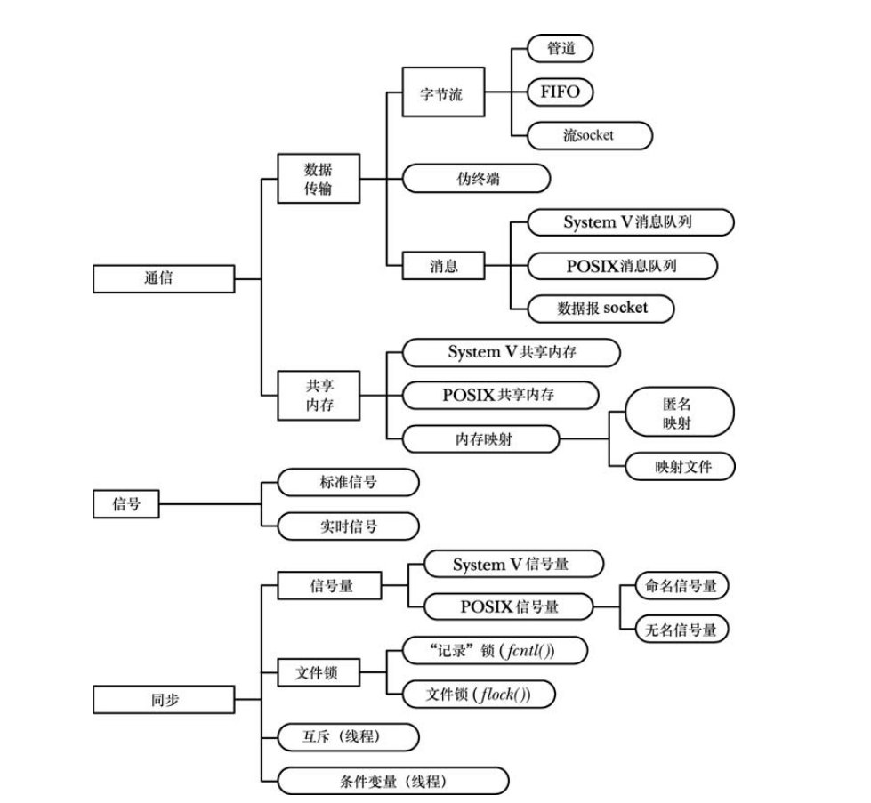

# Linux/UNIX 系统编程手册 下

# 三十四、进程组和会话

## 1. 概述

进程组由一个或多个共享同一进程组标识符(`PGID`) 的**进程**组成  

会话是一组**进程组**的集合。进程的会话成员关系是由其 session 标识符(`SID`)确定的，会话标识符与 `PGID` 一样，是一个类型为 `pid_t` 的数字  

在任一时刻，会话中的其中一个进程组会成为终端的前台进程组，其他进程组会成为后台进程组。只有前台进程组中的进程才能从控制终端中读取输入。  

当控制终端的连接建立起来之后，会话首进程(shell，比如 bash)会成为该终端的控制进程。成为控制进程的主要标志是当断开与终端之间的连接时内核会向该进程发送一个 `SIGHUP` 信号。  

会话和进程组的主要用途是用于 shell 作业控制  


## 2. 进程组

```c
#include <unistd.h>

pid_t getpgrp(void);
// always successfully return process group ID of calling process
```

如果 `getpgrp()` 的返回值与调用进程的进程 ID 匹配的话就说明该调用进程是其进程组的首进程  

`setpgid()` 系统调用将进程 ID 为 `pid` 的进程的进程组 ID 修改为 `pgid`  

```c
#include <unistd.h>

int setpgid(pid_t pid, pid_t pgid);
// return 0 on success or -1 on error
```

如果传入 `pid` 的值设置为 0，那么调用进程的进程组 ID 就会被改变。如果传入 `pgid` 的值设置为 0，那么 ID 为 `pid` 的进程的进程组 ID 会被设置成 `pid` 的值  

`setpgid` 限制：

- `pid` 参数仅可以指定调用进程或其中一个子进程。违反这条规则会导致 `ESRCH` 错误  
- 在组之间移动进程时，调用进程、由 `pid` 指定的进程以及目标进程组必须要属于同一个会话。违反这条规则会导致 `EPERM` 错误。  
- `pid` 参数所指定的进程不能是会话首进程。违反这条规则会导致 `EPERM` 错误。  
- 一个进程在其子进程已经执行 `exec()` 后就无法修改该子进程的进程组 ID 了。 违反这条规则会导致 `EACCES` 错误  


## 3. 会话

```c
#include <unistd.h>

pid_t getsid(pid_t pid);
// return session ID of specified process, or (pid_t)-1 on error

pid_t setsid(void);
// return session ID of new session, or (pid_t)-1 on error
```

如果 `pid` 参数的值为 0，那么 `getsid()` 会返回调用进程的会话 ID  

如果调用进程不是进程组首进程，那么 `setsid()` 会创建一个新会话  

`setsid()` 系统调用会按照下列步骤创建一个新会话：  

- 调用进程成为新会话的首进程和该会话中新进程组的首进程。调用进程的进程组 ID 和会话 ID 会被设置成该进程的进程 ID  
- 调用进程没有控制终端。所有到之前控制终端的连接都会被断开  

如果调用进程是一个进程组首进程，那么 `setsid()` 调用会报出 `EPERM` 错误。避免这个错误发生的最简单的方式是执行一个 `fork()` 并让父进程终止以及让子进程调用 `setsid()`。由于子进程会继承其父进程的进程组 ID 并接收属于自己的唯一的进程 ID，因此它无法成为进程组首进程。  


## 4. 控制终端和控制进程

一个会话中的所有进程可能会拥有一个控制终端。会话在被创建出来的时候是没有控制终端的， 当会话首进程首次打开一个还没有成为某个会话的控制终端的终端时会建立控制终端， 除非在调用 `open()`时指定 `O_NOCTTY` 标记。一个终端至多只能成为一个会话的控制终端  

如果一个进程拥有一个控制终端，那么打开特殊文件`/dev/tty` 就能够获取该终端的文件描述符。  

如果使用 `ioctl(fd, TIOCNOTTY)` 删除进程与文件描述符 `fd` 指定的控制终端之间的关联关系，之后再试图打开 `/dev/tty` 文件就会失败  


`ctermid` 获取表示控制终端段路径名：

```c
#include <stdio.h>

char *ctermid(char *ttyname);
// The pointer to the pathname
```

通常会生成字符串 `/dev/tty`  


## 5. 前台和后台进程组

`tcgetpgrp()` 和 `tcsetpgrp()` 函数分别获取和修改一个终端的前台进程组。  

```c
#include <unistd.h>

pid_t tcgetpgrp(int fd);
// return process group ID of terminal's foreground process group or -1 on error

int tcsetpgrp(int fd, pid_t pgid);
// return 0 on success or -1 on error
```

`fd` 所指定的终端，该终端必须是调用进程的控制终端  


## 6. `SIGHUB`

当一个控制进程失去其终端连接之后，内核会向其发送一个 `SIGHUP` 信号  

`SIGHUP` 信号的默认处理方式是终止进程。如果控制进程处理了或忽略了这个信号，那么后续尝试从终端中读取数据的请求就会返回文件结束的错误  

向控制进程发送 `SIGHUP` 信号会引起一种链式反应，从而导致将 `SIGHUP` 信号发送给很多其他进程。这个过程可能会以下列两种方式发生：  

- 控制进程通常是一个 shell。 shell 建立了一个 `SIGHUP` 信号的处理器，这样在进程终止之前，它能够将 `SIGHUP` 信号发送给由它所创建的各个任务  
- 在终止终端的控制进程时，内核会解除会话中所有进程与该控制终端之间的关联关系以及控制终端与该会话的关联关系，并且通过向该终端的前台进程组的成员发送 `SIGHUP` 信号来通知它们控制终端的丢失  


# 三十五、进程优先级和调度

## 1. 进程优先级

Linux 与大多数其他 UNIX 实现一样，调度进程使用 CPU 的默认模型是循环时间共享。在这种模型中，每个进程轮流使用 CPU 一段时间，这段时间被称为时间片  

进程特性 nice 值（优先级）允许进程间接地影响内核的调度算法。每个进程都拥有一个 nice 值，其取值范围为 -20（高优先级）到 19（低优先级），默认值为 0  

非特权进程只能降低自己的优先级，这样做之后它们就对其他进程 "友好(nice)"了  

nice 值是一个权重因素，它导致内核调度器倾向于调度拥有高优先级的进程。  

```c
#include <sys/resource.h>

int getpriority(int which, id_t who);
// return nice value os specified process on success or -1 on error
int setpriority(int which, id_t who, int prio);
// return 0 on success or -1 on error
```

参数 `which`：

- `PRIO_PROCESS`：操作 `PID` 为 who 的进程，如果 who 为 0，那么使用调用者的进程
- `PRIO_PGRP`：操作进程组 ID 为 who 的进程组中的所有成员，如果 who 为 0，那么为调用者的进程组
- `PRIO_USER`：操作所有真实用户 ID 为 who 的进程，如果 who 为 0，那么使用调用者的真实用户 ID

试图将 nice 值设置为一个超出允许范围的值 `[-20, 19]` 时会直接将 nice 值设置为边界值  


## 2. 实时进程调度

标准的内核调度算法一般能够为这些进程提供足够的性能和响应度。但实时应用对调度器有更加严格的要求  

有对实时的调度进行支持，但是没有达到硬实时的要求，实时调度需要再进行讨论  


## 3. 实时进程调用 API

Linux 实时和和非实时的调度策略：  

实时：

- `SCHED_FIFO`：实时先入先出
- `SCHED_RR`：实时循环

非实时：

- `SCHED_OTHER`：标准的时间片
- `SCHED_BATCH`：与 `SCHED_OTHER` 类似，用于批量执行
- `SCHED_IDLE`：与 `SCHED_OTHER` 类似，但优先级比最大的 nice 值(+19) 还要低

其他同上节，之后需要再讨论


## 4. affinity

进程切换 CPU 时对性能会有一定的影响：如果在原来的 CPU 的高速缓冲器中存在进程的数据，那么为了将进程的一行数据加载进新 CPU 的高速缓冲器中，首先必须使这行数据失效  

Linux（ 2.6）内核尝试了给进程保证软 CPU affinity(亲和力)—在条件允许的情况下进程重新被调度到原来的 CPU 上运行  

```c
#include <sched.h>

int sched_setaffinity(pid_t pid, size_t len, cpu_set_t* set);
int sched_getaffinity(pid_t pid, size_t len, cpu_set_t* set);
// reutrn 0 on success or -1 on error

void CPU_ZERO(cpu_set *set);
void CPU_SET(int cpu, cpu_set_t *set);
void CPU_CLR(int cpu, cpu_set_t *set);

int CPU_ISSET(int cpu, cpu_set_t *set);
// return 1 if cpu is set, or 0 otherwise
```

`<sched.h>` 头文件定义了常量 `CPU_SETSIZE`，通常为 1024，`len` 为指定 set 参数中的字节数，即为 `sizeof(cpu_set_t)` 


# 三十六、进程资源

## 1. 资源统计

```c
#include <sys/resource.h>

struct rusage {
    struct timeval ru_utime; /* user CPU time used */
    struct timeval ru_stime; /* system CPU time used */
    long   ru_maxrss;        /* maximum resident set size */
    long   ru_ixrss;         /* integral shared memory size */
    long   ru_idrss;         /* integral unshared data size */
    long   ru_isrss;         /* integral unshared stack size */
    long   ru_minflt;        /* page reclaims (soft page faults) */
    long   ru_majflt;        /* page faults (hard page faults) */
    long   ru_nswap;         /* swaps */
    long   ru_inblock;       /* block input operations */
    long   ru_oublock;       /* block output operations */
    long   ru_msgsnd;        /* IPC messages sent */
    long   ru_msgrcv;        /* IPC messages received */
    long   ru_nsignals;      /* signals received */
    long   ru_nvcsw;         /* voluntary context switches */
    long   ru_nivcsw;        /* involuntary context switches */
};
int getrusage(int who, struct rusage *res_usage);
// return 0 on success or -1 on error
```

参数 `who`：

- `RUSAGE_SELF`：返回调用进程相关的信息
- `RUSAGE_CHILDREN`：返回调用进程所有被终止和处于等待状态的子进程相关信息
- `RUSAGE_THREAD`：Linux 特有，返回线程相关信息


## 2. 进程资源限制

使用 shell 的内置命令 `ulimit` 可以设置 shell 的资源限制  

`getrlimit()` 和 `setrlimit()` 系统调用允许一个进程读取和修改自己的资源限制  

```c
#include <sys/resource.h>

struct rlimit {
    rlim_t rlim_cur;  // soft limit
    rlim_t rlim_max;  // hard limit
};

int getrlimit(int resource, struct rlimit *rlim);
int setrlimit(int resource, const struct rlimit *rlim);
// return 0 on success or -1 on error
```

`rlim_cur` 和 `rlim_max` 为 `RLIM_INFINITY` 表示没有限制  

参数 `resource`：

|      resource       |                    限制                     |
| :-----------------: | :-----------------------------------------: |
|     `RLIMIT_AS`     |       进程虚拟内存限制大小（字节数）        |
|    `RLIMIT_CORE`    |           core 文件大小（字节数）           |
|    `RLIMIT_CPU`     |              CPU 时间（秒数）               |
|    `RLIMIT_DATA`    |            进程数据段（字节数）             |
|   `RLIMIT_FSIZE`    |             文件大小（字节数）              |
|  `RLIMIT_MEMLOCK`   |            锁住的内存（字节数）             |
|  `RLIMIT_MSGQUEUE`  | 为真实用户 ID 分配的 POSIX 消息队列的字节数 |
|    `RLIMIT_NICE`    |                   nice 值                   |
|   `RLIMIT_NOFILE`   |          最大的文件描述符数量加 1           |
|   `RLIMIT_NPROC`    |          真实用户 ID 下的进程数量           |
|    `RLIMIT_RSS`     |       驻留集大小（字节数；没有实现）        |
|   `RLIMIT_RTPRIO`   |                实时调度策略                 |
|   `RLIMIT_RTTIME`   |            实时 CPU 时间（微秒）            |
| `RLIMIT_SIGPENDING` |       真实用户 ID 信号队列中的信号数        |
|   `RLIMIT_STACK`    |            栈段的大小（字节数）             |


# 三十七、守护进程

## 1. 概述

守护进程(daemon) 特征：

- 它的生命周期很长。通常，一个 daemon 会在系统启动的时候被创建并一直运行直至系统被关闭  
- 它在后台运行并且不拥有控制终端。  

daemon 是用来执行特殊任务的，比如 `cron` 在规定时间执行命令、`sshd` 允许远程主机使用 ssh 登录等等  


## 2. 创建守护进程

执行一个 `fork()`，之后父进程退出，子进程继续执行。

子进程调用 `setsid()` 开启一个新会话并释放它与之前控制终端之间的所有关联关系  

如果 daemon 后面可能会打开一个终端设备，那么必须要采取措施来确保这个设备不会成为控制终端，在所有可能应用到一个终端设备上的 `open()` 调用中指定 `O_NOCTTY` 标记或者在 `setsid()` 调用之后执行第二个 `fork()`，然后再次让父进程退出并让孙子进程继续执行。 这样就确保了子进程不会成为会话组长  

清除进程的 `umask` 以确保当 daemon 创建文件和目录时拥有所需的权限  

修改进程的当前工作目录，通常会改为根目录 `/`。  

关闭 daemon 从其父进程继承而来的所有打开着的文件描述符  

在关闭了文件描述符 0、 1 和 2 之后， daemon 通常会打开 `/dev/null` 并使用 `dup2()` 使所有这些描述符指向这个设备。  

实际可以使用 `becomeDaemon()` 函数将调用者变为 daemon  

```c
#include <syslog.h>

#define BD_NO_CHDIR 01          // Don't chdir("/")
#define BD_NO_CLOSE_FILES 02    // Don't close all open files
#define BD_NO_REOPEN_STD_FDS 04 // Don't reopen stdin, stdout and stderr to /dev/null
#define BD_NO_UMASKO 010        // Don't do a umask(0)
#define BD_MAX_CLOSE 8192       // Maximum file descriptors to close if 
                                // sysconf(_SC_OPEN_MAX) is indeterminate


int becomeDaemon(int flags);
// return 0 on success or -1 on error
```


## 3. 编写 daemon

很多标准的 daemon 是通过在系统关闭时执行特定于应用程序的脚本来停止的。而那些不以这种方式终止的
daemon 会收到一个 `SIGTERM` 信号。如果 daemon 在终止之前需要做些清理工作，那么就需要为这个信号建立一个处理函数。而且 `init` 进程在发完 `SIGTERM` 信号的 5 秒之后会发送一个 `SIGKILL` 信号  

由于 daemon 是长时间运行的，因此要特别小心潜在的内存泄露问题  


## 4. 重新初始化 daemon

daemon 需要持续运行，因此在设计 daemon 程序时需要克服一些障碍：

- 通常 daemon 会在启动时从相关的配置文件中读取操作参数，但有些时候需要在不重启 daemon 的情况下快速修改这些参数  
- 一些 daemon 会产生日志文件。如果 daemon 永远不关闭日志文件的话，那么日志文件就会无限制地增长，最终会阻塞文件系统  

解决这两个问题的方案是让 daemon 为 `SIGHUP` 建立一个处理器， 并在收到这个信号时采取所需的措施  


## 5. `syslog`

在编写 daemon 时碰到的一个问题是如何显示错误消息  

`syslog` 需要再进行讨论，暂跳过  


# 三十八、安全特权级程序

**1. Set ID**  

尽量避免使用 Set UID 和 Set GID，可以将需要权限才能完成的功能拆分到一个只执行单个任务的程序中，然后在需要的时候在子进程中执行这个程序。  

即使有时候需要 Set UID 或 Set GID 权限，对于一个 Set UID 程序来讲也并不总是需要赋给进程 root 身份  


**2. 以最小权限操作**

程序应该总是使用完成当前所执行的任务所需的最小权限来操作， saved 的 Set UID 工具就是为此而设计的  

按需拥有权限，在无需权限时永久删除权限  


**3. 小心执行程序**  

在执行另一个程序(`exec/system`)之前永久地删除权限  

避免执行一个拥有权限的 shell  

在 `exec()` 之前关闭所有用不到的文件描述符  


**4. 避免暴露敏感信息**  

当一个程序读取密码或其他敏感信息时应该在执行完所需的处理之后立即从内存中删除这些信息  

因为包含这些数据的虚拟内存页可能被换出，交换区域的数据可能被特权或者如果进程接收到了一个能导致它产生一个核心 dump 文件的信号，那么就有可能会从该文件中获取这类信息  


**5. 确定进程边界**  

考虑使用 capacity、考虑使用 `chroot`  


**6. 小心信号和竞争条件**  

当信号在程序执行过程中的任意时刻发送时需要考虑可能出现的竞争条件。在程序中合适的地方应该捕获、阻塞或忽略信号以防止可能存在的安全性问题。  


**7. 执行文件操作和文件 I/O**   

如果一个特权进程需要创建一个文件， 那么必须要小心处理那个文件的所有权和权限以确保文件不存在被恶意操作攻击的风险点  


**8. 不要完全相信输入和环境**  

**9. 小心缓冲区溢出**  

当输入值或复制的字符串超出分配的缓冲区空间时就需要小心缓冲区溢出了。永远不要使用 `gets()`，在使用诸如 `scanf()`、`sprintf()`、`strcpy()` 以及 `strcat()` 时需要谨慎  

对于其中的大多数函数来讲，如果到达了指定的最大值，那么源字符串的截断部分会被放到目标缓冲区中。由于这样的截断字符串对于程序来讲可能是毫无意义的，因此调用者必须要检查字符串是否发生了截断  


**10. 小心拒绝访问攻击**  

服务器应该执行负载控制，当负载超过预先设定的限制之后就丢弃请求  

服务器应该为与客户端的通信设置超时时间，这样如果客户端不响应（可能是故意的），那么服务器也不会永远地等待客户端。  

在发生超负荷时，服务器应该记录下合适的信息以便系统管理员得知这个问题  

服务器程序在碰到预期之外的负载时不应该崩溃。如应该严格进行边界检查以确保过多的请求不会造成数据结构溢出  

设计的数据结构应该能够避免算法复杂度攻击。  


**11. 检查返回状态和安全处理失败的情况**  

特权程序应该总是检查系统调用和库函数调用是否成功以及它们是否返回了预期的值  


# 三十九、capacity

跳过


# 四十、登录记账

跳过


# 四十一、动态库基础

动态库是一种将库函数打包成一个单元使之能够在运行时被多个进程共享的技术  

比较熟悉，该章挑重点写  


## 1. 概述

动态库的优点：  

- 由于整个程序的大小变得更小了， 因此在一些情况下， 程序可以完全被加载进内存中，从而能够更快地启动程序。这一点只有在大型共享库正在被其他程序使用的情况下才成立。第一个加载共享库的程序实际上在启动时会花费更长的时间，因为必须要先找到共享库并将其加载到内存中  
- 由于目标模块没有被复制进可执行文件中，而是在共享库中集中维护的，因此在修改目标模块时无需重新链接程序就能够看到变更  

新增开销：  

- 在概念上以及创建共享库和构建使用共享库的程序的实践上，共享库比静态库更复杂  
- 共享库在编译时必须要使用位置独立的代码，这在大多数架构上都会带来性能开销，因为它需要使用额外的一个寄存器  
- 在运行时必须要执行符号重定位。在符号重定位期间，需要将对共享库中每个符号（变量或函数）的引用修改成符号在虚拟内存中的实际运行时位置。由于存在这个重定位的过程，与静态链接程序相比， 一个使用共享库的程序或多或少需要花费一些时间来执行这个过程  


## 2. 位置独立的代码

`gcc -fPIC` 选项指定编译器应该生成位置独立的代码， 这会改变编译器生成执行特定操作的代码的方式，包括访问全局、静态和外部变量，访问字符串常量，以及获取函数的地址。这些变更使得代码可以在运行时被放置在任意一个虚拟地址处。这一点对于共享库来讲是必需的，因为在链接的时候是无法知道共享库代码位于内存的何处的。  

在 Linux/x86 上，可以使用不加 `–fPIC` 选项编译的模块来创建共享库。但这样做的话会丢失共享库的一些优点，因为包含依赖于位置的内存引用的程序文本页面不会在进程间共享  


## 3. 相关工具

```shell
ldd prog # 列出一个程序所需要的共享库

# 获取目标文件（或库、ELF 可执行程序）的各种信息
objdump xxx.so  
readelf xxx.so

# 获取目标库或可执行程序中定义的符号
nm xxx
strings xxx
```


## 4. 安装动态库

- 设置 `LD_LIBRARY_PATH` 环境变量
- 放入默认的目录 `/usr/lib, /lib, /usr/local/lib`
- 在 `/etc/ld.so.conf` 列出的目录

可以使用 `ldconfig` 可以查看或设置动态库的相关信息  


## 5. 版本兼容

随着时间的流逝，可能需要修改共享库的代码。这种修改会导致产生一个新版本的库，这个新版本可以与之前的版本兼容，也可能与之前的版本不兼容。如果是兼容的话则意味着只需要修改库的真实名称的次要版本标识符即可，如果是不兼容的话则意味着必须要定义一个库的新主要版本  

共享库的优点之一是当一个运行着的程序正在使用共享库的一个既有版本时也能够安装库的新主要版本或次要版本。在安装的过程中需要做的事情包括创建新的库版本、将其安装在恰当的目录中以及根据需要更新 `soname` 和链接器名称符号链接（通常使用 `ldconfig` 完成）  

创建 `/usr/lib/libdemo.so.1.0.1` 的动态库

```shell
gcc -c -fPIC xxx.c yyy.c zzz.c
gcc -shared -Wl,-soname,libdemo.so.1 -o libdemo.so.1.0.1 xxx.o yyy.o zzz.o

ln -s libdemo.so.1.0.1 libdemo.so.1
ln -s libdemo.so.1 libdemo.so
```


如果更新 `/usr/lib/libdemo.so.1.0.1` 为 `1.0.2`，需要完成下面的步骤  

```shell
gcc -c -fPIC xxx.c yyy.c zzz.c
gcc -shared -Wl,-soname,libdemo.so.1 -o libdemo.so.1.0.2 xxx.o yyy.o zzz.o

mv libdemo.so.1.0.2 /usr/local/lib
```

升级到 `2.0.0` 需要  

```shell
gcc -c -fPIC xxx.c yyy.c zzz.c
gcc -shared -Wl,-soname,libdemo.so.2 -o libdemo.so.2.0.0 xxx.o yyy.o zzz.o

mv libdemo.so.1.0.2 /usr/local/lib
```


## 6. 指定库搜索目录

除了把动态库放到系统库目录下，使用 `LD_LIBRARY_PATH` 之外，还可以在可执行文件中插入一个在运行时搜索共享库的目录列表，需要 `-rpath` 编译选项  

比如 `gcc -Wl,-rpath,/home/mtk/pdir -o prog prog.c libdemo.so` 会将字符串 `/home/mtk/pdir` 复制到可执行文件 `prog` 的运行时库路径(`rpath`) 列表中，因此当运行这个程序时，动态链接器在解析共享库引用时还会搜索这个目录  


## 7. 运行时找到动态库

在解析库依赖时，动态链接器首先会检查各个依赖字符串以确定它是否包含 `/`，因为在链接可执行文件时如果指定了一个显式的库路径名的话就会发生这种情况。如果找到了一个 `/`，那么依赖字符串就会被解释成一个路径名（绝对路径名或相对路径名），并且会使用该路径名加载库。否则动态链接器会使用下面的规则来搜索共享库。  

- 如果可执行文件的运行时库路径列表 `rpath` 中包含目录并且不包含 `DT_RUNPATH` 列表，那么就搜索这些目录  
- 如果定义了 `LD_LIBRARY_PATH` 环境变量，那么就会轮流搜索该变量值中以冒号分隔的各个目录。如果可执行文件是一个 Set `UID` 或 Set `GID` 程序，那么就会忽略 `LD_LIBRARY_PATH` 变量  
- 如果可执行文件 `DT_RUNPATH` 运行时库路径列表中包含目录，那么就会搜索这些目录  
- 检查 `/etc/ld.so.cache` 文件以确认它是否包含了与库相关的条目  
- 搜索 `/lib` 和 `/usr/lib` 目录  


## 8. 运行时符号解析

假设现在有一个主程序和一个共享库，它们两个都定义了一个全局函数 `xyz()`，并且共享库中的另一个函数调用了 `xyz()`  

```c
// prog.c
void xyz() {
    printf("main-xyz\n");
}

int main() {
    func();
}

// libfoo.so
void xyz() {
    printf("foo-xyz\n");
}

void func() {
    xyz();
}
```

输出为 `main-xyz`，主程序中的 `xyz()` 定义覆盖（隐藏）了共享库中的定义  

符号解析规则：

- 主程序中全局符号的定义覆盖库中相应的定义  
- 如果一个全局符号在多个库中进行了定义，那么对该符号的引用会被绑定到在扫描库时找到的第一个定义，其中扫描顺序是按照这些库在静态链接命令行中列出时从左至右的顺序  

如果想要确保在共享库中对 `xyz()` 的调用确实调用了库中定义的相应函数，那么在构建共享库的时候就需要使用 `–Bsymbolic` 链接器选项  


# 四十二、动态库高级特性

## 1. 加载动态库

当一个可执行文件开始运行之后，动态链接器会加载程序的动态依赖列表中的所有动态库，但有些时候延迟加载库是比较有用的，如只在需要的时候再加载一个插件。动态链接器的这项功能是通过一组 API 来实现的。这组 API 通常被称为 `dlopen` API  

`dlopen` API 使得程序能够在运行时打开一个共享库，根据名字在库中搜索一个函数，然后调用这个函数。在运行时采用这种方式加载的共享库通常被称为动态加载的库，它的创建方式与其他共享库的创建方式完全一样  

```c
#include <dlfcn.h>

void *dlopen(const char *libfilename, int flags);
// return library handle on success or NULL on error
```

如果 `libfilename` 指定的共享库依赖于其他共享库，那么 `dlopen()` 会自动加载那些库。  

同一个库文件中可以多次调用 `dlopen()`，但将库加载进内存的操作只会发生一次， 所有的调用都返回同样的句柄值。使用引用计数来维护库资源   

`flags`：

- `RTLD_LAZY`：只有当代码被执行的时候才解析库中未定义的函数符号。延迟解析只适用于函数引用，对变量的引用会被立即解析。  
- `RTLD_NOW`：在 `dlopen()` 结束之前立即加载库中所有的未定义符号，不管是否需要用到这些符号，这种做法的结果是打开库变得更慢了，但能够立即检测到任何潜在的未定义函数符号错误，而不是在后面某个时刻才检测到这种错误。  
- `RTLD_GLOBAL`：这个库及其依赖树中的符号在解析由这个进程加载的其他库中的引用和通过 `dlsym()` 查找时可用
- `RTLD_LOCAL`，大多数实现该项为默认值，它规定在解析后续加载的库中的引用时这个库及其依赖树中的符号不可用  
- `RTLD_NODELETE`：在 `dlclose()` 调用中不要卸载库，即使其引用计数已经变成 0 了。这意味着在后面重新通过 `dlopen()` 加载库时不会重新初始化库中的静态变量  
- `RTLD_NOLOAD`：不加载库。可以使用这个标记来检查某个特定的库是否已经被加载到了进程的地址空间中。如果已经加载了，那么 `dlopen()` 会返回库的句柄，如果没有加载，那么 `dlopen()` 会返回 `NULL`。第二，可以使用这个标记来更新已加载的库的标记  
- `RTLD_DEEPBIND`：在解析这个库中的符号引用时先搜索库中的定义，然后再搜索已加载的库中的定义。这个标记使得一个库能够实现自包含，即优先使用自己的符号定义，而不是在已加载的其他库中定义的同名全局符号(类似于 `-Bsymbolic` )


```c
#include <dlfcn.h>

const char *dlerror(void);
// return pointer to error-diagnostic or NULL if 
// no error has occurred since previous call to dlerror
```

```c
#include <dlfcn.h>

void *dlsym(void *handle, char *symbol);
// return address of symbol or NULL if symbol is not found
```

handle 参数还可以使用以下的参数：

- `RTLD_DEFAULT`：从主程序中开始查找 symbol，接着按序在所有已加载的共享库中查找，包括那些通过使用了 `RTLD_GLOBAL` 标记的 `dlopen()` 调用动态加载的库，这个标记对应于动态链接器所采用的默认搜索模型  
- `RTLD_NEXT`：在调用 `dlsym()` 之后加载的共享库中搜索 symbol，这个标记适用于需要创建与在其他地方定义的函数同名的包装函数的情况  


```c
#include <dlfcn.h>

int dlclose(void *handle);
// return 0 on success or -1 on error
```

`dlclose()` 函数会减小 handle 所引用的库的打开引用的系统计数。如果这个引用计数变成了 0 并且其他库已经不需要用到该库中的符号了，那么就会卸载这个库  


```c
#include <dlfcn.h>

typedef struct {
    const char *dli_fname;  /* Pathname of shared object that
                               contains address */
    void       *dli_fbase;  /* Base address at which shared
                               object is loaded */
    const char *dli_sname;  /* Name of symbol whose definition
                               overlaps addr */
    void       *dli_saddr;  /* Exact address of symbol named
                               in dli_sname */
} Dl_info;

int dladdr(const void *addr, Dl_info *info);
// return nonzero value if addr was found in a shared library otherwise 0
```


## 2. 控制符号可见性

设计良好的共享库应该只公开那些构成其声明的 API  

下面的方法可以控制符号的 export：

- `static` 声明的符号
- GNU C 编译器提供的 `__attribute__ ((visibility("hidden")))` 属性声明
- version-script 精确控制符号的可见性以及选择将一个引用绑定到符号的哪个版本  
- 当动态加载一个共享库时， `dlopen()` 的 `RTLD_GLOBAL` 标记可以用来指定这个库中定义的符号应该用于后续加载的库中的绑定操作， `––export–dynamic` 链接器选项可以用来使主程序的全局符号对动态加载的库可用。  


## 3. version-script

version-script 是一个包含链接器 `ld` 执行的指令的文本文件。要使用必须要指定 `––version–script ` 链接器选项  

```sh
gcc -Wl,--version-script,myscriptfile.map
```

版本脚本的一个用途是控制那些可能会在无意中变成全局可见（即对与该库进行链接的应用程序可见）的符号的可见性  

比如有三个编译模块 `vis_comm.c, vis_f1.c, vis_f2.c` 构建成一个动态库，这三个源文件分别定义了函数 `vis_comm()`、 `vis_f1()` 以及 `vis_f2()`。`vis_comm()` 函数由 `vis_f1()` 和 `vis_f2()` 调用，但不想被与该库进行链接的应用程序直接使用。  


可以通过以下的方法来实现上面的需求：

```map
# vis.map
VER_1 {
	global:
		vis_f1;
		vis_f2;
	local:
		*;
};
```

```sh
gcc -shared -o vis.so xxx.o -Wl,--version-script,vis.map
readelf --syms --use-dynamic vis.so | grep vis
```


符号版本化允许一个共享库提供同一个函数的多个版本  

比如下面的例子  

```map
# sv_v1.map
VER_1 {
	global: xyz;
	local: *;
};
```

接着创建一个程序 `p1` 来使用这个库  

现在假设需要修改库中 `xyz()` 的定义， 但同时仍然需要确保程序 pl继续使用老版本的函数。为完成这个任务，必须要在库中定义两个版本的 `xyz()`。  

```c
// lib_v2.c
__asm__(".symver xyz_old, xyz@VER_1");
__asm__(".symver xyz_new, xyz@@VER_2");

// old xyz
void xyz_old() {
    // ...
}

void xyz_new() {
    // ...
}

void foo() {
    // ...
}
```

第二个 `.symver` 指令使用 `@@`（不是@）来指示当应用程序与这个共享库进行静态链接时应该使用的 `xyz()` 的默认定义。一个符号的 `.symver` 指令中应该只有一个指令使用 `@@` 标记。  

```map
# v2.map
VER_1 {
	global: xyz;
	local: *;
};

VER_2 {
	global foo;
} VER_1;
```

新版本标签 `VER_2`，它依赖于标签 `VER_1`  

Linux 上的版本标签依赖的唯一效果是版本节点可以从它所依赖的版本节点中继承 global 和 local 规范  


## 4. 初始化和终止函数

在动态库加载和卸载时自动执行的初始化和终止函数  

```c
void __attribute__ ((constructor)) some_load(void) {
    // ...
}

void __attribute__ ((destructor)) some_unload(void) {
    // ...
}
```


## 5. 预加载动态库

出于测试的目的，有些时候可以有选择地（因为查找动态库的顺序）覆盖一些正常情况下会被动态链接器找出的函数（或其他符号） 。要完成这个任务可以定义一个环境变量 `LD_PRELOAD`，其值由在加载其他共享库之前需加载的共享库名称构成  

由于首先会加载这些共享库，因此可执行文件自动会使用这些库中定义的函数，从而覆盖那些动态链接器在其他情况下会搜索的同名函数  

出于安全原因，Set ID 的程序忽略了 `LD_PRELOAD`  


## 6. `LD_DEBUG`

有些时候需要监控动态链接器的操作以弄清楚它在搜索哪些库，这可以通过 `LD_DEBUG` 环境变量来完成。通过将这个变量设置为一个（或多个）标准关键词可以从动态链接器中得到各种跟踪信息  

具体的值如下  

```txt
libs        display library search paths
reloc       display relocation processing
files       display progress for input file
symbols     display symbol table processing
bindings    display information about symbol binding
versions    display version dependencies
scopes      display scope information
all         all previous options combined
statistics  display relocation statistics
unused      determined unused DSOs
help        display this help message and exit
```


# 四十三、进程间通信

对 IPC 比较熟悉，该章只进行总结  

## 1. 分类

  


# 四十四、pipe 和 FIFO

对 pipe 比较熟悉，FIFO 用的不太多，同样该章只进行总结  

## 1. 概述

pipe 是单向的，可以确保写入不超过 `PIPE_BUF` 字节(Linux 4096)的操作是原子的，pipe 的存储能力是有限的  


## 2. 使用

```c
#include <unistd.h>

int pipe(int fds[2]);
// return 0 on success or -1 on error
```

`fds[1]` 写，`fds[0]` 读，一般用于父子进程  


管道的一个常见用途是执行 shell 命令并读取其输出或向其发送一些输入。 `popen()` 和 `pclose()` 函数简化了这个任务。`popen()` 函数创建了一个管道，然后创建了一个子进程来执行 shell，而 shell 又创建了一个
子进程来执行 command 字符串  

```c
#include <stdio.h>

FILE *popen(const char *command, const char *mode);
// return file stream, or NULL on error

int pclose(FILE *stream);
// return termination status of child process or -1 on error
```

`mode` 参数是 `"r"` 或 `"w"`，如果是 `r`，命令的标准输出将通过管道传入调用进程，如果是 `w`，则调用进程通过管道写入到命令的标准输入  

由于 `popen()` 调用返回的文件流指针没有引用一个终端， 因此 stdio 库会对这种文件流应用块缓冲。这意味着当将 mode 的值设置为 w 来调用 `popen()` 时，在默认情况下只有当 stdio 缓冲器被充满或使用 `pclose()` 关闭了管道之后输出才会被发送到管道另一端的子进程。  

如果需要确保子进程能够立即从管道中接收数据，那么就需要定期调用 `fflush()` 或使用 `setbuf(fp, NULL)` 调用禁用 stdio 缓冲  


FIFO 暂时跳过


# 四十五、System V IPC

|     接 口     |     消 息 队 列      |         信 号 量          |     共 享 内 存      |
| :-----------: | :------------------: | :-----------------------: | :------------------: |
|    头文件     |    `<sys/msg.h>`     |       `<sys/sem.h>`       |    `<sys/shm.h>`     |
| 关联数据结构  |      `msqid_ds`      |        `semid_ds`         |      `shmid_ds`      |
| 创建/打开对象 |      `msgget()`      |        `semget()`         | `shmget() + shmat()` |
|   关闭对象    |        （无）        |          （无）           |      `shmdt()`       |
|   控制操作    |      `msgctl()`      |        `semctl()`         |      `shmctl()`      |
|   执行 IPC    | `msgsnd(), msgrcv()` | `semop()` 测试/调整信号量 | 访问共享区域中的内存 |


# 四十六、System V 消息队列

不太常用，简单看看，用到再详细了解

消息队列允许进程以消息的形式交换数据。尽管消息队列在某些方面与管道和 FIFO 类似，但它们之间仍然存在显著的差别  

- 用来引用消息队列的句柄是一个由 `msgget()` 调用返回的标识符。这些标识符与 UNIX 系统上大多数其他形式的 I/O 所使用的文件描述符是不同的  

- 通过消息队列进行的通信是面向消息的，即读者接收到由写者写入的整条消息。读取一条消息的一部分而让剩余部分遗留在队列中或一次读取多条消息都是不可能的。这一点与管道不通，管道提供的是一个无法进行区分的字节流（即使用管道时读者一次可以读取任意数量的字节数，不管写者写入的数据块的大小是什么）  

- 除了包含数据之外，每条消息还有一个用整数表示的类型。从消息队列中读取消息既可以按照先入先出的顺序，也可以根据类型来读取消息  


# 四十七、System V 信号量

有可替代 API，简单看看，用到再详细了解


# 四十八、System V 共享内存

共享内存允许两个或多个进程共享物理内存的同一块区域（通常被称为段）。由于一个共享内存段会成为一个进程用户空间内存的一部分，因此这种 IPC 机制无需内核介入。所有需要做的就是让一个进程将数据复制进共享内存中，并且这部分数据会对其他所有共享同一个段的进程可用。与管道或消息队列要求发送进程将数据从用户空间的缓冲区复制进内核内存和接收进程将数据从内核内存复制进用户空间的缓冲区的做法相比，这种 IPC 技术的速度更快  

共享内存这种 IPC 机制不由内核控制意味着通常需要通过某些同步方法使得进程不会出现同时访问共享内存的情况  


# 四十九、内存映射

适用于需要高性能的 IPC 需求

## 1. 概述

`mmap()` 系统调用在调用进程的虚拟地址空间中创建一个新内存映射。映射分为两种。

- 文件映射：文件映射将一个文件的一部分直接映射到调用进程的虚拟内存中。一旦一个文件被映射之后就可以通过在相应的内存区域中操作字节来访问文件内容了。映射的分页会在需要的时候从文件中（自动）加载。这种映射也被称为基于文件的映射或内存映射文件。
- 匿名映射：一个匿名映射没有对应的文件。相反，这种映射的分页会被初始化为 0  

一个进程的映射中的内存可以与其他进程中的映射共享（各个进程的页表条目指向RAM 中相同分页）  

- 当两个进程映射了一个文件的同一个区域时它们会共享物理内存的相同分页。  
- 通过 fork()创建的子进程会继承其父进程的映射的副本，并且这些映射所引用的物理内存分页与父进程中相应映射所引用的分页相同  

映射分类：

- 私有映射（`MAP_PRIVATE`）：在映射内容上发生的变更对其他进程不可见，对于文件映射来讲，变更将不会在底层文件上进行。尽管一个私有映射的分页在上面介绍的情况中初始时是共享的，但对映射内容所做出的变更对各个进程来讲则是私有的。使用 COW 进行优化  
- 共享映射（`MAP_SHARED`）：在映射内容上发生的变更对所有共享同一个映射的其他进程都可见，对于文件映射来讲，变更将会发生在底层的文件上  


各种内存映射的作用

- 私有文件映射：根据文件内容初始化内存  

- 私有匿名映射：内存分配  
- 共享文件映射：内存映射 I/O；进程间共享内存（IPC）
- 共享匿名映射：进程间共享内存（IPC）

一个进程在执行 `exec()` 时映射会丢失，但通过 `fork()` 创建的子进程会继承映射  


## 2. `mmap`

`mmap()` 系统调用在调用进程的虚拟地址空间中创建一个新映射。  

```c
#include <sys/mman.h>

void *mmap(void *addr, size_t length, int prot, int flags, int fd, off_t offset);
// return starting address of mapping on success or MAP_FILED on error
```

`addr` 参数指定了映射被放置的虚拟地址。如果将 `addr` 指定为 NULL，那么内核会为映射选择一个合适的地址。这是创建映射的首选做法。或者在 `addr` 中指定一个非 NULL 值时，内核会在选择将映射放置在何处时将这个参数值作为一个提示信息来处理。  

`length` 参数指定了映射的字节数。尽管 length 无需是一个系统分页大小的倍数，但内核会以分页大小为单位来创建映射  

`prot` 参数是一个位掩码，指定了映射的保护信息

- `PROT_NONE` 区域无法访问
- `PROT_READ` 区域内容可读取
- `PROT_WRITE` 区域内容可修改
- `PROT_EXEC` 区域内容可执行

`flags` 参数：

- `MAP_PRIVATE` 
- `MAP_SHARED`
- `MAP_FIXED`：并且 `addr` 为非零值，那么 `addr` 和 offset 除以系统分页大小所得的余数应该相等  
- `MAP_ANONYMOUS`：匿名映射，即没有底层文件对应的映射  
- `MAP_LOCKED`：按照 `mlock()` 的方式预加载映射分页并将映射分页锁进内存  
- `MAP_HUGETLB`：创建一个使用巨大页的映射
- `MAP_NORESERVE`：控制交换空间的预留
- `MAP_POPULATE`：填充一个映射的分页。对于文件映射来讲，这将会在文件上执行一个超前读取。这意味着后续对映射内容的访问不会因分页故障而发生阻塞  
- `MAP_UNINITIALIZED`：指定这个标记会防止一个匿名映射被清零。它能够带来性能上的提升，但同时也带来了安全风险，因为已分配的分页中可能会包含上一个进程留下来的敏感信息。因此这个标记一般只供嵌入式系统使用，因为在这种系统中性能是一个至关重要的因素，并且整个系统都处于嵌入式应用程序的控制之下  

参数 `fd` 和 `offset` 是用于文件映射的（匿名映射将忽略它们）。 `fd` 参数是一个标识被映射的文件的文件描述符。 `offset` 参数指定了映射在文件中的起点，它必须是系统分页大小的倍数。要映射整个文件就需要将 `offset` 指定为 0 并且将 `length` 指定为文件大小。`offset` 参数必须要与分页对齐  


## 3. `munmap`

```c
#include <sys/mman.h>

int munmap(void *addr, size_t length);
// return 0 on success or -1 on error
```

`addr` 参数是待解除映射的地址范围的起始地址，它必须与一个分页边界对齐。`length` 参数是一个非负整数，它指定了待解除映射区域的大小（字节数）  

当一个进程终止或执行了一个 `exec()` 之后进程中所有的映射会自动被解除  


## 4. 文件映射

`mmap()` 将打开的文件的内容映射到调用进程的地址空间中，被调用之后就能够关闭文件描述符了，而不会对映射产生任何影响  

**私有文件映射**  

私有文件映射最常见的两个用途：

- 允许多个执行同一个程序或使用同一个共享库的进程共享同样的（只读的）文本段，它是从底层可执行文件或库文件的相应部分映射而来的  
- 映射一个可执行文件或共享库的初始化数据段。这种映射会被处理成私有使得对映射数据段内容的变更不会发生在底层文件上  


**共享文件映射**  

当多个进程创建了同一个文件区域的共享映射时，它们会共享同样的内存物理分页。对映射内容的变更将会反应到文件上。实际上，这个文件被当成了该块内存区域的分页存储  

共享文件映射可以**内存映射 I/O** 和 IPC


**内存映射 I/O**  

由于共享文件映射中的内容是从文件初始化而来的，并且对映射内容所做出的变更都会自动反应到文件上，因此可以简单地通过访问内存中的字节来执行文件 I/O，而依靠内核来确保对内存的变更会被传递到映射文件中，比起传统的 `read` 和 `write` 有更好的性能（在大型文件中执行重复随机访问）  


当访问文件未被映射的的区域会导致 `SIGSEVG` 信号，默认动作是 core dump  


## 5. 同步映射区域

内核会自动将发生在 `MAP_SHARED` 映射内容上的变更写入到底层文件中，但在默认情况下，内核不保证这种同步（写回）操作会在何时发生。   

`msync()` 系统调用让应用程序能够显式地控制何时完成共享映射与映射文件之间的同步。  

```c
#include <sys/mman.h>

int msyc(void *addr, size_t length, int flags);
// return 0 on success or -1 on error
```

`flags` ：

- `MS_SYNC`：执行一个同步的文件写入。这个调用会阻塞直到内存区域中所有被修改过的分页被写入到文件为止。  
- `MS_ASYNC`：执行一个异步的文件写入。内存区域中被修改过的分页会在后面某个时刻被写入磁盘并立即对在相应文件区域中执行 `read()` 的其他进程可见
- `MS_INVALIDATE`：使映射数据的缓存副本失效。当内存区域中所有被修改过的分页被同步到文件中之后，内存区域中所有与底层文件不一致的分页会被标记为无效。当下次引用这些分页时会从文件的相应位置处复制相应的分页内容，其结果是其他进程对文件做出的所有更新将会在内存区  


## 6. 匿名映射

创建匿名映射的方法：

- 在 `flags` 中指定 `MAP_ANONYMOUS` 并将 `fd` 指定为 -1。Linux 上会忽略 `fd`  
- 打开 `/dev/zero` 设备文件并将得到的文件描述符传递给 `mmap()`。  


## 7. 重新映射

Linux 提供了 `mremap()` 系统调用改变映射的位置和大小  

```c
#include <sys/mman.h>

void *mremap(void *oddaddress, size_t oldsize, size_t newsize, int flags, ...);
// return starting address of remapping region on success or MAP_FILED on error
```

在执行重映射的过程中内核可能会为映射在进程的虚拟地址空间中重新指定一个位置，而是否允许这种行为则是由 `flags` 参数来控制的。它是一个位掩码，其值要么是 0，要么包含下列几个值  

- `MREMAP_MAYMOVE`：如果指定了这个标记，那么根据空间要求的指令，内核可能会为映射在进程的虚拟地址空间中重新指定一个位置。如果没有指定这个标记，并且在当前位置处没有足够的空间来扩展这个映射，那么就返回 `ENOMEM` 错误  
- `MREMAP_FIXED`：这个标记只能与 `MREMAP_MAYMOVE` 一起使用。它在 `mremap()` 中所起的作用与  `MAP_FIXED` 在 `mmap()` 中所起的作用类似  


## 8. `MAP_NORESERVE`

一些应用程序会创建大（通常是私有匿名的）映射，但只使用映射区域中的一小部分  

如果内核总是为此类映射分配（或预留）足够的交换空间，那么很多交换空间可能会被浪费。相反，内核可以只在需要用到映射分页的时候（即当应用程序访问分页时）为它们预留交换空间。这种方法被称为 lazy swap reservation  

lazy swap reservation 允许交换空间被过度利用。但是如果尝试访问整个映射，那么 RAM 和 swap 空间就会被耗尽，之后会执行 OOM  

Linux 特有的 `/proc/sys/vm/overcommit_memory` 文件包含了一个整数值，它控制着内核对交换空间过度利用的处理  

| `overcommit_memory` | 指定 `MAP_NORESERVE` | 没有指定 `MAP_NORESERVE` |
| :-----------------: | :------------------: | :----------------------: |
|          0          |     允许过度利用     |    拒绝明显的过度利用    |
|          1          |     允许过度利用     |       允许过度利用       |
|          2          |    严格的过度利用    |      严格的过度利用      |

过度利用监控只适用于私有可写映射和共享匿名映射  


## 9. 非线性映射

非线性映射——文件分页的顺序与它们在连续内存中出现的顺序不同的映射  

```c
#include <sys/mman.h>

int remap_file_pages(void *addr, size_t size, int prot, size_t pgoff, int flags);
// reutrn 0 on success or -1 on error
```

