# 一、介绍

有时候想要更清晰地表达自己的想法，需要简单画一些结构图等等。网上搜了一下，有 SVG 和 Graphviz DOT，之前看了一下 SVG，学了一点点，感觉有点绕，应该更适合前端的同学。  

Clang 生成的 CFG、Exploded Graph 都是 DOT 格式的，应该更适合自己学习，而且 DOT 可以很方便的转换为 SVG 格式，当然也可以很方便导出其他格式的图片。  

安装配置等等杂项参考附录 A 其他人的内容  


# 二、Hello World

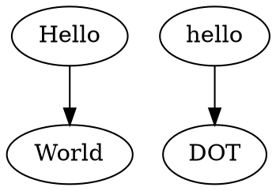

  

```sh
# -Tpng Set output format to 'png'
# -O Automatically generate an output filename based on the input filename
# -o 
dot -Tpng -O hello.dot
dot -Tpng -o hello.png hello.dot
```


# 三、语法

终结符以**粗体**显示，字符串常量用单引号 `''` 引起来，括号 `()` 表示分组，方括号 `[]` 表示可选项，竖线 `|` 表示选择其一  

|   非终结符   |                             语法                             |
| :----------: | :----------------------------------------------------------: |
|   *graph*    | [ **strict** ] (**graph** \| **digraph**) [*ID*] **'{'** *stmt_list* **'}'** |
| *stmt_list*  |              [ *stmt* [ **';'** ] *stmt_list* ]              |
|    *stmt*    | *attr_stmt* \| *node_stmt* \|  *edge_stmt*  \| *ID* **'='** *ID*\| subgraph |
| *attr_stmt*  |       (**graph** \| **node** \| **edge**) *attr_list*        |
| *attr_list*  |         **'['** [ *a_list* ] **']'** [ *attr_list* ]         |
|   *a_list*   |     *ID* '=' *ID* [ (**';'** \| **','**) ] [ *a_list* ]      |
| *node_stmt*  |                   *node_id* [*attr_list*]                    |
|  *node_id*   |                       *ID* [ *port* ]                        |
|    *port*    | **':'** *ID* [ **':'** *compass_pt* ] \| **':'** *compass_pt* |
| *edge_stmt*  |     (*node_id* \| *subgraph*) *edgeRHS* [ *attr_list* ]      |
|  *edgeRHS*   |       *edgeop* (*node_id* \| *subgraph*) [ *edgeRHS* ]       |
|   *edgeop*   |                           -> \| --                           |
|  *subgraph*  |    [ **subgraph** [ *ID* ] ] **'{'** *stmt_list* **'}'**     |
| *compass_pt* | (**n** \| **ne** \| **e** \| **se** \| **s** \| **sw** \| **w** \| **nw** \| **c** \| _) |

关键字解释：  

- **strict**：严格的图修饰，禁止创建多个相同的边
- **graph**：无向图
- **digraph**：有向图
- **n, e, s, w**：分别表示北、东、南、西，最终指向
- **ne, se, sw, nw** 分别表示东北、东南、西南、西北
- **c, _**： 分别表示中部和任意方向


*ID* 是下面的其中一项：

- 字母（`[a-zA-Z\200-\377]`）、下划线（`_`）、数字(`[0-9]`)字符组成的字符串，但是不以数字开头
- 数字 `[-]?(.[0-9]+ | [0-9]+(.[0-9]*)?)`
- 双引号引起来的字符串 `"..."`
- HTML 字符串 `<...>`


*compass_pt* 具体指箭头从哪个位置指向哪个位置  

例 3.1：  

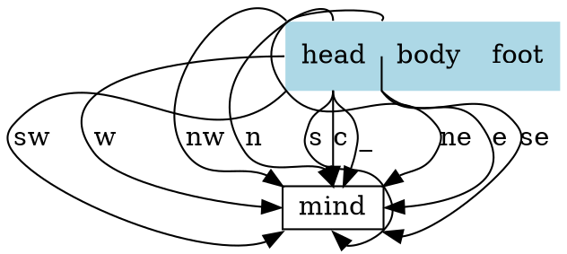


注释类似于 C/C++ 的注释，`//` 和 `/* */`  

`;` 和 `,` 都不是必须的，可以使用 whitespace 代替  

`\` 类似与 C/C++，表示换行  


例 3.2：  

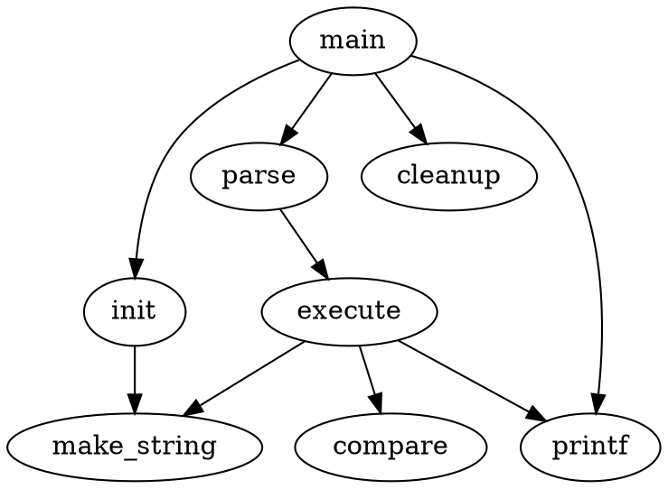

  


# 四、属性

所有的属性可以见[文档](https://graphviz.gitlab.io/_pages/doc/info/attrs.html)  

接下来学习使用常用的公共属性  

|    属性名     |                             说明                             |
| :-----------: | :----------------------------------------------------------: |
|  **charset**  |                     编码，一般设置 UTF-8                     |
| **fontname**  | 字体名称，这个在中文的情况需要设置，否则导出图片的时候会乱码 |
| **fontcolor** |                           字体颜色                           |
| **fontsize**  |                    字体大小，用于文本内容                    |
| **fillcolor** |         用于填充节点或者群组 (cluster) 的背景颜色。          |
|   **size**    |                     图形的最大宽度和高度                     |
|   **label**   |                       图形上的文本标记                       |
|  **margin**   |                        设置图形的边距                        |
|    **pad**    | 指定将绘制区域扩展到绘制图形所需的最小区域的长度（以英寸为单位） |
|   **style**   |                    设置图形组件的样式信息                    |
|  **rankdir**  | 设置图形布局的排列方向 (全局只有一个生效). "TB", "LR", "BT", "RL", 分别对应于从上到下，从左到右，从下到上和从右到左绘制的有向图 |
|  **ranksep**  |                以英寸为单位提供所需的排列间隔                |
|   **ratio**   |                     设置生成图片的纵横比                     |

`style` 可以选择的值和效果：

节点 `style`：

| style 值  |                             效果                             |
| :-------: | :----------------------------------------------------------: |
|   solid   |  |
|  dashed   |  |
|  dotted   |  |
|   bold    |    |
|  rounded  |  |
| diagonals |  |
|  filled   |  |
|  striped  |  |
|  wedged   |  |


边 `style`：

| style 值 |                             效果                             |
| :------: | :----------------------------------------------------------: |
|  solid   |  |
|  dashed  |  |
|  dotted  |  |
|   bold   |  |


`cluster style`：

| style 值 |                             效果                             |
| :------: | :----------------------------------------------------------: |
|  solid   |  |
|  dashed  |  |
|  dotted  |  |
|   bold   |  |
|   ...    |                             ...                              |


## 1. 节点

默认的节点属性是 `shape=ellipse,width=.75,height=.5` 并且 `lable` 是节点名  

一个图中可能有非常多的 node 和 edge，可以事先声明一个公共的属性，比如 

```dot
digraph G {
    node [shape=box color=blue];
    edge [color=red];
}
```

节点常用的属性：

|      属性名       |                             说明                             |
| :---------------: | :----------------------------------------------------------: |
|     **color**     |                       绘制图像轮廓颜色                       |
|     **shape**     | 具体见[这里](https://graphviz.gitlab.io/_pages/doc/info/shapes.html)，常用有 `box, circle, ellipse, plaintext, square` 等等 |
| **width, height** | 图形的宽度和高度，如果设置了 **fixedsize** 为 true，则宽和高为最终的长度 |
|   **fixedsize**   |    如果为 false，节点的大小由其文本内容所需要的最小值决定    |
|     **sides**     |              如果 `shape=polygon` 时，边的数量               |
|     **rank**      | 子图中节点上的排列等级约束。最小等级是最顶部或最左侧，最大等级是最底部或最右侧。 |


例 4.1.1  

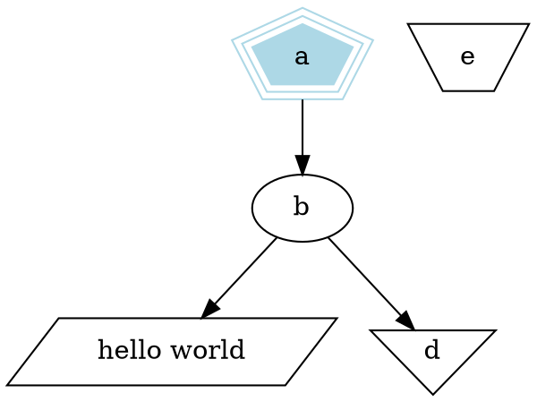

  


例 4.1.2  

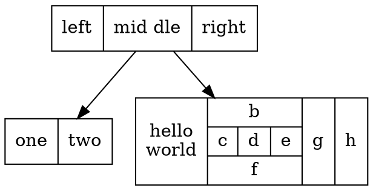


例 4.1.3  

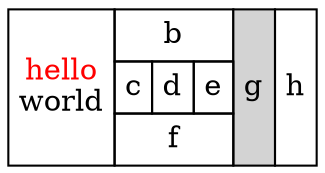


例 4.1.4  

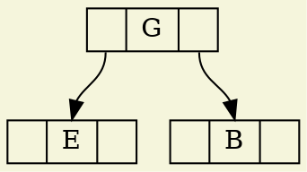

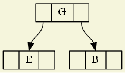  


例 4.1.5  

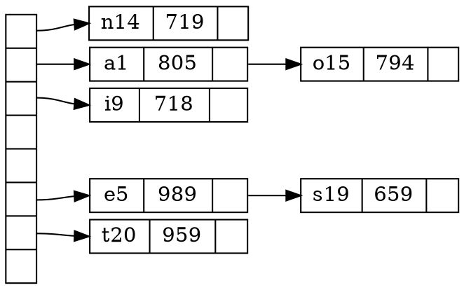

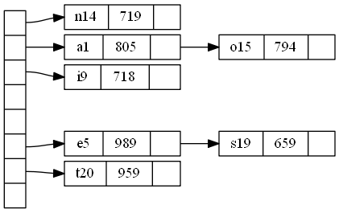  


## 2. 边

|    属性名     |                             说明                             |
| :-----------: | :----------------------------------------------------------: |
| **arrowhead** |         箭头种类，`box, diamond, curve, normal, dot`         |
| **arrowsize** |                    箭头大小，double 类型                     |
|   **color**   | 绘制边的形状，有两种情况。color 的情况单色边，color list 可以有多种颜色，见下面例4.2.1 |
|    **dir**    |                 `both, forward, back, none`                  |
|    **len**    |                     边的长度，用英尺表示                     |
|  **weight**   |        边的权重，权重越大，边越短且越垂直，必须是整数        |


例 4.2.1  

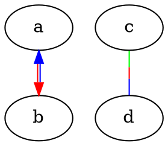

 

`a->b` 是画了两条不同颜色平行线条，向下箭头颜色是第一种颜色，向上箭头是第二种，如果再添加颜色箭头颜色不会改变，仅仅增加一条平行的该颜色线条  


例 4.2.2  

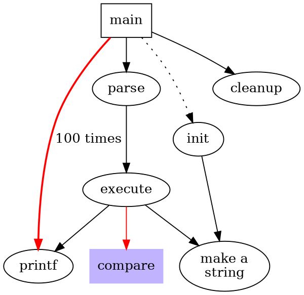


## 3. 子图

**subgraph** 必须搭配 **cluster** 一起使用，使用 `subgraph cluster*`   

例 4.3.1  

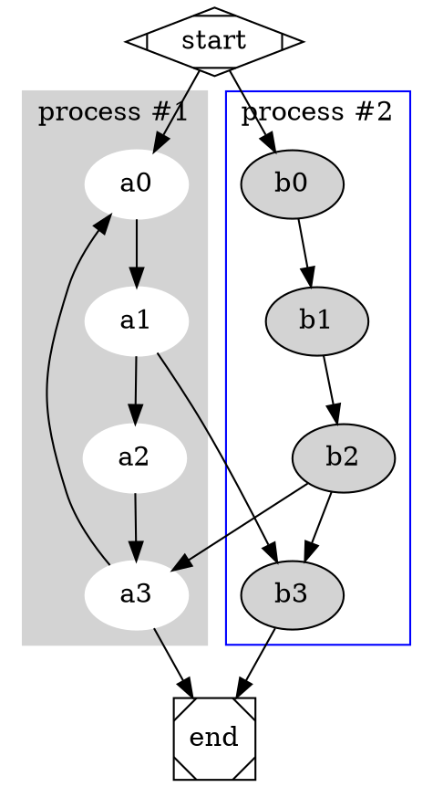

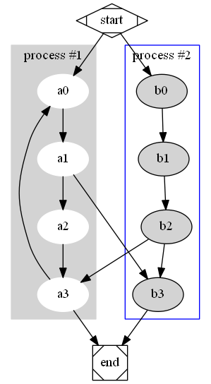  


# 附录 A 参考资料

[DOT语言 wiki](https://zh.wikipedia.org/zh-hans/DOT语言)

https://graphviz.gitlab.io/doc/info/lang.html

https://www.graphviz.org/pdf/dotguide.pdf

https://www.cnblogs.com/shuqin/p/11897207.html

https://github.com/uolcano/blog/issues/13

[样式及颜色的博客](https://www.cnblogs.com/shinianhuanniyijuhaojiubujian/p/9134519.html)

