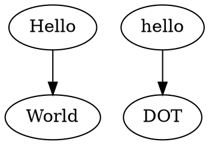
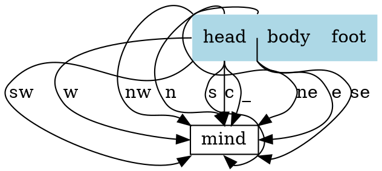

# 一、介绍

有时候想要更清晰地表达自己的想法，需要简单画一些结构图等等。网上搜了一下，有 SVG 和 Graphviz DOT，之前看了一下 SVG，学了一点点，感觉有点绕，应该更适合前端的同学。  

Clang 生成的 CFG、Exploded Graph 都是 DOT 格式的，应该更适合自己学习，而且 DOT 可以很方便的转换为 SVG 格式，当然也可以很方便导出其他格式的图片。  

安装配置等等杂项参考附录 A 其他人的内容  

# 二、Hello World

  

# 三、语法

终结符以**粗体**显示，字符串常量用单引号 `''` 引起来，括号 `()` 表示分组，方括号 `[]` 表示可选项，竖线 `|` 表示选择其一  

|   非终结符   |                             语法                             |
| :----------: | :----------------------------------------------------------: |
|   *graph*    | [ **strict** ] (**graph** \| **digraph**) [*ID*] **'{'** *stmt_list* **'}'** |
| *stmt_list*  |              [ *stmt* [ **';'** ] *stmt_list* ]              |
|    *stmt*    | *attr_stmt* \| *node_stmt* \|  *edge_stmt*  \| *ID* **'='** *ID*\| subgraph |
| *attr_stmt*  |       (**graph** \| **node** \| **edge**) *attr_list*        |
| *attr_list*  |         **'['** [ *a_list* ] **']'** [ *attr_list* ]         |
|   *a_list*   |     *ID* '=' *ID* [ (**';'** \| **','**) ] [ *a_list* ]      |
| *node_stmt*  |                   *node_id* [*attr_list*]                    |
|  *node_id*   |                       *ID* [ *port* ]                        |
|    *port*    | **':'** *ID* [ **':'** *compass_pt* ] \| **':'** *compass_pt* |
| *edge_stmt*  |     (*node_id* \| *subgraph*) *edgeRHS* [ *attr_list* ]      |
|  *edgeRHS*   |       *edgeop* (*node_id* \| *subgraph*) [ *edgeRHS* ]       |
|   *edgeop*   |                           -> \| --                           |
|  *subgraph*  |    [ **subgraph** [ *ID* ] ] **'{'** *stmt_list* **'}'**     |
| *compass_pt* | (**n** \| **ne** \| **e** \| **se** \| **s** \| **sw** \| **w** \| **nw** \| **c** \| _) |

关键字解释：  

- **strict**：严格的图修饰，禁止创建多个相同的边
- **graph**：无向图
- **digraph**：有向图
- **n, e, s, w**：分别表示北、东、南、西，最终指向
- **ne, se, sw, nw** 分别表示东北、东南、西南、西北
- **c, _**： 分别表示中部和任意方向

*ID* 是下面的其中一项：

- 字母（`[a-zA-Z\200-\377]`）、下划线（`_`）、数字(`[0-9]`)字符组成的字符串，但是不以数字开头
- 数字 `[-]?(.[0-9]+ | [0-9]+(.[0-9]*)?)`
- 双引号引起来的字符串 `"..."`
- HTML 字符串 `<...>`

*compass_pt* 具体指箭头从哪个位置指向哪个位置  

具体的例子：

# 附录 A 参考资料

[DOT语言 wiki](https://zh.wikipedia.org/zh-hans/DOT语言)

https://www.graphviz.org/pdf/dotguide.pdf

https://www.cnblogs.com/shuqin/p/11897207.html

https://github.com/uolcano/blog/issues/13

