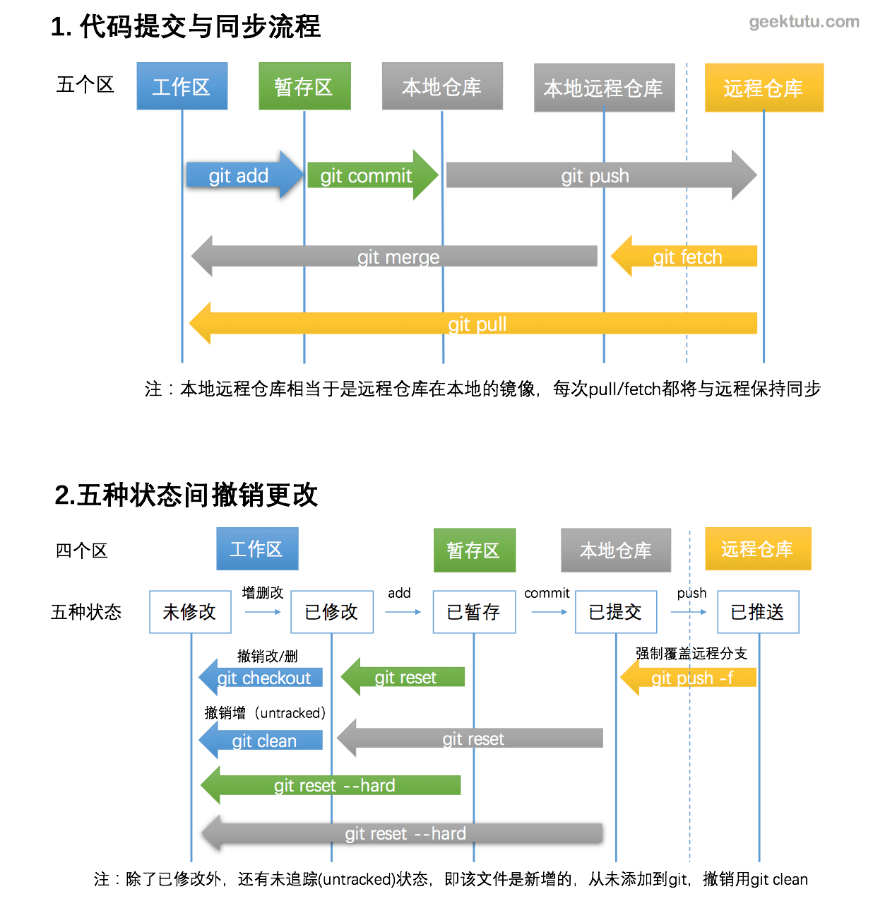

# 一、起步

Git 是一个**分布式版本控制系统 DVCS**


客户端并不只提取最新版本的文件快照，而是把代码仓库完整地镜像下来。 这么一来，任何一处协同工作用的服务器发生故障，事后都可以用任何一个镜像出来的本地仓库恢复。

Git 和其他版本控制系统的主要差别在 Git 对待数据的方式。其他系统以文件变更列表方式储存信息。**Git 直接记录快照，而非差异比较。**每次你提交更新，或在 Git 中保存项目状态时，它主要对当时的全部文件**制作一个快照并保存这个快照的索引**。 如果文件没有修改，Git 不再重新存储该文件，而是只保留一个链接指向之前存储的文件。 


**Git 保证完整性**，Git 中所有数据再存储之前都计算校验和，然后以校验和来引用。意味着不可能在 Git 不知情的情况下改变任何文件内容或者目录的内容。这个功能建构在 Git 底层。比如在传输过程丢失信息或者损坏文件，Git 都能发现。Git 使用计算校验和的机制为 SHA-1 散列。由 40 个 hex 字符组成的字符串。由于 [SHA-1](https://zh.wikipedia.org/wiki/SHA-1) 不够安全。Git 开发者讨论过使用[新的 Hash 策略](https://plus.google.com/+LinusTorvalds/posts/7tp2gYWQugL)。

Git 一般只添加数据。

**Git 的三种状态**： 

- 已提交(committed)：安全地保存到本地数据库中。
- 已修改(modified)：表示修改了文件，但是没有保存到数据库中。
- 已暂存(staged)： 表示对一个已修改文件地当前版本做了标记，使之包含在下次提交的快照中。

**Git 的三个工作区域概念**：


- Git 仓库：Git 用来保存项目的元数据和对象数据库的地方。从其他计算机 clone repository 时，copy 这里的数据。
- 工作目录：对某个版本独立提取出来的内容，放在磁盘上可以使用或者修改。
- 暂存区域：是一个文件，保存了下次将 commit 的文件列表信息，一般在 git repository 目录中，有时候也被叫做 `Index`。


**基本的 Git 工作流程**

- 在工作目录修改文件
- 暂存文件，将文件的快照放入暂存区域
- 提交更新，找到暂存区的文件，将快照永久地存储到 Git 仓库目录中


**初次运行 Git 的配置**

`git config` 工具帮助设置控制 Git 的外观和行为的配置变量。这些变量存储到三个不同的位置：

- `/etc/gitconfig` 包含系统上每一位用户及他们仓库的通用配置。`--system`
- `~/.gitconfig` 或 `~/.config/git/config` 只针对当前用户。`--global`
- `.git/config`，针对该 repository 。

```shell
# 用户信息
git config --global user.name "name"
git config --global user.email "xxx@example.com"

# 编辑器
git config --global core.editor vim|emacs

# 查看配置
git config user.name

# push 时不用每次输入密码
git config --global credential.helper cache
```

**帮助**

```shell
git help <verb>
git <verb> --help
man git <verb>
```


# 二、基础

**工作目录下每一个文件都有两种状态：已跟踪和未跟踪**


## 1. Git 常用操作




**新建 repository**

```shell
git init [projectName]
```


**克隆现有仓库**

```sh
git clone [options] [--] <repo> [dir]
git clone -b <newBranchName> url
git clone --depth <depth> url

# example
git clone https://github.com/libgit2/libgit2
git clone https://github.com/libgit2/libgit2 mylibgit # mylibgit 为自定义本地仓库名
# git 使用 https 或者 ssh 传输协议
```


**查看状态**

```shell
git status [-s]  # s: short
```

**添加/删除文件**

```shell
git add filenames|dir    # 跟踪文件
git rm filenames         # 如果删除之前修改过且放在暂存区域，需要用 -f(force)，防止误删文件
                         # rm file and staged the file
git rm -r dir            # 删除跟踪目录
git rm --cache filenames # 原文件保留在磁盘，仅删除 git 跟踪

# filename 可以使用 glob 模式
git rm log/\*.log # 删除 log/ 目录下，*.log 文件，\ 防止 shell 自动展开
git rm \*~        # 删除以 ~ 结尾的所有文件，\ 同上

git mv src dst    # rename <=> mv old new; git rm old; git add new;
```

**提交**

```shell
git commit [-m "message"]
git commit filenames [-m "message"]  # 只 commit 指定文件
git commit -a [-m "message"]         # commit 所有跟踪的文件，即便没有 git add

# ... modified
# 当 commit 之后发漏掉文件，或者提交信息写错
git commit -m "test commit --amend"  # commit 之后，发现漏掉 testfile
git add testfile
git commit --amend                   # 追加 commit
```

**操作历史**

```shell
git log -p -2     # -p 显示 diff，-2 显示仅两次提交，默认为全部
git log --stat    # 每次 commit 的变化总结，进行 code review 或者浏览 partner commit 时使用
git log --pretty=oneline|short|full|fuller|format
git log --pretty=oneline --graph  # 可以用 ASCII 字符形象地显示分支合并历史
git log --pretty=format:"%h..."
git log --since=2.weeks           # --after, 最近两周，2008-01-15
git log --until=xxx               # --before
git log --author|committer=xxx
git log --grep=xxx
git log --all-match=xxx
git log -Sfoo                     # add 或 rm 某些字符串的 commit
git log -- dir
```

**撤销操作**

```shell
# 取消暂存的文件，从暂存状态变为未暂存状态
git reset HEAD filename   # 加上 --hard 可以成为一个危险的命令，因为会改变文件内容
                          # --hard 使得从 <commit> 之后对工作树中跟踪文件的任何更改都会被丢弃
                          
# HEAD 表示当前版本，上个版本是 HEAD~，上上个版本是 HEAD~~，往前10个版本是 HEAD~10
git reset --hard commitid  # 在版本之间穿梭，并且修改文件

# git 主要包括三棵树 work directory，index(stage)，HEAD(.git repo)
# 穿梭版本，如果进行了错误的 commit，还没有 push 到远程分支，想要撤销本次提交
# 需要使用 git reset --hard/soft 命令
# git reset --hard commitid 彻底回退到某个版本，本地的源码(work dir)也会变为上一个版本的内容
#     撤销的 commit 中所包含的更改(HEAD)被冲掉，还有 index 文件也会回退。
# git reset [--mixed] commitid 更新 index 文件
# git reset --soft commitid 回退到某个版本，只回退了 commit 的信息(HEAD)

# 撤销对文件的修改
git checkout -- filename  # 一个危险的命令，很清楚要撤销修改，不然修改内容会被丢弃
```


**远程仓库**

```shell
# git clone
git clone url [dir]    # clone 时，所使用的远程主机自动被 Git 命名为 origin，-o 指定主机名

# git remote
git remote [-v]                    # 列出远程主机的名字，e.g. origin，-v --verbose
git remote add remoteName url      # 添加远程仓库
git remote rm remoteName
git remote show remoteName
git remote rename oldName newName  # 远程仓库的重命名

# git fetch
# 当远程主机有了更新，需要更新获取到本地，需要 fetch，查看其他人的进度，对本地代码没影响
# 之后可以 merge 
# git fetch origin 会抓取clone后新推送的所有工作。
# git fetch 命令会将数据拉取到你的本地仓库，但是不会合并或者修改当前的工作，必须手动合并到自己的工作。
# 如果有一个分支设置为追踪远程分支，可以使用 git pull 命令来自动抓取然后合并远程分支到当前分支
git fetch [remoteName] [branchName]

# git pull 会尝试从最初clone的服务器上抓取数据并自动尝试合并到当前所在 branch 
# == git fetch + git merge
git pull [remoteName] [remoteBranchName:]

# git push 推送到远程主机
git push [remoteName] [localBranch] [:remoteBranch]
git push -u origin master  # 第一次 push
git push origin master     # 不过还是不要 push 到 master 分支，见 branch
git push --all origin      # push 所有分支到 origin 主机
git push origin --tags     # push tags
```

**tags**

```sh
git tag          # list tags
git show someTag # 显示 tag
# tag 有 lightweight 和 annotated(附注标签)
# lightweight 类似不会改变的分支，只是一个特定 commit 的引用。
# annotated 是一个存储在 git 数据库的完整对象，可以被校验。

# 轻量标签
git tag v1.4-lw                       # 创建 lightweight tag

# 附注标签
git tag -a v1.4 -m 'my version 1.4'   # -a add，创建 tag，-m message，annotated
git show v1.4 # 查看标签信息与对应的提交信息

# 对过去的提交打 tag
git log -pretty=oneline 
# ...
git tag -a v1.5 xxxx xxx # xxx 为部分校验和，也可以填全部校验和
git push origin v1.5     # 默认 tag 不会被 push，需要显式 push，--tags 也行

# 使用 branch 作为 tag，但是注意如果再一次提交，分支会向前移动
git chechout -b version2 v2.0.0  # 再一次 commit, branch version2 和 tag v2.0.0 将不同
```

**diff** 

```shell
git diff
git diff [filename]      # 比较跟踪文件中尚未暂存地文件更新了哪些部分
git diff --cached|staged # 查看已提交和暂存区的变化
```

**别名**

```sh
git config --global alias.st status  # git st ==> git status
git config --global alias.unstage 'reset HEAD --' 
git config --global alias.last 'log -1 HEAD'
git config --global alias.visual '!gitk'         # ! 表示外部命令
```


## 2. `.gitignore`

```txt
# 可以使用 glob 模式匹配，shell 简化的正则表达式 * [] ? **任意中间目录
# 匹配模式可以从 `/` 开始或结束，防止递归和指定目录
# ! 取反
# 模板文件 https://github.com/github/gitignore

*.[oa]        # .a and .o files
!lib.a        # track lib.a, even though ignoring .a files above
*~            # files that end with ~
/TODO         # ignore the TODO file in the current dir
build/        # ignore all files in build/ dir
doc/*.txt    
doc/**/*.pdf  # doc/xxx.pdf and doc/ddd/yyy.pdf
```


# 三、分支

## 1. 基本概念

之前说过，Git 保存的不是文件的变化或者差异，**而是一系列不同时刻的文件快照**。

暂存操作时，会计算每一个文件的校验和，然后把新版本的文件快照(`blob object`)保存到 Git 仓库中，最终将校验和加入到暂存区等待 `commit`。

进行 `commit` 时，先计算每一个子目录的校验和，然后在 Git 仓库中将校验和保存为树对象。随后，Git 会创建一个 `commit object`。该对象会包含一个指向树对象(目录结构和 `blob` 对象索引)的指针，所有提交信息以及指向上次提交对象(父对象)的指针。(见下图)

```sh
git add README test.rb LICENSE
git commit -m "The initial commit of my project"
```

首次提交后的 `commit object` 以及树结构


进行修改和提交之后：


**Git 的 branch，实质上是指向提交对象的可变指针**


## 2. 创建分支

```sh
git branch testing  # 在当前 commit 对象上创建一个指针
# Git 使用 HEAD 指针，指向当前的本地分支。

git checkout -b testing  # 创建并切换分支
```


## 3. 切换分支

```shell
git checkout testing
```


这样可以避免在 `master` 分支上进行开发，以防止发生错误。

接下来我们在 `testing` 分支进行开发(修改，提交)

```sh
# edit ...
git commit -a -m "made a change"  
# commit 之后，testing 分支创建 commit 对象，master 分支不变
```


 如果再次切回 master 进行修改，这时项目出现分叉

```sh
git checkout master
# edit
git commit -a -m "made other change"

# 查看分支信息
git log --pretty=oneline --graph --all
* c2b9e (HEAD, master) made other changes
| * 87ab2 (testing) made a change
|/
* f30ab The initial commit of my project
```


## 4. 一个实际例子

开发某个网站，已经有了一些 commit，现在有了新的需求，开一个分支实现。此时，突然有更严重的问题需要修补，于是切换到 production 分支，为紧急任务创建一个分支，然后修复。通过测试后，切回到 production 分支，合并修补 bug，最后将改动 push 到 production。最后切换到原先分支，实现新需求。

初始状态：


比如新要求是解决 `#53` 问题

```sh
git checkout -b iss53
```


```shell
# edit ...
git commit -a -m "added a new footer[issue 53]"  # 见下图 C3
```


```sh
# 这时紧急电话来了，需要对一个紧急 bug 进行修复
git checkout master # 切回 production 分支，假设为 master
git checkout -b hotfix

# fixing hot bugs...
git commit -a -m "fixed the broken email address"  # 见下图 C4
```


```sh
# 提交之前进行了测试确保 hotfix 没问题，之后 merge 到 master
git checkout master
git merge hotfix       # master 进行 "fast-forward"，指针指向 hotfix，见下图 C4
git branch -d hotfix   # 删除 hotfix
```


```shell
# 现在切回 issue53 进行开发
git checkout iss53
# edit ...
git commit -a -m "finished the new footer [issue 53]"  # C5

# 这个时候需要注意，在 hotfix 分支上所做的工作没有包含到 iss53 分支中
# - 需要拉取 hotfix 所做的修改，git merge master 
# - 或者等到完成 iss53 合并回 master
# 但是，如果 iss53 和 hotfix 对同一文件进行了不同的修改，将造成 merge conflict
# # * 见合并冲突
```


```shell
# 分支的合并
# 假设已经完成 iss53，准备合并回 master，而且 master 和 iss53 没有修改相同文件
git checkout master
git merge iss53        # C4 和 C5 merge，由于出现分叉，将进行 C2/C4/C5 三方合并到 C6
```


## 5. 合并冲突

上面提到过，如果说在两个不同分支中，对同一文件做出不同的修改，将造成 merge conflict。

如果现在的状态是：


在 `master` 和 `iss53` 都对同一文件进行了不同修改(添加到不同地方可以)，Git 就无法干净地合并它们。此时 Git 做了 merge，但是没有创建一个新的 merge 并提交。然后等待使用者去解决合并产生地冲突。使用 `git status` 可以可以知道包含冲突而处于未合并的状态。

```sh
# edit xxx file in master branch and iss53
git checkout master
git merge iss53       # 这里提示 CONFLICT，自动合并失败，需要手动处理并 commit

# 这时候查看 xxx 文件
# <<<<<<< HEAD
# xxx
# =======
# yyy
# >>>>>>> dev

# 需要选择 ======= 的上半部分或者下半部分，或者自行合并这些内容
# 也可以使用工具来解决冲突
git mergetool

# 修改之后使用 git status 查看状态，发现刚刚发生冲突的文件现在状态是 modified
# 全部修改好之后，git commit 之后就成功合并了产生冲突，之后的状态如下图
```


## 6. 分支管理

```sh
git branch [-v]              # list branchs, v verbose
git branch -r                # list remote branchs
git branch -d branchName     # delete some branch
```


在整个项目的开发周期的不同阶段中，可以同时拥有多个开发的分支，定期把某些特性分支 merge 到其他的分支。许多开发者喜欢，只在 `master` 分支保留完全稳定的代码。还有一些 `develop` 或者 `next` 的分支。被用来做后续的开发或者测试稳定性。一旦达到稳定，就可以 merge 到 `master` 分支。


## 7. 远程分支

远程引用是对远程仓库的引用，包括 branch，tag。可以使用 `git ls-remote [remoteName]` 来显示远程引用的完整列表。或者通过 `git remote show [remoteName]` 获得远程分支的信息。

远程分支是远程分支状态的引用。以 `remoteName/branchName` 命名，比如 `origin/master`。

来看一个具体例子：

在网络里有 `git.ourcompany.com` 的 Git 服务器。如果从这里 `clone`，自动会将其命名为 `origin`，拉取所有数据，创建一个指向它的 `master` 分支的指针，并在本地将其命名为 `origin/master`。Git 会给你与 `origin` 的 `master` 分支指在同一个地方的本地 `master` 分支。


如果在接下来，其他人推送到 `git.ourcompany.com` 并且更新了 `master` 分支，只要不与 `origin` 服务器连接，你的本地 `origin/master` 指针就不会移动。

本地 `master` 分支和服务器上的 `master` 可以分叉。


如果要同步你的工作，使用 `git fetch origin` 命令，从中抓取本地没有的数据，并且更新本地数据库。移动 `origin/master` 指针指向更新后的位置。


假设有多个远程仓库，origin 和 teamone，teamone 服务器上的数据是 origin 服务器上的一个子集。

现在 teamone/master 指向 `31b8e` 节点。使用 `git fetch teamone` 来抓取 teamone 服务器上的数据而本地没有的数据，所以 git 并不会抓取数据，仅仅设置 `teamone/master` 分支指向 `teamone` 的 `master` 分支。


**删除远程分支**

```sh
git push origin --delete serverfix
```


## 8. push

当想要公开分享一个分支时，需要将其推送(`push`) 到有写入权限的远程仓库上。本地的分支不会自动和远程分支同步，需要显式地推送想要分享地分支。可以把不愿意分享的内容放到私人分支上，而将需要和别人协作的内容推送到公开分支。 

如果希望和别人一起在名为 `serverfix` 的分支上工作，你可以像 `push` 第一个分支那样 `push` 它。 

```sh
git push origin serverfix
# 这里需要说明的是有些工作被简化了，git 自动将 serverfix 分支的名字展开为 
# refs/heads/serverfix:refs/heads/serverfix
# 推送本地的 serverfix 分支来更新远程的 serverfix 分支
git push origin serverfix:serverfix     # 效果同上
git push origin serverfix:awesomebranch # 将本地的serverfix分支推送到远程awesomebranch分支
```

`git fetch origin`
当抓取到新的远程跟踪分支时，本地不会自动生成一份可编辑的副本。这种情况下，不会有一个新的 `serverfix` 分支，只有一个不可以修改的 `origin/serverfix` 指针。可以运行 `git merge origin/serverfix` 将这些工作合并到当前所在分支。

如果想要在自己的 serverfix 分支上工作，可以将其建立在远程跟踪分支之上。

`git checkout -b serverfix origin/serverfix`


**跟踪分支**

从一个远程跟踪分支检出一个本地分支会自动创建一个叫做**跟踪分支**（有时候也叫**上游分支**）。跟踪分支是与远程分支有直接关系的本地分支。 如果在一个跟踪分支上输入 `git pull` ，Git 能自动地识别去哪个服务器上抓取、合并到哪个分支。

当克隆一个仓库时，它通常会自动地创建一个跟踪 `origin/master` 的`master` 分支。 也可以设置其他的跟踪分支。

```sh
git checkout -track orgin/serverfix 
# Branch serverfix set up to track remote branch serverfix from origin.
# Switched to a new branch 'serverfix'

#如果想要让本地分支和远程分支有不同的名字
git checkout -b sf origin/serverfix
# Branch sf set up to track remote branch serverfix from origin.
# Switched to a new branch 'sf'
# 现在，本地分支 sf 会自动从 origin/serverfix 拉取

# 修改正在追踪的上游分支，可以使用 git branch -u|--set-upstream to remotename/branch 的方式
git branch -u origin/serverfix
# Branch serverfix set up to track remote branch serverfix from origin.
```


## 9. pull

当 `git fetch` 命令从服务器上抓取本地没有的数据时，它并不会修改工作目录中的内容。 它只会获取数据然后让你自己合并。 然而，有一个命令叫作 `git pull` 在大多数情况下它的含义是一个 `git fetch` 紧接着一个 `git merge` 命令。 

由于 `git pull` 的魔法经常令人困惑所以通常单独显式地使用 fetch 与 merge 命令会更好一些。 


## 10. rebase

回到 merge 分支的例子


原先使用 `merge` 命令对 C2、C3、C4进行了三方合并为 C5。还有使用 `rebase` 方法将提交到某个分支所有修改z转移到另一个分支上。类似于重新播放。

```sh
git checkout experiment 
git rebase master
# First, rewinding head to replay your work on top of it...
# Applying: added staged command
```

首先找到进行操作的两个分支(当前分支 experiment 和 master)的最近祖先节点(C2)。然后对比当前分支相对于该祖先节点的历次commit，提取相应的修改并存为临时文件，然后将当前分支指向目标基底 C3 , 最后以此将之前另存为临时文件的修改依序应用。 


这两种整合方法的最终结果没有任何区别，但是变基使得提交历史更加整洁。 你在查看一个经过变基的分支的历史记录时会发现，尽管实际的开发工作是并行的，但它们看上去就像是先后串行的一样，提交历史是一条直线没有分叉。 

一般我们这样做的目的是为了确保在向远程分支推送时能保持提交历史的整洁，向某个别人维护的项目贡献代码时，你首先在自己的分支里进行开发，当开发完成时你需要先将你的代码变基到 `origin/master` 上，然后再向主项目提交修改。 这样的话，该项目的维护者就不再需要进行整合工作，只需要快进合并便可。 

```sh
git checkout master
git merge experiment
```


**`rebase`的准则：不要对在你的仓库外有副本的分支执行变基。 **

把rebase命令当作是在推送前清理提交使之整洁的工具，并且只在从未推送至共用仓库的提交上执行rebase命令。假如你在那些已经被推送至共用仓库的提交上执行rebase命令，并因此丢弃了一些别人的开发所基于的提交，那你有麻烦了。

如果你或你的同事在某些情形下决意要这么做，请一定要通知每个人执行 `git pull --rebase` 命令，这样尽管不能避免伤痛，但能有所缓解。


# 四、服务器上的git

## 1. 协议

**local protocol**

常见于团队每一个成员都对一个共享的文件系统（例如一个挂载的 NFS）拥有访问权。

```sh
# clone 一个本地版本库
git clone /opt/git/project.git         # hard-link or copy file，faster
git clone file:///opt/git/project.git  # 触发网络传输

# 增加一个本地版本库
git remote add local_proj /opt/git/project.git
```

**HTTP(s)**

架设 HTTP/S 协议的服务端会比 SSH 协议的棘手一些。 如果你在 HTTP 上使用需授权的推送，管理凭证会比使用 SSH 密钥认证麻烦一些。


**SSH**

架设 Git 服务器时常用 SSH 协议作为传输协议。 SSH 协议也是一个验证授权的网络协议；并且，因为其普遍性，架设和使用都很容易。

SSH 协议的缺点在于你不能通过他实现匿名访问。 即便只要读取数据，使用者也要有通过 SSH 访问你的主机的权限，这使得 SSH 协议不利于开源的项目。  如果你只在公司网络使用，SSH 协议可能是你唯一要用到的协议。 

```sh
# clone
git clone ssh://user@server/project.git 
git clone user@server:project.git  # scp-style
```


**Git**

是包含在 Git 里的一个特殊的守护进程；它监听在一个特定的端口（9418） ，类似于 SSH 服务，但是访问无需任何授权。 

由于没有授权机制，一旦你开放推送操作，意味着网络上知道这个项目 URL 的人都可以向项目推送数据。 

Git 协议是 Git 使用的网络传输协议里最快的。 如果你的项目有很大的访问量，或者你的项目很庞大并且不需要为写进行用户授权，架设 Git 守护进程来提供服务是不错的选择。它使用与 SSH 相同的数据传输机制，但是省去了加密和授权的开销。 

Git 协议缺点是缺乏授权机制。 Git 协议也许也是最难架设的。 它还要求防火墙开放 9418 端口，但是企业防火墙一般不会开放这个非标准端口。 而大型的企业防火墙通常会封锁这个端口。 


## 2.在服务器上搭建git

```sh
# server
git clone --bare srcproject dstproject.git  # 创建一个 bare repo 作为 server repo
# bare repo 没有工作目录，也就是只有 .git 目录，一般为 .git 结尾，为了不让用户直接修改服务器上的工作区
# clone 大致相当于 cp -Rf srcproject/.git dstproject.git
```

```sh
# client
git clone user@git.example.com:/xxx/dstproject.git
```

**小型安装**

需要 ssh 连接，所有开发者可以连接到 SSH 服务器。如果想要设置访问控制权限，只需要设置操作系统文件的系统权限就行。

如果需要团队里的每个人都对仓库有写权限，又不能给每个人在服务器上建立账户，那么提供 SSH 连接就是唯一的选择了。 

第一种方法是给团队里的每个人创建用户账号，很直接也很麻烦。

第二种方法是创建一个 `git` 用户，让每个需要写权限的人发送一个 SSH 公钥。然后将其加入 git 账户的 `~/.ssh/authorized_keys` 文件。所有人都可以通过 `git` 账户访问主机。 

具体配置过程：

```sh
# server
# 创建 git 用户并配置 .ssh 文件
sudo adduser git
su git
cd ~
mkdir .ssh && chmod 700 .ssh
touch .ssh/authorized_keys && chmod 600 .ssh/authorized_keys

# 将公钥加入到 .ssh 目录下 authorized_keys 文件的末尾
# example
cat /tmp/id_rsa.john.pub >> ~/.ssh/authorized_keys
cat /tmp/id_rsa.josie.pub >> ~/.ssh/authorized_keys
cat /tmp/id_rsa.jessica.pub >> ~/.ssh/authorized_keys

# 创建 bare git repo
cd /opt/git
mkdir project.git
cd project.git
git init --bare
```


```sh
# clients
# 生成 SSH 公钥，在 ~/.ssh 目录下
# 需要寻找 id_dsa 或 id_rsa 命名的文件，其中一个带有 .pub 扩展名
# id_[rd]sa.pub 为公钥，另一个是私钥
ssh-keygen         # 生成密钥对

# 将 ssh 公钥信息发送给 git 服务器的管理员

# on john's computer
cd myproject
git init 
git add .
git commit -m "initial commit"
git remote add origin git@gitserver:/opt/git/project.git
git push origin master

# on josie's computer
git clone git@gitserver:/opt/git/project.git
cd project
vim README  # edit the README
git commit -am 'fix for the README file'
git push origin master
```


可以让 `git` 用户使用 `git-shell` 来代替 `bash`等，方便地将`git`用户的活动限制在与 `git` 相关的范围内。


**gitlab**

一个更现代，功能更全的 Git 服务器。


# 五、分布式 git

## 1. 对项目做出贡献

**私有小型团队**

一个工作流程图

Jessica 和 John 是平行的成员


```sh
git fetch origin
git merge origin/master
git push origin master
```


**私有管理团队**

假设 John 与 Jessica 在一个特性上工作，同时 Jessica 与 Josie 在第二个特性上工作。  

公司使用了一种整合-管理者工作流程，独立小组的工作只能被特定的工程师整合，主仓库的 master 分支只能被那些工程师更新。 


**派生的公开项目**

因为没有权限直接更新项目的分支，你必须用其他办法将工作给维护者。  

```sh
git clone url
cd project
git checkout -b featureA
# work
git commit -m "xxx"

# 当完成了工作，需要将其贡献给维护者，去原始项目进行 fork 创建一份自己可写的派生 repo
# 之后添加这个新仓库的 url
git remote add myfork
git push -u myfork featureA

# 通知维护者，被称为 pull request
# 例如 Jessica 想要发送给 John 一个拉取请求，她已经在刚刚推送的分支上做了两次提交
# Jessica's computer
git request-pull origin/master myfork # 生成一份 pull request
# The following changes since commit 1edee6b1d61823a2de3b09c160d7080b8d1b3a40:
#   John Smith (1):
#       added a new function
# are available in the git repository at:
#     git://githost/simplegit.git featureA
#   Jessica Smith (2):
#       add limit to log function
#       change log output to 30 from 25
# lib/simplegit.rb | 10 +++++++++-
# 1 files changed, 9 insertions(+), 1 deletions(-)
```

在一个你不是维护者的项目上，通常有一个总是跟踪 origin/master 的 master 分支会很方便，在特性分支上做工作是因为如果它们被拒绝时你可以轻松地丢弃。 

然后项目的维护者已经拉取了一串其他补丁，然后尝试拉取你的第一个分支，但是没有干净地合并。 在这种情况下，可以尝试 rebase 那个分支到 origin/master 的顶部，为维护者解决冲突，然后重新提交你的改动:

```sh
git checkout featureA
git rebase origin/master
git push -f myfork featureA
```


TODO: 其他部分暂略，用到再学


## 2. 维护项目

**在特性分支工作**

如果你想向项目中整合一些新东西，最好将这些尝试局限在特性分支。


**应用来自邮件的补丁**

`git apply` 或 `git am` 来应用补丁。

假设收到了一个使用 `git diff` 命令创建的补丁，补丁保存在 `/tmp/patch-ruby-client.patch`中，应用补丁

```sh
git apply /tmp/patch-ruby-client.patch # 会修改工作目录的文件，是原子操作
```

与 `patch -p1` 来应用补丁类似，不过 `patch` 命令可能会导致部分应用

```sh
 git apply --check xxx.patch # 测试补丁是否能顺利应用
```


# 六、GitHub

GitHub 是最大的 Git 版本库托管商，是成千上万的开发者和项目能够合作进行的中心。 

## 1. 为项目贡献

**fork**

如果你想要参与某个项目，但是并没有推送权限，这时可以对这个项目进行 `fork`。 fork 的意思是指，GitHub 将在你的空间中创建一个完全属于你的项目副本，且你对其具有推送权限。

**一般流程**

- 从 `master` 分支创建一个新分支
- 提交一些修改来改进项目
- 将这个分支推送到 github 上
- 创建一个合并请求
- 根据实际情况修改
- 项目的拥有者合并或关闭你的合并请求
